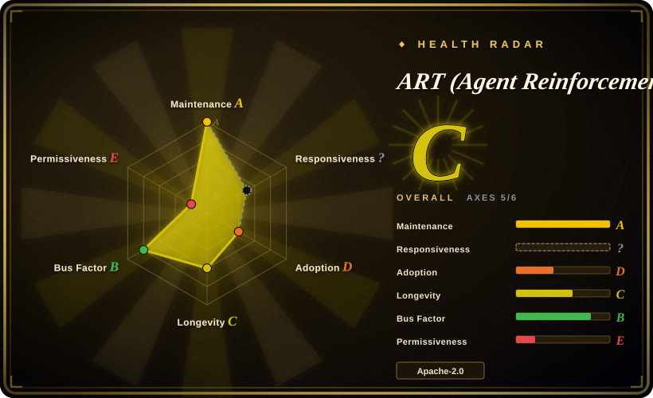
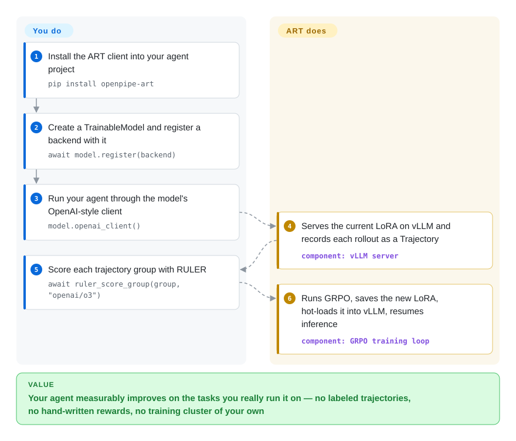

# ART (Agent Reinforcement Trainer)

Your agent demos well but won't ship — it picks the wrong tool call, gives up early, and you have no labeled dataset of "correct runs" to fine-tune on. ART puts your live agent through real tasks over and over, has an LLM judge rank its own attempts against each other (RULER), and trains the model with GRPO on the better ones — hot-swapping each new adapter straight back into serving.

## When to use

You're an engineer who has built a multi-step agent — say an email-research agent that issues several tool calls, reads results, and decides what to do next — and prompting plus a bigger base model has plateaued. The agent is right often enough to demo but not reliably enough to ship: it picks the wrong search, gives up early, or hallucinates an answer when the evidence was retrievable. You don't have a labeled dataset of "correct trajectories," and hand-writing a reward function for every failure mode is its own project.

ART is built for exactly this. You keep your agent code in Python and route its model calls through ART's OpenAI-compatible client; ART records each rollout as a *trajectory* (the full multi-turn message sequence). Instead of forcing you to author a reward function, RULER (Relative Universal LLM-Elicited Rewards) generates several trajectories per task and uses an LLM-as-judge to *rank* them relatively — which is enough signal for GRPO, since GRPO only needs relative scores. The backend then runs GRPO (on Unsloth or torchtune, with LoRA) to produce a new adapter, hot-loads it back into vLLM, and the loop repeats until the agent converges. OpenPipe's ART·E demo reports a Qwen 2.5 14B email agent reaching parity-or-better with a much larger proprietary model on its task [未验证 — vendor benchmark]. Because the client runs wherever your agent runs (even a laptop) while a `ServerlessBackend` spins up W&B-managed autoscaling GPUs for inference and training — the official quickstart is a free-tier Colab notebook — you get "on-the-job training" without standing up your own training cluster.

## How it works

ART splits the loop into two halves: your code, and a backend. You instantiate a `TrainableModel` with a base model id, call `await model.register(backend)` (a `LocalBackend` for a machine that has the GPU, a `ServerlessBackend` for W&B-managed GPUs), and run your agent through `model.openai_client()` — an ordinary OpenAI-style interface whose requests are routed to a vLLM server serving the *current* LoRA adapter. As each rollout completes, every message is recorded into a trajectory. You then score the group: by hand, or by handing the whole `TrajectoryGroup` to `ruler_score_group`, which asks a judge LLM (the docs example uses `openai/o3`) to rank the trajectories 0–1 — relative ranking is all GRPO needs, because it normalizes rewards within the group. The backend pauses inference, trains GRPO (Unsloth or torchtune in-process; a Megatron-based multi-node trainer exists for cluster runs), saves the new LoRA, hot-loads it into vLLM, and unblocks inference. What stays yours: the agent code, the scenarios you feed it, and the judge model's API bill.

<!-- flow-steps:begin (generated from flows/llm-training-art.json by tools/flow_card.py — do not edit) -->

Text version of the flow

1. **You**: Install the ART client into your agent project — `pip install openpipe-art`
2. **You**: Create a TrainableModel and register a backend with it — `await model.register(backend)`
3. **You**: Run your agent through the model's OpenAI-style client — `model.openai_client()`
4. **ART (Agent Reinforcement Trainer)**: Serves the current LoRA on vLLM and records each rollout as a Trajectory — component: `vLLM server`
5. **You**: Score each trajectory group with RULER — `await ruler_score_group(group, "openai/o3")`
6. **ART (Agent Reinforcement Trainer)**: Runs GRPO, saves the new LoRA, hot-loads it into vLLM, resumes inference — component: `GRPO training loop`

**Value**: Your agent measurably improves on the tasks you really run it on — no labeled trajectories, no hand-written rewards, no training cluster of your own

<!-- flow-steps:end -->

## When NOT to use

- **You only need plain SFT / instruction tuning.** ART now ships first-class SFT (`train_sft_from_file`, distillation, SFT-warmup-then-RL recipes — docs, 2026-09), but if supervised fine-tuning on a static dataset is the *whole* job, wiring a model to a training backend is heavier than you need: [LLaMA-Factory](llamafactory.md) (config-driven, UI) or [Unsloth](unsloth.md) (single-GPU speed) are the simpler lanes — and ART builds on Unsloth underneath anyway.
- **You have no usable reward signal or task environment.** GRPO needs many rollouts that can be scored. If your task can't be executed repeatedly and judged (even by an LLM), RL won't help; you need an evaluable environment first.
- **You can't afford the judge cost.** RULER calls an LLM-as-judge for every group of trajectories — the docs' own example judges with `openai/o3`. On large runs that API cost is real; group sizes that are too small give inconsistent rankings. [未验证：具体成本随任务与裁判模型浮动，文档未给出数字]
- **You need a specific unsupported model.** ART targets vLLM/HF-transformers causal LMs that Unsloth supports, and the README (2026-09) still says "Gemma 3 does not appear to be supported for the time being." Anything outside that envelope is uncertain.
- **You want a frozen, conservative dependency stack.** It rides a fast-moving stack (vLLM, Unsloth, TRL, torchtune; a newer Megatron+Monarch multi-node path), installs extras per CUDA version (`openpipe-art[backend]` vs `[backend-cu130]`; the Megatron extra requires Python 3.12), and ships frequently — breakage from upstream churn is a maintenance consideration [推断].
- **You lean on the managed path and mind lock-in.** The serverless quickstart is genuinely low-ops, but it is built on W&B Training/Inference/Artifacts; checkpointing, deployment, and observability of your trained adapters drift toward OpenPipe/W&B's platform the more you use them.

## Comparison

| Alternative | In index | Our verdict | Tradeoff |
|---|---|---|---|
| [Unsloth](unsloth.md) | ✅ | Choose Unsloth when the need is faster single-GPU LoRA/SFT or single-turn GRPO, not a multi-step agent rollout loop. | Unsloth is the training-efficiency layer ART uses underneath; ART adds agentic GRPO plus RULER reward orchestration. |
| [agent-lightning](agent-lightning.md) | ✅ | Choose agent-lightning when minimal-code-change RL for existing agents is more important than ART's bundled RULER reward path. | Closest conceptual sibling: both train agents from execution, but they differ in integration model and reward tooling. |
| [LLaMA-Factory](llamafactory.md) | ✅ | Choose LLaMA-Factory for broad SFT/DPO/PPO model fine-tuning through config and UI workflows. | Stronger for general fine-tuning breadth; weaker for ART's deployed multi-step-agent rollout loop. |
| HF TRL | 未收录 | Choose HF TRL when you want the lower-level GRPO/PPO/DPO trainer and can wire the agent rollout loop yourself. | More control and generality, but you assemble rewards, inference serving, and orchestration. |
| [verl](verl.md) | ✅ | Choose verl when high-throughput distributed RLHF/RL at larger training scale is the main requirement. | Scales further but is heavier to operate and less focused on single-engineer agent instrumentation. |
| [torchtune](torchtune.md) | ✅ | Choose torchtune when PyTorch-native fine-tuning/RL recipes are enough and an agent-RL framework would be too opinionated. | A building block ART itself uses in its local backend, not a complete agent-rollout training framework. |

## Tech stack

- **Language/runtime:** Python (PyPI package `openpipe-art`, 0.5.20 as of 2026-09).
- **Algorithm:** GRPO (Group Relative Policy Optimization); GSPO listed as experimental (docs, 2026-09).
- **Reward:** RULER — LLM-as-judge that relatively ranks/scores 0–1 multiple trajectories per task; no labeled data required.
- **Training/inference:** Unsloth or torchtune for LoRA fine-tuning; vLLM serves the current adapter; a Megatron + Monarch runtime for multi-node CUDA training.
- **Architecture:** client + pluggable backend. `LocalBackend` runs vLLM + trainer on your machine; `ServerlessBackend` runs training/inference on W&B-managed autoscaling GPUs; `TinkerBackend` via `openpipe-art[tinker]`.
- **Integrations:** LangGraph, MCP servers (MCP·RL), OpenEnv, W&B (metrics, artifacts, inference), Langfuse and OpenPipe for observability.

## Dependencies

- Core ML: PyTorch, transformers, PEFT (LoRA).
- Training/serving: Unsloth or torchtune (local), vLLM, TRL; Megatron extra for multi-node (Python 3.12, CUDA 12/13 images).
- A judge LLM for RULER (docs example: `openai/o3`; can be a cheaper hosted/local model).
- Either a GPU for `LocalBackend` (dedicated mode wants two GPUs for simultaneous inference+training per the backend docs) or the managed `ServerlessBackend` path (W&B API key).
- Models: most vLLM/HF-transformers causal LMs that Unsloth supports (Qwen, Llama, GPT-OSS, etc.); Gemma 3 unsupported.

## Ops difficulty

**Medium → high.** The conceptual model (client records trajectories, backend trains, adapter hot-reloads) is clean, and the ServerlessBackend/W&B path can take infra off your plate entirely — the official quickstart runs on a free tier. But self-hosting means operating a GPU box plus a fast-moving vLLM/Unsloth/TRL stack, instrumenting your own agent and scenario set, and managing RULER judge cost and reliability (small groups rank inconsistently). The newer Megatron multi-node path trades that for cluster-grade setup (CUDA images, RDMA/NCCL networking). That's meaningfully more than a single-pass SFT job.

## Health & viability

- **Responsiveness**: Cannot be scored — unknown (scorer had no qualifying window signal, 2026-09).
- **Maintenance — very active (2026-09).** Default branch pushed 2026-09-27; GitHub release v0.5.19 (2026-08-14), PyPI 0.5.20 (2026-09-09). Pre-1.0, so expect API movement and breakage from upstream (vLLM/Unsloth/TRL/torchtune) churn. Not archived.
- **Governance & backing — single vendor (OpenPipe).** Organization-owned by OpenPipe, a venture-style company whose managed/serverless RL offering (with W&B) is the monetized path; the scorer's 12-month window shows 18 active committers with one contributor writing ~53% of commits. Roadmap and the RULER reward tooling are vendor-driven; longevity is tied to OpenPipe's commercial trajectory, and leaning on the managed path carries lock-in risk. [推断]
- **Age & Lindy — young / unproven.** Created 2025-03, ~1.5 years old. No Lindy track record yet; this is an early bet on agent-RL becoming mainstream and on OpenPipe sustaining the project, not on durability.
- **Adoption & ecosystem.** ~10.8k stars / ~1.0k forks (GitHub API, 2026-09-28) and integrations (LangGraph, MCP·RL, W&B, OpenEnv, Tinker); the headline ART·E "beats o3" and "40% cheaper / 28% faster" figures are OpenPipe's own benchmarks/marketing, not independently confirmed. Built on top of Unsloth/vLLM/TRL/torchtune, so it inherits that ecosystem's reach and its instability.
- **Risk flags — early relicense + vendor lock-in + fast-moving deps.** The repo launched MIT-licensed (2025-03-10) and was relicensed to Apache-2.0 on 2025-04-08 (LICENSE commit history, verified 2026-09) — the one-month flip is why the health scorer grades the license axis E; the current license is permissive but the precedent shows terms can move. Further flags: managed-path lock-in toward OpenPipe/W&B, breakage from a fast upstream stack, and v0.x API churn.

## Caveats (unverified)

- ART·E "beats o3 on email retrieval" is an OpenPipe-published benchmark on their own task — treat as [未验证] vendor claim.
- "40% lower cost / 28% faster" figures come from OpenPipe/W&B marketing for the managed path [未验证].
- Star/fork counts are volatile; ~10.8k stars / ~997 forks read from the GitHub API on 2026-09-28 [未验证：作为采用度含义].
- Exact minimum GPU/VRAM requirements are not clearly documented [未验证].
- "LocalBackend dedicated mode wants two GPUs" is inferred from the backend docs' `trainer_gpu_ids`/`inference_gpu_ids` example plus the statement that shared mode pauses inference; no exhaustive matrix of supported configurations was verified [推断].
