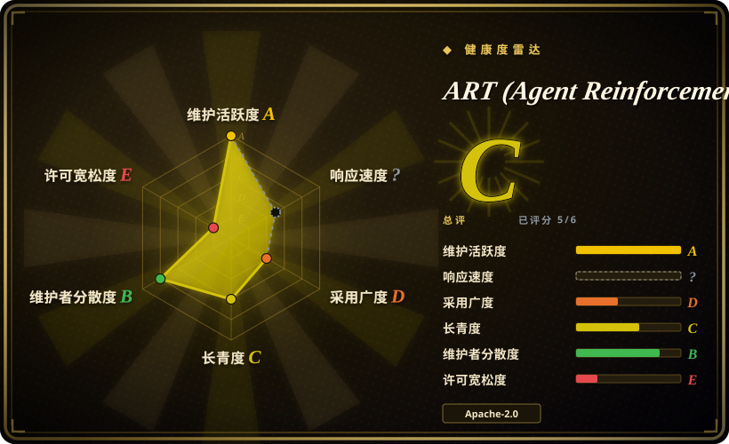
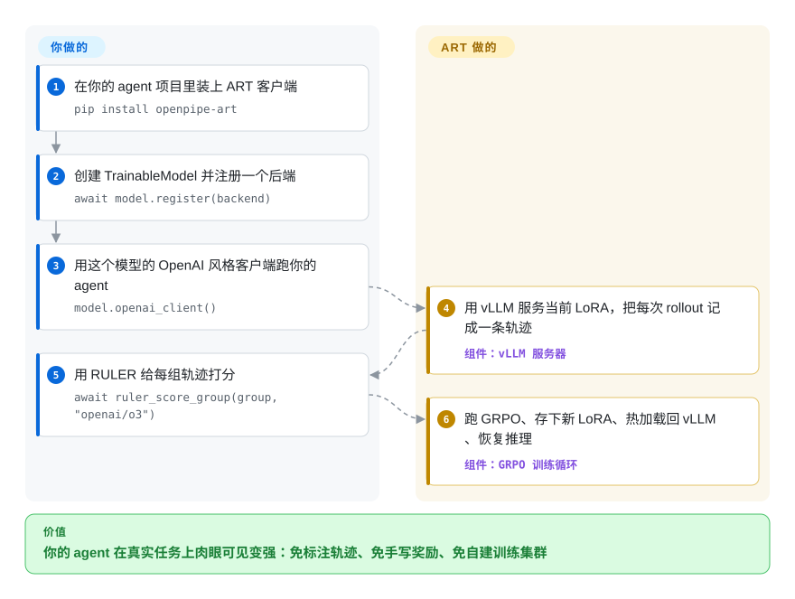

# ART (Agent Reinforcement Trainer)

你的 agent 演示很能打、上线却不行——它会挑错工具调用、过早放弃，而你手里没有一份「正确轨迹」标注集可拿去微调。ART 把在线 agent 反复丢进真实任务，让一个 LLM 裁判对它自己的多次尝试做相对排序（RULER），再用 GRPO 把更好的那些练进模型——每一版新适配器都热换回服务链路。

## 何时使用

你是一名工程师，已经搭好了一个多步 agent——比如一个邮件检索 agent，它会发起多次工具调用、读取结果、再决定下一步——但靠改 prompt、换更大的底座模型已经到了天花板。这个 agent 对得够多到能演示，却不够可靠到能上线：它会选错检索方式、过早放弃，或者在证据本可检索到时硬编一个答案。你手里没有一份标注好的「正确轨迹」数据集，而为每一种失败模式手写奖励函数本身又是一个项目。

ART 正是为这种场景而生。你把 agent 代码继续留在 Python 里，把它的模型调用经由 ART 的 OpenAI 兼容客户端路由；ART 会把每一次 rollout 记录成一条 *轨迹*（完整的多轮消息序列）。它不强迫你写奖励函数，而是由 RULER（Relative Universal LLM-Elicited Rewards）为每个任务生成多条轨迹，再用 LLM 充当裁判对它们做 *相对排序*——由于 GRPO 只需要相对分数，这个信号就够用。随后后端跑 GRPO（基于 Unsloth 或 torchtune，用 LoRA）产出新的适配器，热加载回 vLLM，循环往复直到 agent 收敛。OpenPipe 的 ART·E 演示称一个 Qwen 2.5 14B 邮件 agent 在其任务上达到甚至超过某个大得多的闭源模型 [未验证——厂商基准]。由于客户端可以跑在你的笔记本上，而 `ServerlessBackend` 会在 W&B 托管的弹性 GPU 上起推理与训练——官方快速上手就是一个跑在免费额度里的 Colab 笔记本——你能拿到「边干边学」的 RL，而不必自建训练集群。

## 怎么用起来

ART 把训练循环切成两半：你的代码，和一个后端。你用底座模型 id 实例化 `TrainableModel`，调用 `await model.register(backend)`（机器有卡就用 `LocalBackend`，没有就交给 W&B 托管的 `ServerlessBackend`），再经 `model.openai_client()` 跑 agent——一个普通 OpenAI 风格的接口，请求会被路由到一台正在服务 *当前* LoRA 适配器的 vLLM 上。每次 rollout 结束，全部消息都被记进一条轨迹。然后你给这一组打分：手写奖励，或把整个 `TrajectoryGroup` 交给 `ruler_score_group`——它会请一个裁判 LLM（文档示例用的是 `openai/o3`）把这组轨迹按 0 到 1 相对排序；GRPO 会做组内归一化，所以相对排名就是它需要的全部。后端随后暂停推理、跑 GRPO（本地是 Unsloth 或 torchtune；多机有一条基于 Megatron 的训练路径）、保存新 LoRA、热加载进 vLLM、恢复推理。仍然归你管的：agent 代码、你喂给它的场景集，以及裁判模型的 API 账单。

<!-- flow-steps:begin (generated from flows/llm-training-art.json by tools/flow_card.py — do not edit) -->

流程文字版

1. **你**：在你的 agent 项目里装上 ART 客户端 — `pip install openpipe-art`
2. **你**：创建 TrainableModel 并注册一个后端 — `await model.register(backend)`
3. **你**：用这个模型的 OpenAI 风格客户端跑你的 agent — `model.openai_client()`
4. **ART (Agent Reinforcement Trainer)**：用 vLLM 服务当前 LoRA，把每次 rollout 记成一条轨迹 — 组件：`vLLM 服务器`
5. **你**：用 RULER 给每组轨迹打分 — `await ruler_score_group(group, "openai/o3")`
6. **ART (Agent Reinforcement Trainer)**：跑 GRPO、存下新 LoRA、热加载回 vLLM、恢复推理 — 组件：`GRPO 训练循环`

**价值**：你的 agent 在真实任务上肉眼可见变强：免标注轨迹、免手写奖励、免自建训练集群

<!-- flow-steps:end -->

## 何时不用

- **你只需要单纯的 SFT / 指令微调。** ART 如今提供一等公民的 SFT（`train_sft_from_file`、蒸馏、先 SFT 再 RL 的配方——文档，2026-09），但如果监督微调静态数据集就是 *全部* 活儿，把模型接到一个训练后端上比你需要的更重：[LLaMA-Factory](llamafactory.zh.md)（配置驱动、带 UI）或 [Unsloth](unsloth.zh.md)（单卡速度）是更简单的赛道——反正 ART 底层用的也是 Unsloth。
- **你没有可用的奖励信号或任务环境。** GRPO 需要大量可被打分的 rollout。如果你的任务无法反复执行并被评判（哪怕由 LLM 来评），RL 帮不了你，得先有一个可评估的环境。
- **你承担不起裁判成本。** RULER 对每组轨迹都要调用 LLM 裁判——文档自己的示例就在用 `openai/o3` 当裁判。大规模训练时这笔 API 成本是实打实的；分组太小还会导致排序不稳定。[未验证：具体成本随任务与裁判模型浮动，文档未给出数字]
- **你需要某个不被支持的特定模型。** ART 面向 Unsloth 支持的 vLLM/HF-transformers 因果语言模型，README（2026-09）仍写着「Gemma 3 does not appear to be supported for the time being」。超出这个范围的情况都不确定。
- **你需要一套冻结、保守的依赖栈。** 它依托快速演进的栈（vLLM、Unsloth、TRL、torchtune，外加较新的 Megatron+Monarch 多机路径），按 CUDA 版本分装 extra（`openpipe-art[backend]` 对 `[backend-cu130]`；Megatron extra 要求 Python 3.12）并频繁发版——上游变动带来的破坏是需要考虑的维护成本 [推断]。
- **你重度使用托管路径且在意锁定。** 无服务器快速上手确实把运维压到很低，但它整个建在 W&B Training/Inference/Artifacts 上；托管越多，你训好的适配器的存档、部署与可观测越深地滑向 OpenPipe/W&B 的平台。

## 横向对比

| 替代品 | 是否收录 | 我们的评价 | 取舍 |
|---|---|---|---|
| [Unsloth](unsloth.zh.md) | ✅ | 需求是更快的单卡 LoRA／SFT 或单轮 GRPO，而不是多步 agent rollout 循环时，选 Unsloth。 | Unsloth 是 ART 底层使用的训练效率层；ART 额外加入 agentic GRPO 与 RULER 奖励编排。 |
| [agent-lightning](agent-lightning.zh.md) | ✅ | 给现有 agent 做最小代码改动的 RL 比 ART 内置 RULER 奖励路径更重要时，选 agent-lightning。 | 它是概念上最接近的同类：都从执行中训练 agent，但集成方式和奖励工具不同。 |
| [LLaMA-Factory](llamafactory.zh.md) | ✅ | 想通过配置和 UI 工作流覆盖广泛模型的 SFT/DPO/PPO 微调时，选 LLaMA-Factory。 | 通用微调广度更强；在 ART 专精的已部署多步 agent rollout 循环上更弱。 |
| HF TRL | 未收录 | 想要底层 GRPO/PPO/DPO trainer，且能自己接 agent rollout 循环时，选 HF TRL。 | 控制力和通用性更强，但奖励、推理服务和编排都要自己拼。 |
| [verl](verl.zh.md) | ✅ | 大规模训练下的高吞吐分布式 RLHF/RL 是主需求时，选 verl。 | 扩展性更强但运维更重，也不聚焦单工程师给 agent 埋点的易用性。 |
| [torchtune](torchtune.zh.md) | ✅ | PyTorch 原生微调／RL 配方已经足够，完整 agent-RL 框架反而过重时，选 torchtune。 | 它是 ART 本地后端自己也在用的构件，而不是完整的 agent-rollout 训练框架。 |

## 技术栈

- **语言/运行时：** Python（PyPI 包 `openpipe-art`，2026-09 为 0.5.20）。
- **算法：** GRPO（Group Relative Policy Optimization）；GSPO 列为实验性（文档，2026-09）。
- **奖励：** RULER——LLM 充当裁判，对每个任务的多条轨迹做相对排序/0–1 打分；无需标注数据。
- **训练/推理：** Unsloth 或 torchtune 做 LoRA 微调；vLLM 服务当前适配器；多机 CUDA 训练走 Megatron + Monarch 运行时。
- **架构：** 客户端 + 可插拔后端。`LocalBackend` 在你自己的机器上跑 vLLM + 训练器；`ServerlessBackend` 把训练/推理放到 W&B 托管的弹性 GPU；`openpipe-art[tinker]` 提供 Tinker 后端。
- **集成：** LangGraph、MCP 服务器（MCP·RL）、OpenEnv、W&B（指标、制品、推理）、Langfuse 与 OpenPipe 做可观测。

## 依赖

- 核心 ML：PyTorch、transformers、PEFT（LoRA）。
- 训练/服务：Unsloth 或 torchtune（本地）、vLLM、TRL；多机需要 Megatron extra（Python 3.12、CUDA 12/13 镜像）。
- 一个供 RULER 使用的裁判 LLM（文档示例：`openai/o3`；也可以是更便宜的托管/本地模型）。
- 要么给 `LocalBackend` 一台带 GPU 的机器（按后端文档，dedicated 模式推理与训练各要一张卡），要么走托管的 `ServerlessBackend`（需要 W&B API key）。
- 模型：多数 Unsloth 支持的 vLLM/HF-transformers 因果语言模型（Qwen、Llama、GPT-OSS 等）；不支持 Gemma 3。

## 运维难度

**中 → 高。** 概念模型（客户端记录轨迹、后端训练、适配器热重载）很干净，ServerlessBackend/W&B 路径能把基础设施整个从你身上卸掉——官方快速上手跑在免费额度里。但自托管意味着要运维一台 GPU 机器外加一套快速演进的 vLLM/Unsloth/TRL 栈、要给自己的 agent 和场景集埋点，还要管理 RULER 裁判的成本与可靠性（组太小会导致排序不稳定）。较新的 Megatron 多机路径则换成集群级搭建（CUDA 镜像、RDMA/NCCL 组网）。这比一次性的 SFT 作业要重不少。

## 健康度与可持续性

- **响应速度**：无法计算——unknown（评分器在 2026-09 的窗口内没有可用信号）。
- **维护——非常活跃（2026-09）。** 默认分支 2026-09-27 仍有推送；GitHub release v0.5.19（2026-08-14），PyPI 0.5.20（2026-09-09）。处于 1.0 之前，预期会有 API 变动，以及来自上游（vLLM/Unsloth/TRL/torchtune）churn 的破坏。未归档。
- **治理与背书——单一厂商（OpenPipe）。** 由 OpenPipe 以 Organization 持有，这是一家创投型公司，其托管/无服务器 RL 方案（与 W&B 配合）是变现路径；评分器的 12 个月窗口显示 18 个活跃提交者、头部贡献者写了约 53% 的提交。路线图与 RULER 奖励工具由厂商驱动；存续绑在 OpenPipe 的商业走向上，重度依赖托管路径还有锁定风险。[推断]
- **年龄与 Lindy——年轻 / 未经检验。** 创建于 2025-03，约 1.5 年。尚无 Lindy 履历；这是对 agent-RL 走向主流、以及 OpenPipe 持续投入的早期押注，而非押在耐久性上。
- **采用与生态。** 约 10.8k star / 约 1.0k fork（GitHub API，2026-09-28），有若干集成（LangGraph、MCP·RL、W&B、OpenEnv、Tinker）；招牌的 ART·E「击败 o3」与「便宜 40% / 快 28%」是 OpenPipe 自家的基准/营销，未经独立证实。构建在 Unsloth/vLLM/TRL/torchtune 之上，因此既继承了该生态的覆盖面，也继承了它的不稳定。
- **风险标记——早期改版权 + 厂商锁定 + 快变依赖。** 仓库开仓时是 MIT（2025-03-10），2025-04-08 改为 Apache-2.0（LICENSE 提交历史，2026-09 核实）——上线一个月就翻面，这正是健康度评分器把许可证轴判 E 的原因；现行许可证宽松，但这个先例说明条款会动。进一步的标记：朝 OpenPipe/W&B 的托管路径锁定、快速上游栈带来的破坏，以及 v0.x 的 API churn。

## 存疑（未验证）

- ART·E「在邮件检索上击败 o3」是 OpenPipe 在自家任务上发布的基准——视作 [未验证] 厂商声明。
- 「成本降 40% / 训练快 28%」出自 OpenPipe/W&B 对托管路径的市场宣传 [未验证]。
- star/fork 数易变；约 10.8k star / 约 997 fork 取自 2026-09-28 的 GitHub API [未验证：作为采用度的含义]。
- 确切的最低 GPU/显存要求文档未明确说明 [未验证]。
- 「LocalBackend dedicated 模式要两张卡」是从后端文档的 `trainer_gpu_ids`/`inference_gpu_ids` 示例加「共享模式训练时会暂停推理」这句话推断的，未穷举验证所有支持配置 [推断]。
