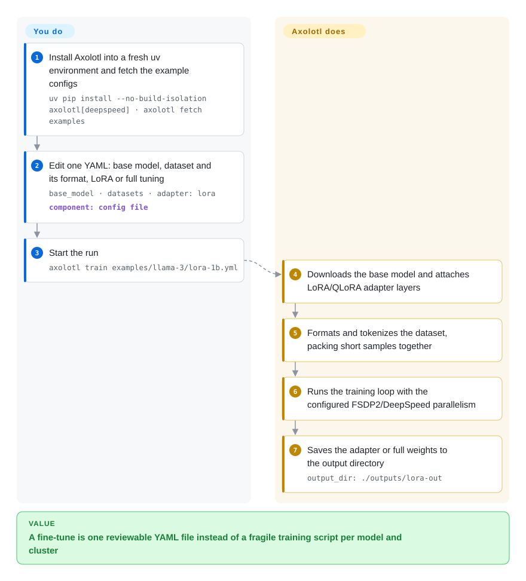

# Axolotl

You want to fine-tune an open model on your own data across several GPUs, but wiring transformers, PEFT, TRL, DeepSpeed or FSDP and your dataset's chat format together by hand means hundreds of lines of glue that break on the next library upgrade. Axolotl puts the whole run — base model, dataset format, LoRA or full tuning, parallelism — into one YAML file and runs it with `axolotl train`.

## When to use

You're an ML engineer at a team that ships its own fine-tunes: a support-ticket model one month, a reasoning distillation the next, sometimes a DPO pass on top. Your current setup is a `train.py` that imports five Hugging Face libraries, plus a DeepSpeed JSON and a shell script per cluster; every new base model means re-learning its chat template and padding rules, and last time a `transformers` upgrade silently changed the loss masking so a week of runs had to be redone.

You reach for Axolotl: you copy one of its example configs, change `base_model`, point `datasets` at your JSONL with a declared format, pick `adapter: lora` or full tuning, and run `axolotl train config.yml` — on one GPU or, with FSDP2/DeepSpeed settings in the same file, across nodes. The deciding tradeoff against [LlamaFactory](llamafactory.md) is **a config-file-only, multi-GPU-first workflow versus a web UI**: there's no point-and-click LlamaBoard here, but the YAML is the reproducible artifact you commit. Against [Unsloth](unsloth.md), Axolotl gives up some single-GPU speed and memory headroom to make FSDP2, DeepSpeed, sequence and expert parallelism first-class.

## How it works

Axolotl is an orchestration layer over the Hugging Face training stack (transformers, PEFT for LoRA adapters, TRL for preference and RL trainers, Accelerate for multi-GPU launch). **You write the config — which model, which data, which method, which parallelism; Axolotl does the plumbing.** When you run `axolotl train`, it downloads the base model, applies LoRA/QLoRA adapter layers if you asked for them (small trainable matrices beside the frozen weights, so you update a few million parameters instead of billions), loads and tokenizes your dataset using the prompt format you named (`alpaca`, chat templates, preference pairs), packs short samples together so GPUs don't waste time on padding, and launches the training loop with the parallelism the config specifies. It then saves the adapter or full weights to `output_dir`. Think of it as a recipe card handed to a professional kitchen: you write what you want and the quantities, the kitchen knows which pans and timings each dish needs. Afterwards the same config drives `axolotl inference`, `axolotl merge-lora` and `axolotl export` (GGUF for llama.cpp/Ollama).

<!-- flow-steps:begin (generated from flows/axolotl.json by tools/flow_card.py — do not edit) -->

Text version of the flow

1. **You**: Install Axolotl into a fresh uv environment and fetch the example configs — `uv pip install --no-build-isolation axolotl[deepspeed] · axolotl fetch examples`
2. **You**: Edit one YAML: base model, dataset and its format, LoRA or full tuning — `base_model · datasets · adapter: lora` — component: `config file`
3. **You**: Start the run — `axolotl train examples/llama-3/lora-1b.yml`
4. **Axolotl**: Downloads the base model and attaches LoRA/QLoRA adapter layers
5. **Axolotl**: Formats and tokenizes the dataset, packing short samples together
6. **Axolotl**: Runs the training loop with the configured FSDP2/DeepSpeed parallelism
7. **Axolotl**: Saves the adapter or full weights to the output directory — `output_dir: ./outputs/lora-out`

**Value**: A fine-tune is one reviewable YAML file instead of a fragile training script per model and cluster

<!-- flow-steps:end -->

## When NOT to use

- **You have one consumer GPU and VRAM is the bottleneck.** [Unsloth](unsloth.md) is tuned for exactly that case (custom Triton kernels, aggressive memory savings); Axolotl's advantage only shows once you need several GPUs.
- **You or your colleagues want a UI rather than YAML.** Axolotl has no training web UI; [LlamaFactory](llamafactory.md) gives you LlamaBoard on top of a similar Hugging Face stack.
- **You're writing a custom training loop or a new algorithm.** Axolotl wraps trainers behind config keys; for research code that changes the loss or the loop, use [TRL](trl.md) (or plain transformers) directly so you aren't fighting the wrapper.
- **You're doing large-scale RL with a separate rollout engine on multi-node MoE models.** Axolotl has GRPO, but frameworks built around rollout/training co-scheduling — [verl](verl.md) or [Miles](miles.md) — are the tools for that job.
- **It has to live in an existing Python environment.** Axolotl pins exact versions of transformers, PEFT, TRL, accelerate and datasets and needs Python ≥ 3.12 and PyTorch ≥ 2.13; installing it next to other HF-pinned code causes resolver conflicts. Give it its own venv or use the `axolotlai/axolotl` Docker image.
- **Telemetry can't leave your network.** Telemetry (PostHog: system info, model types, error rates) is on by default; set `AXOLOTL_DO_NOT_TRACK=1` in every environment, or choose a trainer without it such as [TRL](trl.md).
- **You need vendor-neutral, multi-maintainer governance.** Two maintainers account for about 83% of recent commits under the Axolotl AI company; if bus factor matters more than features, the Hugging Face–backed [TRL](trl.md) is the safer base.
- **You train on Apple Silicon or CPU.** The supported path is NVIDIA (Ampere or newer for bf16 and Flash Attention) or AMD GPUs; on a Mac use MLX-LM (not indexed).

## Comparison

| Alternative | In index | Our verdict | Tradeoff |
|---|---|---|---|
| [LlamaFactory](llamafactory.md) | ✅ | Pick LlamaFactory when a web UI and zero-code setup matter for non-specialists; pick Axolotl when runs are config files in git and multi-GPU/multi-node is the norm. | LlamaFactory is friendlier to start with; Axolotl's YAML-only surface is narrower but goes deeper on parallelism (FSDP2, context and expert parallelism). |
| [Unsloth](unsloth.md) | ✅ | Pick Unsloth for the fastest, lowest-VRAM LoRA/QLoRA on one GPU; pick Axolotl once training spans several GPUs or nodes. | Unsloth's kernels win on a single card; Axolotl trades that edge for first-class sharded training. |
| [Hugging Face TRL](trl.md) | ✅ | Pick TRL when you want to write the training script yourself or need the latest trainer the day it lands; pick Axolotl when you want those trainers driven by a reproducible config. | Axolotl builds on TRL, so TRL is always at least as current; Axolotl adds dataset formatting, packing and parallelism presets on top. |
| [torchtune](torchtune.md) | ✅ | Do not start new projects on torchtune — its README says it is no longer actively maintained (development wound down in 2025); Axolotl is a maintained config-driven alternative. | torchtune was PyTorch-native without HF dependencies; Axolotl keeps the HF ecosystem and is still shipping. |
| [Soup](soup.md) | ✅ | Pick Soup when one small GPU must also carry export and serving in the same tool; pick Axolotl when you want a slower-moving, multi-GPU-first config contract. | Soup covers more of the post-training tail and low-VRAM tricks; Axolotl changes its config surface less often and scales out further. |
| [verl](verl.md) | ✅ | Pick verl for large-scale RLHF/GRPO with a dedicated rollout engine across many nodes; pick Axolotl for SFT/DPO and moderate-scale GRPO from one config. | verl is built around rollout/training co-scheduling; Axolotl is a general post-training front end. |

## Tech stack

- **Python** (≥ 3.12) with a `typer`/`fire`-based CLI: `axolotl fetch`, `train`, `preprocess`, `inference`, `merge-lora`, `export`, `agent-docs`, `config-schema`.
- **Hugging Face stack** — transformers, PEFT, TRL, accelerate, datasets, all pinned to exact versions per release.
- **PyTorch** (≥ 2.13, < 2.15) with FSDP2 and optional DeepSpeed; multi-node through torchrun or Ray.
- **Kernels and optimizations** — Flash Attention 2/3/4, xformers, Flex/Sage attention, Liger kernels, Cut Cross Entropy, ScatterMoE, sample packing, sequence/context parallelism, expert parallelism, QAT and FP8/NVFP4 paths via TorchAO.
- **Config validation** — Pydantic schemas (`axolotl config-schema` dumps them).
- **Datasets** — local files, Hugging Face Hub, and S3/GCS/Azure/OCI via fsspec backends.

## Dependencies

- **Hardware** — NVIDIA GPUs (Ampere or newer for bf16 and Flash Attention) or AMD GPUs; multi-node needs a fast interconnect for sharded training.
- **Software** — Python ≥ 3.12, PyTorch ≥ 2.13 with a matching CUDA build (the README uses `UV_TORCH_BACKEND=cu130`), `uv` as the recommended installer; optional `axolotl[deepspeed]` extra.
- **Container alternative** — `axolotlai/axolotl` images on Docker Hub, the README's "less error prone" path.
- **External services (optional)** — Hugging Face Hub for models and datasets, Weights & Biases / TensorBoard / Trackio for logging, cloud object storage for data, PostHog telemetry endpoint unless disabled.
- **Licensing** — the project is Apache-2.0 but depends on the `axolotl-contribs-lgpl` package; check that an LGPL dependency is acceptable for your distribution.

## Ops difficulty

**Medium.** No service runs long-term — it is a batch job — but the job is GPU-heavy:

1. **Environment** — exact library pins and a CUDA-matched PyTorch make the Docker image or a dedicated `uv` venv the sane default.
2. **Config literacy** — hundreds of config keys; a wrong `sample_packing`, chat template or `lora_target_modules` silently degrades a run instead of failing it. Start from the shipped examples.
3. **Distributed runs** — FSDP2/DeepSpeed settings, NCCL networking and checkpoint resume across nodes are your cluster's problem; Axolotl only exposes the knobs.
4. **Upgrades** — a minor release every few weeks pulls new pinned versions of the HF stack; re-run a known-good config before upgrading production fine-tunes.
5. **Telemetry policy** — add `AXOLOTL_DO_NOT_TRACK=1` to images and job templates where data egress is restricted.

## Health & viability

- **Maintenance (2026-10).** Active: v0.20.0 shipped 2026-09-30, three weeks after v0.19.0, with minor releases every three to seven weeks through 2026 and new model support added monthly. Issues get a first response in about a day on median.
- **Governance / bus factor.** Run by Axolotl AI (the company behind docs.axolotl.ai). 31 people committed in the last 12 months, but the top contributor holds about 43% of commits and the top three about 83% — a concentrated core around the founder.
- **Age & Lindy.** Started in April 2023 and continuously active for three and a half years through several model generations and a move to the `axolotl-ai-cloud` organization; a moderate Lindy prior, limited mainly by the concentrated maintainer base.
- **Adoption.** ~12.5k GitHub stars; on PyPI only 8,818 downloads last month and 1 dependent repo counted — most users run the Docker images or cloud templates (RunPod, Modal, Vast.ai and others), so registry numbers understate use.
- **Risk flags.** Apache-2.0 with no relicense history; telemetry on by default; an LGPL-licensed contrib dependency; commercial support offered by the company, with no feature gating in the open-source repo observed.

## Caveats (unverified)

- [推断] "Most users run the Docker images or cloud templates" is inferred from the low PyPI numbers and the README's install guidance, not from usage data.
- [未验证] Throughput and memory comparisons against Unsloth and LlamaFactory were not benchmarked here; they vary with model, config and hardware.
- [未验证] AMD GPU support is stated in the README requirements; the breadth of features that work on AMD was not checked.
- [推断] "No feature gating observed" is based on reading the README and package dependencies; the company's paid offerings were not reviewed.
- [未验证] What exactly the `axolotl-contribs-lgpl` package contains, and therefore the practical impact of its LGPL license, was not inspected.
