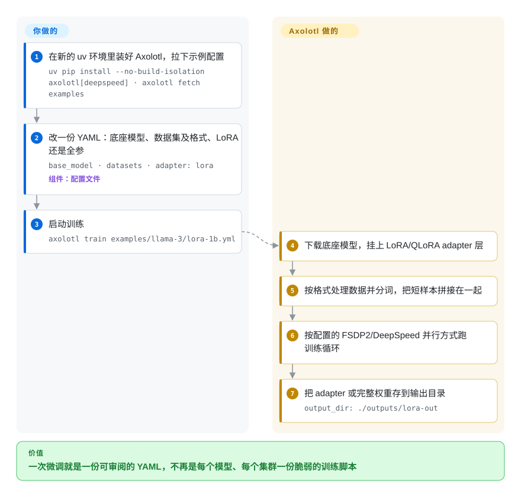

# Axolotl

你想用自己的数据在几张 GPU 上微调一个开源模型，可是手工把 transformers、PEFT、TRL、DeepSpeed 或 FSDP 和数据集的对话格式拼到一起，要写几百行胶水代码，下一次库升级就可能全坏。Axolotl 把一次训练的全部要素——底座模型、数据格式、LoRA 还是全参、并行方式——写进一个 YAML 文件，用 `axolotl train` 跑起来。

## 何时使用

你是一个自己产出微调模型的团队里的 ML 工程师：这个月做客服工单模型，下个月做推理能力蒸馏，有时还要在上面加一轮 DPO（直接偏好优化，用“好答案/坏答案”对来调模型）。现在的做法是一个引了五个 Hugging Face 库的 `train.py`，外加每个集群一份 DeepSpeed JSON 和一个 shell 脚本；每换一个底座模型就要重新搞清它的对话模板和 padding 规则，上次 `transformers` 一升级还悄悄改了损失掩码，害得一周的实验全部重跑。

这时你会想到 Axolotl：复制一份它自带的示例配置，改掉 `base_model`，把 `datasets` 指向你的 JSONL 并声明格式，选 `adapter: lora` 或全参微调，然后运行 `axolotl train config.yml`——单卡可以，同一个文件里写上 FSDP2/DeepSpeed 设置也能跨节点。和 [LlamaFactory](llamafactory.zh.md) 比，起决定作用的取舍是 **只用配置文件、多卡优先的工作流 vs 网页界面**：这里没有点选式的 LlamaBoard，但 YAML 本身就是你提交进 git 的可复现产物。和 [Unsloth](unsloth.zh.md) 比，Axolotl 放弃一部分单卡速度和显存余量，换来 FSDP2、DeepSpeed、序列并行和专家并行的一等支持。

## 怎么用起来

Axolotl 是叠在 Hugging Face 训练栈之上的编排层（transformers；做 LoRA adapter 的 PEFT；提供偏好和强化学习训练器的 TRL；负责多卡启动的 Accelerate）。**你写配置——哪个模型、哪份数据、哪种方法、怎么并行；管线由 Axolotl 接好。** 运行 `axolotl train` 后，它下载底座模型；如果你要求了，就加上 LoRA/QLoRA adapter 层（挂在冻结权重旁边的小型可训练矩阵，只更新几百万个参数而不是几十亿个）；按你指定的提示格式（`alpaca`、对话模板、偏好对）加载并分词数据集；把短样本拼接在一起，免得 GPU 把时间浪费在填充上；再按配置里的并行方式启动训练循环。最后把 adapter 或完整权重存到 `output_dir`。就像把一张菜谱卡交给专业后厨：你写想要什么、用量多少，后厨知道每道菜该用哪口锅、火候多久。之后同一份配置还能驱动 `axolotl inference`、`axolotl merge-lora` 和 `axolotl export`（导出给 llama.cpp/Ollama 用的 GGUF）。

<!-- flow-steps:begin (generated from flows/axolotl.json by tools/flow_card.py — do not edit) -->

流程文字版

1. **你**：在新的 uv 环境里装好 Axolotl，拉下示例配置 — `uv pip install --no-build-isolation axolotl[deepspeed] · axolotl fetch examples`
2. **你**：改一份 YAML：底座模型、数据集及格式、LoRA 还是全参 — `base_model · datasets · adapter: lora` — 组件：`配置文件`
3. **你**：启动训练 — `axolotl train examples/llama-3/lora-1b.yml`
4. **Axolotl**：下载底座模型，挂上 LoRA/QLoRA adapter 层
5. **Axolotl**：按格式处理数据并分词，把短样本拼接在一起
6. **Axolotl**：按配置的 FSDP2/DeepSpeed 并行方式跑训练循环
7. **Axolotl**：把 adapter 或完整权重存到输出目录 — `output_dir: ./outputs/lora-out`

**价值**：一次微调就是一份可审阅的 YAML，不再是每个模型、每个集群一份脆弱的训练脚本

<!-- flow-steps:end -->

## 何时不用

- **你只有一张消费级显卡，显存是瓶颈。** [Unsloth](unsloth.zh.md) 正是为这种情况调优的（自定义 Triton 内核、激进的显存节省）；Axolotl 的优势要到需要多张卡时才显现。
- **你或同事要的是界面而不是 YAML。** Axolotl 没有训练用的网页界面；[LlamaFactory](llamafactory.zh.md) 在相近的 Hugging Face 栈上提供了 LlamaBoard。
- **你在写自定义训练循环或新算法。** Axolotl 把训练器包在配置键后面；要改损失或循环的研究代码，直接用 [TRL](trl.zh.md)（或纯 transformers），免得和包装层较劲。
- **你在多节点 MoE 模型上做带独立 rollout 引擎的大规模强化学习。** Axolotl 有 GRPO，但这类活该用围绕 rollout 与训练协同调度构建的框架——[verl](verl.zh.md) 或 [Miles](miles.zh.md)。
- **它必须装进一个现成的 Python 环境。** Axolotl 把 transformers、PEFT、TRL、accelerate 和 datasets 钉在精确版本上，并要求 Python ≥ 3.12、PyTorch ≥ 2.13；和其他钉了 HF 版本的代码装在一起会产生依赖冲突。给它单独的 venv，或用 `axolotlai/axolotl` Docker 镜像。
- **遥测数据不能出你的网络。** 遥测（PostHog：系统信息、模型类型、错误率）默认开启；在每个环境都设 `AXOLOTL_DO_NOT_TRACK=1`，或者选不带遥测的训练器，比如 [TRL](trl.zh.md)。
- **你需要厂商中立、多维护者的治理。** 在 Axolotl AI 公司名下，两位维护者贡献了近期约 83% 的提交；如果巴士因子比功能更重要，有 Hugging Face 背书的 [TRL](trl.zh.md) 是更稳的底座。
- **你在 Apple Silicon 或 CPU 上训练。** 支持的路径是 NVIDIA（bf16 和 Flash Attention 需要 Ampere 或更新）或 AMD GPU；Mac 上用 MLX-LM（未收录）。

## 横向对比

| 替代品 | 是否收录 | 我们的评价 | 取舍 |
|---|---|---|---|
| [LlamaFactory](llamafactory.zh.md) | ✅ | 非专业人员也要上手、网页界面和零代码很重要时，选 LlamaFactory；训练以 git 里的配置文件为单位、多卡多机是常态时，选 Axolotl。 | LlamaFactory 上手更友好；Axolotl 只有 YAML 一个入口、面更窄，但在并行上走得更深（FSDP2、上下文并行、专家并行）。 |
| [Unsloth](unsloth.zh.md) | ✅ | 单卡上要最快、最省显存的 LoRA/QLoRA，选 Unsloth；训练一旦跨多卡或多节点，选 Axolotl。 | Unsloth 的内核在单卡上占优；Axolotl 用这份优势换来一等的分片训练。 |
| [Hugging Face TRL](trl.zh.md) | ✅ | 想自己写训练脚本、或要第一时间用上最新训练器时，选 TRL；想用可复现的配置来驱动这些训练器时，选 Axolotl。 | Axolotl 建在 TRL 之上，所以 TRL 永远至少一样新；Axolotl 在其上加了数据格式化、样本拼接和并行预设。 |
| [torchtune](torchtune.zh.md) | ✅ | 不要在 torchtune 上开新项目——它的 README 写明已不再积极维护（开发在 2025 年收尾）；Axolotl 是仍在维护的配置驱动替代。 | torchtune 是纯 PyTorch、不依赖 HF；Axolotl 保留 HF 生态并且仍在持续发版。 |
| [Soup](soup.zh.md) | ✅ | 一张小显卡还要在同一个工具里完成导出和服务时，选 Soup；想要变化更慢、多卡优先的配置契约时，选 Axolotl。 | Soup 覆盖更多训练后环节和低显存技巧；Axolotl 配置面变化更少、横向扩展更远。 |
| [verl](verl.zh.md) | ✅ | 要在多节点上配专用 rollout 引擎做大规模 RLHF/GRPO，选 verl；用一份配置做 SFT/DPO 和中等规模 GRPO，选 Axolotl。 | verl 围绕 rollout 与训练的协同调度构建；Axolotl 是通用的后训练前端。 |

## 技术栈

- **Python**（≥ 3.12），命令行基于 `typer`/`fire`：`axolotl fetch`、`train`、`preprocess`、`inference`、`merge-lora`、`export`、`agent-docs`、`config-schema`。
- **Hugging Face 栈** —— transformers、PEFT、TRL、accelerate、datasets，每个版本都钉死在精确版本上。
- **PyTorch**（≥ 2.13、< 2.15），FSDP2 和可选的 DeepSpeed；多节点通过 torchrun 或 Ray。
- **内核与优化** —— Flash Attention 2/3/4、xformers、Flex/Sage attention、Liger 内核、Cut Cross Entropy、ScatterMoE、样本拼接、序列/上下文并行、专家并行，以及经 TorchAO 的 QAT 和 FP8/NVFP4 路径。
- **配置校验** —— Pydantic schema（`axolotl config-schema` 可导出）。
- **数据集** —— 本地文件、Hugging Face Hub，以及经 fsspec 后端的 S3/GCS/Azure/OCI。

## 依赖

- **硬件** —— NVIDIA GPU（bf16 和 Flash Attention 需要 Ampere 或更新）或 AMD GPU；多节点分片训练需要高速互联。
- **软件** —— Python ≥ 3.12、带匹配 CUDA 构建的 PyTorch ≥ 2.13（README 用的是 `UV_TORCH_BACKEND=cu130`），推荐用 `uv` 安装；可选 `axolotl[deepspeed]` extra。
- **容器方案** —— Docker Hub 上的 `axolotlai/axolotl` 镜像，README 称这条路“更不容易出错”。
- **外部服务（可选）** —— 拉模型和数据集的 Hugging Face Hub，记录日志的 Weights & Biases / TensorBoard / Trackio，存数据的云对象存储，以及未关闭时的 PostHog 遥测端点。
- **许可** —— 项目本身是 Apache-2.0，但依赖 `axolotl-contribs-lgpl` 包；分发前确认可以接受一个 LGPL 依赖。

## 运维难度

**中。** 没有常驻服务——它是一个批处理作业——但作业很吃 GPU：

1. **环境** —— 精确的库版本钉死加上与 CUDA 匹配的 PyTorch，让 Docker 镜像或专用 `uv` venv 成为合理默认。
2. **读懂配置** —— 配置键有几百个；`sample_packing`、对话模板或 `lora_target_modules` 写错不会报错，只会悄悄让效果变差。从自带示例起步。
3. **分布式训练** —— FSDP2/DeepSpeed 设置、NCCL 网络和跨节点断点续训是你集群的事；Axolotl 只把开关暴露出来。
4. **升级** —— 每隔几周一个小版本，会带来新钉死的 HF 栈版本；升级生产微调前先用一份已知可用的配置重跑一遍。
5. **遥测策略** —— 在限制数据外发的地方，把 `AXOLOTL_DO_NOT_TRACK=1` 写进镜像和作业模板。

## 健康度与可持续性

- **维护（2026-10）。** 活跃：v0.20.0 于 2026-09-30 发布，距 v0.19.0 三周；2026 年以来每三到七周一个小版本，每月都有新模型支持。issue 首次回复的中位数约为一天。
- **治理 / 巴士因子。** 由 Axolotl AI 公司（docs.axolotl.ai 背后的公司）运营。过去 12 个月有 31 人提交过代码，但头号贡献者约占 43% 的提交，前三约占 83%——核心集中在创始人周围。
- **年龄与 Lindy。** 2023 年 4 月启动，三年半里持续活跃，经历了好几代模型，也迁到了 `axolotl-ai-cloud` 组织下；Lindy 先验中等，主要受限于维护者过于集中。
- **采用度。** 约 1.25 万 GitHub star；PyPI 上个月只有 8,818 次下载，依赖图上只统计到 1 个依赖仓库——多数用户跑的是 Docker 镜像或云模板（RunPod、Modal、Vast.ai 等），注册表数字低估了实际使用。
- **风险标志。** Apache-2.0，无改许可证历史；遥测默认开启；有一个 LGPL 许可的 contrib 依赖；公司提供商业支持，未在开源仓库里观察到功能门控。

## 存疑（未验证）

- [推断] “多数用户跑 Docker 镜像或云模板”是从偏低的 PyPI 数字和 README 的安装指引推断的，没有使用数据支撑。
- [未验证] 与 Unsloth、LlamaFactory 的吞吐和显存对比本页没有做基准测试；结果随模型、配置和硬件变化很大。
- [未验证] AMD GPU 支持写在 README 的环境要求里；哪些功能能在 AMD 上跑通没有核对。
- [推断] “未观察到功能门控”基于阅读 README 和包依赖；公司的付费产品没有审阅。
- [未验证] `axolotl-contribs-lgpl` 包里具体有什么、因而 LGPL 许可的实际影响，没有检查。
