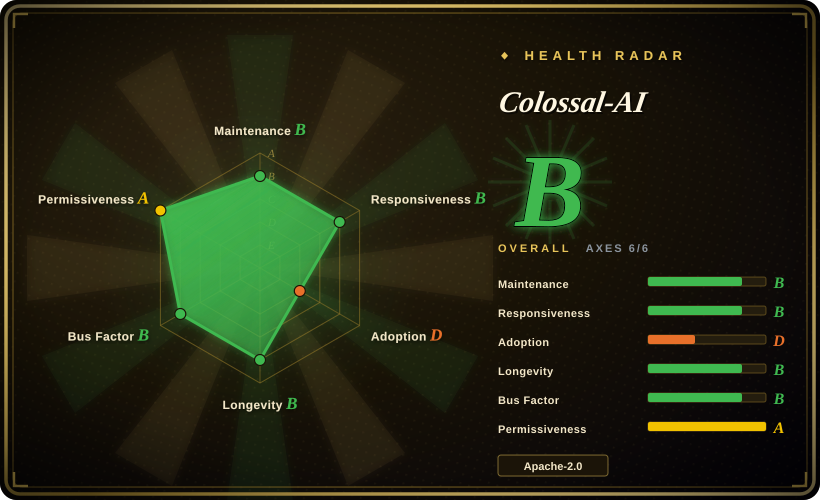
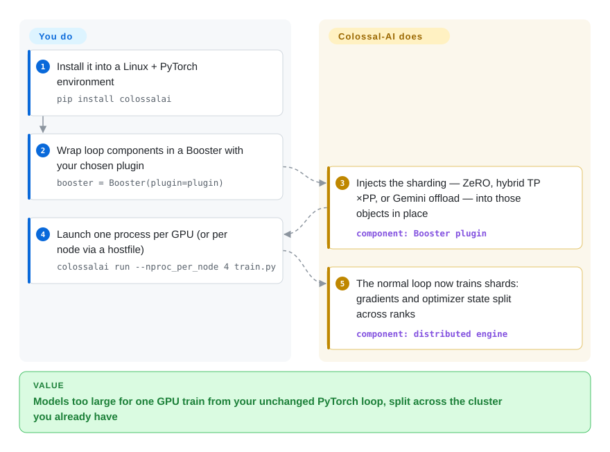

# Colossal-AI

A 70B model on your node of 8 GPUs: plain DDP copies the whole model to every card and dies OOM. Colossal-AI shards the model, gradients, and optimizer state across GPUs — ZeRO, tensor/pipeline/sequence parallelism, even spilling to CPU/NVMe — as plugins around an otherwise ordinary PyTorch training loop.

## When to use

You're an ML platform engineer or research engineer with a multi-GPU cluster (a node of 8×A100s, or several nodes) and a model that simply will not fit the single-GPU, parameter-efficient mold — a 30B+ dense LLM you want to continue-pretrain, a full fine-tune where LoRA isn't enough, or a from-scratch run where activations and optimizer state blow past one card's VRAM. Plain `torchrun` + DDP replicates the whole model per GPU and OOMs immediately; you need to *shard* the model, the gradients, and the optimizer state, and possibly spill some of it to CPU/NVMe. Colossal-AI gives you those sharding strategies — ZeRO (stages 1–3), tensor parallelism, pipeline parallelism, sequence parallelism, and Gemini-style heterogeneous offload — as composable `plugin`s you select around an otherwise normal PyTorch training loop, so you can dial the parallelism to your cluster topology and memory budget instead of rewriting the model.

You reach for it when the bottleneck is *scale and cost*: fitting a model that doesn't fit, raising throughput on a fixed GPU count, or cutting the hardware needed for a given run. It targets the "I have a cluster and a big model" lane — large-scale pretraining and full/large fine-tunes — rather than the "I have one 4090 and a LoRA" lane. Mixed precision (FP16/BF16) and the auto-parallel / Booster API are there to keep the convenience layer thin while still exposing PyTorch underneath. Before committing, weigh the stalled release cadence flagged below — this is the framework's main selection risk today.

## How it works

Colossal-AI wraps a standard PyTorch training loop rather than replacing it. You install it into a Linux + PyTorch environment (`pip install colossalai`; CUDA kernels build at runtime by default, `BUILD_EXT=1` pre-builds them), then in your script initialize the distributed context (`colossalai.launch_from_torch()`) and pick a plugin that encodes your parallelism choice — `LowLevelZeroPlugin` (ZeRO-1/2), `HybridParallelPlugin` (any combination of tensor × pipeline × data parallel), `GeminiPlugin` (chunked optimizer-state offload to CPU/NVMe), or `TorchDDPPlugin` / `TorchFSDPPlugin` — and hand it to a `Booster`. The docs' own word for what happens next is that `colossalai.booster` "injects features into your training components (e.g. model, optimizer, dataloader) seamlessly": `booster.boost(...)` returns sharded versions of your objects in place, and your loop keeps running as normal except that backward goes through `booster.backward(loss, optimizer)`. You scale it out with the CLI launcher — `colossalai run --nproc_per_node 4 train.py`, or `--hostfile` for multi-node. What stays yours: the cluster plumbing (NCCL/networking, shared checkpoint storage), the CUDA/PyTorch version matching, and the ZeRO × TP × PP × offload split that actually fits your model.

<!-- flow-steps:begin (generated from flows/colossalai.json by tools/flow_card.py — do not edit) -->

Text version of the flow

1. **You**: Install it into a Linux + PyTorch environment — `pip install colossalai`
2. **You**: Wrap loop components in a Booster with your chosen plugin — `booster = Booster(plugin=plugin)`
3. **Colossal-AI**: Injects the sharding — ZeRO, hybrid TP×PP, or Gemini offload — into those objects in place — component: `Booster plugin`
4. **You**: Launch one process per GPU (or per node via a hostfile) — `colossalai run --nproc_per_node 4 train.py`
5. **Colossal-AI**: The normal loop now trains shards: gradients and optimizer state split across ranks — component: `distributed engine`

**Value**: Models too large for one GPU train from your unchanged PyTorch loop, split across the cluster you already have

<!-- flow-steps:end -->

## When NOT to use

- **The release cadence has stalled (verified 2026-09).** Latest stable release v0.5.0 shipped 2025-06-04; the "weekly" `colossalai-nightly` wheels stopped after 2025.7.12 (PyPI, 2025-07-12); default-branch commits in 2026 were README edits (April) then CI/requirements chores (late September), while the README now front-pages HPC-AI's commercial GPU-cloud and model-API ads and its news list stops at 2025/02. Not archived, but the project looks to be in maintenance mode behind the company's pivot. If you need a distributed-training stack whose development keeps pace with the 2026 ecosystem, choose PyTorch FSDP (in-tree, evergreen) or DeepSpeed instead; pin `v0.5.0` here only if its feature set already covers you.
- **You'd be better served by the incumbents.** DeepSpeed and Megatron-LM are the most battle-tested ZeRO and tensor/pipeline-parallel stacks and have the deepest production track record; PyTorch FSDP ships *in* PyTorch with no extra framework — and with the stall above, "no extra framework" now also means "no extra decay". If your team already runs one of those, Colossal-AI's marginal convenience no longer justifies the dependency. [推断：依据 2026-09 发布与维护数据，非实测对比]
- **Single-GPU LoRA / QLoRA.** If you're parameter-efficient-tuning one model on one consumer GPU, Colossal-AI's distributed machinery is pure overhead — reach for [Unsloth](unsloth.md) (fast single-GPU kernels) or [LlamaFactory](llamafactory.md) (config-driven LoRA/QLoRA, web UI). Multi-GPU sharding is the whole reason this framework exists.
- **No cluster / infra to operate.** This is heavyweight distributed-systems software: multi-node launchers, NCCL/network tuning, CUDA-toolkit matching, and parallelism configs that interact with model architecture. Without a cluster and someone to run it, the setup cost dwarfs the benefit.
- **You want an inference / serving engine.** Colossal-AI is a *training* system. For high-throughput LLM serving you want vLLM / SGLang / TensorRT-LLM, not this.
- **You need a frozen, conservative dependency stack — or its opposite.** It pins Python ≥3.10 <3.13 and PyTorch ≥2.2 (README requirements, 2026-09), and since releases have stalled, staying on the tagged version means missing upstream PyTorch/CUDA adaptations; living on `main` means running un-released, CI-only code. Either way you own the drift. [推断：由版本钉与发布间隔推得]

## Comparison

| Alternative | In index | Our verdict | Tradeoff |
|---|---|---|---|
| DeepSpeed | 未收录 | Choose DeepSpeed where the Microsoft ZeRO/offload stack is already the production default — especially now, since its release stream keeps moving while Colossal-AI's has been quiet since 2025-06. | DeepSpeed has the deeper deployment track record and active cadence; Colossal-AI overlaps on ZeRO/offload but adds its own plugin and Booster surface. |
| Megatron-LM | 未收录 | Choose Megatron-LM for lower-level NVIDIA-style tensor and pipeline parallelism in very large transformer pretraining. | Top-end throughput at scale, but more bespoke; Colossal-AI makes similar ideas more composable but has stopped packaging them into releases. |
| PyTorch FSDP | 未收录 | Choose PyTorch FSDP when native fully-sharded data parallelism is enough and avoiding another framework matters — with Colossal-AI coasting, the "extra dependency" is now also an aging one. | Built into PyTorch and evergreen; Colossal-AI adds tensor/pipeline/sequence parallelism and Gemini offload at the cost of a third-party dependency. |
| [LlamaFactory](llamafactory.md) | ✅ | Choose LlamaFactory when the need is higher-level config/UI fine-tuning rather than a distributed training engine. | Turnkey for SFT/LoRA workflows and wraps distributed backends; Colossal-AI is lower-level infrastructure for large-scale or full training. |
| [Unsloth](unsloth.md) | ✅ | Choose Unsloth when single-GPU LoRA/QLoRA speed and VRAM savings are the whole problem. | Opposite end of the spectrum: one GPU and custom kernels versus Colossal-AI's many-GPU sharding machinery. |

## Tech stack

- **Language:** Python (CPython ≥ 3.10, < 3.13 per `setup.py` and README, 2026-09), built on **PyTorch ≥ 2.2**.
- **Parallelism strategies (README Features, 2026-09):** data parallel, pipeline parallel, 1D/2D/2.5D/3D tensor parallel, sequence parallel, ZeRO (stages 1–3), Auto-Parallel; exposed as Booster plugins — `HybridParallelPlugin`, `GeminiPlugin`, `LowLevelZeroPlugin`, `TorchDDPPlugin`, `TorchFSDPPlugin`, `MoeHybridParallelPlugin` (verified in `colossalai/booster/plugin/`, 2026-09).
- **Memory / offload:** Gemini-style heterogeneous training (PatrickStar lineage per README) — offloading parameters, gradients, and optimizer state to CPU (and NVMe) to train models larger than aggregate GPU memory.
- **Precision:** mixed-precision FP16 / BF16 (and FP8 per the project's 2024 blog series — [未验证：当前版本覆盖范围未逐项核对]).
- **API surface:** a `Booster` / plugin API that wraps a standard PyTorch training loop, a `colossalai run` CLI launcher, plus example training recipes (LLaMA, GPT, ResNet, ColossalChat/Colossal-LLaMA applications).

## Dependencies

- **Hardware:** NVIDIA CUDA GPUs — compute capability ≥ 7.0 (V100/RTX20 and newer), CUDA ≥ 11.0 (README requirements, 2026-09); realistically **multiple** GPUs, often multiple nodes, for the framework to earn its keep; high-bandwidth interconnect (NVLink / InfiniBand/RDMA) matters at multi-node scale.
- **OS:** Linux only ("only Linux is supported for now" — README installation, 2026-09).
- **Core runtime:** Python 3.10–3.12 + PyTorch ≥ 2.2 with a matching CUDA toolkit; NCCL for collective communication.
- **Build:** CUDA/C++ extensions are *not* compiled by default — kernels build at runtime on first use, or pre-build with `BUILD_EXT=1 pip install colossalai` / from source, which needs an `nvcc` toolchain.
- **Release channel reality (2026-09):** stable `colossalai` on PyPI is 0.5.0 (2025-06); `colossalai-nightly` last uploaded 2025-07-12 — plan to build from `main` for anything newer than mid-2025.
- **Cluster plumbing (yours to run):** a launcher hostfile/SSH setup for multi-node and shared storage for checkpoints at scale.

## Ops difficulty

**High.** This is distributed-systems software, and the difficulty is inherent to the job, not the framework's fault. The happy path (single node, one parallelism plugin) is approachable, but real use means multi-node launch and networking, matching CUDA/PyTorch/NCCL versions (a perennial source of breakage), and choosing a parallelism configuration (ZeRO stage × TP × PP × offload) that fits both your model architecture and your interconnect — a wrong split silently tanks throughput or OOMs. Add checkpoint/restart at scale, the usual large-run reliability concerns, and — new as of 2026 — the fact that packaged releases and nightlies stopped in mid-2025, so version freshness is your problem to manage. Colossal-AI sits firmly in "you need a platform/infra owner" territory, similar to DeepSpeed and Megatron-LM.

## Health & viability

- **Responsiveness**: Grade B — median first response ~88 hours, but only 3 qualifying items in the scorer window (2026-09): it answers when it's active, and the quiet stretches dominate the cadence anyway.
- **Maintenance — coasting (as of 2026-09).** Not archived, and the default branch moved again in late September 2026 — but only CI enablement and requirements cleanup (PRs #6442, #6456); 2026-04 commits were README edits; before that the last substantive windows were Nov 2025 and mid-2025. The scorer counts just 2 active weeks out of the last 13. Stable release v0.5.0 (2025-06-04) is ~15 months old; the promised weekly nightlies died after 2025.7.12 (2025-07-12, PyPI). 511 open issues against a 3-person active-maintainer window is a backlog, not a "normal load" (that earlier framing predated the stall).
- **Governance & backing — single vendor (HPC-AI Technology, a.k.a. Lu Chen).** Organization-owned by HPC-AI Technology, which has visibly pivoted its README toward commercial GPU-cloud rental and a paid model-API business; the scorer sees 3 active committers in the 12-month window, top contributor 40% — a near-single-digit bus factor for this repository. Colossal-AI was the flagship OSS, but the marketing energy now goes to HPC-AI Cloud and model APIs, and the news list stops at 2025/02. Roadmap follows the company's commercial priorities, which may not be this framework's. [推断：pivot 判断依据 README 版面与新闻停更，公司内部方向未知]
- **Age & Lindy — moderate-to-strong, decaying.** Created 2021-10, ~5 years old — old enough to have survived multiple LLM-training hype cycles, which was a meaningful Lindy signal while it was active. But Lindy is age × still-active: the still-active factor is now weak (see maintenance), so treat the age as evidence of *installed knowledge* (papers, recipes, integrations) rather than of future upkeep.
- **Adoption & ecosystem.** ~41.4k stars (flat vs June) and example recipes for popular open models; PyPI 9715 downloads/month with 63 dependent repos (scorer, 2026-09) — real but not deep. The incumbents it competes with (DeepSpeed, Megatron-LM, PyTorch FSDP) have deeper production track records, and FSDP in particular keeps shipping without you depending on anyone's release train.
- **Risk flags — vendor deprioritization + churn.** Apache-2.0, no relicense history (scorer risk_license A). The real flag in 2026 is not the license but the cadence: a company-backed OSS whose releases, nightlies, and maintainer attention have all quieted while the ecosystem moved. If you adopt it, assume either pinned-v0.5.0 or build-from-main, and plan an exit to FSDP/DeepSpeed if a needed fix never lands. [推断]

## Caveats (unverified)

- [未验证] ~41.4k stars / ~4.5k forks / 511 open+PR issues as of 2026-09-28 (GitHub API); counts are volatile — indicative only.
- [未验证] The exact set of supported parallelism plugins, offload modes, and supported models shifts by version; the lists here were re-checked against `main` @ 2026-09 (booster plugin files, README Features), but per-release guarantees for the packaged v0.5.0 were not each verified.
- [推断] "DeepSpeed / Megatron-LM are more battle-tested" is a maturity inference from their longer production history, not a measured head-to-head benchmark against Colossal-AI.
- [推断] The maintenance-stall reading (company pivot toward commercial cloud/model APIs) is inferred from README front matter, the news list ending 2025/02, and commit/PyPI dates; HPC-AI's internal priorities were not observable.
- [未验证] FP8 mixed-precision coverage in the current build is from the project's 2024 blog series claim; not re-verified against v0.5.0 sources here.
- [推断] Throughput / cost / "train larger models cheaper" advantages (e.g., the README's 70B B200/H200 benchmark table) are first-party numbers on vendor-selected hardware; no independent benchmark was run.
