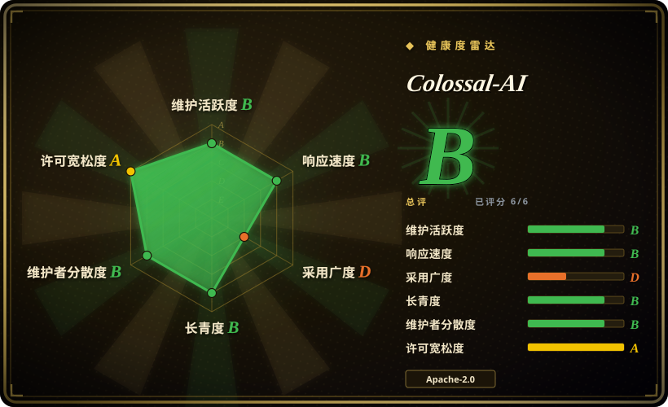
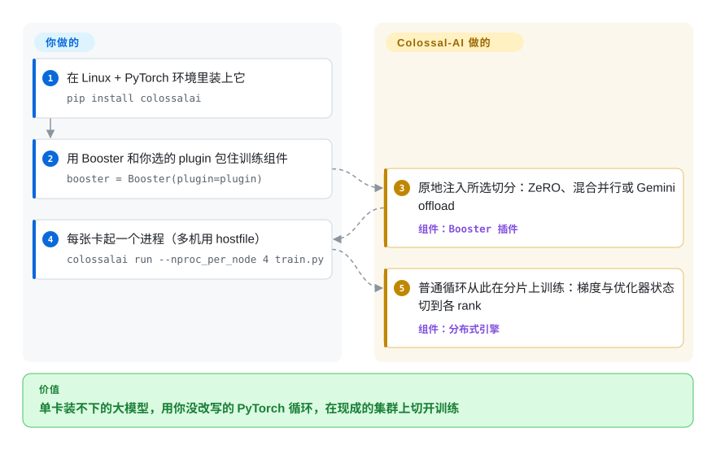

# Colossal-AI

一个 70B 模型放进一台 8 卡的机器：普通 DDP 会把整个模型复制到每张卡上，当场 OOM。Colossal-AI 把模型、梯度、优化器状态切开分布到多张卡上——ZeRO、张量/流水线/序列并行，甚至溢写到 CPU/NVMe——以插件形式围在一个本来普通的 PyTorch 训练循环外面。

## 何时使用

你是 ML 平台工程师或研究工程师，手里有一个多卡集群（一台 8×A100 的机器，或好几台节点），要跑的模型根本套不进单卡、参数高效那一套——一个 30B+ 的 dense LLM 想继续预训练，一次 LoRA 不够用的全参微调，或者一次从头训练，激活和优化器状态早就把单卡显存撑爆了。普通的 `torchrun` + DDP 会把整个模型在每张卡上复制一份，立刻 OOM；你需要把模型、梯度、优化器状态都*切开*，必要时还要往 CPU/NVMe 上溢出一部分。Colossal-AI 把这些切分策略——ZeRO（1~3 级）、张量并行、流水线并行、序列并行，以及 Gemini 式异构 offload——做成可组合的 `plugin`，让你在一个原本普通的 PyTorch 训练循环外面挑选，于是你可以按集群拓扑和显存预算去拨并行度，而不是重写模型。

当瓶颈在*规模和成本*时你会选它：装下一个装不下的模型、在固定卡数上提吞吐，或者压低一次训练所需的硬件。它瞄准的是「我有集群、有大模型」这条赛道——大规模预训练和全参/大型微调——而不是「我有一张 4090、跑个 LoRA」那条。混合精度（FP16/BF16）和 auto-parallel / Booster API 的存在，是为了把便利层做薄、同时底下仍然露出 PyTorch。动手前先掂量下面显著标出的发布停摆——这是它今天最主要的选型风险。

## 怎么用起来

Colossal-AI 是包住标准 PyTorch 训练循环，而不是替你重写它。你在 Linux + PyTorch 环境里 `pip install colossalai`（CUDA kernel 默认不预编译、首次用到时在运行时构建；`BUILD_EXT=1` 可以提前编译），然后在脚本里初始化分布式环境（`colossalai.launch_from_torch()`），挑一个编码了你并行方案的 plugin——`LowLevelZeroPlugin`（ZeRO-1/2）、`HybridParallelPlugin`（张量×流水线×数据的任意组合）、`GeminiPlugin`（优化器状态分块 offload 到 CPU/NVMe）、或 `TorchDDPPlugin` / `TorchFSDPPlugin`——交给 `Booster`。官方文档对下一步的原话是 `colossalai.booster` 会「把特性无缝注入你的训练组件（模型、优化器、数据加载器等）」：`booster.boost(...)` 原地返回这些对象的分片版本，你的循环照常跑，只是反向要改走 `booster.backward(loss, optimizer)`。扩容由 CLI 启动器负责——`colossalai run --nproc_per_node 4 train.py`，多节点加 `--hostfile`。仍然归你管的：集群管线（NCCL/组网、共享 checkpoint 存储）、CUDA/PyTorch 版本匹配，以及那个真正贴合你模型结构的 ZeRO × TP × PP × offload 切分。

<!-- flow-steps:begin (generated from flows/colossalai.json by tools/flow_card.py — do not edit) -->

流程文字版

1. **你**：在 Linux + PyTorch 环境里装上它 — `pip install colossalai`
2. **你**：用 Booster 和你选的 plugin 包住训练组件 — `booster = Booster(plugin=plugin)`
3. **Colossal-AI**：原地注入所选切分：ZeRO、混合并行或 Gemini offload — 组件：`Booster 插件`
4. **你**：每张卡起一个进程（多机用 hostfile） — `colossalai run --nproc_per_node 4 train.py`
5. **Colossal-AI**：普通循环从此在分片上训练：梯度与优化器状态切到各 rank — 组件：`分布式引擎`

**价值**：单卡装不下的大模型，用你没改写的 PyTorch 循环，在现成的集群上切开训练

<!-- flow-steps:end -->

## 何时不用

- **发布节奏已经停摆（2026-09 核实）。** 最新稳定版 v0.5.0 发布于 2025-06-04；号称「每周」的 `colossalai-nightly` wheel 停在 2025.7.12（PyPI，2025-07-12）；2026 年默认分支上的提交，四月是 README 编辑，九月下旬是 CI 与 requirements 清理（PR #6442、#6456），而 README 头版现在是 HPC-AI 自家 GPU 云和模型 API 的广告，新闻列表停在 2025/02。未归档，但项目看起来已进入维护模式、让位于公司的商业化转向。如果你要一条跟得上 2026 生态的分布式训练线，选 PyTorch FSDP（内置、常青）或 DeepSpeed；在这里 pin `v0.5.0`，只应因为它的能力已经覆盖你。
- **用老牌方案更划算。** DeepSpeed 和 Megatron-LM 是经受最多实战检验的 ZeRO 与张量/流水线并行栈，生产履历最深；PyTorch FSDP 直接*内置*在 PyTorch 里，不用额外框架——而且叠加上面的停摆，「不用额外框架」如今还额外意味着「不用额外老化」。如果你团队已经在跑其中之一，Colossal-AI 那点边际便利已经撑不起这个依赖了。[推断：依据 2026-09 发布与维护数据，非实测对比]
- **单卡 LoRA / QLoRA。** 如果你只是在一张消费级 GPU 上对一个模型做参数高效微调，Colossal-AI 的分布式机器纯属累赘——去用 [Unsloth](unsloth.zh.md)（单卡快核）或 [LlamaFactory](llamafactory.zh.md)（配置驱动的 LoRA/QLoRA、带 web UI）。多卡切分才是这个框架存在的全部理由。
- **没有集群 / 没有基础设施去运维。** 这是重量级分布式系统软件：多节点启动器、NCCL/网络调优、CUDA 工具链版本匹配，还有会和模型结构相互作用的并行配置。没有集群、也没人来运维，搭建成本会远超收益。
- **你要的是推理 / 服务引擎。** Colossal-AI 是*训练*系统。要做高吞吐 LLM 服务，你该用 vLLM / SGLang / TensorRT-LLM，而不是它。
- **你要一套冻结、保守的依赖栈——或者恰恰相反。** 它钉死 Python ≥3.10、<3.13 与 PyTorch ≥2.2（README 安装要求，2026-09）；而由于发布停摆，留在 tag 版本等于错过上游 PyTorch/CUDA 的适配跟进，常驻 `main` 又等于跑未经发布、只有 CI 兜底的代码。两头都得你自己扛漂移。[推断：由版本钉与发布间隔推得]

## 横向对比

| 替代品 | 是否收录 | 我们的评价 | 取舍 |
|---|---|---|---|
| DeepSpeed | 未收录 | Microsoft 的 ZeRO/offload 栈已经是生产默认时就选 DeepSpeed——尤其是现在：它的发布线还在动，Colossal-AI 的已静默自 2025-06。 | DeepSpeed 部署履历更深、节奏仍在；Colossal-AI 在 ZeRO/offload 上重叠，但加入自己的 plugin 和 Booster 面。 |
| Megatron-LM | 未收录 | 超大 transformer 预训练需要更底层的 NVIDIA 风格张量与流水线并行时，选 Megatron-LM。 | 规模化吞吐强，但更定制；Colossal-AI 思路类似且更可组合，但已经不再把这些能力打包成发版。 |
| PyTorch FSDP | 未收录 | 原生全分片数据并行已够用、且避免额外框架很重要时选 PyTorch FSDP——Colossal-AI 停摆之后，「多一个依赖」如今也是「多一个在老化的依赖」。 | 内置于 PyTorch、持续更新；Colossal-AI 额外提供张量/流水线/序列并行和 Gemini offload，代价是一个第三方依赖。 |
| [LlamaFactory](llamafactory.zh.md) | ✅ | 需求是更高层的配置/UI 微调，而不是分布式训练引擎时，选 LlamaFactory。 | 它对 SFT/LoRA 工作流更开箱即用，并包装分布式后端；Colossal-AI 是面向大规模或全参训练的更底层基础设施。 |
| [Unsloth](unsloth.zh.md) | ✅ | 单卡 LoRA/QLoRA 提速和省显存就是全部问题时，选 Unsloth。 | 它处在光谱另一端：一张卡和自定义 kernel，对比 Colossal-AI 的多卡切分机器。 |

## 技术栈

- **语言：** Python（CPython ≥3.10、<3.13，依 `setup.py` 与 README，2026-09），构建在 **PyTorch ≥2.2** 之上。
- **并行策略（README Features，2026-09）：** 数据并行、流水线并行、1D/2D/2.5D/3D 张量并行、序列并行、ZeRO（1~3 级）、Auto-Parallel；以 Booster plugin 形式暴露——`HybridParallelPlugin`、`GeminiPlugin`、`LowLevelZeroPlugin`、`TorchDDPPlugin`、`TorchFSDPPlugin`、`MoeHybridParallelPlugin`（2026-09 已在 `colossalai/booster/plugin/` 目录核实）。
- **内存 / offload：** Gemini 式异构训练（README 归到 PatrickStar 谱系）——把参数、梯度、优化器状态 offload 到 CPU（及 NVMe），从而训练超过 GPU 显存总量的模型。
- **精度：** 混合精度 FP16 / BF16（FP8 见该项目 2024 年博客系列——[未验证：当前版本覆盖范围未逐项核对]）。
- **API 面：** 包住标准 PyTorch 训练循环的 `Booster` / plugin API、`colossalai run` CLI 启动器，以及针对主流开源模型的示例训练配方（LLaMA、GPT、ResNet，及 ColossalChat/Colossal-LLaMA 应用）。

## 依赖

- **硬件：** NVIDIA CUDA GPU——计算能力 ≥7.0（V100/RTX20 起）、CUDA ≥11.0（README 安装要求，2026-09）；现实里得是**多张**卡、往往多节点，框架才划算；多节点规模下高带宽互联（NVLink / InfiniBand/RDMA）很关键。
- **操作系统：** 仅 Linux（README 安装节原话「only Linux is supported for now」，2026-09）。
- **核心运行时：** Python 3.10~3.12 + PyTorch ≥2.2，配匹配的 CUDA 工具链；集合通信用 NCCL。
- **构建：** CUDA/C++ 扩展默认*不*在安装时编译——首次用到时运行时构建；`BUILD_EXT=1 pip install colossalai` 或源码安装可预编译，后者需要 `nvcc` 工具链。
- **发布渠道现实（2026-09）：** PyPI 稳定版是 0.5.0（2025-06）；`colossalai-nightly` 最后上传 2025-07-12——想要 2025 年中之后的任何东西，按从 `main` 自构建来规划。
- **集群管线（你自己跑）：** 多节点需要 hostfile/SSH 启动环境，规模化训练还需要放 checkpoint 的共享存储。

## 运维难度

**高。** 这是分布式系统软件，难度是这个活儿本身带来的，不是框架的锅。顺路径（单节点、一个并行 plugin）还算好上手，但真正用起来意味着多节点启动与组网、匹配 CUDA/PyTorch/NCCL 版本（老牌的翻车来源），以及挑一套既贴合你模型结构又贴合互联的并行配置（ZeRO 级 × TP × PP × offload）——切错了就悄悄把吞吐压垮或直接 OOM。再加上规模化下的 checkpoint/重启、大型训练惯有的可靠性问题，以及 2026 年新增的一条：打包发版和 nightly 都停在 2025 年中，版本新鲜度变成你要自己管理的问题。Colossal-AI 稳稳落在「你需要一个平台/基础设施负责人」的区间，和 DeepSpeed、Megatron-LM 同档。

## 健康度与可持续性

- **响应速度**：Grade B——中位首次响应约 88 小时，但评分窗口内只有 3 个合格样本（2026-09）：有动作时回得算快，可整体节奏仍由静默期主导。
- **维护——滑行中（截至 2026-09）。** 未归档，默认分支 2026 年 9 月下旬确实又动了——但动的只是 CI 启用与 requirements 清理（PR #6442、#6456）；2026-04 是 README 编辑；再往前有实质动作的窗口是 2025-11 和 2025 年中。评分器数到最近 13 周里只有 2 个活跃周。稳定版 v0.5.0（2025-06-04）已经约 15 个月；承诺的每周 nightly 死在 2025.7.12（2025-07-12，PyPI）。511 个未决 issue 对着 3 人的活跃维护窗口——这是积压，不再是「正常负载」（旧说法成文于停摆之前）。
- **治理与背书——单一厂商（潞晨 / HPC-AI Technology）。** 由 HPC-AI Technology 以 Organization 持有，这家公司已把 README 头版明显转向自家 GPU 云租赁与付费模型 API 生意；评分器看到 12 个月窗口内 3 个活跃提交者、头部占 40%——对这个仓库来说 bus factor 低到个位数。Colossal-AI 曾是旗舰开源，但营销精力如今花在 HPC-AI Cloud 和模型 API 上，新闻列表停在 2025/02。路线图跟着公司商业优先级走，而那未必还是这个框架的。[推断：转向判断依据 README 版面、新闻停更与提交/PyPI 日期，公司内部方向不可观测]
- **年龄与 Lindy——中到强，但在衰减。** 创建于 2021-10，约 5 年——老到熬过了多轮 LLM 训练炒作周期，在它还活跃时这是有意义的 Lindy 信号。但 Lindy 是年龄 × 仍活跃：现在的「仍活跃」成色很弱（见维护），所以请把年龄当作*存量知识*（论文、配方、集成）的证据，而不是未来维护的证据。
- **采用与生态。** 约 41.4k star（对比 6 月几乎没涨），有针对主流开源模型的示例配方；PyPI 月下载 9715、63 个依赖仓库（评分器，2026-09）——真实但不深。它对标的老牌方案（DeepSpeed、Megatron-LM、PyTorch FSDP）生产履历更深，而 FSDP 尤其不需要看任何一家发版列车的脸色就能持续更新。
- **风险标记——厂商降权 + churn。** Apache-2.0，无重新授权历史（评分器 risk_license A）。2026 年真正的标记不是许可证，而是节奏：一家公司背书的开源，发版、nightly 与维护者注意力同时安静下来，而生态还在往前走。若采用，请按「pin v0.5.0」或「从 main 自构建」二选一来规划，并预设好等某个必要修复迟迟不落地时迁往 FSDP/DeepSpeed 的退路。[推断]

## 存疑（未验证）

- [未验证] 约 41.4k star / 约 4.5k fork / 511 个未决 issue+PR，取自 2026-09-28 的 GitHub API；计数易变，仅供参考。
- [未验证] 支持的并行 plugin、offload 模式与模型集合逐版本变动；本页清单已对照 `main` @ 2026-09（booster plugin 目录、README Features）重核，但未逐一核对打包版 v0.5.0 的每版保证。
- [推断]「DeepSpeed / Megatron-LM 更经实战检验」是基于它们更长生产历史的成熟度推断，而非对 Colossal-AI 的实测正面对比。
- [推断]「维护停摆源于公司转向商业云/模型 API」是从 README 头版、新闻列表止于 2025/02、提交与 PyPI 日期推断的；HPC-AI 内部优先级不可观测。
- [未验证] 当前构建的 FP8 混合精度覆盖范围来自项目 2024 年博客系列的宣称；未在此对照 v0.5.0 源码复核。
- [推断] 吞吐/成本/「更便宜地训更大模型」的优势（如 README 的 70B B200/H200 基准表）是厂商自选硬件上的第一方数字；本页未跑独立基准。
