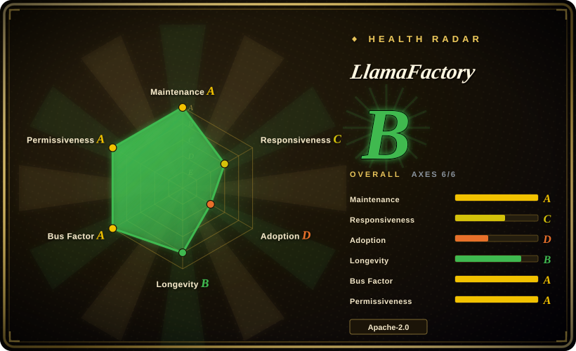
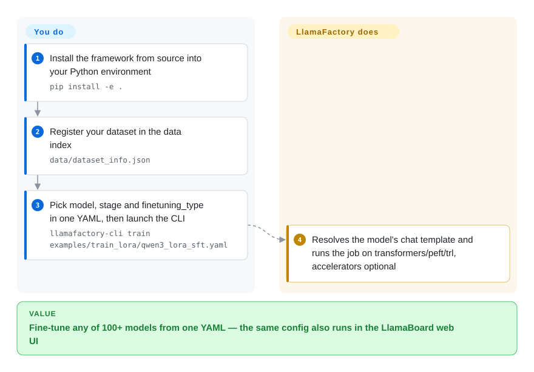

# LlamaFactory

You swap open models weekly — Qwen3 now, some new multimodal next — and each switch means hunting a different training repo, rewriting the loop, re-plumbing your data. LlamaFactory collapses that into one YAML in front of the standard Hugging Face stack: you declare the model, the job (SFT, DPO, PPO …) and the tuning method (LoRA, QLoRA, full), and the same config runs from the CLI or the LlamaBoard web UI across 100+ models.

## When to use

You're an ML engineer or applied researcher who needs to fine-tune a wide range of open models — say Qwen3 this week, Llama-4 the next, a multimodal Qwen-VL after that — and you don't want to rewrite a bespoke training loop or hunt down a different repo for each architecture. You also want to move between methods (LoRA → QLoRA → full tuning → DPO/PPO) without re-plumbing your data pipeline. LlamaFactory resolves this by exposing one declarative interface: you register a dataset, pick a model and a `stage`/`finetuning_type`, and it dispatches to the right path across 100+ supported models. The same YAML config runs from the CLI (`llamafactory-cli train`) or is editable live in LlamaBoard, so you can prototype in the browser and then commit the config for reproducible runs.

It's also a strong fit when the people doing the tuning aren't full-time training engineers. The LlamaBoard web UI lets you launch SFT or preference-optimization jobs, watch loss curves, and run quick chat evals without touching Python — lowering the barrier for domain experts who want to adapt a model to their data. Under the hood it still leans on the standard Hugging Face stack (transformers/peft/trl) plus accelerators like FlashAttention-2, Unsloth kernels, and vLLM/SGLang for fast inference, so you get the convenience layer without being cut off from the ecosystem's primitives.

## How it works

LlamaFactory is a dispatch layer on top of the standard Hugging Face training stack. You declare three things in one YAML file — which model (`model_name_or_path`), which job (`stage`: SFT, DPO, PPO, …), and how much of the model to touch (`finetuning_type`: full / freeze / LoRA / QLoRA) — and the framework resolves the model's chat template (the formatting rules that turn raw text into the conversation shape the model was trained on), hooks your registered dataset up to the right preprocessing path, then runs the job via `transformers`/`peft`/`trl`, optionally plugging in FlashAttention-2, Unsloth kernels or DeepSpeed/FSDP. The same configuration also loads into LlamaBoard, the Gradio web UI, where you click the same knobs, watch loss curves and chat-evaluate without writing Python. What stays yours: the GPU/CUDA environment, your dataset's formatting, the hyperparameters, and the judgment of when a run has outgrown the abstraction and should go back to raw TRL/Axolotl scripts.

<!-- flow-steps:begin (generated from flows/llamafactory.json by tools/flow_card.py — do not edit) -->

Text version of the flow

1. **You**: Install the framework from source into your Python environment — `pip install -e .`
2. **You**: Register your dataset in the data index — `data/dataset_info.json`
3. **You**: Pick model, stage and finetuning_type in one YAML, then launch the CLI — `llamafactory-cli train examples/train_lora/qwen3_lora_sft.yaml`
4. **LlamaFactory**: Resolves the model's chat template and runs the job on transformers/peft/trl, accelerators optional

**Value**: Fine-tune any of 100+ models from one YAML — the same config also runs in the LlamaBoard web UI

<!-- flow-steps:end -->

## When NOT to use

- **You want maximum single-GPU speed/VRAM efficiency.** [Unsloth](unsloth.md)'s custom Triton kernels are reported to be faster and lighter on a single GPU for the model families it supports; LlamaFactory wraps Unsloth optionally but its own dispatch adds initialization overhead. [未验证] benchmark numbers vary by config.
- **You need agentic / multi-turn RL or reward-from-environment training.** LlamaFactory targets the SFT→preference-optimization (DPO/KTO/ORPO/SimPO/PPO) lane, not rollout-based agent RL — see [ART](art.md) or [Agent Lightning](agent-lightning.md).
- **You want a minimal, auditable training loop you fully own.** The framework abstracts a lot; when something breaks deep in a `stage`/`template` interaction, debugging means tracing through LlamaFactory's dispatch layers on top of transformers/trl. A thinner library (torchtune, HF TRL) may be easier to reason about.
- **Config sprawl / template lock-in.** Behavior is driven by model `template`s and a large config surface; getting a custom chat template or unusual dataset format exactly right can be fiddly, and you're coupled to LlamaFactory's abstractions and release cadence.
- **Bleeding-edge architecture day-one.** New model support depends on a LlamaFactory release wiring up the template/dispatch, which may lag a raw transformers integration.

## Comparison

| Alternative | In index | Our verdict | Tradeoff |
|---|---|---|---|
| [Unsloth](unsloth.md) | ✅ | Choose Unsloth when single-GPU speed and VRAM savings matter more than broad model/method coverage or a web UI. | Its custom kernels win on one GPU; multi-GPU only via manual Accelerate/DeepSpeed setup, and the broad dataset/method matrix stays yours to wire. |
| [ART](art.md) | ✅ | Choose ART when the target is agentic RL with GRPO-style rollouts rather than SFT or preference tuning. | Different problem: training agents from rollouts, not a general fine-tuning workbench. |
| [Agent Lightning](agent-lightning.md) | ✅ | Choose Agent Lightning when existing agents should be trained from their own execution traces. | Agent-RL infrastructure, not a general SFT/LoRA toolbox. |
| [axolotl](axolotl.md) | ✅ | Choose axolotl for YAML-driven, multi-GPU-first production runs with FSDP/DeepSpeed out of the box. | More reproducibility-oriented; LlamaFactory adds web UI and a broader zero-code surface. |
| [torchtune](torchtune.md) | ✅ | Choose torchtune when lean native-PyTorch recipes you own end-to-end are preferable to a large framework. | Less batteries-included and no web UI, but easier to reason about. |
| HF TRL ([trl](trl.md)) | ✅ | Choose TRL when you want the lower-level SFT/DPO/PPO trainer classes and can do the wiring yourself. | More control and less abstraction than LlamaFactory (LlamaFactory runs on TRL underneath), but every integration detail is yours. |
| Swift (ModelScope) | 未收录 | Choose Swift when the ModelScope ecosystem is the stronger fit for a broad fine-tuning framework. | Broadly overlapping scope; ecosystem preference is the deciding tradeoff. |

## Tech stack

- **Language:** Python (≈99% per repo).
- **Core:** Hugging Face `transformers`, `peft`, `trl`, `accelerate`, `datasets`, `torch`.
- **UI/API:** Gradio (LlamaBoard web UI); OpenAI-compatible HTTP API server.
- **Acceleration:** FlashAttention-2, optional Unsloth kernels, optional quantization (bitsandbytes / GPTQ / AWQ), DeepSpeed & FSDP for distributed training, vLLM / SGLang for inference.
- **Methods:** pre-training, SFT, reward modeling, PPO, DPO, KTO, ORPO, SimPO; full / freeze / LoRA / QLoRA / OFT / QOFT.
- **Tracking:** Weights & Biases, SwanLab, TensorBoard.

## Dependencies

- **Runtime:** Python ≥ 3.11; PyTorch ≥ 2.0 (2.6 recommended). CUDA GPU for any real training (CPU only for trivial smoke tests); Ascend NPU supported via Python 3.12, `requirements/npu.txt` plus the Ascend CANN toolkit and kernels.
- **Required Python deps (PyPI metadata for llamafactory 0.9.5, checked 2026-09-28):** `transformers` ≥ 4.55 (excl. 4.52.0/4.57.0, ≤ 5.6.0), `peft` ≥ 0.18 (≤ 0.18.1), `trl` ≥ 0.18 (≤ 0.24.0), `accelerate` ≥ 1.3 (≤ 1.11.0), `datasets` ≥ 2.16 (≤ 4.0.0). The README's *Requirement* table still prints lower minimums (`transformers` 4.49, `peft` 0.14, `trl` 0.8.6); the packaging metadata is what pip actually enforces.
- **Optional groups:** `deepspeed`, `bitsandbytes`, `vllm`, `flash-attn`, `galore`, `badam`, `awq`/`gptq`, metrics/tracking extras (`report_to` supports `none`/`wandb`/`tensorboard`/`swanlab`/`mlflow` per the example configs).
- **Install:** from source (`git clone --depth 1 … && pip install -e .`) or the official Docker image `hiyouga/llamafactory:latest` (built on Ubuntu 22.04, CUDA 12.4, Python 3.11, PyTorch 2.6.0, flash-attn 2.7.4); a `llamafactory` wheel also exists on PyPI.

## Ops difficulty

**Low-to-medium.** For the happy path — a single GPU, a supported model, LoRA/QLoRA via LlamaBoard or one CLI command — it's among the easiest ways to get a fine-tune running, and the Docker image removes most environment pain. Difficulty rises to **medium** with multi-GPU/distributed setups (DeepSpeed ZeRO stage / FSDP / Ray config interacts with library versions and VRAM, a common source of incompatibility issues), custom chat templates or non-standard dataset formats, and the usual CUDA/flash-attn/bitsandbytes version-matching friction inherent to the PyTorch training ecosystem.

## Health & viability

- **Responsiveness**: Grade C — median first-response time 194.3 hours across 26 qualifying issues/PRs.
- **Maintenance — very active (as of 2026-09).** Repo pushed the day of this check (2026-09-28, GitHub API); latest tagged release is still v0.9.5 (2026-05-30) — development moves on `main` (the Day-0/Day-1 model table tracks new releases there) with releases lagging. ~1,154 open issues (GitHub API 2026-09-28) — high, but proportional to ~75k stars and a fast-adding model matrix. Not archived.
- **Governance & bus factor — single maintainer, a real flag.** The repo is **User-owned** (`hiyouga`) yet carries ~75.1k stars — a classic bus-factor signal: enormous adoption concentrated on one person's account, without a foundation or company structure visible. There is a contributor community, but the named owner sets direction; if that maintainer steps back, continuity is uncertain. [推断]
- **Age & Lindy — moderate, trending strong.** Created 2023-05, ~3.3 years old and continuously, heavily active — it has become a de-facto default for open-model fine-tuning, which is a strong adoption-driven Lindy signal even at a young absolute age. The durability question is governance (above), not activity.
- **Adoption & ecosystem.** Among the most-used SFT/LoRA front-ends; broad model/method coverage, a web UI (LlamaBoard), Docker image, and reliance on the standard HF stack (transformers/peft/trl) keep it well-connected to the ecosystem rather than a silo.
- **Risk flags — bus factor above all.** Apache-2.0, no relicense/CVE history asserted. The dominant risk is single-maintainer governance on a high-stakes, widely-depended-on repo; secondary risks are template/config lock-in and lag in day-one support for brand-new architectures (see When NOT to use).

## Caveats (unverified)

- [未验证] The "de-facto default for open-model fine-tuning" framing is a community-reputation claim; verified numbers this pass are ~75.1k stars, ~1,154 open issues and 2026-09-28 push date (GitHub API). Stars in this ecosystem remain date-sensitive.
- [未验证] Specific throughput/VRAM comparisons vs Unsloth/axolotl/torchtune come from third-party blog benchmarks and vary heavily with config, model, and hardware; no first-party guarantee.
- [推断] The exact set of supported models/methods shifts release-to-release; "100+ models" is the project's own framing — verify a specific model's support against the current repo before relying on it.
- [推断] "Development moves on `main`, releases lag" is inferred from v0.9.5 (2026-05-30) being latest while the default branch is pushed daily; no release-calendar statement from the maintainer was found.
