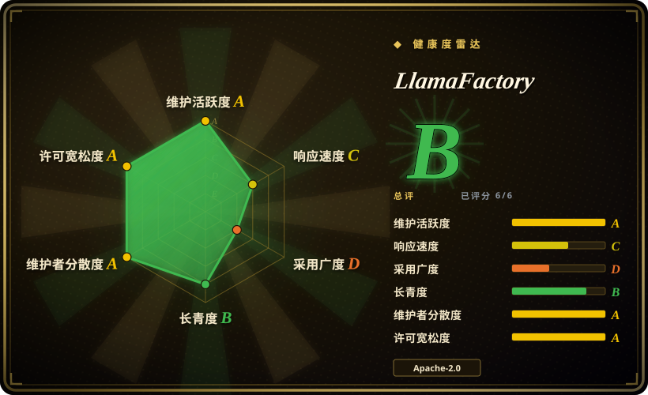
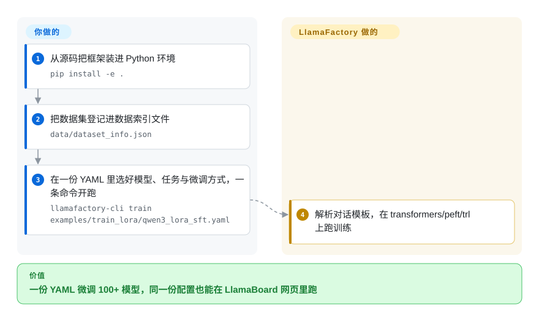

# LlamaFactory

你每周都在换开源模型——这周 Qwen3，下周又来个多模态——每换一次就得另找一个训练仓库、重写训练循环、重接数据管线。LlamaFactory 把这些收敛成标准 Hugging Face 栈前的一份 YAML：声明模型、任务（SFT、DPO、PPO……）和微调方式（LoRA、QLoRA、全参），同一份配置既能走 CLI，也能在 LlamaBoard 网页里跑，覆盖 100+ 模型。

## 何时使用

你是 ML 工程师或应用研究员，需要微调各种各样的开源模型——这周是 Qwen3，下周是 Llama-4，再后面又来个多模态 Qwen-VL——而你不想为每种架构重写一套训练循环，也不想到处翻不同的仓库。你还希望能在不同方法之间自由切换（LoRA → QLoRA → 全量微调 → DPO/PPO）而不必重新搭数据管线。LlamaFactory 用一套声明式接口解决这个问题：你注册数据集、选好模型和 `stage`/`finetuning_type`，它就在 100+ 受支持模型间把流程分发到正确的路径上。同一份 YAML 配置既能在 CLI（`llamafactory-cli train`）运行，也能在 LlamaBoard 里实时编辑——你可以先在浏览器里快速试，再把配置提交进仓库做可复现训练。

当做微调的人并不是全职训练工程师时，它同样很合适。LlamaBoard Web UI 让你不碰 Python 就能启动 SFT 或偏好优化任务、看 loss 曲线、跑简单的对话评测，降低了领域专家把模型适配到自有数据上的门槛。底层它依旧依托标准的 Hugging Face 栈（transformers/peft/trl），并叠加 FlashAttention-2、Unsloth kernel、vLLM/SGLang 等加速件，因此你得到便利层的同时，并没有和生态原语脱节。

## 怎么用起来

LlamaFactory 是叠在标准 Hugging Face 训练栈之上的一层分发。你只在一份 YAML 里声明三件事——用哪个模型（`model_name_or_path`）、做什么任务（`stage`：SFT、DPO、PPO 等）、动多大比例的参数（`finetuning_type`：全参 / freeze / LoRA / QLoRA）——框架负责解析模型的对话模板（把原始文本拼成模型训练时见过的对话格式的这套规则）、把你的数据集接到正确的预处理路径，再调用 `transformers`/`peft`/`trl` 跑起来，并可选地插上 FlashAttention-2、Unsloth kernel 或 DeepSpeed/FSDP。同一份配置也能加载进 LlamaBoard（Gradio 网页界面）：同样的旋钮做成表单，启动训练、看 loss 曲线、随手对话评测，全程不写 Python。仍然归你管的：GPU/CUDA 环境、数据集的格式化、超参数，以及一次训练何时「超出抽象舒适区」、该退回裸 TRL/Axolotl 脚本的判断。

<!-- flow-steps:begin (generated from flows/llamafactory.json by tools/flow_card.py — do not edit) -->

流程文字版

1. **你**：从源码把框架装进 Python 环境 — `pip install -e .`
2. **你**：把数据集登记进数据索引文件 — `data/dataset_info.json`
3. **你**：在一份 YAML 里选好模型、任务与微调方式，一条命令开跑 — `llamafactory-cli train examples/train_lora/qwen3_lora_sft.yaml`
4. **LlamaFactory**：解析对话模板，在 transformers/peft/trl 上跑训练

**价值**：一份 YAML 微调 100+ 模型，同一份配置也能在 LlamaBoard 网页里跑

<!-- flow-steps:end -->

## 何时不用

- **你要单卡极致速度/显存效率。** 据报道，在其支持的模型家族上，[Unsloth](unsloth.zh.md) 的自定义 Triton kernel 单卡更快、更省显存；LlamaFactory 可选包装 Unsloth，但自身分发层会带来初始化开销。[未验证] 具体跑分随配置变化很大。
- **你需要 agent 化 / 多轮 RL 或环境奖励训练。** LlamaFactory 面向 SFT→偏好优化（DPO/KTO/ORPO/SimPO/PPO）这条线，而非基于 rollout 的 agent RL——看 [ART](art.zh.md) 或 [Agent Lightning](agent-lightning.zh.md)。
- **你想要一个完全自己掌控、可审计的极简训练循环。** 框架抽象很厚；一旦在某个 `stage`/`template` 交互的深处出问题，排查就意味着要穿过 LlamaFactory 叠在 transformers/trl 之上的分发层。更薄的库（torchtune、HF TRL）可能更易推理。
- **配置膨胀 / 模板锁定。** 行为由模型 `template` 和庞大的配置面驱动；把自定义对话模板或非常规数据格式调对可能很繁琐，而且你会被绑定在 LlamaFactory 的抽象和发版节奏上。
- **追最前沿架构的第一天。** 新模型支持依赖 LlamaFactory 发版把 template/分发接通，可能比 transformers 原生集成滞后。

## 横向对比

| 替代品 | 是否收录 | 我们的评价 | 取舍 |
|---|---|---|---|
| [Unsloth](unsloth.zh.md) | ✅ | 单卡速度和省显存比广泛模型／方法覆盖或 Web UI 更重要时，选 Unsloth。 | 它的自定义 kernel 在单卡上占优；多卡要靠手动 Accelerate/DeepSpeed 配置，广泛的数据集与方法矩阵得自己接。 |
| [ART](art.zh.md) | ✅ | 目标是带 GRPO 式 rollout 的 agentic RL，而不是 SFT 或偏好微调时，选 ART。 | 它解决的是从 rollout 训练 agent，不是通用微调工作台。 |
| [Agent Lightning](agent-lightning.zh.md) | ✅ | 需要从现有 agent 自身执行轨迹中训练时，选 Agent Lightning。 | 它是 agent-RL 基础设施，不是通用 SFT/LoRA 工具箱。 |
| [axolotl](axolotl.zh.md) | ✅ | 需要 YAML 驱动、多卡优先，并开箱带 FSDP/DeepSpeed 的生产训练时，选 axolotl。 | 它更偏可复现生产运行；LlamaFactory 多了 Web UI 和更广的零代码面。 |
| [torchtune](torchtune.zh.md) | ✅ | 精简、原生 PyTorch、端到端自己掌控，比大型框架更重要时，选 torchtune。 | 开箱能力更少、无 Web UI，但更容易推理。 |
| HF TRL（[trl](trl.zh.md)） | ✅ | 想要底层 SFT/DPO/PPO trainer，并愿意自己接线时，选 TRL。 | 比 LlamaFactory 更可控、抽象更少（LlamaFactory 底层就跑在 TRL 上），但每个集成细节都由你承担。 |
| Swift(ModelScope) | 未收录 | ModelScope 生态更契合，且同样需要广覆盖微调框架时，选 Swift。 | 覆盖面与 LlamaFactory 重叠；生态偏好是决定性取舍。 |

## 技术栈

- **语言：** Python（仓库约 99%）。
- **核心：** Hugging Face `transformers`、`peft`、`trl`、`accelerate`、`datasets`、`torch`。
- **UI/API:** Gradio(LlamaBoard Web UI);OpenAI 兼容 HTTP API 服务。
- **加速：** FlashAttention-2、可选 Unsloth kernel、可选量化（bitsandbytes / GPTQ / AWQ）、DeepSpeed 与 FSDP 分布式训练、vLLM / SGLang 推理。
- **方法：** 预训练、SFT、奖励建模、PPO、DPO、KTO、ORPO、SimPO；全量 / freeze / LoRA / QLoRA / OFT / QOFT。
- **跟踪：** Weights & Biases、SwanLab、TensorBoard。

## 依赖

- **运行时：** Python ≥ 3.11；PyTorch ≥ 2.0（推荐 2.6）。任何真实训练都需要 CUDA GPU（CPU 仅适合最简单的冒烟测试）；昇腾 NPU 走 Python 3.12、`requirements/npu.txt` 加 Ascend CANN 工具链与 kernels。
- **必需 Python 依赖（llamafactory 0.9.5 的 PyPI 元数据，2026-09-28 核验）：** `transformers` ≥ 4.55（排除 4.52.0/4.57.0，≤ 5.6.0）、`peft` ≥ 0.18（≤ 0.18.1）、`trl` ≥ 0.18（≤ 0.24.0）、`accelerate` ≥ 1.3（≤ 1.11.0）、`datasets` ≥ 2.16（≤ 4.0.0）。README 的 *Requirement* 表仍写着更低的最小值（`transformers` 4.49、`peft` 0.14、`trl` 0.8.6）；pip 实际强制的是打包元数据那一套。
- **可选分组：** `deepspeed`、`bitsandbytes`、`vllm`、`flash-attn`、`galore`、`badam`、`awq`/`gptq`、metrics/tracking 额外项（示例配置显示 `report_to` 支持 `none`/`wandb`/`tensorboard`/`swanlab`/`mlflow`）。
- **安装：** 源码安装（`git clone --depth 1 … && pip install -e .`）或官方 Docker 镜像 `hiyouga/llamafactory:latest`（基于 Ubuntu 22.04、CUDA 12.4、Python 3.11、PyTorch 2.6.0、flash-attn 2.7.4）；PyPI 上也有 `llamafactory` wheel。

## 运维难度

**低到中。** 走顺路径时——单卡、受支持模型、通过 LlamaBoard 或一行 CLI 跑 LoRA/QLoRA——它是把微调跑起来最简单的方式之一，Docker 镜像也消除了大部分环境痛点。难度升到**中**的场景：多卡/分布式（DeepSpeed ZeRO stage / FSDP / Ray 配置会和库版本、显存交互，是常见的不兼容来源）、自定义对话模板或非标准数据格式，以及 PyTorch 训练生态固有的 CUDA/flash-attn/bitsandbytes 版本匹配摩擦。

## 健康度与可持续性

- **响应速度**：Grade C——中位首次响应时间 194.3 小时，基于 26 个 qualifying issues/PRs。
- **维护——非常活跃（截至 2026-09）。** 仓库在本次核查当天（2026-09-28）仍有推送；最新 tag 仍是 v0.9.5（2026-05-30）——开发在 `main` 上推进（Day-0/Day-1 模型表就是跟着新模型走的），发版节奏滞后于主干。约 1,154 个未决 issue（GitHub API，2026-09-28）——偏高，但与约 75.1k star 和快速扩张的模型矩阵成比例。未归档。
- **治理与 bus factor——单一维护者，是个实打实的标记。** 仓库由 **User 持有**（`hiyouga`），却背着约 75.1k star——这是典型的 bus-factor 信号：巨大的采用量集中在一个人的账号上，看不到基金会或公司结构。虽有贡献者社区，但方向由这位具名 owner 把控；一旦该维护者退场，延续性就不确定。[推断]
- **年龄与 Lindy——中等，趋势向强。** 创建于 2023-05，约 3.3 年且持续高强度活跃——它已成为开源模型微调的事实默认之一，即便绝对年龄尚轻，这也是采用驱动的强 Lindy 信号。耐久性的疑问在治理（见上），而非活跃度。
- **采用与生态。** 是使用最广的 SFT/LoRA 前端之一；模型/方法覆盖广，有 Web UI（LlamaBoard）、Docker 镜像，且依托标准 HF 栈（transformers/peft/trl），与生态连接良好而非孤岛。
- **风险标记——首要是 bus factor。** Apache-2.0，不断言重新授权/CVE 历史。最主要的风险是这个高风险、被广泛依赖的仓库的单一维护者治理；次要风险是 template/配置锁定，以及对全新架构第一天支持的滞后（见「何时不用」）。

## 存疑（未验证）

- [未验证] “开源模型微调的事实默认”是社区口碑式表述；本轮核验到的数字是约 75.1k star、约 1,154 个未决 issue 与 2026-09-28 的推送日期（GitHub API）。本生态 star 数对时间敏感，仅供参考。
- [未验证] 与 Unsloth/axolotl/torchtune 的具体吞吐/显存对比来自第三方博客跑分，随配置、模型、硬件差异极大；无一方官方保证。
- [推断] 受支持的模型/方法集合随版本变动；“100+ 模型”是项目自己的表述——依赖某具体模型前请对照当前仓库核实其支持情况。
- [推断] “开发在主干、发版滞后”是从 v0.9.5（2026-05-30）为最新 tag、而默认分支每日有推送推断的；未找到维护者发布的发版日历承诺。
