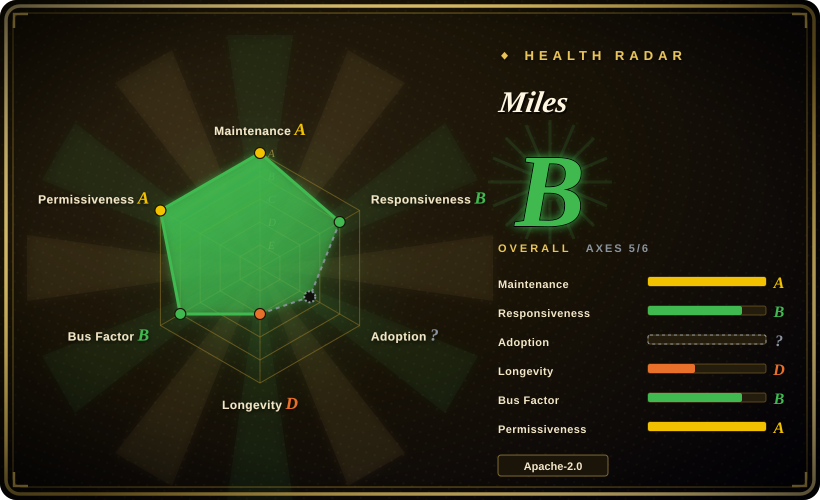
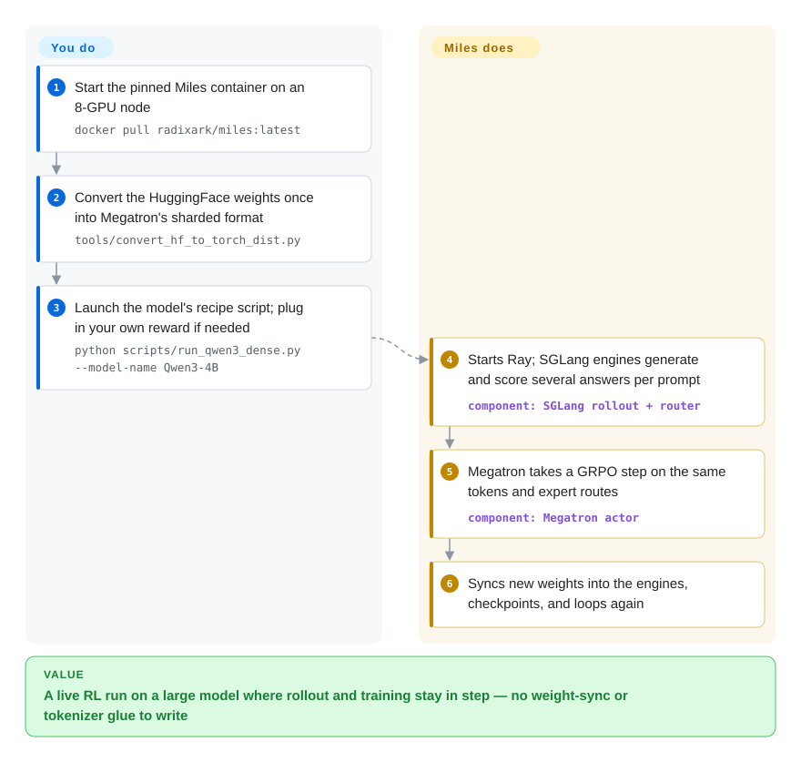

# Miles

RL-training a frontier-size model means two clusters of GPUs that disagree: the inference engine that writes the answers and the trainer that learns from them use different kernels, different MoE expert choices and different token boundaries, so the run drifts or diverges while hours of GPU time sit idle waiting on weight copies. Miles is RadixArk's fork of slime that welds SGLang (fast generation) to Megatron-LM (large-scale training) and spends its effort on keeping the two numerically in step — token-for-token hand-off, replayed expert routing, seconds-scale weight sync, and engine restarts without stopping the run.

## When to use

You're on an RL-infra or post-training team with real hardware — a few nodes of H100/H200 or B200/GB200, maybe AMD MI300X/MI355X — and you need to run GRPO, GSPO, PPO or on-policy distillation on a large MoE model such as DeepSeek-V4, Kimi-K2.6, GLM-5.x or Qwen3.5, often with multi-turn agentic rollouts (coding agents in sandboxes). The generic RL stacks get you a curve, but at this scale it goes wrong in specific ways: `rollout/raw_reward` climbs for a while and then collapses because the inference engine picked different experts than the trainer recomputes, or because the text was detokenized and re-tokenized differently on the way back; or `perf/train_wait_time` dwarfs `perf/actor_train_time` because pushing a trillion-parameter checkpoint into the engines takes minutes.

Miles is the choice when you've already accepted SGLang for rollout and Megatron-LM for training and want an opinionated framework that ships per-model launch recipes for the newest frontier models (several landed on release day, per the project's news list) and the correctness fixes those models need — token-in-token-out, Rollout Routing Replay for MoE, MXFP8/NVFP4 low-precision RL, P2P RDMA weight transfer, SGLang engine fault recovery. Over [verl](verl.md) it trades engine choice (no vLLM) and backend breadth for a narrower, deeper SGLang+Megatron path tuned by people who also work on SGLang; over its upstream slime it adds that enterprise-facing hardening layer and a faster-moving model matrix.

## How it works

A Miles job is two engines taking turns on the same problem. SGLang (a high-throughput LLM inference server) generates several candidate answers per prompt — the *rollout* — behind a router that spreads requests over engines; your reward function scores them; Megatron-LM (NVIDIA's library for splitting one model across many GPUs) takes an optimizer step on the GRPO (group-relative policy optimization) objective; then the new weights are pushed back into the SGLang engines and the loop repeats. Everything is orchestrated as Ray actors. What Miles does for you is the glue that is hard at scale: sharing or splitting GPUs between the two engines (`--colocate` swaps the trainer off the GPU while generation runs), keeping token IDs and MoE routing identical on both sides, syncing weights over NCCL, RDMA or disk deltas, checkpointing and resuming, and restarting a dead engine in place. What stays yours: picking or editing the launch recipe (`scripts/run_*.py` — a Python file that is meant to be read and changed), converting the HuggingFace checkpoint to Megatron's sharded format once, and supplying the reward, data source or agent loop through about two dozen `--*-path` plug-in flags. Think of it as a relay race where Miles owns the baton hand-off: you choose the runners and the course.

<!-- flow-steps:begin (generated from flows/miles.json by tools/flow_card.py — do not edit) -->

Text version of the flow

1. **You**: Start the pinned Miles container on an 8-GPU node — `docker pull radixark/miles:latest`
2. **You**: Convert the HuggingFace weights once into Megatron's sharded format — `tools/convert_hf_to_torch_dist.py`
3. **You**: Launch the model's recipe script; plug in your own reward if needed — `python scripts/run_qwen3_dense.py --model-name Qwen3-4B`
4. **Miles**: Starts Ray; SGLang engines generate and score several answers per prompt — component: `SGLang rollout + router`
5. **Miles**: Megatron takes a GRPO step on the same tokens and expert routes — component: `Megatron actor`
6. **Miles**: Syncs new weights into the engines, checkpoints, and loops again

**Value**: A live RL run on a large model where rollout and training stay in step — no weight-sync or tokenizer glue to write

<!-- flow-steps:end -->

## When NOT to use

- **You have one GPU, or a single consumer card.** The quick start assumes a node with 8 H100/H200/B-series GPUs, 500 GB free disk and Docker with GPU access; the recipes are tuned for multi-GPU Megatron parallelism. For single-GPU LoRA/QLoRA or small-model GRPO, use [Unsloth](unsloth.md) or [Hugging Face TRL](trl.md) instead.
- **You only need SFT or DPO on a HuggingFace model.** Miles has an SFT recipe, but its reason to exist is the rollout/training loop. For supervised or preference tuning, [TRL](trl.md), [LlamaFactory](llamafactory.md) or [Axolotl](axolotl.md) are simpler and keep you in the HF format with no Megatron conversion step.
- **Your inference stack is vLLM, or you want to swap rollout engines.** Rollout is SGLang-only (router, TITO session server, patched build). If vLLM is the engine your team operates, use [verl](verl.md) (supports vLLM and SGLang, FSDP and Megatron) or OpenRLHF (Ray + vLLM + DeepSpeed) instead.
- **You can't run the pinned Docker image.** The installation guide warns that Miles pins *patched* SGLang and Megatron-LM, and that installing them at the wrong commit is the most common source of bug reports. On locked-down clusters where you must assemble your own environment, a framework that installs from PyPI (TRL, or verl) will cost less debugging.
- **You need a stable API and semver.** v0.1.0 shipped on 2026-08-18 and v0.1.1 on 2026-09-26; 773 PRs were merged in the 30 days before 2026-09-29, and recent issues report breakage between the Megatron bridge, offline checkpoint tools and launchers. Pin a commit and budget for re-validation on every upgrade; if you need a slow-moving contract, TRL is the safer base.
- **You want LoRA without converting to Megatron.** The training-backend docs list LoRA as *not supported* on the FSDP backend — LoRA/multi-LoRA lives on the Megatron path, which requires the `torch_dist` checkpoint conversion. For HF-native LoRA RL on modest hardware, use Unsloth or TRL.
- **You want to RL-tune an agent you already built, without owning the training cluster.** Miles expects you to run the GPUs and the engines. [Agent Lightning](agent-lightning.md) or [ART](art.md) wrap an existing agent's traces into training with far less infrastructure.

## Comparison

| Alternative | In index | Our verdict | Tradeoff |
|---|---|---|---|
| slime (THUDM/slime) | not indexed | Pick slime when you want the leaner upstream SGLang+Megatron RL framework that Miles forked from; pick Miles when you need its enterprise hardening (fault recovery, P2P weight sync, low-precision RL) and day-0 frontier-model recipes. | Same architecture and argument pass-through; Miles adds features and churn on top, slime is the older and more-starred base. Not added in this tab-intake batch. |
| [verl](verl.md) | ✅ | Pick verl when you need engine and backend choice (vLLM or SGLang; FSDP, Megatron and more) or a broader algorithm zoo; pick Miles when you are committed to SGLang+Megatron and the MoE train/inference mismatch is your main failure mode. | verl buys flexibility and a larger community at the cost of a less specialized path; Miles narrows the stack to deepen correctness on it. |
| OpenRLHF | not indexed | Pick OpenRLHF when your team already runs Ray + vLLM + DeepSpeed and models fit without Megatron-style tensor/expert parallelism; pick Miles for 100B+ MoE runs that need Megatron's parallel layouts. | OpenRLHF is older (2023) and simpler to stand up on DeepSpeed; Miles scales further but requires the Megatron conversion and pinned image. Not added in this tab-intake batch. |
| NeMo RL (NVIDIA-NeMo/RL) | not indexed | Pick NeMo RL when you want an NVIDIA-backed stack with a DTensor or Megatron Core backend inside the NeMo ecosystem; pick Miles when SGLang rollout and AMD ROCm support matter more than vendor alignment. | NeMo RL has the NVIDIA roadmap behind it; Miles has SGLang-native rollout and ships AMD images, but relies on a startup's roadmap. Not added in this tab-intake batch. |
| [Hugging Face TRL](trl.md) | ✅ | Pick TRL for GRPO/DPO/SFT on models that fit data parallelism inside the transformers stack; pick Miles once rollout throughput and cross-node model sharding dominate the cost. | TRL is easy to install and stable; it does not provide Miles's decoupled async rollout or Megatron-scale parallelism. |

## Tech stack

- **Language:** Python (the bulk of the repo), with small CUDA, Jinja/Go-template (Helm `charts/`) and JavaScript (dashboard) parts per GitHub's language breakdown.
- **Rollout:** SGLang behind `sglang-router`, with a token-in-token-out session server for OpenAI-compatible agent loops.
- **Training:** Megatron-LM by default (TP × PP × CP × EP × ETP parallelism, `torch_dist` checkpoints); PyTorch FSDP2 as an alternative backend that trains the HuggingFace implementation as-is.
- **Orchestration:** Ray actors; `train.py` (colocated/sync), `train_async.py` (fully async) and `train_multi_policy.py` entry points; per-model launchers under `scripts/`.
- **Weight sync:** NCCL broadcast (default), P2P RDMA via Mooncake, or disk-delta through shared storage (blake3/xxhash/zstd in `requirements.txt`).
- **Algorithms:** GRPO, GSPO, PPO, REINFORCE++, SFT, on-policy distillation; LoRA and multi-LoRA; precisions MXFP8, NVFP4, FP8, INT4 QAT, BF16, FP16.

## Dependencies

- **GPUs:** NVIDIA GB300/GB200/B300/B200 (production), H200/H100 (production, CI-guarded), A100 (supported, FP8 features disabled); AMD MI300X/MI325/MI350X/MI355X via ROCm images. Multi-node needs InfiniBand/RoCEv2/Slingshot at 200+ GB/s per node.
- **Container:** `radixark/miles:latest` (or `rocm/sgl-dev:miles-*` on AMD) bundling PyTorch, patched Megatron-LM and SGLang, FlashAttention-3, DeepGEMM, Apex, Ray.
- **Python deps** (`requirements.txt`): `ray[default]>=2.56`, `transformers==5.12.1`, `sglang-router`, `wandb`, `tensorboard`, `nvidia-resiliency-ext`, `torchft-nightly`, `mcp[cli]`, `openai`, `kubernetes_asyncio`, `psycopg` (a metric-history gate store), and others.
- **Storage:** at least 500 GB free disk for a single-node quick start (model, datasets, the Megatron checkpoint copy and checkpoints).
- **Optional services:** Weights & Biases for metrics; agent sandboxes on AgentENV, Daytona, E2B or Modal; environment connectors (Harbor, HUD, NeMo Gym, OpenEnv, Verifiers).

## Ops difficulty

**High.** Even the happy path is a GPU node, a privileged Docker run with host IPC/network and raised ulimits, a one-off HF→Megatron checkpoint conversion, and a Ray cluster the launcher starts for you. Beyond one node you own the interconnect, shared storage for checkpoints, Ray head placement and the choice of colocated vs disaggregated GPU layout and weight-transfer mode (`p2p` and `disk-delta` are incompatible with `--colocate`). The fast release pace and patched dependencies make upgrades a re-validation exercise rather than a version bump. Relaunching the same command resumes from the last checkpoint, and SGLang engine failures recover in place, which lowers day-2 pain once the run is up.

## Health & viability

- **Maintenance — extremely active (as of 2026-09-29).** Default branch pushed 2026-09-29; 773 PRs merged in the prior 30 days; releases v0.1.0 (2026-08-18) and v0.1.1 (2026-09-26). The same pace is a stability cost: 885 open PRs and 145 open vs 60 closed issues, many recent ones filed without replies.
- **Governance & bus factor.** Org-owned by RadixArk (GitHub org created 2025-07; Ying Sheng lists RadixArk as employer), with CODEOWNERS spread over ~10 people. Commit share is concentrated: fzyzcjy has 1,133 of ~2,300 commits across the top 15 contributors (~49%). Two CODEOWNERS (fzyzcjy, Ying1123) are also top-20 SGLang contributors, which ties Miles's roadmap to SGLang's.
- **Age & Lindy — young, so no Lindy credit.** Created 2025-10-09 (~1 year), itself a fork of slime (2025-06). ~3.0k stars and 526 forks in a year, plus LMSYS blog coverage, show uptake, but a one-year-old v0.1 framework is a bet on its team, not on track record [推断].
- **Backing.** A startup-backed project co-evolving with an upstream owned by a different org (THUDM/Z.ai). Whether the two converge, diverge or one absorbs the other is open; slime's own top contributor also works on Miles.
- **Risk flags.** Apache-2.0, no relicense history. Patched dependency pins are the main operational risk; enterprise positioning suggests commercial offerings may grow around it (see Caveats).

## Caveats (unverified)

- [未验证] Day-0 support claims (DeepSeek-V4, Kimi-K3, GLM-5.2, Inkling, Nemotron) and "weights reach the engines in seconds on a trillion-parameter model" come from the README/news list and LMSYS blog posts; not reproduced — needs a multi-node GPU cluster.
- [未验证] The claim that R3 and TITO remove the train/inference mismatch that destabilizes large runs is a project claim; no independent benchmark was checked.
- [推断] "Startup-backed" and the likelihood of commercial offerings around Miles are inferred from the RadixArk org, the "enterprise-facing" positioning and maintainer employer fields; no funding or pricing disclosure was verified.
- [推断] The account `miles-code-angel` (32 commits, bio "The code god farther of Miles") looks like an automated or agent account; its role was not confirmed.
- [推断] The slime ↔ Miles relationship ("forked from and co-evolving with") is stated upstream; how often changes flow between the two repos was not measured.
- [未验证] Hardware support status per GPU is quoted from the installation docs (2026-09-29); NPU appears only as a launcher script (`run_qwen3_4b_npu.py`), not in the support table.
- [未验证] The radar's adoption axis is `?` because the PyPI name `miles` belongs to an unrelated package (checked 2026-09-29); Miles ships through Docker images and git, so no download or dependent count was measurable.
