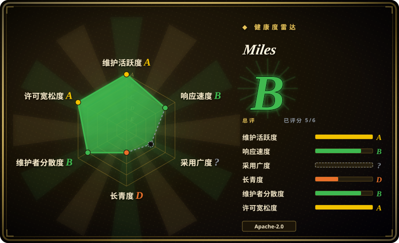
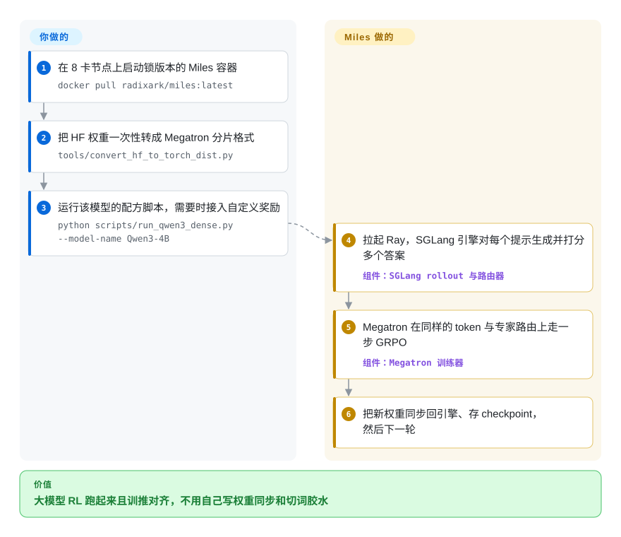

# Miles

给前沿规模的大模型做强化学习，最常见的坑是“写答案的”和“学答案的”对不上：推理引擎和训练器用的算子不同、MoE 选中的专家不同、切词边界不同，训练曲线涨着涨着就崩了，大把 GPU 时间还耗在搬权重上。Miles 是 RadixArk 从 slime 分叉出来的框架，把 SGLang（负责快速生成）和 Megatron-LM（负责大规模训练）焊在一起，把力气花在让两边数值对齐上：token 原样交接、专家路由回放、秒级同步权重、引擎挂了原地拉起不停训练。

## 何时使用

你在一个做 RL 基础设施或后训练的团队，手里有真卡——几台 H100/H200 或 B200/GB200 的节点，也可能是 AMD MI300X/MI355X——要在 DeepSeek-V4、Kimi-K2.6、GLM-5.x、Qwen3.5 这类大 MoE 模型上跑 GRPO、GSPO、PPO 或在线蒸馏，还常常带多轮智能体 rollout（在沙箱里写代码的 agent）。通用 RL 框架也能跑出曲线，但到这个规模会以很具体的方式出错：`rollout/raw_reward` 涨一阵后突然塌掉，原因是推理引擎选的专家和训练器重算时选的不一样，或者文本回传时先解码再重新切词，切出来的 token 变了；又或者 `perf/train_wait_time` 远大于 `perf/actor_train_time`，因为把一个万亿参数的权重推回推理引擎要好几分钟。

当你已经认定 rollout 用 SGLang、训练用 Megatron-LM，想要一个有主见的框架，直接给出最新前沿模型的逐模型启动配方（按项目新闻列表，好几个是发布当天就支持），并把这些模型需要的正确性补丁一起带上——token 进 token 出、MoE 路由回放、MXFP8/NVFP4 低精度 RL、P2P RDMA 权重传输、SGLang 引擎故障自愈——就选 Miles。相比 [verl](verl.zh.md)，它放弃了引擎选择（不支持 vLLM）和后端广度，换来一条更窄但挖得更深、由同时参与 SGLang 开发的人调过的 SGLang+Megatron 路径；相比上游 slime，它多了这层面向企业的加固和更快跟进的模型矩阵。

## 怎么用起来

一个 Miles 任务就是两台引擎轮流干同一件事。SGLang（高吞吐的大模型推理服务）对每个提示词生成若干候选答案——这叫 *rollout*——前面有个路由器把请求分摊到多台引擎；你的奖励函数给答案打分；Megatron-LM（NVIDIA 用来把一个模型切到很多张卡上的训练库）按 GRPO（组内相对策略优化）目标走一步优化；然后新权重推回 SGLang 引擎，循环往复。整个过程用 Ray actor 编排。Miles 替你做的是规模上来后最难的那层胶水：两台引擎共用还是分开 GPU（`--colocate` 在生成时把训练器挪下显卡）、让两边的 token ID 和 MoE 路由完全一致、通过 NCCL、RDMA 或磁盘增量同步权重、断点保存与续跑、原地重启挂掉的引擎。留给你的是：挑选或修改启动配方（`scripts/run_*.py`，一个本来就让你读和改的 Python 文件）、把 HuggingFace 权重一次性转成 Megatron 的分片格式，以及通过二十多个 `--*-path` 插件参数接入自己的奖励、数据源或 agent 循环。可以把它想成一场接力赛：Miles 负责交接棒，选哪几个选手、跑哪条赛道由你定。

<!-- flow-steps:begin (generated from flows/miles.json by tools/flow_card.py — do not edit) -->

流程文字版

1. **你**：在 8 卡节点上启动锁版本的 Miles 容器 — `docker pull radixark/miles:latest`
2. **你**：把 HF 权重一次性转成 Megatron 分片格式 — `tools/convert_hf_to_torch_dist.py`
3. **你**：运行该模型的配方脚本，需要时接入自定义奖励 — `python scripts/run_qwen3_dense.py --model-name Qwen3-4B`
4. **Miles**：拉起 Ray，SGLang 引擎对每个提示生成并打分多个答案 — 组件：`SGLang rollout 与路由器`
5. **Miles**：Megatron 在同样的 token 与专家路由上走一步 GRPO — 组件：`Megatron 训练器`
6. **Miles**：把新权重同步回引擎、存 checkpoint，然后下一轮

**价值**：大模型 RL 跑起来且训推对齐，不用自己写权重同步和切词胶水

<!-- flow-steps:end -->

## 何时不用

- **只有一张卡，或者是消费级显卡。** 快速上手默认一个 8 卡 H100/H200/B 系列节点、500 GB 空闲磁盘和能用 GPU 的 Docker，配方都是按多卡 Megatron 并行调的。单卡 LoRA/QLoRA 或小模型 GRPO，改用 [Unsloth](unsloth.zh.md) 或 [Hugging Face TRL](trl.zh.md)。
- **只想在 HuggingFace 模型上做 SFT 或 DPO。** Miles 有 SFT 配方，但它存在的理由是 rollout 和训练的循环。监督微调或偏好对齐用 [TRL](trl.zh.md)、[LlamaFactory](llamafactory.zh.md) 或 [Axolotl](axolotl.zh.md) 更简单，而且一直留在 HF 格式，不用转 Megatron。
- **团队的推理栈是 vLLM，或者想换 rollout 引擎。** rollout 只支持 SGLang（路由器、TITO 会话服务、打过补丁的版本）。如果你们运维的是 vLLM，改用 [verl](verl.zh.md)（支持 vLLM 与 SGLang、FSDP 与 Megatron）或 OpenRLHF（Ray + vLLM + DeepSpeed）。
- **跑不了官方锁版本的 Docker 镜像。** 安装文档明确警告：Miles 锁定的是*打过补丁*的 SGLang 和 Megatron-LM，自己装错 commit 是最常见的 bug 报告来源。在只能自己拼环境的受限集群上，从 PyPI 安装的框架（TRL 或 verl）排障成本更低。
- **需要稳定 API 和语义化版本。** v0.1.0 于 2026-08-18 发布，v0.1.1 于 2026-09-26 发布；截至 2026-09-29 的 30 天内合并了 773 个 PR，近期 issue 里有 Megatron bridge、离线权重工具和启动脚本之间互相打架的报告。要锁 commit，并为每次升级预留重新验证的时间；要一个慢变的接口，TRL 更稳。
- **想做 LoRA 又不想转 Megatron 格式。** 训练后端文档写明 FSDP 后端*不支持* LoRA——LoRA 和多 LoRA 都在 Megatron 路径上，必须先转 `torch_dist` 权重。在普通硬件上做 HF 原生的 LoRA RL，用 Unsloth 或 TRL。
- **想给已经写好的 agent 做 RL，又不想自己管训练集群。** Miles 默认 GPU 和引擎都由你来跑。[Agent Lightning](agent-lightning.zh.md) 或 [ART](art.zh.md) 能把现成 agent 的执行轨迹接进训练，基础设施负担小得多。

## 横向对比

| 替代品 | 是否收录 | 我们的评价 | 取舍 |
|---|---|---|---|
| slime（THUDM/slime） | 未收录 | 想要 Miles 分叉之前那个更精简的上游 SGLang+Megatron RL 框架，选 slime；需要故障自愈、P2P 权重同步、低精度 RL 这层企业级加固和前沿模型首日配方，选 Miles。 | 两者架构和参数透传方式相同；Miles 在其上叠加功能也叠加了变动，slime 更早、星标更多。本轮标签页收录批次未添加。 |
| [verl](verl.zh.md) | ✅ | 需要引擎和后端可选（vLLM 或 SGLang；FSDP、Megatron 等）或更全的算法库，选 verl；已经认定 SGLang+Megatron、主要失败模式是 MoE 训推不一致，选 Miles。 | verl 用更灵活和更大的社区换来一条不那么专精的路径；Miles 收窄技术栈，把这条路上的正确性做深。 |
| OpenRLHF | 未收录 | 团队已经在跑 Ray + vLLM + DeepSpeed、模型不需要 Megatron 式张量/专家并行就能装下，选 OpenRLHF；百亿参数以上的 MoE、需要 Megatron 并行布局，选 Miles。 | OpenRLHF 更老（2023 年），基于 DeepSpeed 搭起来更简单；Miles 能扩得更大，但要做 Megatron 格式转换并用锁版本镜像。本轮标签页收录批次未添加。 |
| NeMo RL（NVIDIA-NeMo/RL） | 未收录 | 想要 NVIDIA 背书、在 NeMo 生态内用 DTensor 或 Megatron Core 后端，选 NeMo RL；更看重 SGLang 原生 rollout 和 AMD ROCm 支持而非厂商绑定，选 Miles。 | NeMo RL 背后是 NVIDIA 的路线图；Miles 有 SGLang 原生 rollout 并提供 AMD 镜像，但依赖一家初创公司的路线图。本轮标签页收录批次未添加。 |
| [Hugging Face TRL](trl.zh.md) | ✅ | 模型用数据并行就能装下、想留在 transformers 体系里做 GRPO/DPO/SFT，选 TRL；一旦 rollout 吞吐和跨节点切模型成了主要成本，选 Miles。 | TRL 安装简单、接口稳定；但没有 Miles 那种解耦的异步 rollout 和 Megatron 级并行。 |

## 技术栈

- **语言：** 按 GitHub 语言统计，主体是 Python，另有少量 CUDA、Jinja/Go 模板（Helm `charts/`）和 JavaScript（dashboard）。
- **Rollout：** SGLang，前面挂 `sglang-router`，另有一个 token 进 token 出的会话服务，供 OpenAI 兼容接口的 agent 循环使用。
- **训练：** 默认 Megatron-LM（TP × PP × CP × EP × ETP 并行，`torch_dist` 权重格式）；PyTorch FSDP2 作为备选后端，直接训练 HuggingFace 原版实现。
- **编排：** Ray actor；入口有 `train.py`（共卡/同步）、`train_async.py`（全异步）和 `train_multi_policy.py`；逐模型启动脚本在 `scripts/` 下。
- **权重同步：** NCCL 广播（默认）、经 Mooncake 的 P2P RDMA，或经共享存储的磁盘增量（`requirements.txt` 里的 blake3/xxhash/zstd 就是为它准备的）。
- **算法：** GRPO、GSPO、PPO、REINFORCE++、SFT、在线蒸馏；LoRA 与多 LoRA；精度支持 MXFP8、NVFP4、FP8、INT4 QAT、BF16、FP16。

## 依赖

- **GPU：** NVIDIA GB300/GB200/B300/B200（生产级）、H200/H100（生产级，CI 守护）、A100（支持，但 FP8 特性关闭）；AMD MI300X/MI325/MI350X/MI355X 通过 ROCm 镜像支持。多节点需要 InfiniBand/RoCEv2/Slingshot，每节点 200+ GB/s。
- **容器：** `radixark/miles:latest`（AMD 上用 `rocm/sgl-dev:miles-*`），内含 PyTorch、打过补丁的 Megatron-LM 和 SGLang、FlashAttention-3、DeepGEMM、Apex、Ray。
- **Python 依赖**（`requirements.txt`）：`ray[default]>=2.56`、`transformers==5.12.1`、`sglang-router`、`wandb`、`tensorboard`、`nvidia-resiliency-ext`、`torchft-nightly`、`mcp[cli]`、`openai`、`kubernetes_asyncio`、`psycopg`（指标历史闸门的存储）等。
- **存储：** 单节点快速上手至少 500 GB 空闲磁盘（模型、数据集、Megatron 格式副本和 checkpoint）。
- **可选服务：** Weights & Biases 记录指标；agent 沙箱可用 AgentENV、Daytona、E2B 或 Modal；环境连接器有 Harbor、HUD、NeMo Gym、OpenEnv、Verifiers。

## 运维难度

**高。** 就连最顺的路径也要：一个 GPU 节点、带 host IPC/网络和放宽 ulimit 的特权 Docker、一次 HF→Megatron 的权重转换，外加启动脚本替你拉起的 Ray 集群。超过一个节点后，互联网络、存 checkpoint 的共享存储、Ray head 放在哪、共卡还是分卡、用哪种权重传输模式（`p2p` 和 `disk-delta` 不能与 `--colocate` 同用）都得你来管。发布节奏快加上依赖打过补丁，升级更像一次重新验证而不是改个版本号。好的一面是：同一条命令重新执行就能从最近的 checkpoint 续跑，SGLang 引擎挂了能原地恢复，跑起来之后的日常负担会低一些。

## 健康度与可持续性

- **维护——极度活跃（截至 2026-09-29）。** 默认分支 2026-09-29 仍有推送；此前 30 天合并了 773 个 PR；发布了 v0.1.0（2026-08-18）和 v0.1.1（2026-09-26）。同样的节奏也是稳定性成本：885 个未合并 PR，issue 未关 145 个、已关 60 个，近期不少 issue 没有回复。
- **治理与巴士因子。** 归 RadixArk 组织所有（GitHub 组织建于 2025-07；Ying Sheng 的资料写着就职于 RadixArk），CODEOWNERS 覆盖约 10 人。提交高度集中：前 15 名贡献者约 2,300 次提交里，fzyzcjy 占 1,133 次（约 49%）。两位 CODEOWNERS（fzyzcjy、Ying1123）也在 SGLang 贡献者前 20 名里，Miles 的路线图和 SGLang 绑得很紧。
- **年龄与 Lindy——太年轻，拿不到 Lindy 加分。** 创建于 2025-10-09（约 1 年），本身是 slime（2025-06）的分叉。一年约 3.0k 星、526 个 fork，加上 LMSYS 博客的持续报道，说明有人在用；但一个一岁的 v0.1 框架，押的是团队而不是历史记录 [推断]。
- **背后力量。** 一个由初创公司推动的项目，和另一家组织（THUDM/Z.ai）的上游并行演化。两者会合流、分叉还是一方吸收另一方，目前没有定论；slime 自己的头号贡献者也在给 Miles 提交代码。
- **风险信号。** Apache-2.0，没有改许可证的历史。打补丁的依赖锁版本是最主要的运维风险；“面向企业”的定位意味着周边可能会长出商业服务（见存疑）。

## 存疑（未验证）

- [未验证] 首日支持的说法（DeepSeek-V4、Kimi-K3、GLM-5.2、Inkling、Nemotron）以及“万亿参数模型的权重几秒就推到引擎”来自 README/新闻列表和 LMSYS 博客；没有复现——需要多节点 GPU 集群。
- [未验证] R3 和 TITO 消除了导致大规模训练不稳的训推不一致，这是项目方的说法；没有查到独立基准。
- [推断] “初创公司推动”以及周边可能出现商业服务，是从 RadixArk 组织、“面向企业”的定位和维护者资料里的雇主推断的；没有核实融资或定价信息。
- [推断] 账号 `miles-code-angel`（32 次提交，简介“The code god farther of Miles”）看起来像自动化或 agent 账号；它的角色没有得到确认。
- [推断] slime 与 Miles 的关系（“分叉自并与之共同演化”）是上游自述；两个仓库之间改动互相流动的频率没有测量。
- [未验证] 各 GPU 的支持状态摘自安装文档（2026-09-29）；NPU 只以一个启动脚本（`run_qwen3_4b_npu.py`）出现，不在支持表里。
- [未验证] 雷达的采用度一轴是 `?`，因为 PyPI 上的 `miles` 是另一个无关的包（2026-09-29 查过）；Miles 通过 Docker 镜像和 git 分发，没有可测的下载量或依赖方数量。
