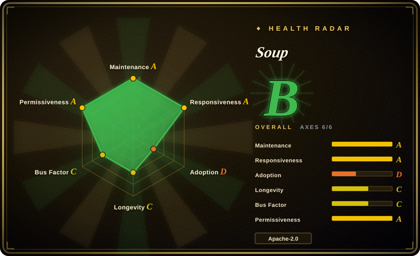
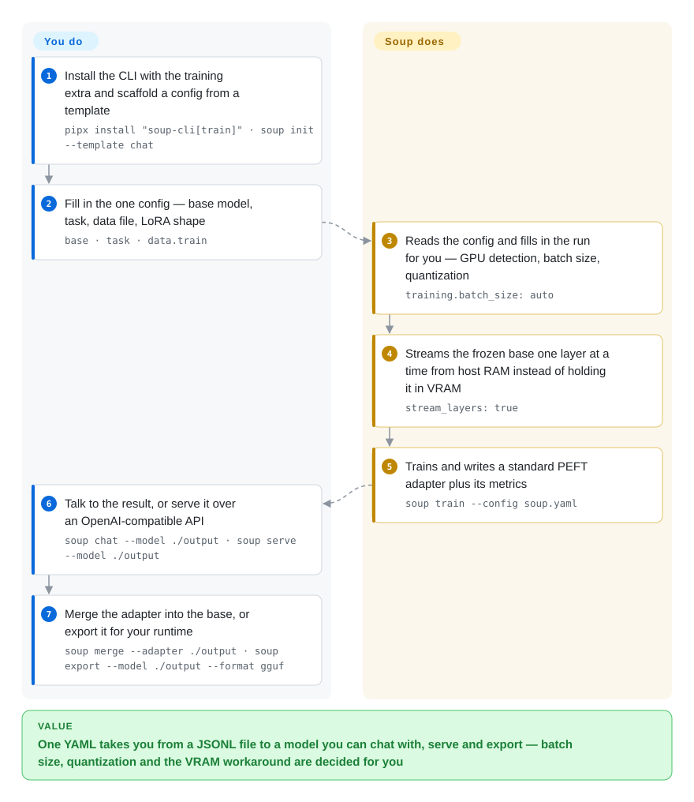

# Soup

One YAML and one command turn a JSONL file into a fine-tuned model: Soup wires the Hugging Face training stack together, and with layer streaming keeps the frozen base in host RAM so an 8B model can train on a 4 GB GPU.

## When to use

You have one small GPU — a 4–8 GB laptop card, an aging workstation card, or a free Colab T4 — and you want to fine-tune a model that does not fit on it. With stock `transformers` + PEFT the base weights alone fill your VRAM before training starts, and the accelerator libraries hit the same wall because they keep the base resident: [Unsloth](unsloth.md) offsets it with Triton kernels and dynamic 4-bit, [LlamaFactory](llamafactory.md) with QLoRA plus sharding, but neither changes the fact that the whole checkpoint has to be reachable by the GPU. Soup's layer streaming keeps the frozen base in CPU RAM and copies one decoder layer at a time into a small VRAM buffer, so peak VRAM tracks a single layer instead of the whole model.

Reach for Soup when the binding constraint is *wiring* rather than throughput. You have a dataset in a standard format and you want one config file to carry you through the whole path — quantization, batch-size selection, training, adapter merge, GGUF export, an OpenAI-compatible server — instead of keeping a bespoke script plus four library versions in sync per experiment. It spans SFT and the preference/RL family (DPO, GRPO, PPO, KTO, ORPO, SimPO, IPO, BCO) plus reward modelling, distillation, unlearning, MoE router tuning and vision/audio fine-tuning, all behind the same `soup.yaml`. What decides it against [Unsloth](unsloth.md) is the VRAM floor; against [LlamaFactory](llamafactory.md) it is the longer tail (export, serving, governance CLI) living in the same tool; against [Axolotl](axolotl.md) it is the single-small-GPU assumption Axolotl does not make.

## How it works

Soup does not implement its own trainer — it is a CLI orchestration layer over `transformers`, `peft`, `trl`, `datasets` and `bitsandbytes`, and `config/schema.py` is the single source of truth for every field you may set. You write one `soup.yaml` (base model, task, data file, LoRA shape) and it reads that config to pick the batch size, the quantization and the trainer, then runs the job. What comes back is a normal PEFT adapter, so merging it, converting it to GGUF, or unloading it with `transformers` directly all remain open to you — the lock-in sits on the config surface, not on the artifact. The one piece that is not a wrapper is layer streaming: with `stream_layers: true` the frozen base stays in host RAM, page-locked when the machine allows, and each decoder layer is copied into one of two pre-allocated VRAM buffers while the previous layer is still computing. That is what turns "this model does not fit" into "this model trains", and the price is time — every layer is read twice per step, once forward and once when the backward pass recomputes it.

<!-- flow-steps:begin (generated from flows/soup.json by tools/flow_card.py — do not edit) -->

Text version of the flow

1. **You**: Install the CLI with the training extra and scaffold a config from a template — `pipx install "soup-cli[train]" · soup init --template chat`
2. **You**: Fill in the one config — base model, task, data file, LoRA shape — `base · task · data.train`
3. **Soup**: Reads the config and fills in the run for you — GPU detection, batch size, quantization — `training.batch_size: auto`
4. **Soup**: Streams the frozen base one layer at a time from host RAM instead of holding it in VRAM — `stream_layers: true`
5. **Soup**: Trains and writes a standard PEFT adapter plus its metrics — `soup train --config soup.yaml`
6. **You**: Talk to the result, or serve it over an OpenAI-compatible API — `soup chat --model ./output · soup serve --model ./output`
7. **You**: Merge the adapter into the base, or export it for your runtime — `soup merge --adapter ./output · soup export --model ./output --format gguf`

**Value**: One YAML takes you from a JSONL file to a model you can chat with, serve and export — batch size, quantization and the VRAM workaround are decided for you

<!-- flow-steps:end -->

## When NOT to use

- **You need a stable config and version contract for a long-lived training pipeline.** 177 releases landed between 2026-03-03 and 2026-09-12, roughly one a day, and the contract has moved under existing users: v0.75 turned an unknown config key from a warning into a hard load failure, and replaced the `gspo` objective with a sequence-level one that will not reproduce runs made before it. Pin the version and read the release notes before upgrading, or choose [Axolotl](axolotl.md) for a slower-moving YAML workflow, or [TRL](trl.md) plus your own glue if you want no wrapper at all.
- **You are building a capacity plan on the "8B on 4 GB" headline.** That row (119.6 tok/s, 3.32 GB peak) was measured before the #331 wrong-gradient repair and has not been re-run on a 4 GB card; the re-measurement has been open since 2026-08-09 (issue #361), and the repair itself cost −4.8% throughput at 32B. Layer streaming is opt-in, still marked BETA, and covers `sft`/`dpo`/`orpo`/`simpo`/`kto` only. If you need a number you can put in a plan, wait for the re-run or use [Unsloth](unsloth.md), whose multipliers are vendor-reported too but whose single-GPU fast path is the product rather than a feature.
- **You are hoping to train without a GPU.** Soup lowers the VRAM floor; it does not remove the accelerator. Layer streaming needs a CUDA card whose free VRAM holds one layer plus the resident LoRA adapters, optimizer state, activations and CUDA context — the documented runs are a 4 GB RTX 3050 and a free-tier T4 capped to 4.00 GB. CPU is a CI path, not a training path: quantization is auto-disabled there, which removes precisely the thing that makes an 8B base small enough to stream, and `stream_layers` is rejected outright on the MLX backend. If you have no usable GPU, rent one and use [LlamaFactory](llamafactory.md) or [Axolotl](axolotl.md) on it.
- **You are pinned to Python 3.13 or newer.** The bound is hard (`>=3.10,<3.13`) because the failure happens inside the PyTorch native extension before any Soup code runs, leaving nothing actionable. [TRL](trl.md) and [torchtune](torchtune.md) track newer Pythons sooner.
- **You need security fixes backported to an older release.** `SECURITY.md` supports the latest release only and marks every earlier line unsupported, so a frozen deployment stops receiving fixes the moment a new minor ships.
- **You want to own the training loop.** Soup is an orchestration layer over upstream trainers; once your need falls outside the call surface of its 91 command modules and 36 trainer modules, you maintain both Soup and the library underneath it. Use [TRL](trl.md) or [torchtune](torchtune.md) directly in that case.
- **You need governance or procurement assurance.** `CODEOWNERS` hands every path to one individual, there is no foundation behind the project, and the compliance workflow is `init` templates plus CLI commands rather than a certification. For organizational continuity prefer [TRL](trl.md)'s foundation-adjacent backing, or accept [Unsloth](unsloth.md)'s vendor roadmap and its paid tier for the capabilities the OSS core does not cover.

## Comparison

| Alternative | In index | Our verdict | Tradeoff |
|---|---|---|---|
| [Unsloth](unsloth.md) | ✅ | Choose Unsloth when the model already fits your GPU and you want the fastest single-GPU LoRA/QLoRA path; choose Soup when the model does not fit and the VRAM floor is the actual blocker. | Unsloth spends its effort on kernel throughput inside VRAM; Soup trades throughput away for a lower floor, and can even call Unsloth as its backend via `backend: unsloth`. |
| [LlamaFactory](llamafactory.md) | ✅ | Choose LlamaFactory when breadth of supported models and a browser UI matter most; choose Soup when you want the stages after training — export, serving, provenance, compliance CLI — to live in the same tool as the trainer. | LlamaFactory is the more mature and more UI-first framework; Soup is newer with a longer tail, but its config contract moves far faster. |
| [Axolotl](axolotl.md) | ✅ | Choose Axolotl for a YAML-driven, multi-GPU-first run where a reproducible config contract is the priority; choose Soup for a single small GPU plus the export and serving tail. | Axolotl gives up the downstream stages and the low-VRAM trick in exchange for a slower-moving, more predictable configuration surface. |
| [torchtune](torchtune.md) | ✅ | Choose torchtune when you want native PyTorch recipes you can read end to end and own; choose Soup when you would rather not own the loop at all. | torchtune is lower-level and easier to audit; Soup automates more while adding a substantially larger surface that you do not control. |
| [HF TRL](trl.md) | ✅ | Choose TRL when you want the reference SFT/DPO/GRPO trainers and will write the wiring and pin the versions yourself; choose Soup when you want the wiring already done and can accept a wrapper that changes quickly. | TRL is the layer Soup calls: going direct buys control and fewer moving parts, and costs you the glue Soup ships — including the data pipeline and the export path. |

## Tech stack

- **Language:** Python only (520 modules under `src/soup_cli/`, plus 580 test modules). CLI built on Typer + Rich; config on Pydantic + PyYAML; terminal plots via Plotext; an optional `textual` TUI.
- **Training layer:** `transformers`, `peft`, `trl`, `datasets`, `accelerate`, `bitsandbytes` — the `[train]` extra, with `torch>=2.6.0` and `transformers>=5.16.1,<6`. The core install is deliberately torch-free (CLI, config and data tools only).
- **Backends:** `transformers` by default; `unsloth` via the `[fast]` extra (advertised 2–5x faster); `mlx` for Apple Silicon, which is a separate model-loading path and incompatible with layer streaming. Multi-GPU is driven by `--deepspeed zero2/zero3/zero++` and `--fsdp full_shard/shard_grad/full_offload`.
- **Quantization and export:** bitsandbytes NF4/FP8/NVFP4, QAT via `torchao`, GPTQ/AWQ, GGUF (llama.cpp/Ollama), ONNX, TensorRT-LLM, BitNet.
- **Surfaces:** a CLI of 91 command modules; a local web UI served by FastAPI + uvicorn on `127.0.0.1:7860` (read endpoints require auth); OpenAI-compatible and Anthropic Messages HTTP servers; an MCP server; `config/schema.py` as the single config contract.
- **Repo shape:** 12 guide documents under `docs/`, 8 example configs under `examples/configs/`, a Colab notebook that reproduces the 4 GB claim, and 19 numbered gate/probe/run measurement records under `benchmarks/`.

## Dependencies

- **Runtime:** Python 3.10–3.12 (hard ceiling). The `[train]` extra installs PyTorch plus the Hugging Face training stack; the bare `soup-cli` install has no torch and can only run config, data and inspection commands. `pipx`/`uv tool` or a venv is recommended because PEP 668 blocks system-Python installs on recent Debian/Ubuntu.
- **Hardware:** a CUDA GPU for any practical training (Apple MPS is supported but experimental; CPU is a test path with quantization disabled). The measured layer-streaming floor is a 4 GB-class CUDA card; Turing (sm_75) works, with an fp16-specific dtype fix in the tree. Host RAM must hold the streamed store — roughly 3.6 GB for an 8B NF4 base, and the 14B NF4 store page-locks as 10 GiB. A page-locked store needs the machine's pinned-memory headroom; when it does not fit, the store falls back to a slower pageable or NVMe-disk tier.
- **Infrastructure:** none. No database, queue or hosted control plane; the CLI runs locally and the server binds loopback by default. Docker images are published to GHCR on every release.
- **External touchpoints (optional):** the Hugging Face Hub for model/dataset download and `soup push`; cloud runners (Lambda Labs, Modal) only if you use the deploy autopilot.
- **Telemetry:** opt-in and hardware-only. `SOUP_TELEMETRY=1` is off by default; the documented field list is version, top-level command, Python/OS/arch, duration and a locally generated anonymous UUID, with dataset contents, model names, config values, paths and IPs explicitly excluded.

## Ops difficulty

**Low to medium.** The install is one line (`pipx install "soup-cli[train]"`), there is no service to stand up, `soup doctor` reports GPU, dependency and version state in one place, and a Docker image exists. Difficulty comes from four places rather than from deployment: the usual CUDA/PyTorch/bitsandbytes version matrix; a release cadence that makes version pinning mandatory rather than optional; layer streaming's pre-flight checks, which refuse a run when the pinned host store will not fit RAM headroom and make you tune `stream_read_ahead` / `stream_buffers` / `stream_vram_override` instead of silently swapping; and platform edges — Windows hit a sharder mapping limit past ~100 GB of live safetensors (fixed 2026-09-14), and an `soup infer` path bug on Windows was still open at verification time. Multi-GPU via DeepSpeed or FSDP2 is documented with measured numbers, but it is a third-party dependency surface (DeepSpeed JIT builds, `nvcc` requirements) rather than something Soup owns.

## Health & viability

- **Maintenance — very active (as of 2026-09-20).** 177 releases between 2026-03-03 and 2026-09-12; 100 commits in the last five days at the time of checking; 14 CI jobs green across 3 operating systems × 3 Python versions plus MLX and PyTorch smoke jobs. `benchmarks/` holds 19 numbered gate/probe/run records, and the CI configuration itself is annotated with the measured durations that justify each timeout.
- **Responsiveness — strong.** 81 open versus 559 closed issues and 420 closed pull requests; sampled issues were answered the same or next day. The project also publishes the failures: a silent wrong-gradient defect (#331) was found, reported upstream, repaired, and re-gated at 32B and 72B.
- **Governance — the weakest signal, and the radar agrees (C).** Owner is a User account, not an organization; `CODEOWNERS` assigns every path to one person; lifetime contributions are 1,026 for the maintainer against 54 for the next contributor, and the radar measures that concentration over the last 12 months as top-1 0.744 and top-3 0.816. The mitigating reading is recency: of the last 100 commits only 36 came from the maintainer, with 24 other authors in that window, and the v0.75 release notes state that all 60 of its pull requests came from outside the maintainer. [推断] bus factor has improved in practice while ownership has not changed.
- **Backing and funding — thin.** No foundation or vendor; `NOTICE` credits one individual; donations route through Stripe to a named private company whose relationship to the project is not documented in the repo. The layer-streaming preprint is self-archived on Zenodo. [未验证] no third-party replication of the headline throughput numbers was found — the "reproduced independently on an H100" figure in the README is the same author on different hardware.
- **Age / Lindy — do not lean on it (C).** Created 2026-02-20, so 212 days old at verification, with the last commit 1 day old. The age prior cannot help here; the case for the project rests entirely on the "still active" half of age × still-active, which is currently strong.
- **Adoption — loud, but the measurable registry signals are small (D).** ~6.9k stars and ~1.08k forks in seven months, plus a Product Hunt launch and a Trendshift badge. Against that, the radar reads 7,104 PyPI downloads in the last month and 0 downstream projects in the package graph; the catalog of ~160 recipes is defined in a Python file rather than shipped as plugin packages, so there is no third-party integration ecosystem to count as an independent signal. The D grades registry reach, not whether people use it, and it is the honest counterweight to the star count.
- **Risk flags.** `Development Status :: 3 - Alpha` in `pyproject.toml`; many BETA-marked feature areas (layer streaming, curriculum training, TTS, classifier training, distillation); roughly daily releases with breaking config and semantics changes; single-owner governance; and a self-published preprint standing in for independent validation.
- **Verdict.** Viable now for short-cycle experimentation, including the low-VRAM case that nothing else in this category covers. The two things a reader should weigh hardest are the moving config contract and the pending re-measurement of the headline number, not the star count.

## Caveats (unverified)

- [未验证] The PyPI monthly download figure (7,104) and the 0-downstream-projects reading come from a single registry snapshot taken by the radar tool at verification time; neither was cross-checked against a second source, and a single month is a noisy adoption signal.
- [未验证] The three headline throughput/VRAM figures (119.6 tok/s, 3.32 GB peak at 8B NF4; 113.00 tok/s on H100; 3.32 GB unchanged) are author-measured and, for the 4 GB card, pre-repair. No independent re-measurement was found, and the tracked re-run is still open.
- [未验证] The Zenodo preprint's peer-review status. No venue or review process is stated on the archive record checked.
- [未验证] The recipe catalogue count. The changelog states 164; counting distinct Hugging Face model ids in `recipes/catalog.py` yields 118. The two numbers may use different units; not reconciled.
- [未验证] No install, training run or export was executed during verification, so every runtime claim — throughput, VRAM peaks, export targets, server behaviour — is repo-documented rather than reproduced here.
- [未验证] The private company named as the donation recipient, and its relationship to the maintainer's project, were not verified against any registry.
- [未验证] The claim that the Multi-GPU/DeepSpeed numbers generalize: the published measurement is a single H100 with Llama-3.1-8B bf16 LoRA r=8, and the project's own paper reports the anti-result that eight ZeRO-3 cards were slower than one card training resident.
- [推断] Star growth attribution: a Product Hunt launch, a Trendshift badge, a Discord/Telegram community and the "8B on a 4 GB laptop GPU" hook all coexist, so the share of adoption that reflects production use rather than the announcement cycle is unknown.
- [推断] "Independent reproduction" in the README means a different machine by the same author; the phrasing does not establish third-party validation.
- [推断] The compliance templates are described as "a normal training config plus header comments", so they provide a workflow scaffold. Whether any specific HIPAA/SOC 2/EU AI Act/SR 11-7 obligation is satisfied by running them is a legal and organizational question this page does not answer.
