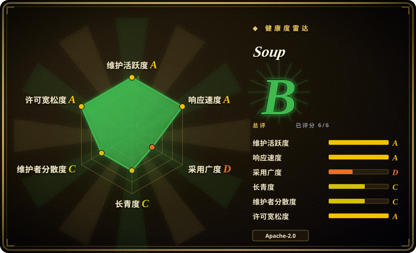
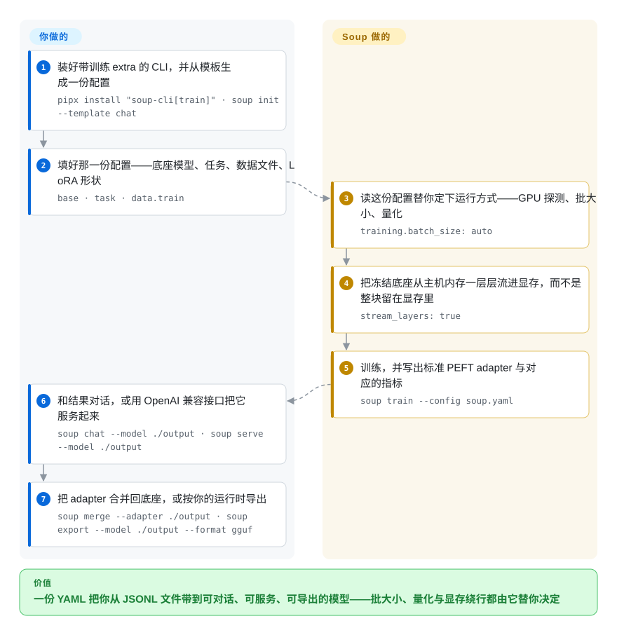

# Soup

一个 YAML 加一条命令，把 JSONL 数据集变成微调好的模型：Soup 把 Hugging Face 训练栈串起来，并用层流（layer streaming）把冻结底座留在主机内存里，让 8B 模型能在 4 GB 显卡上训练。

## 何时使用

你只有一块小显卡——4 至 8 GB 的笔记本显卡、一块旧的工作站卡，或者免费的 Colab T4——却想微调一个装不下的模型。用原生的 `transformers` + PEFT，模型权重本身在训练开始前就占满显存；而加速类库会撞上同一堵墙，因为它们都把底座留在显存里：[Unsloth](unsloth.zh.md) 靠 Triton 内核加动态 4bit 缓解，[LlamaFactory](llamafactory.zh.md) 靠 QLoRA 加分片缓解，但两者都没有改变“整个检查点必须能被 GPU 触达”这件事。Soup 的层流把冻结底座放进 CPU 内存，每次只把一层 decoder 拷进小块显存缓冲区，于是显存峰值跟着单层走，而不是跟着整个模型走。

当你的瓶颈是**接线**而不是吞吐时，该考虑 Soup。你手上有标准格式的数据集，希望一个配置文件从头带你走完：量化、批大小选择、训练、合并 adapter、导出 GGUF、起一个 OpenAI 兼容服务，而不是每做一次实验就维护一份自写脚本加四个库的版本同步。它覆盖 SFT 与偏好/强化学习家族（DPO、GRPO、PPO、KTO、ORPO、SimPO、IPO、BCO），外加奖励建模、蒸馏、遗忘学习、MoE 路由微调以及视觉/音频微调，全部共用同一份 `soup.yaml`。与 [Unsloth](unsloth.zh.md) 之间起决定作用的是显存下限；与 [LlamaFactory](llamafactory.zh.md) 之间是训练之后那一长段（导出、服务、合规 CLI）是否留在同一个工具里；与 [Axolotl](axolotl.zh.md) 之间则是 Axolotl 并不假设你只有一块小显卡。

## 怎么用起来

Soup 不自研 trainer，它是 `transformers`、`peft`、`trl`、`datasets`、`bitsandbytes` 之上的 CLI 编排层，而 `config/schema.py` 是全部可配置字段的唯一来源。你写一份 `soup.yaml`（底座模型、任务、数据文件、LoRA 形状），它读这份配置替你决定批大小、量化方式和 trainer，然后跑起来。产出是标准的 PEFT adapter，所以合并它、转成 GGUF、或者干脆脱离 Soup 用 `transformers` 直接加载，这些路都留着——锁定发生在配置面，不在产物面。唯一不是包装的一环是层流：`stream_layers: true` 时冻结底座常驻主机内存（机器允许时做 page-lock），每一层 decoder 会被拷进两个预分配显存缓冲区之一，同时上一层还在计算。这才把“这个模型装不下”变成了“这个模型能训”，代价是时间——每层每个 step 要读两遍，前向一遍，反向重算时再一遍。

<!-- flow-steps:begin (generated from flows/soup.json by tools/flow_card.py — do not edit) -->

流程文字版

1. **你**：装好带训练 extra 的 CLI，并从模板生成一份配置 — `pipx install "soup-cli[train]" · soup init --template chat`
2. **你**：填好那一份配置——底座模型、任务、数据文件、LoRA 形状 — `base · task · data.train`
3. **Soup**：读这份配置替你定下运行方式——GPU 探测、批大小、量化 — `training.batch_size: auto`
4. **Soup**：把冻结底座从主机内存一层层流进显存，而不是整块留在显存里 — `stream_layers: true`
5. **Soup**：训练，并写出标准 PEFT adapter 与对应的指标 — `soup train --config soup.yaml`
6. **你**：和结果对话，或用 OpenAI 兼容接口把它服务起来 — `soup chat --model ./output · soup serve --model ./output`
7. **你**：把 adapter 合并回底座，或按你的运行时导出 — `soup merge --adapter ./output · soup export --model ./output --format gguf`

**价值**：一份 YAML 把你从 JSONL 文件带到可对话、可服务、可导出的模型——批大小、量化与显存绕行都由它替你决定

<!-- flow-steps:end -->

## 何时不用

- **你需要稳定的配置与版本契约来支撑长期训练流水线。** 2026-03-03 到 2026-09-12 之间发了 177 个 release，差不多一天一个，而且契约已经在存量用户脚下变过：v0.75 把未知配置键从警告改成了直接拒绝加载，并把 `gspo` 目标替换成序列级目标，导致此前的运行无法复现。要么钉住版本并在升级前读 release notes，要么选配置演进更慢的 [Axolotl](axolotl.zh.md)，要么用 [TRL](trl.zh.md) 自己写胶水、完全不引入包装层。
- **你在拿“4 GB 跑 8B”这个标题数字做容量规划。** 那行数据（119.6 tok/s、3.32 GB 峰值）测于 #331 梯度错误修复之前，且未在 4 GB 卡上重测；重测自 2026-08-09 起挂在 issue #361，而修复本身在 32B 上花掉 4.8% 吞吐。层流是 opt-in、仍标 BETA，且只覆盖 `sft`/`dpo`/`orpo`/`simpo`/`kto`。若你要一个能写进方案的数字，要么等重测，要么用 [Unsloth](unsloth.zh.md)——它的倍率同样是厂商自报，但单卡快速路径本身就是它的产品，而不是一个特性。
- **你指望不用显卡也能训。** Soup 降低的是显存下限，不是去掉加速器。层流需要一块 CUDA 卡，其可用显存要装得下一层权重，外加驻留的 LoRA adapter、优化器状态、激活值和 CUDA context——已记录的运行是 4 GB 的 RTX 3050 和限制到 4.00 GB 的免费档 T4。CPU 是 CI 通道而非训练通道：那里量化会被自动关闭，恰恰拿掉了让 8B 底座小到足以流式传输的那个前提；而在 MLX 后端上 `stream_layers` 会被直接拒绝。没有可用 GPU 就租一张，并在上面用 [LlamaFactory](llamafactory.zh.md) 或 [Axolotl](axolotl.zh.md)。
- **你被钉在 Python 3.13 或更新版本上。** 上界是硬的（`>=3.10,<3.13`），因为崩溃发生在 PyTorch 原生扩展里、任何 Soup 代码执行之前，用户拿不到任何可操作的报错。[TRL](trl.zh.md) 与 [torchtune](torchtune.zh.md) 跟进新 Python 更快。
- **你需要把安全补丁回溯到旧版本。** `SECURITY.md` 只支持最新版，并把更早的版本线全部标为不支持；一旦新的小版本发布，被冻结的部署就停止收到修复。
- **你想自己掌控训练循环。** Soup 是上游 trainer 之上的编排层；当需求超出它 91 个命令模块、36 个 trainer 模块的调用面之后，你要同时维护 Soup 和底下的库。那种情况直接用 [TRL](trl.zh.md) 或 [torchtune](torchtune.zh.md)。
- **你需要治理与采购层面的保障。** `CODEOWNERS` 把所有路径交给一个人，项目背后没有基金会，合规流程是 `init` 模板加 CLI 命令而不是认证。要组织级的延续性，优先看有基金会背景的 [TRL](trl.zh.md)；或者接受 [Unsloth](unsloth.zh.md) 的厂商路线图，以及它为开源核心未覆盖能力准备的付费档。

## 横向对比

| 替代品 | 是否收录 | 我们的评价 | 取舍 |
|---|---|---|---|
| [Unsloth](unsloth.zh.md) | ✅ | 模型本来就装得下、你要最快单卡 LoRA/QLoRA 路径时选 Unsloth；模型装不下、显存下限才是真障碍时选 Soup。 | Unsloth 把力气花在显存内的内核吞吐上；Soup 用吞吐换更低的下限，甚至可以通过 `backend: unsloth` 反过来把 Unsloth 当后端调用。 |
| [LlamaFactory](llamafactory.zh.md) | ✅ | 最看重支持模型广度与浏览器界面时选 LlamaFactory；想让训练之后的环节（导出、服务、溯源、合规 CLI）与 trainer 同处一个工具时选 Soup。 | LlamaFactory 更成熟、更以 UI 为先；Soup 更新、链路更长，但配置契约的演进快得多。 |
| [Axolotl](axolotl.zh.md) | ✅ | 要做 YAML 驱动、多卡优先且配置契约可复现的运行，选 Axolotl；只有一块小显卡并且要训练之后的导出与服务链路，选 Soup。 | Axolotl 放弃下游环节与低显存技巧，换来的是一套演进更慢、更可预期的配置面。 |
| [torchtune](torchtune.zh.md) | ✅ | 想要能从头读到尾、完全自己掌控的原生 PyTorch recipe，选 torchtune；根本不想自己掌循环，选 Soup。 | torchtune 层次更低、更容易审计；Soup 自动化更多，同时引入一大块你控制不了的表面积。 |
| [HF TRL](trl.zh.md) | ✅ | 想要参考实现的 SFT/DPO/GRPO trainer、并且愿意自己接线和钉版本，选 TRL；想让接线已经做好、并能接受一个变化很快的包装层，选 Soup。 | TRL 正是 Soup 调用的那一层：直接用换来控制力和更少活动部件，代价是丢掉 Soup 提供的那部分胶水，包括数据流水线与导出路径。 |

## 技术栈

- **语言：** 只有 Python（`src/soup_cli/` 下 520 个模块，另有 580 个测试模块）。CLI 基于 Typer + Rich；配置基于 Pydantic + PyYAML；终端图表用 Plotext；另有一个基于 `textual` 的可选 TUI。
- **训练层：** `transformers`、`peft`、`trl`、`datasets`、`accelerate`、`bitsandbytes`，由 `[train]` extra 安装，要求 `torch>=2.6.0`、`transformers>=5.16.1,<6`。核心安装刻意不带 torch，只有 CLI、配置与数据工具。
- **后端：** 默认 `transformers`；`[fast]` extra 提供 `unsloth`（官方称快 2 至 5 倍）；Apple Silicon 走 `mlx`，那是一条独立的模型加载路径，与层流不兼容。多卡由 `--deepspeed zero2/zero3/zero++` 与 `--fsdp full_shard/shard_grad/full_offload` 驱动。
- **量化与导出：** bitsandbytes 的 NF4/FP8/NVFP4，经 `torchao` 的 QAT，GPTQ/AWQ，GGUF（llama.cpp/Ollama），ONNX，TensorRT-LLM，BitNet。
- **使用面：** 91 个命令模块的 CLI；FastAPI + uvicorn 提供的本地 Web UI（`127.0.0.1:7860`，读取类接口需要鉴权）；OpenAI 兼容与 Anthropic Messages 两种 HTTP 服务；一个 MCP server；`config/schema.py` 是唯一配置契约。
- **仓库形态：** `docs/` 下 12 篇指南，`examples/configs/` 下 8 份示例配置，一个复现 4 GB 结论的 Colab notebook，`benchmarks/` 下 19 份编号的 gate/probe/run 实测记录。

## 依赖

- **运行时：** Python 3.10 至 3.12（硬上界）。`[train]` extra 会装 PyTorch 与 Hugging Face 训练栈；裸装 `soup-cli` 不含 torch，只能跑配置、数据与检查类命令。建议用 `pipx`/`uv tool` 或虚拟环境，因为在较新的 Debian/Ubuntu 上 PEP 668 会阻止写入系统 Python。
- **硬件：** 任何实际训练都需要 CUDA 显卡（Apple MPS 可用但属实验性；CPU 是关闭量化后的测试通道）。层流的实测下限是 4 GB 级别的 CUDA 卡，Turing（sm_75）可用，仓库里带着针对 fp16 的 dtype 修复。主机内存要装得下流式 store——8B NF4 底座约 3.6 GB，14B NF4 的 store 会按 10 GiB 做 page-lock。page-locked store 需要机器有足够的不可换出内存余量；装不下时会退回更慢的 pageable 或 NVMe 盘上 tier。
- **基础设施：** 无。不需要数据库、队列或托管控制面；CLI 本地运行，服务默认只绑本机回环。每个 release 都会发布 GHCR 上的 Docker 镜像。
- **外部触点（可选）：** Hugging Face Hub 用于下载模型/数据集和 `soup push`；云上运行器（Lambda Labs、Modal）只在用部署 autopilot 时涉及。
- **遥测：** opt-in 且只报硬件信息。`SOUP_TELEMETRY=1` 默认关闭；文档列出的字段是版本、顶层命令、Python/OS/架构、耗时和一个本地生成的匿名 UUID，并明确排除数据集内容、模型名、配置值、路径与 IP。

## 运维难度

**低至中。** 安装是一行（`pipx install "soup-cli[train]"`），没有需要常驻的服务，`soup doctor` 一次报出 GPU、依赖与版本状态，也有 Docker 镜像。难度来自四处而非部署本身：常见的那套 CUDA/PyTorch/bitsandbytes 版本矩阵；快到让钉版本从可选变成必选的发布节奏；层流的 pre-flight 检查——当 pinned host store 装不下内存余量时它会拒绝启动，让你去调 `stream_read_ahead` / `stream_buffers` / `stream_vram_override`，而不是偷偷用交换；以及平台边角——Windows 上曾在活跃 safetensors 映射超过约 100 GB 时崩掉 sharder（2026-09-14 修复），验证时 `soup infer` 在 Windows 上仍有一个未修路径 bug。多卡走 DeepSpeed 或 FSDP2 有带实测数字的文档，但那是第三方依赖面（DeepSpeed 的 JIT 构建、对 `nvcc` 的要求），不是 Soup 自己能掌控的东西。

## 健康度与可持续性

- **维护——非常活跃（截至 2026-09-20）。** 2026-03-03 到 2026-09-12 之间共 177 个 release；核查时最近五天有 100 次提交；14 个 CI job 在 3 个操作系统 × 3 个 Python 版本外加 MLX 与 PyTorch smoke 上全绿。`benchmarks/` 下有 19 份编号的 gate/probe/run 实测记录，连 CI 配置里都写着实测耗时来论证每个 timeout 的取值。
- **响应性——强。** 81 个 open 对 559 个 closed issue，420 个已关闭 PR；抽样看到 issue 当天或次日有人回应。项目也公开自己的失败：一个静默梯度错误（#331）被发现、上报上游、修复，并在 32B 与 72B 上重新过门。
- **治理——最弱的一项，雷达也给出 C。** Owner 是 User 账号而非组织；`CODEOWNERS` 把所有路径指给一个人；历史累计贡献是维护者 1,026 对第二名 54，雷达把最近 12 个月的这种集中度量化为第一贡献者占比 0.744、前三占比 0.816。缓解性的读数是近期分布：最近 100 次提交里维护者只占 36 次，同一窗口另有 24 位作者，且 v0.75 的 release notes 称该版本全部 60 个 PR 都来自维护者之外。[推断] 实践中 bus factor 已改善，但所有权结构没变。
- **背书与资金——薄。** 没有基金会或厂商；`NOTICE` 只署名一个人；捐赠经 Stripe 流向一家具名私营公司，该公司与项目的关系在仓库里没有记录。层流论文自行存档在 Zenodo 上。[未验证] 未找到对标题吞吐数字的第三方复现——README 里那句“在 H100 上独立复现”是同一作者换了硬件。
- **年龄 / Lindy——别指望它（C）。** 创建于 2026-02-20，截至核查 212 天，最后提交距今 1 天。年龄先验在这里帮不上忙；支持这个项目的论据完全落在 age × still-active 里“仍活跃”那一半，而那一半目前很强。
- **采用——声量大，但可测的注册表信号很小（D）。** 七个月内约 6.9k star 与约 1.08k fork，另有 Product Hunt 发布与 Trendshift 徽章。与此相对，雷达读出最近一个月 PyPI 下载量 7,104、包依赖图上 0 个下游项目；约 160 份 recipe 的目录定义在一个 Python 文件里、并不以插件包形式分发，所以没有第三方集成生态可以当作独立信号来数。这个 D 量的是注册表触达，不是“有没有人用”，它是 star 数诚实的对照面。
- **风险标记。** `pyproject.toml` 里写着 `Development Status :: 3 - Alpha`；大量功能标注 BETA（层流、课程式训练、TTS、分类器训练、蒸馏）；约一天一发的 release 带着配置与语义层面的破坏性变更；单人所有权治理；以及用自行存档的论文代替独立验证。
- **结论。** 现在可用于短周期实验，也覆盖了这个分类里其他项目都不覆盖的低显存场景。读者最该权衡的是会漂移的配置契约与待重测的标题数字，而不是 star 数。

## 存疑（未验证）

- [未验证] PyPI 月下载量 7,104 与“0 个下游项目”这两个读数来自雷达工具在核查时取的单次注册表快照，均未对照第二个来源核实，而且单月下载量本身就是噪声很大的采用信号。
- [未验证] 三组标题性能数字（8B NF4 下 119.6 tok/s、3.32 GB 峰值；H100 上 113.00 tok/s；3.32 GB 不变）均为作者自测，且 4 GB 卡那组测于修复之前。未找到独立重测，跟踪中的重跑仍未关闭。
- [未验证] 那篇 Zenodo 论文的同行评审状态：所查档案记录里没有写明会议或评审流程。
- [未验证] recipe 目录数量：changelog 说 164，我在 `recipes/catalog.py` 里数到 118 个不同 Hugging Face model id。两个数字可能口径不同，未做核对。
- [未验证] 核查期间未执行任何安装、训练或导出，因此所有运行时主张——吞吐、显存峰值、导出目标、服务行为——都是仓库文档所述，而非在此复现。
- [未验证] 被指为捐赠接收方的私营公司，及其与维护者项目的关系，未对照任何注册信息核实。
- [未验证] 多卡/DeepSpeed 数字的可推广性：公开测量只有一次 H100 上的 Llama-3.1-8B bf16 LoRA r=8，而项目自己的论文报告了一个反向结果——八张卡的 ZeRO-3 比单卡驻留训练更慢。
- [推断] star 增长的归因：Product Hunt 发布、Trendshift 徽章、Discord/Telegram 社区与“4 GB 笔记本跑 8B”这个钩子同时存在，因此其中反映生产使用的比例未知。
- [推断] README 里的“independent reproduction”指同一作者换机器，这个措辞不构成第三方验证。
- [推断] 合规模板被描述为“一份普通训练配置加头部注释”，即它提供的是一套工作流脚手架。运行它是否满足某条具体的 HIPAA/SOC 2/EU AI Act/SR 11-7 义务属于法律与组织问题，本页不作回答。
