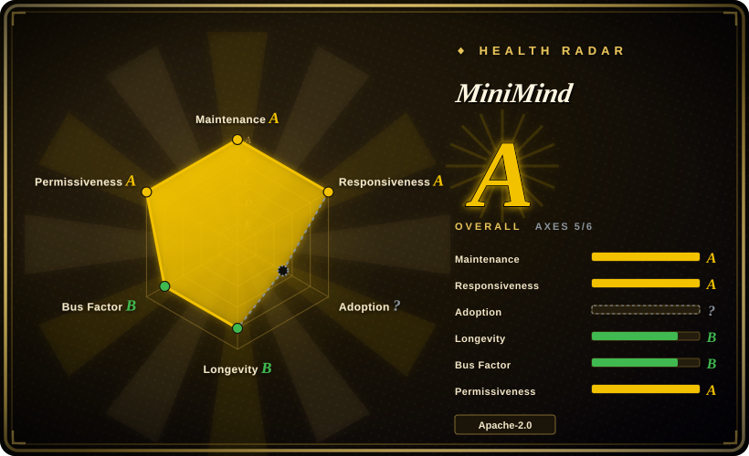

# MiniMind

A from-scratch Chinese-first LLM training course in ~3.2k lines of hand-written PyTorch (`trainer/` + `model/`): a 64M Dense model (`minimind-3`, Qwen3-aligned) plus a 198M-A64M MoE variant, with the whole chain hand-written — BPE tokenizer, pretrain, SFT, LoRA, DPO, PPO/GRPO/CISPO, tool-call SFT, agentic RL and distillation — reported to reach a chattable "Zero" model in ~2.3h / ~¥3 on one rented RTX 3090.

## When to use

You're an engineer who ships LLM-backed features and has fine-tuned a checkpoint or two, but "pretrain → SFT → RLHF" is still a diagram you've never actually executed. You want to run every stage yourself, on hardware you can rent for the price of a coffee, and read every line that does it — not call `trainer.train()` and trust a library. Reading `transformers`/`trl` sources is hopeless for this: they are built for real models, so the core loop is buried under parallelism shims, config plumbing and backwards compatibility. You rent one 24GB GPU, download the two 1.2GB/1.6GB "mini" datasets, and run `train_pretrain.py` → `train_full_sft.py` → the RL scripts, watching loss curves you can attribute to a line of code you actually read.

The deciding tradeoff against its closest substitutes: nanoGPT demonstrates the pretraining half — and now declares itself deprecated — but it stops at GPT-2 pretraining plus domain fine-tuning, on an English/GPT-2 lineage, with no MoE, no RL and no tool calling; torchtune is a maintained PyTorch-native post-training library, but you *use* it rather than rebuild it, and its recipes target real models (Llama/Qwen/DeepSeek families) rather than one artifact you can exhaustively re-derive. MiniMind is the one that keeps the *entire* chain — tokenizer training included — hand-written and small enough that each stage finishes in about an hour, on Chinese-first data, with the MoE, tool-call and agentic-RL stages the other teaching repos do not cover at all.

## When NOT to use

- **You actually need to fine-tune a real model.** A 64M toy teaches mechanism, not a usable artifact. Use [Unsloth](../unsloth.md) for single-GPU LoRA/QLoRA speed on a real checkpoint, or [LlamaFactory](../llamafactory.md) when you want the SFT→DPO chain config-driven and zero-code, because MiniMind's value is its readable code, not the weights it produces.
- **You need the trained model to be factually reliable.** By the project's own samples and its own comparison write-up, 64M loses badly on knowledge accuracy and its English degrades into gibberish; its self-ranked position is mid-pack among small Chinese models [未验证]. Use a hosted model API or a ≥7B open checkpoint, because no amount of training-loop reading fixes a 64M parameter budget.
- **You want MoE throughput, not MoE code.** This repository deliberately stays on vanilla PyTorch, so its MoE has no fused kernels and the README states the 4-expert configuration runs roughly 50% slower than the equally sized Dense model. Use [Colossal-AI](../colossalai.md) or DeepSpeed-MoE/Megatron for real MoE training, and a dedicated serving engine instead of `scripts/serve_openai_api.py` for real MoE inference, because per-expert token bucketing plus kernel launch overhead is exactly what those stacks exist to remove.
- **You are on Apple Silicon or have no CUDA GPU.** The training path is written for CUDA; as of 2026-09 an open issue (filed 2026-09-15) reports that on a Mac, running `trainer/train_pretrain.py` unmodified executes entirely on CPU and never uses the Mac GPU, and the MPS-enabling PRs are still open rather than merged. Use MLX / `mlx-lm` (未收录), which targets Metal directly, or rent a CUDA box, because CPU training collapses the entire time-budget premise.
- **You need pinned versions, a stable API, or something to import.** There are no tagged releases for the model line, and the lineage has broken twice: the 2025-04 rewrite retired the whole `minimind-v1` series (older weights are no longer directly loadable) and the `2 → 3` jump changed tokenizer, chat template, default configs and directory layout again. Pin by commit SHA and vendor the code, or use [torchtune](../torchtune.md) for a versioned, importable library.
- **You will redistribute derived weights commercially.** The repository code is Apache-2.0, but the README describes training data assembled from mixed public corpora (explicitly including a CC-BY-NC source) plus roughly 100k tool-call samples distilled from `qwen3-4b`; it asserts downstream license compatibility, but I could not verify that chain dataset by dataset. Get legal review, or reach for [LlamaFactory](../llamafactory.md) on a corpus whose provenance you control, because the weights inherit MiniMind's unclear data lineage.

## Comparison

| Alternative | In index | Our verdict | Tradeoff |
|---|---|---|---|
| [torchtune](../torchtune.md) | ✅ | When you want to actually post-train a real open checkpoint and need a maintained, importable PyTorch-native library, pick torchtune; pick MiniMind only when the goal is to rebuild each algorithm yourself, because torchtune's recipes hide exactly the pretrain/RL internals MiniMind exposes. | torchtune gives you version-pinned maintenance and real-model support; MiniMind gives you a complete but toy system you can read end to end in an afternoon. |
| [Unsloth](../unsloth.md) | ✅ | When the deliverable is a fine-tuned real model on one GPU, pick Unsloth; pick MiniMind when the deliverable is your own understanding, because Unsloth's Triton kernels optimize a pipeline whose internals you are not meant to touch. | Unsloth trades transparency for ~2x speed on real models; MiniMind trades any usable output for total transparency at 64M scale. |
| [LlamaFactory](../llamafactory.md) | ✅ | When a team needs a config-driven SFT→RLHF pipeline over 100+ models with a web UI, pick LlamaFactory; pick MiniMind when one engineer needs to see what each stage's loss actually consists of, because a zero-code trainer cannot teach the mechanism it abstracts. | LlamaFactory is faster to a working model and broader in model coverage; MiniMind is slower to any output but is the one you can fully re-derive from its own source. |
| [autoresearch](../../ml-research/autoresearch.md) | ✅ | When you want an agent to run autonomous single-GPU training experiments scored by validation bits-per-byte, pick autoresearch; pick MiniMind when you want to *learn* the stages rather than automate the search, because autoresearch assumes you already know what its loop is doing. | autoresearch automates iteration but stays a narrow harness; MiniMind covers the full stage taxonomy (MoE, RL, tool use) but has no experiment automation. |
| [nanoGPT](nanogpt.md) | ✅ | When you want the canonical minimal GPT-2 reference — and you accept that it is now deprecated upstream and stops at pretraining — pick nanoGPT; pick MiniMind when you need the Chinese data path, MoE, tool-call SFT and the RL/RLAIF stages, because all of those live downstream of where nanoGPT ends. | nanoGPT is smaller, cleaner and yields real GPT-2 weights but is frozen and single-maintainer; MiniMind is actively maintained and covers the full stage taxonomy, at the cost of a 64M output unusable for anything else. |

## Tech stack

- Python 3 (author's environment: Python 3.10.16, CUDA 12.2); PyTorch installed separately — `torch` is present but commented out in `requirements.txt`.
- `transformers==4.57.6` for the tokenizer, model base classes and HF interop (`AutoTokenizer`, `AutoModel`, `PreTrainedModel`, `GenerationMixin`); the algorithms themselves are hand-written.
- Verified by reading all 11 files in `trainer/`, both `model/*.py` sources, `scripts/serve_openai_api.py`, `scripts/web_demo.py` and `eval_llm.py`: **no `trl` and no `peft` imports appear on those paths** — `trl==0.13.0` is pinned in `requirements.txt` but unused in the training and model code.
- Custom BPE + ByteLevel tokenizer with a 6400-token vocab (`model/tokenizer.json`, `train_tokenizer.py`), deliberately small so embedding/output layers do not dominate a sub-100M parameter budget; the README advises against retraining it.
- Model code: Decoder-only transformer, Pre-Norm + RMSNorm, SwiGLU, RoPE with YaRN extrapolation (`minimind-3`: 8 layers, d_model 768, 8 q-heads / 4 kv-heads, max_position 32768); the MoE variant adds 4 experts with top-1 routing and no shared expert.
- DDP via `torchrun` (optional DeepSpeed), checkpoint resume, `wandb` / `swanlab` logging, a Streamlit WebUI (`scripts/web_demo.py`) and a Flask OpenAI-compatible server (`scripts/serve_openai_api.py`) with `reasoning_content` / `tool_calls` support; datasets are JSONL.

## Dependencies

- One CUDA GPU as the reference target (24GB RTX 3090 for the mini path; the author used 8×3090); `torch.cuda.is_available()` must be true for the advertised timings.
- Dataset files downloaded separately from ModelScope (primary) or HuggingFace: `pretrain_t2t_mini.jsonl` 1.2GB + `sft_t2t_mini.jsonl` 1.6GB for the fast path; the full mainline set is `pretrain_t2t` 10GB, `sft_t2t` 14GB, `dpo` 53MB, `rlaif` 24MB and two agent-RL files — roughly 24GB.
- A heavy `requirements.txt` (~30 pins) for a project framed as minimal: `transformers`, `trl`, `datasets`, `modelscope`, `numpy==1.26.4`, `streamlit`, `wandb`, `swanlab`, `openai` (for API-based distillation), plus data-cleaning libraries (`jieba`, `nltk`, `simhash`, `datasketch`, `scikit_learn`, `sentencepiece`, `tiktoken`). Several pins are dated; expect to resolve conflicts against a current PyTorch stack.
- No database, no server, no external service in the training path. An OpenAI-compatible API key only if you run the distillation stage.
- Disk: several GB for data plus checkpoints (`./checkpoints/`, `./out/`), before any tokenizer or model-conversion artifacts.

## Ops difficulty

**Low to medium.** Nothing to deploy and no service to keep alive: clone, install, drop the two mini JSONL files into `./dataset/`, run scripts from `trainer/`. The real operational surface is cost and version drift rather than uptime — every run burns GPU-hours, the code moves on `master` with no release to pin, and the pinned `numpy`/`transformers` versions need reconciling with your local torch build. Checkpoint/resume (`--from_resume 1`) is built in, including resume across a changed GPU count, which is what makes long runs survivable on interruptible rentals.

## Health & viability

- **Maintenance (2026-09):** actively maintained, unusually so for a teaching repo — last default-branch commit 2026-09-18 (one day before verification), commits in 7 of the last 13 weeks, and recent merges are genuine correctness fixes from outside contributors (a top-1 MoE router gradient bug, RL/DDP gradient all-reduce, replacing `eval()` with an AST evaluator in the tool path, Ctrl+C handling). The 388-commit history spans 2024-07 to now.
- **Governance / bus factor:** a single-author project with a real patch community, not a solo-maintained backwater. 13 contributors were active in the last 12 months and the top contributor holds 57.5% of that window (lifetime: 204 commits by the author vs 6 for the runner-up), so direction, releases and the curriculum are one person's editorial line while routine bugs get fixed by others. No foundation, no vendor, no visible funding model.
- **Age & Lindy (2026-09):** created 2024-07-27, ~784 days old and still shipping — the favourable "old **and** active" quadrant rather than young-and-hyped. The caveat is that durability attaches to the *repository*, not to its *artifacts*: two rewrites already invalidated old weights and tokenizers, so a pinned commit is the only reproducible unit.
- **Adoption & ecosystem:** 61.7k stars / 8.0k forks / 280 watchers, weights and datasets published on both HuggingFace and ModelScope, a public online demo, a companion video course, and sibling repositories for vision and omni variants. Adoption is readers and students rather than dependents: the repository ships no `pyproject.toml`/`setup.py` and the author does not publish it as an installable package, so it leaves no dependency-graph footprint — the health scorer's adoption axis is `?` with reason `no_package_structural`. (An unrelated `minimind` 0.6.0 distribution exists on PyPI under a different author [未验证]; it is not this project.)
- **Risk flags:** Apache-2.0 with no relicense history and no CLA; the notable risks are provenance (mixed-license and distilled training data, unverifiable here) and reproducibility (no tagged release of the model line), not licensing or abandonment.

## Caveats (unverified)

- [未验证] Training-data licensing: the README states the data is assembled from public corpora including explicitly CC-BY-NC sources plus ~100k tool-call samples synthesized from `qwen3-4b`, and asserts the chain satisfies each license. I did not verify redistribution terms dataset by dataset.
- [未验证] The "2 hours / ¥3" headline is the author's own estimate for the SFT stage (`1 epoch`, single 3090, mini data, ~¥1.3/h rental) and cannot be checked without a reproduction environment; it is not the total cost of reaching a usable model, and the README scopes it that way.
- [未验证] All per-stage time/cost figures in the README's training-cost table, and the claim that the 4-expert MoE path is ~50% slower than the Dense model, are author-reported and not independently reproduced here.
- [未验证] The project's own benchmark table and subjective model ranking (comparing `minimind-3` against other small Chinese models) are self-reported and were not re-run.
- [未验证] `trl==0.13.0` is pinned in `requirements.txt` but has no import in the files I read (all of `trainer/`, `model/model_minimind.py`, `model/model_lora.py`, `scripts/serve_openai_api.py`, `scripts/web_demo.py`, `eval_llm.py`); whether the uninspected files (`scripts/chat_api.py`, `scripts/convert_model.py`, `scripts/eval_toolcall.py`, or dataset preparation) use it is not confirmed.
- [未验证] The tracked contents of the root `dataset/` directory, and whether the documented JSONL schemas match every current script's expectations (the README's tool-call sample uses escaped JSON strings), were not verified against the code.
- [未验证] Star/fork/watcher/contributor counts (61.7k / 8.0k / 280 / 17) are point-in-time GitHub figures read 2026-09-19 and are volatile.
- [未验证] Whether the `minimind` distribution on PyPI (v0.6.0, author `yuchan`, no homepage or project URLs declared) is related to this repository. The repo tree has no `pyproject.toml`/`setup.py` and the author identity does not match, so the relationship is unconfirmed rather than established.
- [推断] The "~3.2k lines" figure is my own count at commit `cc312c1`: `trainer/*.py` 2887 + `model/*.py` 357 = 3244 lines. Counted over the whole tree (`scripts/` 676 + `eval_llm.py` 96) it is ~4.0k lines.
- [推断] Classified here as `app` (a runnable training + inference script collection) inside a study-and-experiments sub-category, although the README frames the project as a course and tutorial; the code is real and runnable, but its audience is learners rather than a production pipeline.
- [推断] Because checkpoints are gitignored and no artifact is packaged, "was this exact configuration ever run" cannot be reconstructed from the repository alone.
