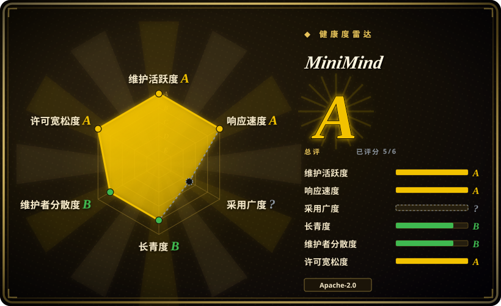

# MiniMind

一个用约 3.2k 行手写 PyTorch 从零写起的、中文优先的 LLM 训练教学项目（`trainer/` + `model/`）：64M 参数 Dense 模型（`minimind-3`，结构对齐 Qwen3）加一个 198M-A64M 的 MoE 版本，全链路均为手写——BPE 分词器、预训练、SFT、LoRA、DPO、PPO/GRPO/CISPO、Tool Call SFT、Agentic RL 与蒸馏；作者称在单张租用 RTX 3090 上约 2.3 小时、约 3 元人民币即可得到可对话的 Zero 模型。

## 何时使用

你是一名已经在产品里调用 LLM、也微调过一两个 checkpoint 的工程师，但「预训练 → SFT → RLHF」对你仍是一张从未亲手跑通的流程图。你想自己在租来的机器上跑完每个阶段——成本大约一杯咖啡——并且逐行读完做这件事的代码，而不是调用 `trainer.train()` 然后信任一个库。直接读 `transformers`/`trl` 源码在这件事上是无解的：它们为真实模型服务，核心循环被并行封装、配置装配和向后兼容埋得很深。你的做法是租一张 24GB 显卡，下载 1.2GB 与 1.6GB 两个 mini 数据集，依次跑 `train_pretrain.py`、`train_full_sft.py` 和几个 RL 脚本，看着 loss 曲线对应到你真正读过的某一行代码。

相对最近的替代品，决定性的取舍是：nanoGPT 演示了预训练那一半——而且它现在已宣布废弃——但它止步于 GPT-2 预训练加领域微调，是英文 / GPT-2 血统，没有 MoE、没有 RL、没有 Tool Call；torchtune 是持续维护的 PyTorch 原生后训练库，但它是拿来**用**的而不是拿来重造的，其 recipe 面向真实模型（Llama/Qwen/DeepSeek 家族），而不是一个你能彻底推导的单一产物。MiniMind 是唯一把**整条链路**——包括分词器训练——都保持手写、且小到每个阶段约一小时跑完的项目：中文优先的数据，加上 MoE、Tool Call 与 Agentic RL 这几个其他教学仓库完全没覆盖的阶段。

## 何时不用

- **你真的要微调一个真实模型。** 64M 的玩具教的是机制，不是可用产物。单卡 LoRA/QLoRA 追速度用 [Unsloth](../unsloth.zh.md)，想让 SFT→DPO 全链路配置化、零代码就用 [LlamaFactory](../llamafactory.zh.md)，因为 MiniMind 的价值在可读代码，不在它产出的权重。
- **你需要训出来的模型事实可靠。** 按项目自己给出的样例与自评选型，64M 在知识准确性上明显落后，英文会退化成乱码，其自评位次在小规模中文模型里处于中游 [未验证]。请改用托管模型 API 或 ≥7B 的开源 checkpoint，因为读再多训练循环也补不上 64M 的参数预算。
- **你要的是 MoE 吞吐，而不是 MoE 代码。** 这个仓库刻意只用原生 PyTorch，MoE 没有 fused kernel，README 自述 4 experts 配置比同规模 Dense 约慢 50%。要真做 MoE 训练用 [Colossal-AI](../colossalai.zh.md) 或 DeepSpeed-MoE/Megatron，要真做 MoE 推理用专用推理引擎而不是 `scripts/serve_openai_api.py`，因为按专家分桶加上 kernel 启停开销正是这些栈要消掉的东西。
- **你在 Apple Silicon 上或没有 CUDA 显卡。** 训练路径是按 CUDA 写的；截至 2026-09，有一个未关闭的 issue（2026-09-15 提交）报告在 Mac 上不改任何东西直接跑 `trainer/train_pretrain.py` 会完全跑在 CPU 上、用不到 Mac 的 GPU，而开启 MPS 的 PR 还处于开放未合并状态。改用直接面向 Metal 的 MLX / `mlx-lm`（未收录），或租一台 CUDA 机器，因为 CPU 训练会让整套时间预算的前提失效。
- **你需要锁版本、稳定的 API，或者一个可 import 的依赖。** 模型线没有任何 tagged release，而且历史上断过两次：2025-04 的重构下架了整个 `minimind-v1` 系列（旧权重不再能直接加载），`2 → 3` 又改动了分词器、chat template、默认配置与目录结构。请按 commit SHA 锁定并 vendor 代码，或者用 [torchtune](../torchtune.zh.md) 这类带版本、可 import 的库。
- **你要商用再分发派生权重。** 仓库代码是 Apache-2.0，但 README 描述的训练数据由混合公开语料拼成（其中明确包含 CC-BY-NC 来源），另加约 10 万条基于 `qwen3-4b` 蒸馏合成的 Tool Call 样本；它声称下游许可可传递，但我无法逐数据集核验这条链。请先做法务审查，或改用 [LlamaFactory](../llamafactory.zh.md) 在你掌控来源的语料上训练，因为权重会继承 MiniMind 这条不清楚的数据链。

## 横向对比

| 替代品 | 是否收录 | 我们的评价 | 取舍 |
|---|---|---|---|
| [torchtune](../torchtune.zh.md) | ✅ | 当你要真的后训练一个真实开源 checkpoint、需要持续维护且可 import 的 PyTorch 原生库时，选 torchtune；只有当目标是亲手重建每个算法时才选 MiniMind，因为 torchtune 的 recipe 恰好隐藏了 MiniMind 暴露的预训练 / RL 内部实现。 | torchtune 给你带版本锁定的维护与真实模型支持；MiniMind 给你一个一下午能读完的完整玩具系统。 |
| [Unsloth](../unsloth.zh.md) | ✅ | 当交付物是单卡微调好的真实模型时，选 Unsloth；当交付物是你自己的理解时选 MiniMind，因为 Unsloth 的 Triton kernel 优化的正是一条你不该去改内部的流水线。 | Unsloth 用透明度换真实模型上约 2x 的速度；MiniMind 在 64M 尺度上用任何可用产出换完全透明。 |
| [LlamaFactory](../llamafactory.zh.md) | ✅ | 当团队需要覆盖 100+ 模型、带 Web UI 的配置化 SFT→RLHF 流水线时，选 LlamaFactory；当一名工程师需要看清每个阶段的 loss 到底由什么构成时选 MiniMind，因为零代码训练器教不了它抽象掉的机制。 | LlamaFactory 更快拿到可用模型、模型覆盖更广；MiniMind 到任何产出都更慢，但它是两者中唯一能从自身源码完整推导的那一个。 |
| [autoresearch](../../ml-research/autoresearch.zh.md) | ✅ | 当你想让 agent 以 validation bits-per-byte 为评分自动跑单卡训练实验时，选 autoresearch；当你想**学会**各阶段而不是自动化搜索时选 MiniMind，因为 autoresearch 假定你已经知道它的循环在做什么。 | autoresearch 自动化了迭代但只是一个窄 harness；MiniMind 覆盖完整阶段谱系（MoE、RL、Tool Use）但没有实验自动化。 |
| [nanoGPT](nanogpt.zh.md) | ✅ | 当你要最经典的最小 GPT-2 参考实现、且接受它已被上游废弃、止步于预训练时，选 nanoGPT；当你需要中文数据路径、MoE、Tool Call SFT 与 RL/RLAIF 阶段时选 MiniMind，因为那些全都在 nanoGPT 结束之处的下游。 | nanoGPT 更小更干净、能产出真实 GPT-2 权重，但已冻结且单人维护；MiniMind 仍在维护、覆盖完整阶段谱系，代价是 64M 的产出没法用于任何其他用途。 |

## 技术栈

- Python 3（作者环境为 Python 3.10.16 与 CUDA 12.2）；PyTorch 需单独安装——`torch` 在 `requirements.txt` 里被注释掉了。
- `transformers==4.57.6` 用于分词器、模型基类与 HF 生态互操作（`AutoTokenizer`、`AutoModel`、`PreTrainedModel`、`GenerationMixin`）；算法本身是手写的。
- 通过逐一读取 `trainer/` 全部 11 个文件、`model/` 下两个 `.py` 源码、`scripts/serve_openai_api.py`、`scripts/web_demo.py` 与 `eval_llm.py` 核实：**这些路径上没有 `trl`、也没有 `peft` 的 import**——`trl==0.13.0` 钉在 `requirements.txt` 里，但在训练与模型代码中未被使用。
- 自定义 BPE + ByteLevel 分词器，词表 6400（`model/tokenizer.json`、`train_tokenizer.py`），刻意做小以免 embedding / 输出层吃掉一亿参数以下的预算；README 明确不建议重新训练它。
- 模型代码：Decoder-only Transformer，Pre-Norm + RMSNorm、SwiGLU、RoPE 并支持 YaRN 外推（`minimind-3` 为 8 层、d_model 768、8 个 q-head / 4 个 kv-head、max_position 32768）；MoE 版本增加 4 experts、top-1 routing，且去掉了 shared expert。
- 训练侧有 `torchrun` 的 DDP（可选 DeepSpeed）、断点续训、`wandb` / `swanlab` 记录；服务侧有 Streamlit WebUI（`scripts/web_demo.py`）与 Flask 的 OpenAI 兼容服务（`scripts/serve_openai_api.py`），支持 `reasoning_content` 与 `tool_calls`；数据集为 JSONL。

## 依赖

- 一张 CUDA 显卡是基准目标（mini 路径参考 24GB RTX 3090；作者本人用 8×3090）；要让 README 里那些时间数字成立，`torch.cuda.is_available()` 必须为真。
- 数据集需另外下载，主渠道为 ModelScope，备选 HuggingFace：快速路径用 `pretrain_t2t_mini.jsonl` 1.2GB 加 `sft_t2t_mini.jsonl` 1.6GB；主线完整集为 `pretrain_t2t` 10GB、`sft_t2t` 14GB、`dpo` 53MB、`rlaif` 24MB 与两个 agent RL 文件，合计约 24GB。
- 对一个以「极简」为卖点的项目来说，`requirements.txt` 相当重（约 30 个 pin）：`transformers`、`trl`、`datasets`、`modelscope`、`numpy==1.26.4`、`streamlit`、`wandb`、`swanlab`、`openai`（用于调 API 蒸馏），以及一批数据清洗库（`jieba`、`nltk`、`simhash`、`datasketch`、`scikit_learn`、`sentencepiece`、`tiktoken`）。其中若干 pin 已偏旧，与当前 PyTorch 栈共存时需要解冲突。
- 训练路径上没有数据库、没有服务端、没有外部服务；只有跑蒸馏阶段才需要一个 OpenAI 兼容的 API key。
- 磁盘：数据加 checkpoint（`./checkpoints/`、`./out/`）需要数 GB，尚未计入分词器与模型转换产物。

## 运维难度

**低到中等。** 没有东西需要部署，也没有服务需要保活：clone、装依赖、把两个 mini JSONL 放进 `./dataset/`，然后在 `trainer/` 里跑脚本。真正的运维面不是可用性而是成本与版本漂移——每次运行都在烧 GPU 小时，代码只在 `master` 上推进、没有可锁的 release，钉住的 `numpy` / `transformers` 版本还要和本地 torch 构建对齐。断点续训（`--from_resume 1`）是内建的，并且支持在显卡数量变化后恢复，这正是让长跑在可中断的租用机器上能活下来的关键。

## 健康度与可持续性

- **维护活跃度（2026-09）：** 维护活跃，对教学项目来说异常活跃——默认分支最后一次提交在 2026-09-18（核验前一天），最近 13 周里有 7 周有提交，且近期合入的是来自外部贡献者的真实正确性修复（top-1 MoE 路由器梯度 bug、RL/DDP 梯度 all-reduce、把工具路径里的 `eval()` 换成 AST 求值器、Ctrl+C 处理）。388 个提交横跨 2024-07 至今。
- **治理集中度 / 巴士系数：** 单人主导但社区能提交补丁，不是无人问津的孤岛。最近 12 个月内有 17 位贡献者活跃，该窗口内 top1 占比 49%（全历史口径：作者 204 个提交对第二位 6 个），也就是说方向、发布与课程编排由一个人定，而日常 bug 由他人修。没有基金会、没有厂商、看不到资助模式。
- **年龄与 Lindy（2026-09）：** 创建于 2024-07-27，约 784 天且仍在发布，落在「既老**又**活着」的有利象限，而不是年轻炒作型。需要保留的限定是：耐久性属于**仓库**而非它的**产物**——两次重构已经让旧权重与分词器失效，因此可复现的最小单位是一个锁定的 commit。
- **采用与生态：** 61.7k star / 8.0k fork / 280 watcher，权重与数据集在 HuggingFace 与 ModelScope 双渠道发布，有公开在线 demo、配套视频课程，以及视觉与 Omni 的兄弟仓库。采用形态是读者与学生而非依赖方：仓库里没有 `pyproject.toml`/`setup.py`，作者也没有把它发布成可安装的包，因此在依赖图里不留痕迹——健康度打分器的采用轴为 `?`，原因是 `no_package_structural`。（PyPI 上另有一个署名不同的 `minimind` 0.6.0 发行版 [未验证]，它不是本项目。）
- **风险信号：** Apache-2.0，无 relicense 历史，无 CLA；值得注意的风险是来源（混合许可与蒸馏训练数据，本文无法核验）与可复现性（模型线没有 tagged release），不是许可变更或停止维护。

## 存疑（未验证）

- [未验证] 训练数据许可：README 称数据由公开语料拼成，其中明确包含 CC-BY-NC 来源，另加约 10 万条基于 `qwen3-4b` 蒸馏合成的 Tool Call 样本，并断言该链路满足各许可要求。我未逐数据集核验再分发条款。
- [未验证] 「2 小时 / 3 元」是作者对 SFT 阶段的自报估算（`1 epoch`、单卡 3090、mini 数据、约 1.3 元/时租价），没有复现环境无法核实；它不是训出可用模型的总成本，README 本身也做了这个限定。
- [未验证] README 训练开销表里的各阶段时间与成本，以及「4 experts 的 MoE 路径比 Dense 慢约 50%」的说法，均为作者自报，本文未独立复现。
- [未验证] 项目自己的 benchmark 表与主观模型排序（把 `minimind-3` 与其他小规模中文模型对比）为自报结果，未重跑。
- [未验证] `trl==0.13.0` 钉在 `requirements.txt` 中，但我读过的文件里都没有它的 import（`trainer/` 全部、`model/model_minimind.py`、`model/model_lora.py`、`scripts/serve_openai_api.py`、`scripts/web_demo.py`、`eval_llm.py`）；未检查的文件（`scripts/chat_api.py`、`scripts/convert_model.py`、`scripts/eval_toolcall.py`，或数据准备脚本）是否使用它未确认。
- [未验证] 仓库根 `dataset/` 目录被跟踪的内容，以及文档里的 JSONL 字段格式是否与当前每个脚本的期望一致（README 的 Tool Call 样例用的是转义 JSON 字符串），未与代码逐一核对。
- [未验证] star / fork / watcher / 贡献者数（61.7k / 8.0k / 280 / 17）是 2026-09-19 读取的 GitHub 时点数据，会波动。
- [未验证] PyPI 上名为 `minimind` 的发行版（v0.6.0、作者 `yuchan`、未声明 homepage 与 project URLs）与本仓库是否相关。仓库树里没有 `pyproject.toml`/`setup.py`，作者署名也对不上，所以这个关系是未确认而不是已建立。
- [推断] 「约 3.2k 行」是我在 commit `cc312c1` 上的自行统计：`trainer/*.py` 2887 行加 `model/*.py` 357 行，合计 3244 行；若按整个仓库算（`scripts/` 676 行加 `eval_llm.py` 96 行）约 4.0k 行。
- [推断] 归为 `app`（可运行的训练加推理脚本集合）并放入 study-and-experiments 子分类，而 README 自身的定位是课程与教程；代码确实真实可跑，但受众是学习者而非生产流水线。
- [推断] 由于 checkpoint 被 gitignore 且没有任何打包产物，「这套确切的配置是否真的跑过」无法仅从仓库重建。
