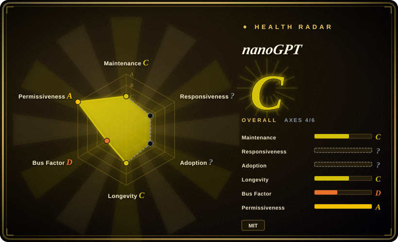

# nanoGPT

The canonical minimal GPT training reference: `train.py` (~336 lines) plus `model.py` (~330 lines) reproduce GPT-2 124M on OpenWebText on an 8×A100 node in ~4 days, or a character-level Shakespeare GPT in about 3 minutes on one GPU — and the repository's own November 2025 notice declares it deprecated in favour of `nanochat`.

## When to use

You're an engineer who wants to understand GPT training at the level where you could rebuild it, and you want the reference implementation that everything else is compared against rather than a simplified demo. You have one GPU (or a MacBook) and an afternoon; you clone this, run `python data/shakespeare_char/prepare.py`, then `python train.py config/train_shakespeare_char.py`, and three minutes later you are sampling from a 6-layer transformer you trained yourself. When you want the real thing rather than a toy, you point the same script at `data/openwebtext/prepare.py` and reproduce GPT-2 124M — with checkpoints that interoperate with OpenAI's released GPT-2 weights, so `sample.py --init_from=gpt2-xl` samples coherent English from a 1.5B model you did not train. The whole training loop is explicit: DDP setup, gradient accumulation, mixed precision, cosine learning-rate decay, evaluation, checkpointing — no `Trainer`, no Lightning, nothing hidden behind a library call.

The deciding tradeoff against its closest substitutes: [MiniMind](minimind.md) covers far more of the modern stack (tokenizer training, MoE, DPO/GRPO, tool-call and agentic RL, Chinese-first data) but it is a 64M toy that runs CPU-only if you are on a Mac; [torchtune](../torchtune.md) and [Unsloth](../unsloth.md) are maintained and fast but they are libraries you *use*, and their recipes optimize internals you are not meant to read. nanoGPT is the one that gives you a **real GPT-2 lineage with readable code**: loadable pretrained weights, ~670 lines of model + training loop, and working MPS/CPU paths — at the cost of having no instruction-tuning, no RL and no active maintenance.

## When NOT to use

- **You are starting a new project on it.** The repository now tells you not to: its own notice says nanochat "is very likely you meant to use/find" and that nanoGPT "is now very old and deprecated but I will leave it up for posterity". Use nanochat (未收录) for the maintained successor, or [MiniMind](minimind.md) if you want a maintained from-scratch chain, because a deprecated reference receives no fixes and its stale README even still claims "still under active development".
- **You need instruction-following, chat or tool behaviour.** The current README documents pretraining, domain fine-tuning (Shakespeare) and sampling only — there is no SFT/chat template, no DPO/RLHF stage and no tool-calling stage in the tree. Use [MiniMind](minimind.md) (SFT → DPO → GRPO → tool-call → agentic RL) or [LlamaFactory](../llamafactory.md) / [Unsloth](../unsloth.md) on a real instruct checkpoint, because there is no alignment pipeline here to extend.
- **You need a Chinese-capable model.** The data path is OpenWebText (English) plus Shakespeare, with GPT-2 BPE; you would rebuild the tokenizer and corpus yourself. Use [MiniMind](minimind.md), which is Chinese-first with a custom 6400-token BPE, because retokenizing and re-sourcing a corpus is the majority of the work, not an edge case.
- **You want modern multi-GPU parallelism.** The code is DDP-only; FSDP sits in the README's own TODO list, and the model itself is a plain GPT-2 (no RoPE, no RMSNorm, no GQA, no MoE). Use [torchtune](../torchtune.md) or [Colossal-AI](../colossalai.md) for FSDP/tensor/pipeline parallelism on real architectures, because nanoGPT optimizes for readability over throughput at scale.
- **You want something still being maintained.** Code has been frozen since 2024-12-09 (the only later commit is the deprecation notice), the radar shows 0 active weeks in the last 13, and the 12-month governance window is a single author. Pick [MiniMind](minimind.md) (merges from outside contributors most weeks) or [autoresearch](../../ml-research/autoresearch.md) (agent-driven experiment harness) if you need the code to keep moving.
- **You need a dependency with pinned versions.** There is no `requirements.txt`, no `pyproject.toml`, no `setup.py` and no tagged release; dependencies live in one `pip install` line and the code was written against the PyTorch 2.0 era. Use [torchtune](../torchtune.md) for a versioned library or [Unsloth](../unsloth.md) for a maintained trainer, because vendoring an unpinned, frozen script set makes every future environment change your problem.

## Comparison

| Alternative | In index | Our verdict | Tradeoff |
|---|---|---|---|
| [MiniMind](minimind.md) | ✅ | When you need the modern training stack — tokenizer, SFT, MoE, RL, tool-call — pick MiniMind; pick nanoGPT when you need a *real* GPT-2 you can sample English from and load OpenAI's checkpoints into, because MiniMind's 64M output is a teaching artifact while nanoGPT's is a genuine (if obsolete) GPT-2. | MiniMind covers far more of the pipeline and is actively maintained, but cannot use a Mac GPU and produces no usable model; nanoGPT produces real GPT-2 weights and runs on MPS/CPU, but stops at pretraining. |
| [autoresearch](../../ml-research/autoresearch.md) | ✅ | When you want an agent to search over training configurations under a fixed time budget, pick autoresearch; pick nanoGPT when you want to run and read the training loop yourself, because autoresearch replaces exactly the human-in-the-loop experimentation nanoGPT is designed to teach. | autoresearch automates iteration but hides the loop behind an agent harness; nanoGPT is the loop, exposed, and now unmaintained. |
| [torchtune](../torchtune.md) | ✅ | When you must post-train a real open checkpoint with a maintained, versioned library, pick torchtune; pick nanoGPT when the goal is to understand what such a library does internally, because torchtune's recipes will not teach you the mechanics and nanoGPT will not give you production support. | torchtune gives pinned versions, FSDP and real architectures; nanoGPT gives ~670 readable lines and a deprecated, unpinned environment. |
| [Unsloth](../unsloth.md) | ✅ | When the deliverable is a fast fine-tune on one GPU, pick Unsloth; pick nanoGPT when the deliverable is comprehension, because Unsloth's Triton kernels exist precisely to make you not think about the training loop. | Unsloth is ~2x faster on real models with far less VRAM; nanoGPT is slower, smaller and frozen, but fully auditable. |
| [LlamaFactory](../llamafactory.md) | ✅ | When a team needs config-driven SFT/RLHF over 100+ models with a UI, pick LlamaFactory; pick nanoGPT when a single engineer needs to derive GPT training from first principles, because a zero-code trainer cannot teach the mechanism it abstracts. | LlamaFactory is faster to any deliverable and maintained; nanoGPT is the pedagogical floor and is deprecated. |

## Tech stack

- Python + PyTorch (written against the PyTorch 2.0 era and using `torch.compile`); plus `numpy`, `tiktoken` (GPT-2 BPE), `transformers` (only to load OpenAI's GPT-2 checkpoints), `datasets` (to fetch OpenWebText), optional `wandb` logging and `tqdm`.
- Code, counted at commit `3adf61e`: `train.py` 336 lines (the explicit training loop — DDP, gradient accumulation, AMP, cosine decay, eval, checkpointing), `model.py` 330 lines (the GPT definition, with an optional `from_pretrained` path for OpenAI weights), `sample.py` 89 lines, `bench.py` 117 lines, `configurator.py` 47 lines (the CLI/config-override layer). ~920 lines across those five files.
- `config/`: `train_gpt2.py`, `train_shakespeare_char.py`, `finetune_shakespeare.py`, and `eval_gpt2{,_medium,_large,_xl}.py` for the published baselines.
- Data: `data/openwebtext/prepare.py` (GPT-2 BPE into `uint16` memmap `.bin`) and `data/shakespeare_char/prepare.py` (character-level), plus `data/shakespeare/` for BPE finetuning. Two Jupyter notebooks (`scaling_laws.ipynb`, `transformer_sizing.ipynb`) are kept in-tree.
- No framework at all: no Lightning, no HF `Trainer`, no `accelerate`. Sampling in `sample.py` is a naive autoregressive loop with no KV-cache path.

## Dependencies

- One GPU for the fast path (a single A100 trains the Shakespeare char model in ~3 minutes); eight A100 40GB for the GPT-2 124M reproduction (~4 days per the README).
- Also runs on CPU (`--device=cpu --compile=False`) and on Apple Silicon via MPS (`--device=mps`, which the README says can accelerate training 2–3x) — the MPS path is the capability [MiniMind](minimind.md) lacks.
- No manifest to pin: `pip install torch numpy transformers datasets tiktoken wandb tqdm`. `wandb` is optional; the README's troubleshooting notes that `torch.compile` is not available on all platforms (Windows is called out).
- Disk/network: OpenWebText preprocessing comments state it takes 54GB in the HuggingFace cache for ~8M documents and that the resulting `train.bin` is ~17GB (with `val.bin` ~8.5MB). The Shakespeare paths are 1MB and seconds.
- No database, no service, no external API.

## Ops difficulty

**Low.** Nothing is deployed and there is no service: clone, one `pip install`, run `prepare.py` then `train.py` with a config file. The friction is environmental rather than operational — no pinned dependencies, no release to pin your copy to, PyTorch-2.0-era code that expects `torch.compile`, and a one-time OpenWebText download costing 54GB of cache plus a ~17GB artifact. On a Mac, the CPU/MPS flags in the README are the difference between a 3-minute demo and a stalled run.

## Health & viability

- **Maintenance (2026-09):** effectively frozen and now formally deprecated. Last code commit 2024-12-09; the only later commit (2025-11-12) changed the README to add the nanochat pointer and the word "deprecated". The radar shows **0 active weeks in the last 13** (maintenance C), and the README is internally inconsistent — it still carries the older line "still under active development" next to the deprecation notice.
- **Governance / bus factor:** single-author to the extreme — the 12-month window shows 1 active maintainer and a top1 share of 1.0 (governance D). There is no organization, foundation or vendor behind it; the roadmap is one person's, and he has publicly redirected his effort to nanochat.
- **Age & Lindy (2026-09):** created 2022-12-28, ~1362 days old — a long-lived artifact whose *reference* value has held up while its *maintenance* value has not. This is the case where the Lindy prior must be read as age × still-active, and the "still-active" half has failed: cite it as a pattern source, not as a foundation.
- **Adoption & ecosystem:** 63.2k stars / 10.9k forks / 542 watchers — one of the most-forked ML teaching repositories, still widely cited. Adoption is readers and forkers, not dependents: no package is published, so the radar's adoption axis is `?` (`no_package_structural`).
- **Risk flags:** MIT with no relicense history; the material risk is **upstream deprecation** (the project's own notice), compounded by 349 open issues with evidently no triage, no tagged releases, and no dependency manifest.

## Caveats (unverified)

- [未验证] The README's performance figures — ~3 minutes on one A100 for the Shakespeare char model, ~4 days on 8×A100 for GPT-2 124M, and the 2–3x MPS speedup — are author-reported and were not reproduced here; no reproduction environment was available.
- [未验证] The exact training-data revision behind the published GPT-2 baseline losses; the README itself notes OpenWebText is only a best-effort reproduction of OpenAI's unreleased WebText, so the baselines carry a documented domain gap.
- [未验证] The disk figures (54GB HuggingFace cache, ~17GB `train.bin`) come from comments inside `data/openwebtext/prepare.py` rather than from a run I measured; the current OpenWebText revision may differ.
- [未验证] Whether `sample.py` has any batching or caching path beyond the naive loop I read; the 89-line file contains no KV-cache code, but I did not execute it.
- [未验证] Windows behaviour: the README says `torch.compile` may be unavailable there and suggests `--compile=False`; no Windows run was attempted.
- [未验证] Whether the deprecation is final or reversible; the notice says the repo is left up "for posterity" but does not explicitly say maintenance has ended.
- [推断] That later from-scratch training projects are measured against this repository is my reading of how it is cited in this index and of its fork count, not a claim made by those projects.
- [推断] Classified here as `app` and filed as study material rather than as a training framework, because its value now is the readable reference, not the pipeline it provides.
- [推断] `nanochat` is the intended successor per the repository's own notice, but I did not read it, so I cannot say whether it covers this page's use cases.
