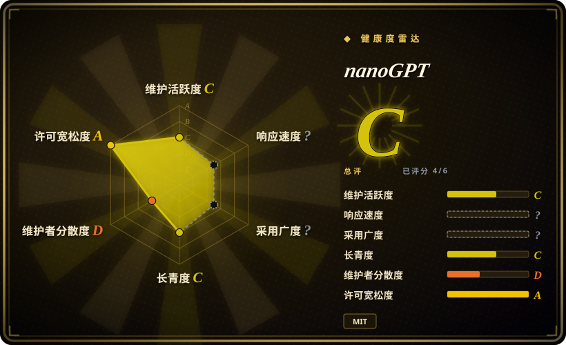

# nanoGPT

最经典的极简 GPT 训练参考实现：`train.py`（约 336 行）加 `model.py`（约 330 行），在 8×A100 节点上用 OpenWebText 约 4 天复现 GPT-2 124M，或在单张 GPU 上约 3 分钟训出一个字符级莎士比亚 GPT——而仓库自己在 2025 年 11 月的公告里宣布它已被 `nanochat` 取代、进入废弃状态。

## 何时使用

你是一名想弄懂 GPT 训练到「自己能重建」这个深度的工程师，而且你要的是所有其他实现都被拿来对照的那份参考实现，而不是一个被简化过的 demo。你手上有一张 GPU（或一台 MacBook）和一个下午：clone 下来，跑 `python data/shakespeare_char/prepare.py`，再跑 `python train.py config/train_shakespeare_char.py`，三分钟后你就在从自己训出来的 6 层 transformer 里采样了。想要真东西而不是玩具时，把同一个脚本指向 `data/openwebtext/prepare.py` 就能复现 GPT-2 124M——产出的 checkpoint 与 OpenAI 发布的 GPT-2 权重互通，所以 `sample.py --init_from=gpt2-xl` 能让你从一个自己没训过的 1.5B 模型里采样出连贯英文。整个训练循环都是显式的：DDP 初始化、梯度累积、混合精度、余弦学习率衰减、评估、checkpoint——没有 `Trainer`，没有 Lightning，没有藏在库调用背后的东西。

相对最近的替代品，决定性的取舍是：[MiniMind](minimind.zh.md) 覆盖了现代栈里多得多的部分（分词器训练、MoE、DPO/GRPO、Tool Call 与 Agentic RL、中文优先数据），但它是 64M 的玩具，而且你在 Mac 上只能跑 CPU；[torchtune](../torchtune.zh.md) 与 [Unsloth](../unsloth.zh.md) 持续维护且更快，但它们是拿来**用**的库，其 recipe 优化的是你不该去读的内部。nanoGPT 是唯一给你**真实 GPT-2 血统加可读代码**的那一个：能加载的预训练权重、模型加训练循环合计约 670 行、MPS/CPU 路径可用——代价是它没有指令微调、没有 RL，也不再维护。

## 何时不用

- **你要在它上面开新项目。** 仓库自己已经叫你别这么做：它的公告说 nanochat「very likely you meant to use/find」，而 nanoGPT「is now very old and deprecated but I will leave it up for posterity」。要持续维护的后继版本就用 nanochat（未收录），要一个仍在维护的从零链路就用 [MiniMind](minimind.zh.md)，因为废弃的参考实现不会再拿到修复，它过期的 README 甚至还写着「still under active development」。
- **你需要指令跟随、对话或工具调用能力。** 当前 README 只记录了预训练、领域微调（莎士比亚）与采样——仓库里没有 SFT/chat 模板、没有 DPO/RLHF、也没有 Tool Call 阶段。要这些就用 [MiniMind](minimind.zh.md)（SFT → DPO → GRPO → Tool Call → Agentic RL），或在真实的 instruct checkpoint 上用 [LlamaFactory](../llamafactory.zh.md) / [Unsloth](../unsloth.zh.md)，因为这里根本没有对齐流水线可供扩展。
- **你需要中文能力的模型。** 数据路径是 OpenWebText（英文）加莎士比亚，配 GPT-2 BPE；分词器和语料都得你自己重建。用 [MiniMind](minimind.zh.md)，它是中文优先、自带 6400 词表 BPE，因为重新分词和重新找语料是这项工作的主体，不是边缘情况。
- **你要现代的多 GPU 并行。** 代码只有 DDP；FSDP 还躺在 README 自己的 TODO 里，模型本身也是朴素的 GPT-2（没有 RoPE、没有 RMSNorm、没有 GQA、没有 MoE）。要 FSDP / 张量并行 / 流水线并行就用 [torchtune](../torchtune.zh.md) 或 [Colossal-AI](../colossalai.zh.md)，因为 nanoGPT 优化的是可读性而不是大规模吞吐。
- **你要一个还在维护的项目。** 代码自 2024-12-09 起冻结（此后唯一的提交是废弃公告），雷达显示最近 13 周有 0 周活跃，12 个月治理窗口里只有一个作者。要代码继续动，就选 [MiniMind](minimind.zh.md)（几乎每周都有外部贡献者合入）或 [autoresearch](../../ml-research/autoresearch.zh.md)（agent 驱动的实验 harness）。
- **你需要一个能锁版本的依赖。** 没有 `requirements.txt`、没有 `pyproject.toml`、没有 `setup.py`，也没有任何 tagged release；依赖只活在 README 的一行 `pip install` 里，代码是按 PyTorch 2.0 时代写的。要带版本的库用 [torchtune](../torchtune.zh.md)，要持续维护的训练器用 [Unsloth](../unsloth.zh.md)，因为 vendor 一份未锁版本、已冻结的脚本集，等于把此后每次环境变化都变成你自己的问题。

## 横向对比

| 替代品 | 是否收录 | 我们的评价 | 取舍 |
|---|---|---|---|
| [MiniMind](minimind.zh.md) | ✅ | 当你需要现代训练栈——分词器、SFT、MoE、RL、Tool Call——时选 MiniMind；当你需要一个能采样出英文、还能加载 OpenAI checkpoint 的**真** GPT-2 时选 nanoGPT，因为 MiniMind 的 64M 产出是教学产物，而 nanoGPT 的产出是真实（尽管过时）的 GPT-2。 | MiniMind 覆盖的流水线多得多且仍在维护，但在 Mac 上用不了 GPU、也产不出可用模型；nanoGPT 能产出真实 GPT-2 权重、能在 MPS/CPU 上跑，但止步于预训练。 |
| [autoresearch](../../ml-research/autoresearch.zh.md) | ✅ | 当你想让 agent 在固定时间预算下搜索训练配置时选 autoresearch；当你想自己跑、自己读那个训练循环时选 nanoGPT，因为 autoresearch 恰好替换掉了 nanoGPT 想教你的那部分人工迭代。 | autoresearch 自动化了迭代，但把循环藏在 agent harness 之后；nanoGPT 就是那个循环本身，公开可读，但已停止维护。 |
| [torchtune](../torchtune.zh.md) | ✅ | 当你必须用持续维护、带版本的库去后训练真实开源 checkpoint 时选 torchtune；当目标是搞懂这类库内部做了什么时选 nanoGPT，因为 torchtune 的 recipe 不会教你机制，而 nanoGPT 不会给你生产支持。 | torchtune 提供锁定的版本、FSDP 与真实架构；nanoGPT 提供约 670 行可读代码，以及一个废弃且未锁定的环境。 |
| [Unsloth](../unsloth.zh.md) | ✅ | 当交付物是单卡上的快速微调时选 Unsloth；当交付物是理解本身时选 nanoGPT，因为 Unsloth 的 Triton kernel 存在的意义就是让你不去想训练循环。 | Unsloth 在真实模型上约快 2x、显存占用低得多；nanoGPT 更慢更小且已冻结，但完全可审计。 |
| [LlamaFactory](../llamafactory.zh.md) | ✅ | 当团队需要覆盖 100+ 模型、带 UI 的配置化 SFT/RLHF 时选 LlamaFactory；当一名工程师需要从第一原理推导 GPT 训练时选 nanoGPT，因为零代码训练器教不了它抽象掉的机制。 | LlamaFactory 到任何交付物都更快且仍在维护；nanoGPT 是教学地板，且已被废弃。 |

## 技术栈

- Python + PyTorch（按 PyTorch 2.0 时代写的，并使用了 `torch.compile`）；另有 `numpy`、`tiktoken`（GPT-2 BPE）、`transformers`（仅用于加载 OpenAI 的 GPT-2 checkpoint）、`datasets`（拉取 OpenWebText）、可选的 `wandb` 日志与 `tqdm`。
- 代码按 commit `3adf61e` 统计：`train.py` 336 行（显式训练循环——DDP、梯度累积、AMP、余弦衰减、评估、checkpoint）、`model.py` 330 行（GPT 定义，含可选的 OpenAI 权重 `from_pretrained` 路径）、`sample.py` 89 行、`bench.py` 117 行、`configurator.py` 47 行（CLI/配置覆盖层），这五个文件合计约 920 行。
- `config/`：`train_gpt2.py`、`train_shakespeare_char.py`、`finetune_shakespeare.py`，以及用于公开 baseline 的 `eval_gpt2{,_medium,_large,_xl}.py`。
- 数据：`data/openwebtext/prepare.py`（GPT-2 BPE 打成 `uint16` 的 memmap `.bin`）与 `data/shakespeare_char/prepare.py`（字符级），另有 `data/shakespeare/` 用于 BPE 微调。仓库里还留着两个 notebook（`scaling_laws.ipynb`、`transformer_sizing.ipynb`）。
- 完全没有框架：没有 Lightning、没有 HF `Trainer`、没有 `accelerate`。`sample.py` 的采样是朴素自回归循环，没有 KV cache 路径。

## 依赖

- 快速路径需要一张 GPU（单张 A100 训字符级莎士比亚约 3 分钟）；复现 GPT-2 124M 需要 8 张 A100 40GB（README 称约 4 天）。
- 也能在 CPU（`--device=cpu --compile=False`）与 Apple Silicon 的 MPS（`--device=mps`，README 称可提速 2–3x）上跑——MPS 这条路径正是 [MiniMind](minimind.zh.md) 缺的能力。
- 没有可锁的清单：`pip install torch numpy transformers datasets tiktoken wandb tqdm`。`wandb` 可选；README 的 troubleshooting 指出 `torch.compile` 并非所有平台都可用（点名了 Windows）。
- 磁盘与网络：OpenWebText 的预处理脚本注释称它在 HuggingFace 缓存里占 54GB、约 800 万篇文档，产出的 `train.bin` 约 17GB（`val.bin` 约 8.5MB）。莎士比亚路径是 1MB 级别、秒级完成。
- 没有数据库、没有服务端、没有外部 API。

## 运维难度

**低。** 没有东西要部署，也没有服务要保活：clone、一行 `pip install`、先跑 `prepare.py` 再带 config 跑 `train.py`。摩擦来自环境而不是运维——没有锁定的依赖、没有可以把自己的副本钉上去的 release、按 PyTorch 2.0 时代写并期待 `torch.compile` 的代码，以及一次性下载 OpenWebText 要花掉 54GB 缓存加约 17GB 产物。在 Mac 上，README 里的 CPU/MPS 参数就是「3 分钟出 demo」和「卡住不动」的区别。

## 健康度与可持续性

- **维护活跃度（2026-09）：** 实际上已经冻结，并已正式废弃。最后一次代码提交是 2024-12-09；此后唯一的提交（2025-11-12）改的是 README，加了 nanochat 指引和「deprecated」一词。雷达显示最近 13 周**有 0 周活跃**（维护活跃度 C），而且 README 自身前后矛盾——它一边挂着废弃公告，一边还留着更早那句「still under active development」。
- **治理集中度 / 巴士系数：** 单一作者到极致——12 个月窗口里只有 1 位活跃维护者，top1 占比 1.0（治理 D）。背后没有组织、基金会或厂商；路线图是一个人的，而他已经公开把精力转向 nanochat。
- **年龄与 Lindy（2026-09）：** 创建于 2022-12-28，约 1362 天，是一件长寿产物：它的**参考**价值还在，**维护**价值已经没了。这正是必须按「年龄 × 仍然活跃」而不是单看年龄来读 Lindy 先验的情形，而「仍然活跃」这一半已经失效：把它当模式来源引用，不要当日志基础。
- **采用与生态：** 63.2k star / 10.9k fork / 542 watcher——被 fork 最多的 ML 教学仓库之一，至今仍被广泛引用。采用形态是读者与 fork 者，不是依赖方：没有发布任何包，所以雷达的采用轴为 `?`（`no_package_structural`）。
- **风险信号：** MIT，无 relicense 历史；实质风险是**上游废弃**（项目自己的公告），并叠加 349 个显然无人分诊的 open issue、零 tagged release、零依赖清单。

## 存疑（未验证）

- [未验证] README 的性能数字——单张 A100 训字符级莎士比亚约 3 分钟、8×A100 复现 GPT-2 124M 约 4 天、MPS 提速 2–3x——均为作者自报，本文未复现；没有可用的复现环境。
- [未验证] 公开 GPT-2 baseline loss 背后所用的确切数据版本；README 自己也说明 OpenWebText 只是对 OpenAI 未公开 WebText 的尽力复刻，因此 baseline 带有文档化的域差。
- [未验证] 磁盘数字（HuggingFace 缓存 54GB、`train.bin` 约 17GB）来自 `data/openwebtext/prepare.py` 里的注释，而不是我实测的运行结果；当前 OpenWebText 版本可能不同。
- [未验证] `sample.py` 在我读到的朴素循环之外是否还有批处理或缓存路径；这个 89 行文件里没有 KV cache 代码，但我没有实际运行它。
- [未验证] Windows 行为：README 说 `torch.compile` 在该平台可能不可用并建议 `--compile=False`；未做 Windows 实测。
- [未验证] 这次废弃是最终决定还是可逆；公告说仓库会留作「posterity」，但没有明确说维护已终止。
- [推断] 「后来的从零训练项目都会拿它当对照」是我的解读，来自它在索引里被引用的方式与 fork 数，不是那些项目自己的说法。
- [推断] 归为 `app` 并作为学习材料而非训练框架收录，因为它现在的价值是可读的参考，而不是它提供的流水线。
- [推断] 按仓库自己的公告，`nanochat` 是预期后继，但我没有读 nanochat，因此无法判断它是否覆盖本页的用例。
