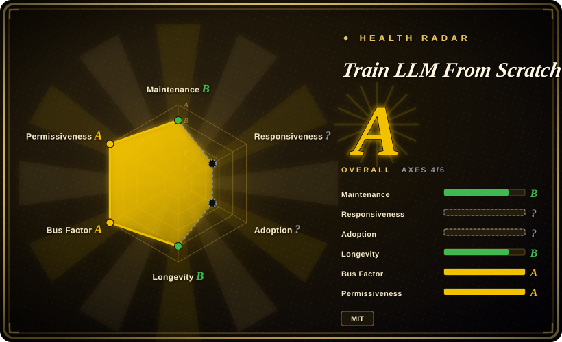
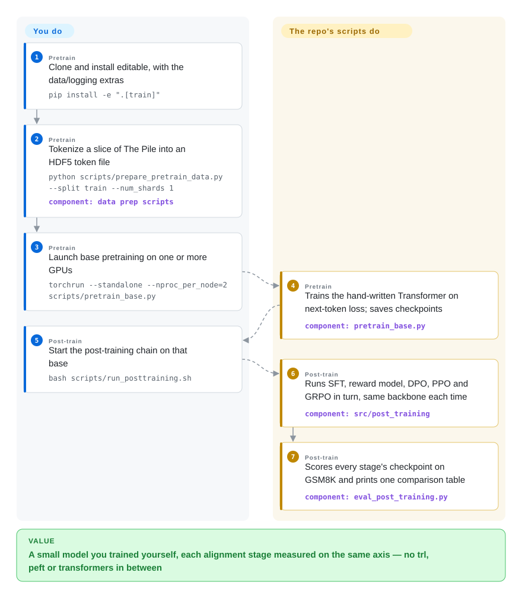

# Train LLM From Scratch

You've read that a chat model is "pretrained, then SFT'd, then RLHF'd", but you can't say what actually changes between those stages, because every trainer you could open hides the loss behind `Trainer.train()`. This repository runs all of them — pretraining, SFT, a reward model, DPO, PPO and GRPO — on one small hand-written PyTorch Transformer, and scores each stage's checkpoint on the same math test so you can watch the number move.

## When to use

You're an ML engineer or grad student who has fine-tuned models with Hugging Face, and you now want to *see* the alignment stages rather than configure them. Opening `trl` to find out what PPO's loss is lands you in a `PPOTrainer` wrapped around accelerate, peft adapters and `transformers` model classes; you close the tab still not knowing where the KL penalty is added. You want a repository where the PPO clipped loss is a ten-line function you can read next to the GRPO group-advantage function and the DPO loss, all operating on the same `Transformer` class you watched learn English from a loss of 11.14. Here you clone, run `pretrain_base.py` on a Pile shard, then `run_posttraining.sh`, and the last thing printed is one table of greedy GSM8K accuracy for Base → SFT → DPO → PPO → GRPO.

The deciding tradeoff against its closest substitutes is **breadth of the alignment half, in plain PyTorch, over a GPT-2-style English model**. [nanoGPT](nanogpt.md) stops at pretraining and is deprecated upstream; [MiniMind](minimind.md) also covers SFT and RL but is Chinese-first, uses `transformers` for the tokenizer and model base classes, and puts its effort into MoE and tool calling; Sebastian Raschka's LLMs-from-scratch (not indexed) is a book companion that goes much deeper on the pretraining chapters than on RL. This repository is the one where a reward model, PPO with GAE, DPO/ORPO/KTO and GRPO share a single backbone and a single evaluation axis, with no `trl`, `peft` or `transformers` import anywhere in the code.

## How it works

The model is deliberately plain: learned position embeddings, LayerNorm, a ReLU MLP, and attention written as a Python list of separate single-head modules whose outputs are concatenated — slower than a fused kernel, but you can read every matrix multiply. For post-training, the author follows "wrap, do not rewrite": the `Transformer` gains one method, `forward_hidden`, that returns the hidden states — the model's internal vector for each token — just before the final layer that turns them into next-word scores. The reward head, the PPO value head and all the log-probability arithmetic sit on top of that one method, so SFT, reward modelling, DPO, PPO and GRPO are each a different data file plus a different loss on the same network — like reusing one engine and swapping only the fuel and the steering rule. What you do is prepare four data streams (a Pile shard, instruction data, preference pairs, math prompts), launch the scripts, and read the per-stage JSON configs; what the repository does is the training loops, bf16 mixed precision, multi-GPU DDP (DistributedDataParallel — one model copy per GPU, gradients averaged), checkpointing and the GSM8K scoring that ties the stages together. There is also a Streamlit control panel that launches the same scripts from forms, and a MkDocs theory site; neither is required.

<!-- flow-steps:begin (generated from flows/train-llm-from-scratch.json by tools/flow_card.py — do not edit) -->

Text version of the flow

1. **You** (Pretrain): Clone and install editable, with the data/logging extras — `pip install -e ".[train]"`
2. **You** (Pretrain): Tokenize a slice of The Pile into an HDF5 token file — `python scripts/prepare_pretrain_data.py --split train --num_shards 1` — component: `data prep scripts`
3. **You** (Pretrain): Launch base pretraining on one or more GPUs — `torchrun --standalone --nproc_per_node=2 scripts/pretrain_base.py`
4. **Train LLM From Scratch** (Pretrain): Trains the hand-written Transformer on next-token loss; saves checkpoints — component: `pretrain_base.py`
5. **You** (Post-train): Start the post-training chain on that base — `bash scripts/run_posttraining.sh`
6. **Train LLM From Scratch** (Post-train): Runs SFT, reward model, DPO, PPO and GRPO in turn, same backbone each time — component: `src/post_training`
7. **Train LLM From Scratch** (Post-train): Scores every stage's checkpoint on GSM8K and prints one comparison table — component: `eval_post_training.py`

**Value**: A small model you trained yourself, each alignment stage measured on the same axis — no trl, peft or transformers in between

<!-- flow-steps:end -->

## When NOT to use

- **You need a model that is actually good at something.** The author's own expectation note in `POST_TRAINING.md` says a ~400M model pretrained from scratch on 2×H100 keeps a "modest" absolute GSM8K score; the README's published numbers are 0.574 preference accuracy for the reward model and for DPO (chance is 0.5), and it publishes no weights. Fine-tune an existing open checkpoint with [Unsloth](../unsloth.md) or [LlamaFactory](../llamafactory.md), because no amount of stage-by-stage clarity makes a Pile-shard base competitive with a pretrained 7B model.
- **You want to align a real checkpoint (Llama, Qwen, Mistral).** The post-training code is written against this repo's own `Transformer` class and `r50k_base` tokenizer; there is no loader for Hugging Face weights. Use [Hugging Face TRL](../trl.md) for SFT/DPO/GRPO on a `transformers` model, or [verl](../verl.md) for RL at scale, because they ship exactly the model plumbing this repo deliberately removed.
- **You want to run it as-is on your own machine.** The default JSON configs and `scripts/run_posttraining.sh` hard-code the author's cloud layout: checkpoints and data under `/ephemeral/…`, and the turnkey script calls `/ephemeral/venv/bin/python` and `/ephemeral/venv/bin/torchrun` directly. Expect to edit paths in `configs/*.json` and the shell script, or run the stage scripts one by one with `--config`/CLI overrides; the default legacy config also defines a ~3B-parameter model that OOMs a 40 GB A100 (issue #5, now mitigated by opt-in `--amp --grad-checkpointing --grad-accum`). If you want something that runs on a laptop first try, [nanoGPT](nanogpt.md)'s Shakespeare character model is the smaller on-ramp.
- **You have no CUDA GPU.** Only the `configs/smoke/` variants are meant to finish on a CPU; the real stages assume CUDA and bf16, and a CPU-friendly student mode is still an open request (issue #38) with an unmerged PR (#39) as of 2026-09-28. Use [nanoGPT](nanogpt.md), which documents CPU and Apple-Silicon (MPS) paths, if you have only a laptop.
- **You want efficient training code to build on.** Attention is a per-head Python loop with no fused/flash kernel, rollouts in PPO/GRPO run without a KV cache (the source says so: "kept for clarity"), and there is no FSDP or tensor parallelism — only DDP. For a small but efficient modern stack, start from nanochat (not indexed) or [torchtune](../torchtune.md), because this repository trades throughput for readability at every step.
- **You need a pinned, importable, tested dependency.** There are no releases or tags, the only CI workflow publishes the docs site (the CPU smoke tests exist under `tests/` but no workflow runs them), and a checkpoint-loading bug with `torch.compile` (`_orig_mod.` key prefix → 163 missing keys) is still open with an unmerged fix (issue #36 / PR #37). Vendor a pinned commit and treat it as reading material, or use [torchtune](../torchtune.md) for a versioned library.

## Comparison

| Alternative | In index | Our verdict | Tradeoff |
|---|---|---|---|
| [MiniMind](minimind.md) | ✅ | When you want the full pretrain→SFT→RL chain on Chinese data, with MoE, LoRA and tool-call stages and a documented ~2h single-3090 path, pick MiniMind; pick this repository when you want an English GPT-2-style model where the reward model, PPO with a value head and GRPO are compared on one GSM8K table without any `transformers` dependency. | MiniMind covers more stage types and is maintained almost daily; this repo covers fewer stages but keeps the model code dependency-free and puts every alignment objective on the same evaluation axis. |
| [nanoGPT](nanogpt.md) | ✅ | When you only want to understand pretraining and value the canonical, most-studied minimal GPT with CPU/MPS paths and GPT-2 weight loading, pick nanoGPT; pick this repository once you need what comes after pretraining, because nanoGPT has no SFT, reward model, DPO or RL at all and is deprecated upstream. | nanoGPT is smaller, better known and runs on a laptop; this repo is larger and GPU-only but continues through the alignment stages nanoGPT never reached. |
| nanochat | not indexed | When you want a maintained, compute-efficient "train a small ChatGPT" harness from the author of nanoGPT — its README targets GPT-2-level capability in about 2 hours on one 8×H100 node for roughly $48 — pick nanochat; pick this repository when you want the classic RLHF menu (reward model + PPO, DPO/ORPO/KTO, GRPO) spelled out as separate readable losses rather than one tuned speedrun. Not added in this tab-intake batch. | nanochat optimises for a strong result per dollar with its own BPE tokenizer and auto-derived hyperparameters; this repo optimises for side-by-side legibility of many alignment objectives, at the cost of speed and model quality. |
| LLMs-from-scratch (rasbt) | not indexed | When you want a book-length, chapter-by-chapter derivation of a GPT with notebooks, loading pretrained GPT-2 weights and classification/instruction fine-tuning, pick LLMs-from-scratch; pick this repository when you specifically want PPO, GRPO and a reward model implemented and run end to end. Not added in this tab-intake batch. | LLMs-from-scratch is deeper pedagogy backed by a published book and a far larger audience; this repo is a single README-length walkthrough whose distinguishing content is the RL half. |
| [Hugging Face TRL](../trl.md) | ✅ | When you need to actually run SFT/DPO/GRPO on a real Hugging Face model, pick TRL; use this repository to understand what TRL's trainers compute before you trust them, because TRL hides the losses behind trainer classes that this repo writes out by hand. | TRL is a maintained production library with broad model support; this repo is a from-scratch reproduction you read, not a library you depend on. |

## Tech stack

- Python ≥3.9 (per `pyproject.toml`), PyTorch only for the model and training math; `torchrun` + DDP for multi-GPU, bf16 autocast, gradient accumulation, cosine LR with warmup; optional `torch.compile` via config.
- Model (`src/models/`, 442 lines): decoder-only Transformer with learned token + position embeddings, pre-block LayerNorm, ReLU MLP (4× width), multi-head attention as a `ModuleList` of single `Head` modules plus an output projection, `1/sqrt(head_size)` scaling.
- Tokenizer: OpenAI `tiktoken` `r50k_base` (GPT-2/GPT-3 vocab, 50 257 tokens padded to 50 304); no tokenizer training.
- Post-training (`src/post_training/`, ~1.8k lines): SFT with assistant-token loss mask, Bradley-Terry reward model with a linear head, DPO/ORPO/KTO, PPO with value head + GAE + KL penalty, GRPO with group-normalised advantages and a k3 KL estimator; rule-based GSM8K answer verifier parsing `<answer>` tags.
- Data: HDF5 (`h5py`) flat token arrays for pretraining, packed HDF5 for SFT, JSONL for preference pairs and RL prompts; `zstandard` to read Pile shards; Hugging Face `datasets` only for downloading Alpaca, Dolly, GSM8K, HH-RLHF and UltraFeedback.
- UI and docs: Streamlit (+ pandas, altair) control panel with one page per stage; MkDocs Material site with Mermaid-sourced diagrams, deployed by a GitHub Actions workflow.

## Dependencies

- A CUDA GPU for any real run. The README table puts the 13M legacy model on a free T4 and larger models on 16–40 GB cards; the post-training requirements file targets H100 + CUDA 12.x, and the published pretraining run used 2× L40.
- Runtime Python packages: `torch`, `numpy`, `h5py`, `tqdm`, `tiktoken`, `zstandard`, `requests`; extras `[train]` add `datasets` and `wandb` (optional — every script also writes JSONL logs), `[ui]` adds Streamlit/pandas/altair, `[docs]` adds MkDocs. `requirements.txt` pins the cu118 PyTorch index for the legacy path; `requirements-post.txt` uses cu121.
- Network access to Hugging Face for The Pile (`monology/pile-uncopyrighted`) and the instruction/preference/math datasets; disk for HDF5 token files and checkpoints (a single Pile shard plus the validation file is the documented minimum).
- No database, no server, no external API; weights & biases only if you enable it.

## Ops difficulty

**Medium for a teaching repo.** Nothing runs as a service, but you are operating GPU training jobs: preparing four datasets, editing the `/ephemeral/…` paths baked into `configs/*.json` and `scripts/run_posttraining.sh`, choosing single-GPU `python` vs `torchrun`, and babysitting multi-hour pretraining before any post-training stage makes sense. Checkpoint save/resume exists (`--checkpoint-every`, `--resume latest` on the legacy trainer; periodic saves on the newer scripts), and every stage has a `configs/smoke/` variant that finishes in seconds — run `python tests/test_post_training_smoke.py` first to check your install before paying for GPU time.

## Health & viability

- **Maintenance (2026-09-28):** episodic, not continuous. After the January–March 2025 launch it saw only scattered commits (May and August 2025) and then about nine idle months until May 2026; then the author added the whole post-training suite, JSON configs, Streamlit UI and docs site in June 2026 and merged a DDP multi-GPU fix and a README rewrite on 2026-06-24; the last default-branch commit is a README star-chart fix on 2026-08-17. Open PRs from outsiders (#37 checkpoint fix, #39 CPU mode, #41 preference truncation) had no maintainer response as of this check.
- **Governance / bus factor:** a single individual's personal project (`owner.type = User`). The author (as `FareedKhan-dev` and `fareed-khan`) has 42 of the 71 contributor-attributed commits; the next contributor has 19, from early 2025. The health scorer's governance axis grades A because ten accounts committed in the last 12 months, but those are one-off outside PRs merged by the author, not co-maintainers. Direction, merges and releases depend on one person, whose README headline is a job search — plan for the repo to go quiet again.
- **Age & Lindy (2026-09-28):** created 2025-01-12, ~20 months old, with a ~10-month idle gap inside that. That is a young project in an intermittent cycle, not a long-lived active one; the Lindy prior gives it little credit.
- **Adoption:** 11.5k stars and 1.6k forks for a teaching repo, largely from trending exposure; a third-party bot (issue #24, 2026-06-11) flagged a small star/fork campaign (6 likely-fake of 294 engagers in 24 h) but itself classified the repo `clean`, and the author closed it as a false positive. Adoption is readers, not dependents: it is not on PyPI and nothing imports it.
- **Risk flags:** MIT, no relicense, no CLA. The real risks are correctness and reproducibility rather than licensing: no releases, no CI on the code, an open checkpoint-loading bug, and a 2025 history where an attention-scaling fix was accidentally reverted and later re-applied (PR #3 / #4). The dataset licences (The Pile uncopyrighted subset, HH-RLHF, UltraFeedback, Alpaca, Dolly) are the user's to check before sharing any weights.

## Caveats (unverified)

- [未验证] The README's GPU table (e.g. "~6B to 8B" max trainable on an A100 40 GB, 2B on an RTX 4090) is the author's estimate; I did not reproduce any of it, and the 3B default legacy config OOMing a 40 GB A100 in issue #5 shows the "without memory flags" numbers are optimistic.
- [未验证] The published training figures — 77M base from loss 11.14 to ~3.73/3.76 in 2000 steps at 130–150k tokens/s on 2× L40, reward-model and DPO accuracy 0.574 on 7 974 pairs — are the author's reported runs; no logs or weights are published to check them, and reproducing needs GPU time.
- [未验证] No per-stage GSM8K accuracy numbers are published in the README or `POST_TRAINING.md` (only the expectation that absolute scores stay "modest"), so whether PPO/GRPO actually improve over SFT at this scale is not demonstrated in the repo.
- [推断] "~400M" for the post-training base comes from `POST_TRAINING.md`; `configs/base.json` (1024 dim, 24 blocks, 1024 context, 50 304 vocab) is consistent with roughly that size, but I did not instantiate the model to count parameters.
- [推断] Line counts (442 for `src/models/`, ~1.8k for `src/post_training/`) are my own `wc -l` at commit `b995104`, including comments and docstrings.
- [未验证] Star/fork/contributor figures (11.5k / 1.6k / 12 contributor logins) were read from the GitHub API on 2026-09-28 and are volatile; the fake-engagement assessment in issue #24 is a third-party bot's probabilistic output that I could not audit.
- [推断] Classified as `app` (a runnable script collection plus a Streamlit UI) under study-and-experiments, although the README frames it as a tutorial; its intended use is learning, not a production pipeline.
