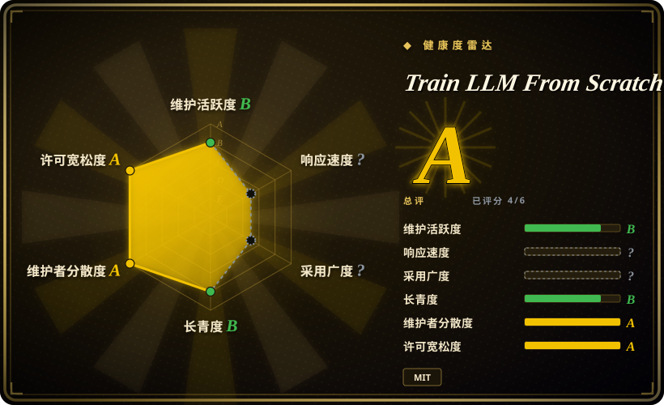
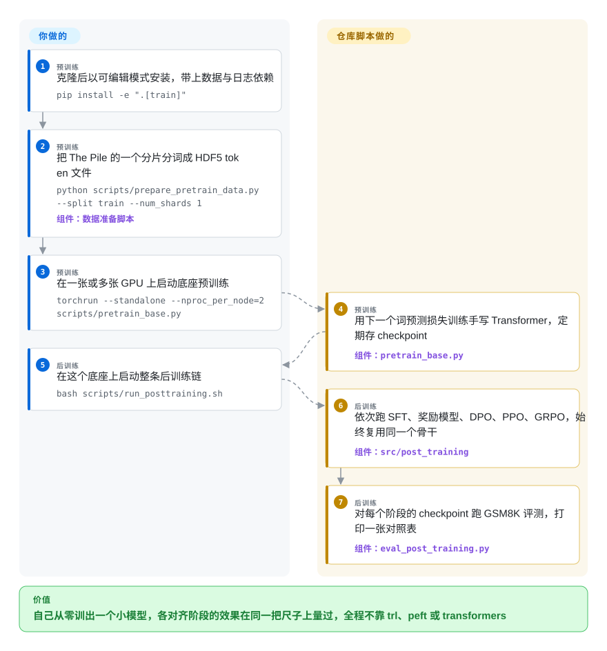

# Train LLM From Scratch

你知道聊天模型要经过“预训练、SFT、再 RLHF”，却说不出每一步到底改了什么——因为你能打开的训练框架都把损失函数藏在一句 `Trainer.train()` 后面。这个仓库在同一个手写的小型 PyTorch Transformer 上把预训练、SFT、奖励模型、DPO、PPO、GRPO 全跑一遍，并用同一套小学数学题给每个阶段的模型打分，让你亲眼看分数怎么变。

## 何时使用

你是用过 Hugging Face 微调模型的算法工程师或研究生，现在想“看见”对齐的各个阶段，而不是只会填配置。你打开 `trl` 想弄清 PPO 的损失长什么样，结果面对的是一个包着 accelerate、peft 适配器和 `transformers` 模型类的 `PPOTrainer`，关掉标签页时仍不知道 KL 惩罚是在哪一行加上去的。你想要的是这样一个仓库：PPO 的截断损失是一个十来行的函数，旁边就是 GRPO 的组内优势函数和 DPO 损失，它们作用在同一个 `Transformer` 类上——就是你刚看着它从损失 11.14 开始学会英语的那一个。在这里你克隆仓库，先用一个 Pile 分片跑 `pretrain_base.py`，再跑 `run_posttraining.sh`，最后打印出来的是一张表：Base → SFT → DPO → PPO → GRPO 各阶段的贪心解码 GSM8K 准确率。

和最接近的替代品相比，决定性的取舍是：**对齐这一半覆盖得最全，全用纯 PyTorch 写，模型是 GPT-2 式的英文模型**。[nanoGPT](nanogpt.zh.md) 只到预训练，而且上游已宣布废弃；[MiniMind](minimind.zh.md) 也覆盖 SFT 和 RL，但以中文为主，分词器和模型基类用了 `transformers`，重心放在 MoE 和工具调用上；Sebastian Raschka 的 LLMs-from-scratch（未收录）是一本书的配套代码，预训练章节讲得比 RL 深得多。本仓库的特点是奖励模型、带 GAE 的 PPO、DPO/ORPO/KTO 和 GRPO 共用一个骨干、共用一把评测尺子，而且整个代码里没有一处 import `trl`、`peft` 或 `transformers`。

## 怎么用起来

模型刻意写得朴素：可学习的位置嵌入、LayerNorm、ReLU 激活的前馈层，注意力则写成一串各自独立的单头模块，最后把输出拼接起来——比融合好的高效算子慢，但每一次矩阵乘法你都读得到。后训练部分，作者遵循“包一层，不重写”：`Transformer` 只多了一个方法 `forward_hidden`，返回最后一层之前的隐藏状态（模型给每个词算出的内部向量，最后一层会把它变成“下一个词是谁”的打分）。奖励头、PPO 的价值头和所有对数概率的计算都叠在这一个方法之上，所以 SFT、奖励建模、DPO、PPO、GRPO 各自只是“换一份数据文件，再换一个损失函数”，网络始终是同一个——好比同一台发动机，只换燃料和方向盘的规则。你要做的是准备四路数据（一个 Pile 分片、指令数据、偏好对、数学题），启动脚本，看每个阶段的 JSON 配置；仓库替你做的是训练循环、bf16 混合精度、多卡 DDP（DistributedDataParallel：每张卡放一份模型副本，梯度求平均）、checkpoint 保存，以及把各阶段串起来的 GSM8K 打分。另有一个 Streamlit 控制面板，用表单启动同样的脚本，还有一个 MkDocs 理论文档站；两者都不是必需的。

<!-- flow-steps:begin (generated from flows/train-llm-from-scratch.json by tools/flow_card.py — do not edit) -->

流程文字版

1. **你**（预训练）：克隆后以可编辑模式安装，带上数据与日志依赖 — `pip install -e ".[train]"`
2. **你**（预训练）：把 The Pile 的一个分片分词成 HDF5 token 文件 — `python scripts/prepare_pretrain_data.py --split train --num_shards 1` — 组件：`数据准备脚本`
3. **你**（预训练）：在一张或多张 GPU 上启动底座预训练 — `torchrun --standalone --nproc_per_node=2 scripts/pretrain_base.py`
4. **Train LLM From Scratch**（预训练）：用下一个词预测损失训练手写 Transformer，定期存 checkpoint — 组件：`pretrain_base.py`
5. **你**（后训练）：在这个底座上启动整条后训练链 — `bash scripts/run_posttraining.sh`
6. **Train LLM From Scratch**（后训练）：依次跑 SFT、奖励模型、DPO、PPO、GRPO，始终复用同一个骨干 — 组件：`src/post_training`
7. **Train LLM From Scratch**（后训练）：对每个阶段的 checkpoint 跑 GSM8K 评测，打印一张对照表 — 组件：`eval_post_training.py`

**价值**：自己从零训出一个小模型，各对齐阶段的效果在同一把尺子上量过，全程不靠 trl、peft 或 transformers

<!-- flow-steps:end -->

## 何时不用

- **你需要一个真正能干活的模型。** 作者自己在 `POST_TRAINING.md` 里写明：在 2×H100 上从零预训练的约 400M 模型，GSM8K 绝对分数依然“有限”；README 公布的数字只有奖励模型和 DPO 的偏好准确率 0.574（随机猜是 0.5），也不发布权重。想要可用模型，就用 [Unsloth](../unsloth.zh.md) 或 [LlamaFactory](../llamafactory.zh.md) 去微调现成的开源 checkpoint，因为分阶段看得再清楚，只吃了一个 Pile 分片的底座也比不过预训练好的 7B 模型。
- **你要对齐一个真实的 checkpoint（Llama、Qwen、Mistral）。** 后训练代码是对着本仓库自己的 `Transformer` 类和 `r50k_base` 分词器写的，没有加载 Hugging Face 权重的入口。要在 `transformers` 模型上做 SFT/DPO/GRPO，用 [Hugging Face TRL](../trl.zh.md)；要大规模做 RL，用 [verl](../verl.zh.md)，因为它们提供的正是这个仓库刻意拿掉的那层模型管线。
- **你想在自己机器上原样跑起来。** 默认 JSON 配置和 `scripts/run_posttraining.sh` 写死了作者云主机的目录：数据和 checkpoint 放在 `/ephemeral/…` 下，一键脚本直接调用 `/ephemeral/venv/bin/python` 和 `/ephemeral/venv/bin/torchrun`。你得改 `configs/*.json` 和这个 shell 脚本里的路径，或者用 `--config`/命令行覆盖逐个跑阶段脚本；旧版预训练的默认配置还定义了一个约 3B 参数的模型，在 40 GB 的 A100 上会爆显存（issue #5，现在可以用 `--amp --grad-checkpointing --grad-accum` 开关缓解）。如果你想第一次就在笔记本上跑通，[nanoGPT](nanogpt.zh.md) 的莎士比亚字符级模型门槛更低。
- **你没有 CUDA 显卡。** 只有 `configs/smoke/` 这组冒烟配置是打算在 CPU 上跑完的；真正的各阶段默认 CUDA 加 bf16。截至 2026-09-28，面向学生的 CPU 模式仍是一个未关闭的需求（issue #38），对应 PR（#39）也没合并。手头只有笔记本，就用文档里写明支持 CPU 和 Apple Silicon（MPS）的 [nanoGPT](nanogpt.zh.md)。
- **你想拿它当高效训练代码的底子。** 注意力是按头循环的 Python 代码，没有融合或 flash 算子；PPO/GRPO 的采样不用 KV 缓存（源码注释原话是“为了清晰”）；并行只有 DDP，没有 FSDP 或张量并行。想要又小又高效的现代训练栈，从 nanochat（未收录）或 [torchtune](../torchtune.zh.md) 起步，因为这个仓库每一步都拿吞吐换了可读性。
- **你需要一个锁定版本、可 import、有测试保障的依赖。** 没有任何 release 或 tag；唯一的 CI 工作流只负责发布文档站（`tests/` 下有 CPU 冒烟测试，但没有工作流去跑它们）；开启 `torch.compile` 后加载 checkpoint 的 bug（键名多出 `_orig_mod.` 前缀，导致 163 个键缺失）仍未关闭，修复 PR 也没合并（issue #36 / PR #37）。把某个 commit 拷进自己仓库、当阅读材料用；要版本化的库，用 [torchtune](../torchtune.zh.md)。

## 横向对比

| 替代品 | 是否收录 | 我们的评价 | 取舍 |
|---|---|---|---|
| [MiniMind](minimind.zh.md) | ✅ | 如果你要在中文数据上走完预训练→SFT→RL 全链路，还想要 MoE、LoRA、工具调用这些阶段和一条写明约 2 小时单卡 3090 的路径，选 MiniMind；如果你要的是英文 GPT-2 式模型，并且想让奖励模型、带价值头的 PPO 和 GRPO 在一张 GSM8K 表上对比、全程不依赖 `transformers`，选本仓库。 | MiniMind 覆盖的阶段类型更多、几乎每天有人维护；本仓库阶段少一些，但模型代码零外部依赖，而且所有对齐目标都落在同一把评测尺子上。 |
| [nanoGPT](nanogpt.zh.md) | ✅ | 如果你只想搞懂预训练，并且看重最经典、被研究最多的极简 GPT（支持 CPU/MPS、能加载 GPT-2 权重），选 nanoGPT；一旦你需要预训练之后的东西，就选本仓库，因为 nanoGPT 完全没有 SFT、奖励模型、DPO 和 RL，而且上游已宣布废弃。 | nanoGPT 更小、更有名、笔记本就能跑；本仓库更大、只能上 GPU，但一直走到了 nanoGPT 没碰过的对齐阶段。 |
| nanochat | 未收录 | 如果你要 nanoGPT 作者出品、仍在维护、讲究算力效率的“训一个小 ChatGPT”框架（README 目标是在一台 8×H100 上约 2 小时、约 48 美元达到 GPT-2 水平），选 nanochat；如果你想把经典 RLHF 菜单（奖励模型 + PPO、DPO/ORPO/KTO、GRPO）拆成一个个可读的损失函数，而不是一条调优好的速通流程，选本仓库。本批次录入未收录它。 | nanochat 追求每一美元换到更强的结果，自带 BPE 分词器、超参自动推导；本仓库追求多种对齐目标并排可读，代价是速度和模型质量。 |
| LLMs-from-scratch（rasbt） | 未收录 | 如果你要一本书那样逐章推导 GPT、配 notebook、能加载预训练 GPT-2 权重、做分类和指令微调的教程，选 LLMs-from-scratch；如果你明确想看 PPO、GRPO 和奖励模型被实现出来并端到端跑通，选本仓库。本批次录入未收录它。 | LLMs-from-scratch 教学更深，有正式出版的书撑着，读者群大得多；本仓库是一份 README 篇幅的讲解，真正与众不同的是 RL 那一半。 |
| [Hugging Face TRL](../trl.zh.md) | ✅ | 如果你要在真实的 Hugging Face 模型上跑 SFT/DPO/GRPO，选 TRL；在信任 TRL 的训练器之前，用本仓库弄懂它们在算什么，因为 TRL 把损失藏在训练器类里，而本仓库把它们一个个手写出来。 | TRL 是维护中的生产级库，支持的模型广；本仓库是从零复现的读物，不是可以依赖的库。 |

## 技术栈

- Python ≥3.9（见 `pyproject.toml`），模型和训练数学只用 PyTorch；多卡用 `torchrun` + DDP，另有 bf16 autocast、梯度累积、带预热的余弦学习率，配置里可选开启 `torch.compile`。
- 模型（`src/models/`，442 行）：仅解码器的 Transformer，可学习的词嵌入加位置嵌入，块内先做 LayerNorm（pre-norm），4 倍宽度的 ReLU 前馈层，多头注意力是若干单头 `Head` 模块组成的 `ModuleList` 再加一个输出投影，缩放系数为 `1/sqrt(head_size)`。
- 分词器：OpenAI `tiktoken` 的 `r50k_base`（GPT-2/GPT-3 词表，50 257 个 token，补齐到 50 304），不训练自己的分词器。
- 后训练（`src/post_training/`，约 1.8k 行）：只在助手回答部分计损失的 SFT，线性头的 Bradley-Terry 奖励模型，DPO/ORPO/KTO，带价值头、GAE 和 KL 惩罚的 PPO，组内归一化优势加 k3 KL 估计的 GRPO；GSM8K 答案校验是基于规则、解析 `<answer>` 标签的。
- 数据：预训练用 HDF5（`h5py`）存扁平 token 数组，SFT 用打包好的 HDF5，偏好对和 RL 题目用 JSONL；用 `zstandard` 读 Pile 分片；Hugging Face `datasets` 只用来下载 Alpaca、Dolly、GSM8K、HH-RLHF 和 UltraFeedback。
- 界面与文档：Streamlit（加 pandas、altair）控制面板，每个阶段一页；MkDocs Material 文档站，图用 Mermaid 源生成，由 GitHub Actions 工作流部署。

## 依赖

- 任何真正的训练都要一张 CUDA 显卡。README 的表格说 13M 旧版模型用免费 T4 就够，更大的模型要 16–40 GB 显存；后训练的依赖文件以 H100 + CUDA 12.x 为目标，公开的那次预训练用的是 2× L40。
- Python 运行时包：`torch`、`numpy`、`h5py`、`tqdm`、`tiktoken`、`zstandard`、`requests`；可选组 `[train]` 加 `datasets` 和 `wandb`（可选，每个脚本都会另写 JSONL 日志），`[ui]` 加 Streamlit/pandas/altair，`[docs]` 加 MkDocs。`requirements.txt` 为旧版路径指定 cu118 的 PyTorch 源，`requirements-post.txt` 用 cu121。
- 需要能访问 Hugging Face 下载 The Pile（`monology/pile-uncopyrighted`）和指令、偏好、数学数据集；磁盘要装得下 HDF5 token 文件和 checkpoint（文档给出的最小量是一个 Pile 训练分片加验证文件）。
- 不需要数据库、服务或外部 API；只有在你开启时才用到 Weights & Biases。

## 运维难度

**对教学仓库来说属于中等。** 没有要常驻的服务，但你实际上在运维 GPU 训练任务：准备四路数据，改掉写死在 `configs/*.json` 和 `scripts/run_posttraining.sh` 里的 `/ephemeral/…` 路径，决定单卡用 `python` 还是多卡用 `torchrun`，还得先守着几个小时的预训练跑完，后训练阶段才有意义。支持 checkpoint 保存与续训（旧版训练脚本有 `--checkpoint-every`、`--resume latest`，新脚本定期存盘），每个阶段都有几秒就能跑完的 `configs/smoke/` 变体——付 GPU 钱之前，先跑 `python tests/test_post_training_smoke.py` 检查安装是否正常。

## 健康度与可持续性

- **维护（2026-09-28）：** 断续式维护，而不是持续维护。2025 年 1–3 月上线后，只在 2025 年 5 月和 8 月有零星提交，随后停了约 9 个月，直到 2026 年 5 月；2026 年 6 月作者一次性加入整套后训练代码、JSON 配置、Streamlit 界面和文档站，6 月 24 日合并了多卡 DDP 修复和 README 重写；默认分支最后一次提交是 2026-08-17 修复 README 星标曲线。截至本次核查，外部贡献者的 PR（#37 checkpoint 修复、#39 CPU 模式、#41 偏好数据截断）都没有得到维护者回应。
- **治理与巴士因子：** 个人项目（`owner.type = User`）。作者（账号 `FareedKhan-dev` 和 `fareed-khan`）贡献了 71 次署名提交中的 42 次；第二名贡献者有 19 次，都在 2025 年初。健康度评分的治理轴给了 A，是因为近 12 个月有 10 个账号提交过代码，但它们都是作者合并的一次性外部 PR，不是共同维护者。方向、合并和发布都系于一人，而且 README 顶部写着作者在找博士职位——要预期仓库会再次沉寂。
- **年龄与 Lindy（2026-09-28）：** 创建于 2025-01-12，约 20 个月，中间还有约 10 个月的空窗。这是一个断续活跃的年轻项目，不是长期持续活跃的项目，Lindy 先验给它的加分很少。
- **采用情况：** 一个教学仓库有 1.15 万星、1.6 千 fork，主要来自 trending 曝光；一个第三方机器人（issue #24，2026-06-11）标记了一小波可疑刷星刷 fork（24 小时内 294 个互动账号中 6 个“疑似虚假”），但它自己把仓库判为 `clean`，作者也以误报关闭。采用者是读者而不是下游依赖：它不在 PyPI 上，也没有项目 import 它。
- **风险信号：** MIT 许可，没有改许可证的历史，也没有 CLA。真正的风险在正确性和可复现性，而不在许可：没有 release、代码没有 CI、有一个未修复的 checkpoint 加载 bug，而且 2025 年有过注意力缩放修复被误回滚、后来才重新打上的经历（PR #3 / #4）。数据集的许可（The Pile 去版权子集、HH-RLHF、UltraFeedback、Alpaca、Dolly）要你自己在分享权重之前核对。

## 存疑（未验证）

- [未验证] README 的显卡表（例如 A100 40 GB 最多能训“约 6B 到 8B”、RTX 4090 能训 2B）是作者的估算，我没有复现；issue #5 里默认的 3B 旧版配置在 40 GB A100 上爆显存，说明“不开省显存开关”时这些数字偏乐观。
- [未验证] 公开的训练数字——77M 底座 2000 步内损失从 11.14 降到约 3.73/3.76、2× L40 上每秒 13–15 万 token、奖励模型和 DPO 在 7 974 对偏好数据上准确率 0.574——都是作者自报的运行结果；没有公开日志或权重可供核对，复现需要 GPU 时间。
- [未验证] README 和 `POST_TRAINING.md` 都没有公布各阶段的 GSM8K 准确率（只写了绝对分数会“有限”的预期），所以在这个规模下 PPO/GRPO 是否真的比 SFT 更好，仓库本身并没有给出证据。
- [推断] 后训练底座“约 400M”出自 `POST_TRAINING.md`；`configs/base.json`（1024 维、24 层、1024 上下文、50 304 词表）与这个量级相符，但我没有实例化模型去数参数。
- [推断] 行数（`src/models/` 442 行，`src/post_training/` 约 1.8k 行）是我在 commit `b995104` 上自己用 `wc -l` 数的，包含注释和文档字符串。
- [未验证] 星标、fork、贡献者数（1.15 万 / 1.6 千 / 12 个贡献者账号）是 2026-09-28 从 GitHub API 读到的，会变化；issue #24 的刷星判断是第三方机器人的概率输出，我无法审计。
- [推断] 归为 `app`（可运行的脚本集合加一个 Streamlit 界面），放在 study-and-experiments 下，尽管 README 把它定位为教程；它的用途是学习，不是生产流水线。
