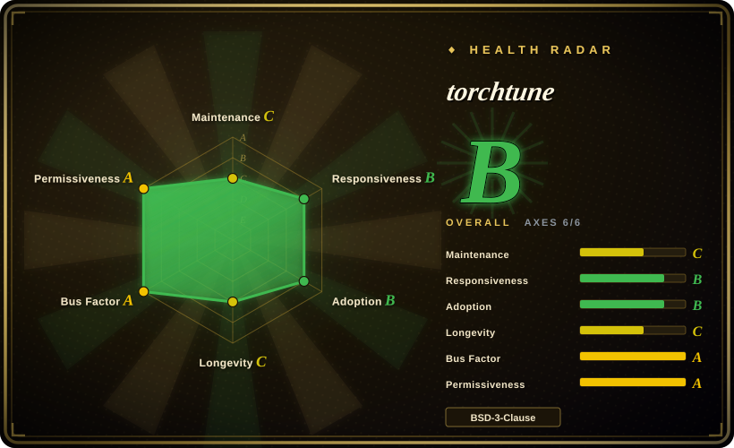
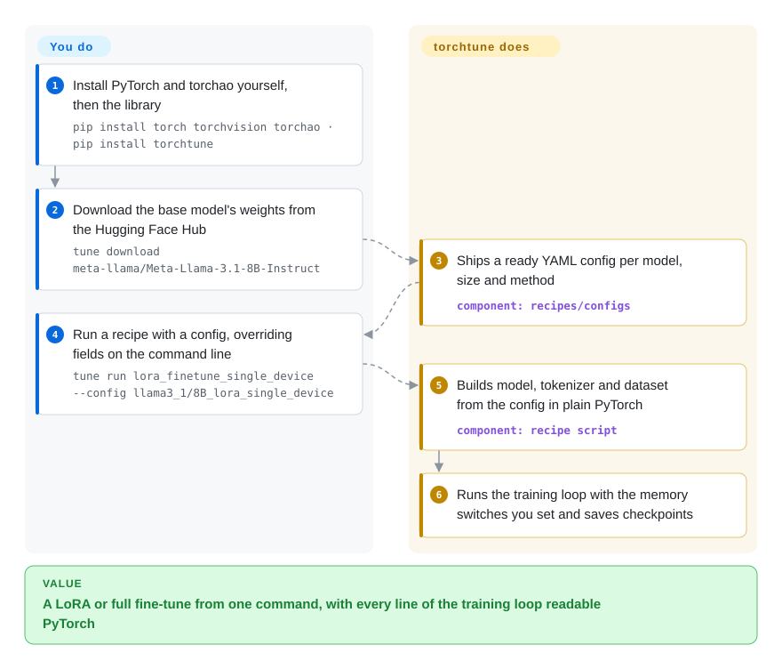

# torchtune

When a LoRA run in a big trainer framework runs out of GPU memory or the loss looks wrong, the training loop you need to read is buried under several layers of wrappers. torchtune ships each method as one plain-PyTorch recipe file plus a YAML config you copy and edit — but Meta stopped feature development in July 2025, so today it is a frozen codebase, not a platform to start on.

## When to use

You're an ML engineer who already has a torchtune pipeline in production or in a paper's reproduction repo: a `tune run lora_finetune_single_device --config llama3_1/8B_lora_single_device` job with a hand-edited YAML, maybe a custom dataset builder. It still trains, the checkpoints still feed your eval harness, and migrating means re-validating loss curves on another framework. You keep torchtune pinned (v0.6.1, the last release) with its matching PyTorch/torchao versions, and you treat it as maintenance-only infrastructure while you plan the move.

The other case is reading, not adopting. You want to see how full fine-tuning, LoRA/QLoRA, DPO, knowledge distillation or quantization-aware training look when written as a single PyTorch training loop with no `Trainer` subclass in between — every memory trick (activation checkpointing, activation offloading, fused optimizer step, chunked cross-entropy) is a visible line you can lift into your own code. Over [Hugging Face TRL](trl.md) or [Axolotl](axolotl.md) its draw was exactly that minimal abstraction; the price now is that nobody is adding new models or fixing compatibility with new PyTorch releases at feature pace.

## How it works

torchtune is a library of *recipes* — one Python script per training method (for example `lora_finetune_single_device` or `full_finetune_distributed`) — plus a set of ready YAML configs per model and size. The `tune` command-line tool downloads weights from the Hugging Face Hub, copies a config next to you, and launches a recipe; for multi-GPU runs it passes through to `torchrun`, PyTorch's launcher that starts one process per GPU. What torchtune does for you: the model definitions (Llama, Qwen, Gemma, Mistral, Phi in plain PyTorch modules), tokenizers, dataset builders, the training loop and the memory/speed switches that you flip in config. What stays yours: getting access to gated weights (an `HF_TOKEN`), choosing the recipe and config, pointing the config at your data, and — now that development has stopped — pinning a PyTorch/torchao combination that still imports. Think of it as a cookbook where each recipe is printed in full rather than referring to a hidden master sauce.

<!-- flow-steps:begin (generated from flows/torchtune.json by tools/flow_card.py — do not edit) -->

Text version of the flow

1. **You**: Install PyTorch and torchao yourself, then the library — `pip install torch torchvision torchao · pip install torchtune`
2. **You**: Download the base model's weights from the Hugging Face Hub — `tune download meta-llama/Meta-Llama-3.1-8B-Instruct`
3. **torchtune**: Ships a ready YAML config per model, size and method — component: `recipes/configs`
4. **You**: Run a recipe with a config, overriding fields on the command line — `tune run lora_finetune_single_device --config llama3_1/8B_lora_single_device`
5. **torchtune**: Builds model, tokenizer and dataset from the config in plain PyTorch — component: `recipe script`
6. **torchtune**: Runs the training loop with the memory switches you set and saves checkpoints

**Value**: A LoRA or full fine-tune from one command, with every line of the training loop readable PyTorch

<!-- flow-steps:end -->

## When NOT to use

- **⚠️ You are starting a new project (abandonment flag, verified 2026-10-08).** The README opens with "Torchtune is no longer actively maintained", and the maintainers' notice (issue #2883, 2025-07-15) stopped feature development, promising only critical bug and security fixes "during 2025". The last release is v0.6.1 (2025-04-07); main has only seen import-compatibility patches since (last commit 2026-04-23). For a new SFT/DPO/GRPO pipeline use [Hugging Face TRL](trl.md); for YAML-driven fine-tuning use [Axolotl](axolotl.md) or [LlamaFactory](llamafactory.md).
- **You want to stay PyTorch-native and follow Meta's roadmap.** The announced successor, torchforge, has itself paused and points to torchtitan, where PyTorch is consolidating LLM training (SFT and the TitanRL stack). Evaluate torchtitan (not indexed) rather than building on either.
- **You need the newest models or the newest PyTorch.** Model support ends around Llama 4 and Qwen3 (2025); the README says it is only tested with the PyTorch release current at the time (2.6.0). Recent commits exist only to fix `ImportError`s after torchao moved symbols, so expect the next PyTorch/torchao upgrade to break it. Use TRL or [Unsloth](unsloth.md), which are still adding new architectures.
- **You need large-scale RL with a fast rollout engine.** Its GRPO recipe is full-weight and distributed only, PPO is single-device only, and neither has a LoRA variant (per the README's method table). For RL post-training at scale use [verl](verl.md); for single-GPU GRPO use Unsloth or TRL.
- **You need memory-efficient fine-tuning on one consumer GPU and nothing else.** It works (QLoRA on a 4090 is in its own benchmark table), but Unsloth's custom kernels are built for exactly that and are still maintained.

## Comparison

| Alternative | In index | Our verdict | Tradeoff |
|---|---|---|---|
| torchtitan (pytorch/torchtitan) | not indexed | For a new PyTorch-native training stack, pick torchtitan, where PyTorch now consolidates LLM training; keep torchtune only for an existing pipeline you cannot migrate yet. | torchtitan is actively developed and scales to large clusters, but it is pre-training-first and its post-training (SFT, TitanRL) is young; torchtune's recipes are more complete but frozen. |
| [Hugging Face TRL](trl.md) | ✅ | For new SFT/DPO/GRPO work on transformers models, pick TRL; torchtune only wins if you need to read a whole training loop with no `Trainer` underneath. | TRL ships biweekly and supports new models and vLLM generation; you accept the transformers `Trainer` abstraction instead of a flat recipe file. |
| [Axolotl](axolotl.md) | ✅ | If what you liked was "edit a YAML, run one command", pick Axolotl, which keeps that model and is still maintained. | Similar config-first workflow and broader method coverage; built on the HF stack rather than hand-written PyTorch modules. |
| [Unsloth](unsloth.md) | ✅ | For single-GPU LoRA/QLoRA where VRAM is the constraint, pick Unsloth; torchtune's single-device recipes no longer receive optimizations. | Custom kernels and fast model support; part of the stack is vendor-driven with a commercial tier. |
| [LlamaFactory](llamafactory.md) | ✅ | When a team wants a web UI or zero-code fine-tuning across many model families, pick LlamaFactory over a frozen CLI recipe library. | Much wider model and method matrix with a GUI; less transparent internals than torchtune's single-file recipes. |

## Tech stack

- **Language:** Python; models, losses and training loops are plain PyTorch (`torch.nn` modules, FSDP2 for sharding across GPUs).
- **Recipes and configs:** one script per method under `recipes/`, YAML configs per model under `recipes/configs/`, loaded with OmegaConf and overridable from the command line (`key=value`).
- **CLI:** `tune` with subcommands `ls`, `cp`, `download`, `run`, `validate`; distributed launches wrap `torchrun`.
- **Methods:** full fine-tuning, LoRA/QLoRA, knowledge distillation, DPO, PPO, GRPO, quantization-aware training (via torchao).
- **Integrations:** Hugging Face Hub and Kaggle Hub for weights, Hugging Face Datasets, EleutherAI LM Eval Harness, Weights & Biases / Comet logging, ExecuTorch for on-device export, bitsandbytes optimizers.

## Dependencies

- **You install PyTorch yourself:** `torch`, `torchvision`, `torchao` are not pulled in by `pip install torchtune`; the README pairs the last release with the PyTorch of its time (2.6.0).
- **Python packages** (`pyproject.toml`): `torchdata`, `datasets`, `huggingface_hub[hf_transfer]`, `safetensors`, `kagglehub`, `sentencepiece`, `tiktoken`, `blobfile`, `tokenizers`, `numpy`, `omegaconf`, `psutil`, `Pillow`, and `pyarrow<21` (pinned in 2026-02 after a breaking pyarrow release).
- **Hardware:** an NVIDIA GPU for most recipes; Intel XPU, AMD ROCm, Apple MPS and Ascend NPU are supported via a `device=` config change. The README's table runs Llama 3.1 8B QLoRA in 7.4 GiB on one RTX 4090; 70B full fine-tuning needs 8× A100.
- **Accounts:** a Hugging Face token for gated weights such as Llama.

## Ops difficulty

**Medium, rising over time.** Running a recipe is a `pip install` and one `tune run` command, with no services to operate. The cost is version management: because the library is frozen, you must pin a PyTorch + torchao + torchtune combination that still imports, and every infrastructure upgrade (new CUDA, new GPU generation, new PyTorch) is a risk with no upstream fix coming. Multi-node runs need your own `torchrun`/SLURM setup. Plan a migration rather than an upgrade path.

## Health & viability

- **Maintenance — wound down (as of 2026-10-08).** Feature development stopped 2025-07-15 by maintainer announcement; v0.6.1 (2025-04-07) is the last release; the last commit on main (2026-04-23) added the wind-down note to the README after two torchao compatibility fixes. The radar's C on maintenance reflects no activity in the last 13 weeks.
- **Governance and backing.** Owned by Meta's `meta-pytorch` org with a core team of about seven named maintainers; the radar's governance A measures how commits were spread, not whether anyone still owns the roadmap — Meta has explicitly moved that roadmap elsewhere.
- **Age & Lindy — no credit.** Created 2023-10 (~3 years), and it is the active-ness half of "age × still active" that fails here. Lindy offers nothing to a project its owner has retired.
- **Successor chain is itself unstable.** The named successor torchforge now carries a "Development paused" banner pointing to torchtitan. Anyone choosing by Meta's lead should check torchtitan's post-training maturity directly.
- **Adoption.** Still 315,353 PyPI downloads in the last month (radar snapshot) and ~5.8k stars, mostly existing pipelines and papers [推断]; that keeps questions answered on issues (median first response 14.9 h) but not the code moving.
- **Risk flags.** BSD-3-Clause, no relicensing. The risk is breakage: overall B on the radar overstates its viability for new work.

## Caveats (unverified)

- [推断] That remaining PyPI downloads come mainly from existing pipelines and pinned research repos is an inference from the wind-down timing; no dependent breakdown was checked.
- [未验证] Whether torchtune still imports with the PyTorch and torchao releases current in 2026-10 was not tested; the 2026-04 fixes suggest maintainers patched the last breakages, not that future ones will be patched.
- [未验证] Memory and throughput numbers (e.g. 7.4 GiB QLoRA on an RTX 4090) are the README's own benchmark table, not reproduced.
- [未验证] torchtitan's readiness as a replacement for torchtune's post-training recipes (SFT, TitanRL) was only read from its README news, not evaluated.
- [推断] The flow card stops at a running fine-tune; how checkpoints are exported for inference depends on the checkpointer configured in each YAML and was not traced in source.
