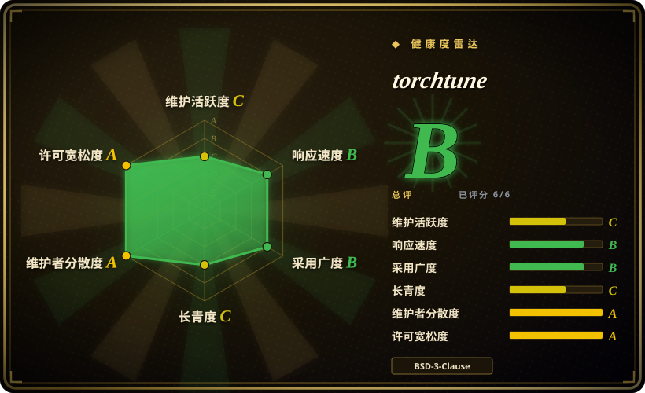
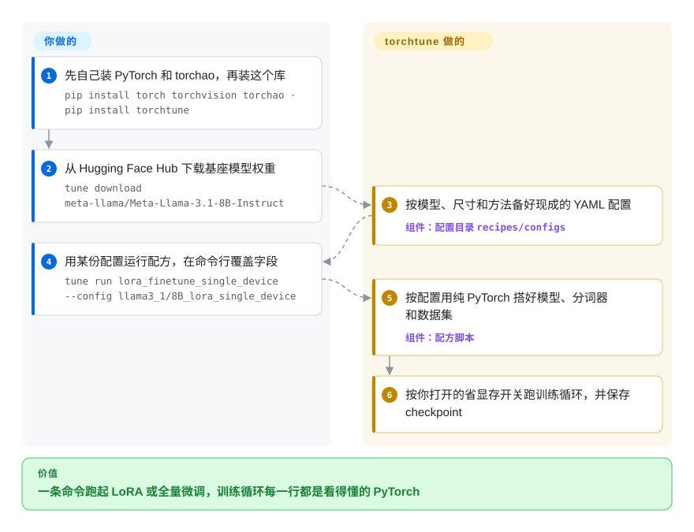

# torchtune

在大型训练框架里跑 LoRA，显存爆了或者 loss 不对劲，你要读的那段训练循环被埋在好几层封装下面。torchtune 把每种方法写成一个纯 PyTorch 的配方脚本，外加一份你复制过来就能改的 YAML 配置——但 Meta 已在 2025 年 7 月停止新功能开发，它现在是一份冻结的代码库，不适合作为新项目的起点。

## 何时使用

你是一名机器学习工程师，手上已经有一条跑在生产或论文复现仓库里的 torchtune 流水线：一个 `tune run lora_finetune_single_device --config llama3_1/8B_lora_single_device` 任务，配着手改过的 YAML，也许还有自定义的数据集构造函数。它仍然能训，产出的 checkpoint 仍然接着你的评测脚本，而迁移就意味着要在另一个框架上重新对齐 loss 曲线。这时你把 torchtune 锁在最后一个版本 v0.6.1，连同与之匹配的 PyTorch 和 torchao 版本一起固定，把它当成只做维护的基础设施，同时规划迁移。

另一种情况是拿来读，而不是拿来用。你想看全量微调、LoRA/QLoRA、DPO、知识蒸馏或量化感知训练写成一个完整的 PyTorch 训练循环是什么样子，中间没有任何 `Trainer` 子类——每一个省显存的技巧（激活检查点、激活卸载、把优化器步骤融进反向传播、分块交叉熵）都是你能直接搬进自己代码的一行。相对 [Hugging Face TRL](trl.zh.md) 或 [Axolotl](axolotl.zh.md)，它当初的吸引力正是这种极少的抽象；现在的代价是，没有人再以功能开发的节奏添加新模型或适配新版 PyTorch。

## 怎么用起来

torchtune 是一组“配方”（recipe）——每种训练方法一个 Python 脚本，比如 `lora_finetune_single_device` 或 `full_finetune_distributed`——再加上按模型和尺寸准备好的 YAML 配置。命令行工具 `tune` 负责从 Hugging Face Hub 下载权重、把配置复制到你手边、启动配方；多卡训练时它会转交给 `torchrun`（PyTorch 自带的启动器，每张 GPU 起一个进程）。torchtune 替你做的：模型定义（Llama、Qwen、Gemma、Mistral、Phi，都是普通 PyTorch 模块）、分词器、数据集构造、训练循环，以及你在配置里拨动的各种省显存、提速开关。你自己要做的：拿到受限权重的访问权（一个 `HF_TOKEN`），选配方和配置，把配置指向你的数据，以及——在停止开发之后——锁定一组仍能正常导入的 PyTorch 和 torchao 版本。可以把它想成一本菜谱，每道菜的做法都完整印在纸上，而不是写一句“加入秘制酱料”。

<!-- flow-steps:begin (generated from flows/torchtune.json by tools/flow_card.py — do not edit) -->

流程文字版

1. **你**：先自己装 PyTorch 和 torchao，再装这个库 — `pip install torch torchvision torchao · pip install torchtune`
2. **你**：从 Hugging Face Hub 下载基座模型权重 — `tune download meta-llama/Meta-Llama-3.1-8B-Instruct`
3. **torchtune**：按模型、尺寸和方法备好现成的 YAML 配置 — 组件：`配置目录 recipes/configs`
4. **你**：用某份配置运行配方，在命令行覆盖字段 — `tune run lora_finetune_single_device --config llama3_1/8B_lora_single_device`
5. **torchtune**：按配置用纯 PyTorch 搭好模型、分词器和数据集 — 组件：`配方脚本`
6. **torchtune**：按你打开的省显存开关跑训练循环，并保存 checkpoint

**价值**：一条命令跑起 LoRA 或全量微调，训练循环每一行都是看得懂的 PyTorch

<!-- flow-steps:end -->

## 何时不用

- **⚠️ 你要开一个新项目（废弃风险，2026-10-08 核实）。** README 开头写着“Torchtune is no longer actively maintained”；维护者在 issue #2883（2025-07-15）宣布停止功能开发，只承诺“在 2025 年内”提供关键缺陷和安全修复。最后一个版本是 v0.6.1（2025-04-07），此后主分支只有导入兼容性补丁（最后一次提交 2026-04-23）。新的 SFT／DPO／GRPO 流水线用 [Hugging Face TRL](trl.zh.md)；想要 YAML 驱动的微调用 [Axolotl](axolotl.zh.md) 或 [LlamaFactory](llamafactory.zh.md)。
- **你想留在 PyTorch 原生路线、跟着 Meta 的路线图走。** 官方宣布的继任者 torchforge 自己也已暂停开发，并指向 torchtitan——PyTorch 正在把大模型训练收拢到那里（含 SFT 和 TitanRL）。直接评估 torchtitan（未收录），不要在这两个之上搭新东西。
- **你需要最新的模型或最新的 PyTorch。** 模型支持止于 2025 年的 Llama 4 和 Qwen3 前后；README 写明只在当时的 PyTorch 稳定版（2.6.0）上测试。最近几次提交只是为了修 torchao 挪动符号后出现的 `ImportError`，下一次 PyTorch／torchao 升级大概率又会把它弄坏。改用 [TRL](trl.zh.md) 或 [Unsloth](unsloth.zh.md)，它们仍在持续添加新架构。
- **你要做大规模强化学习、并需要快速的生成引擎。** 它的 GRPO 配方只有全量权重、只支持多卡，PPO 只支持单卡，二者都没有 LoRA 版本（据 README 的方法表）。大规模 RL 后训练用 [verl](verl.zh.md)；单卡 GRPO 用 Unsloth 或 TRL。
- **你只想在一张消费级显卡上省显存地微调。** 它能做（自家基准表里就有 4090 上的 QLoRA），但 Unsloth 的定制算子就是为这件事做的，而且仍在维护。

## 横向对比

| 替代品 | 是否收录 | 我们的评价 | 取舍 |
|---|---|---|---|
| torchtitan（pytorch/torchtitan） | 未收录 | 要新建 PyTorch 原生训练栈，选 torchtitan，PyTorch 现在把大模型训练收拢到它那里；torchtune 只留给一时迁不走的存量流水线。 | torchtitan 仍在活跃开发、能扩展到大集群，但以预训练为先，后训练部分（SFT、TitanRL）还很年轻；torchtune 的配方更完整，但已冻结。 |
| [Hugging Face TRL](trl.zh.md) | ✅ | 在 transformers 模型上新做 SFT／DPO／GRPO，选 TRL；只有当你需要读一整段底下没有 `Trainer` 的训练循环时，torchtune 才占优。 | TRL 约两周一个版本，跟进新模型并支持用 vLLM 生成；代价是接受 transformers `Trainer` 这层抽象，而不是一个平铺的配方文件。 |
| [Axolotl](axolotl.zh.md) | ✅ | 如果你喜欢的是“改一份 YAML、跑一条命令”，选 Axolotl，它保留了这种用法且仍在维护。 | 同样以配置为先、方法覆盖更广；底层是 HF 技术栈，而不是手写的 PyTorch 模块。 |
| [Unsloth](unsloth.zh.md) | ✅ | 单卡 LoRA／QLoRA、显存是瓶颈时选 Unsloth；torchtune 的单卡配方已经不会再得到优化。 | 定制算子、新模型跟进快；部分技术栈由厂商主导，并有商业版本。 |
| [LlamaFactory](llamafactory.zh.md) | ✅ | 团队想要 Web 界面或零代码微调、覆盖很多模型家族时，选 LlamaFactory，而不是一个冻结的命令行配方库。 | 模型和方法矩阵宽得多，还带图形界面；内部实现不如 torchtune 的单文件配方透明。 |

## 技术栈

- **语言：** Python；模型、损失函数和训练循环都是普通 PyTorch（`torch.nn` 模块，多卡切分用 FSDP2）。
- **配方与配置：** `recipes/` 下每种方法一个脚本，`recipes/configs/` 下按模型放 YAML 配置，用 OmegaConf 加载，可在命令行用 `key=value` 覆盖。
- **命令行：** `tune`，子命令有 `ls`、`cp`、`download`、`run`、`validate`；分布式启动包装了 `torchrun`。
- **方法：** 全量微调、LoRA／QLoRA、知识蒸馏、DPO、PPO、GRPO、量化感知训练（借助 torchao）。
- **集成：** Hugging Face Hub 和 Kaggle Hub 取权重，Hugging Face Datasets，EleutherAI LM Eval Harness，Weights & Biases／Comet 记录指标，ExecuTorch 导出到端侧，bitsandbytes 优化器。

## 依赖

- **PyTorch 要你自己装：** `pip install torchtune` 不会带上 `torch`、`torchvision`、`torchao`；README 把最后一个版本和当时的 PyTorch（2.6.0）配在一起。
- **Python 包**（`pyproject.toml`）：`torchdata`、`datasets`、`huggingface_hub[hf_transfer]`、`safetensors`、`kagglehub`、`sentencepiece`、`tiktoken`、`blobfile`、`tokenizers`、`numpy`、`omegaconf`、`psutil`、`Pillow`，以及 `pyarrow<21`（2026-02 因 pyarrow 破坏性更新而锁定）。
- **硬件：** 大多数配方需要 NVIDIA GPU；改一个 `device=` 配置即可用 Intel XPU、AMD ROCm、Apple MPS 和昇腾 NPU。README 的表格里，Llama 3.1 8B 的 QLoRA 在单张 RTX 4090 上占 7.4 GiB；70B 全量微调要 8 张 A100。
- **账号：** 拉取 Llama 这类受限权重需要 Hugging Face token。

## 运维难度

**中等，且随时间上升。** 跑一个配方只要 `pip install` 加一条 `tune run`，没有需要运维的服务。成本在版本管理：库已冻结，你必须锁定一组仍能正常导入的 PyTorch + torchao + torchtune 组合，而每一次基础设施升级（新 CUDA、新一代 GPU、新 PyTorch）都是风险，上游不会再来修。多机训练要自己搭 `torchrun` 或 SLURM。该规划的是迁移，而不是升级路径。

## 健康度与可持续性

- **维护——已收尾（截至 2026-10-08）。** 维护者于 2025-07-15 宣布停止功能开发；v0.6.1（2025-04-07）是最后一个版本；主分支最后一次提交（2026-04-23）是在两次 torchao 兼容修复之后，往 README 里加上停止维护的说明。雷达维护轴的 C 反映的是近 13 周没有活动。
- **治理与背书。** 归属 Meta 的 `meta-pytorch` 组织，核心团队约七位署名维护者；雷达治理轴的 A 衡量的是提交分布，而不是是否还有人负责路线图——Meta 已明确把路线图挪走了。
- **年龄与 Lindy——不加分。** 创建于 2023-10（约 3 年），“年龄 × 仍活跃”里失分的是“仍活跃”这一半。对一个被主人主动退役的项目，Lindy 先验给不出任何保障。
- **继任链本身也不稳。** 官方点名的继任者 torchforge 现在挂着“Development paused”横幅，指向 torchtitan。想跟着 Meta 走的人，应直接核查 torchtitan 后训练部分的成熟度。
- **采用度。** 上个月仍有 315,353 次 PyPI 下载（雷达快照）、约 5.8k stars，多半来自存量流水线和论文仓库 [推断]；这能让 issue 里的问题有人回（首次响应中位数 14.9 小时），但代码不会再往前走。
- **风险信号。** BSD-3-Clause，无改协议历史。风险在于会坏：雷达总分 B 高估了它对新项目的可用性。

## 存疑（未验证）

- [推断] 剩余 PyPI 下载主要来自存量流水线和锁版本的研究仓库，这是根据停止维护的时间推断的，没有查过下游依赖的构成。
- [未验证] 没有测试 torchtune 在 2026-10 当时的 PyTorch 和 torchao 版本下能否正常导入；2026-04 的修复只说明维护者修过上一轮破坏，不代表以后还会修。
- [未验证] 显存和吞吐数字（如 RTX 4090 上 QLoRA 占 7.4 GiB）来自 README 自己的基准表，未复现。
- [未验证] torchtitan 能否替代 torchtune 的后训练配方（SFT、TitanRL），只读了它 README 的动态，没有实际评估。
- [推断] 流程卡停在“微调跑起来”；checkpoint 如何导出用于推理取决于各 YAML 里配置的 checkpointer，没有追到源码。
