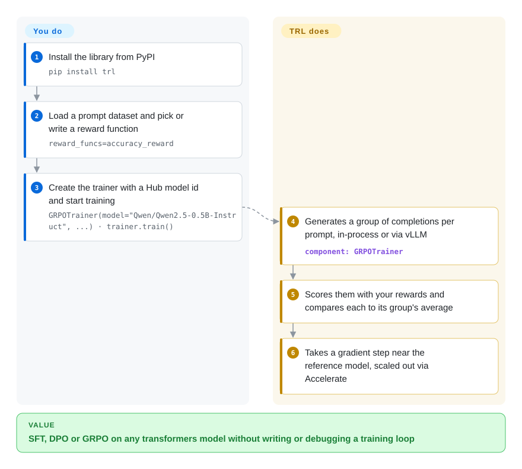

# Hugging Face TRL

Hand-writing a fine-tuning loop for each post-training method means re-implementing chat-template masking, reference-model log-probabilities and on-the-fly generation every time, and one wrong detail trains quietly on garbage instead of crashing. TRL packages SFT, DPO, GRPO and a dozen other methods as trainer classes on top of Hugging Face transformers, so a run is a dataset, a model id and `trainer.train()`.

## When to use

You're an ML engineer with an open-weight checkpoint (a Qwen, Llama or Gemma model from the Hugging Face Hub) and a plan: supervised fine-tuning on your chat transcripts, then preference tuning with DPO, or reinforcement learning with GRPO against a verifiable reward such as "did the final answer match". Your stack is already `transformers` + `datasets` + PEFT. Writing the loop yourself is where it goes wrong: a chat template that also trains on the user's turns, so the model starts imitating your customers; or a GRPO loop where generation never stops at the end-of-turn token and `completions/clipped_ratio` sits near 1. You reach for TRL because each method is a tested trainer class — `SFTTrainer`, `DPOTrainer`, `GRPOTrainer`, `KTOTrainer`, `RewardTrainer` — that takes a Hub model id and dataset, and runs on one GPU or many through the same Accelerate launch.

It beats its neighbours on breadth and neutrality inside the Hugging Face stack. Over [verl](verl.md) you trade rollout throughput at cluster scale for a `pip install` and no Ray cluster; over [Unsloth](unsloth.md) you get vendor-neutral code and more methods, and you can still plug Unsloth's kernels in, since TRL integrates them; over [Axolotl](axolotl.md) or [LlamaFactory](llamafactory.md) you write Python against the trainer API instead of a YAML or a web UI, which matters when your reward or data pipeline is custom code.

## How it works

Each TRL trainer is a thin layer over the transformers `Trainer` (Hugging Face's generic training loop): it adds the method-specific data handling and loss, and inherits checkpointing, logging and multi-GPU support from Accelerate, DeepSpeed ZeRO or FSDP — three ways of splitting a model's memory across GPUs. For GRPO, the trainer samples a *group* of several completions per prompt, scores each with your reward functions (plain Python functions that take the completions and return one number each), and scores every completion against its own group's average, so no separate critic model has to be trained; it then takes a gradient step that also keeps the model close to a frozen reference copy. Generation can run inside the trainer or, much faster, through vLLM (a high-throughput inference engine), either sharing the training GPUs (`colocate`, the default) or on separate GPUs (`server`). What TRL does for you: formatting, masking, generation, reward bookkeeping, the loss and distribution. What stays yours: the dataset in one of its supported formats, the reward functions, the config values, and the hardware. A `trl` command-line tool runs SFT, DPO and KTO without writing code at all.

<!-- flow-steps:begin (generated from flows/trl.json by tools/flow_card.py — do not edit) -->

Text version of the flow

1. **You**: Install the library from PyPI — `pip install trl`
2. **You**: Load a prompt dataset and pick or write a reward function — `reward_funcs=accuracy_reward`
3. **You**: Create the trainer with a Hub model id and start training — `GRPOTrainer(model="Qwen/Qwen2.5-0.5B-Instruct", ...) · trainer.train()`
4. **Hugging Face TRL**: Generates a group of completions per prompt, in-process or via vLLM — component: `GRPOTrainer`
5. **Hugging Face TRL**: Scores them with your rewards and compares each to its group's average
6. **Hugging Face TRL**: Takes a gradient step near the reference model, scaled out via Accelerate

**Value**: SFT, DPO or GRPO on any transformers model without writing or debugging a training loop

<!-- flow-steps:end -->

## When NOT to use

- **RL on large or MoE models across many nodes, where rollout throughput dominates.** TRL scales training through Accelerate, DeepSpeed and FSDP and can offload generation to a vLLM server, but it has no Megatron-style tensor/expert parallelism and no Ray-orchestrated resource pools. For 70B+ or MoE RL runs, use [verl](verl.md) (FSDP or Megatron, vLLM or SGLang) or [Miles](miles.md) (SGLang + Megatron).
- **You want to tune an agent you already run in production from its traces.** TRL expects you to own the dataset and reward function inside its trainer. [Agent Lightning](agent-lightning.md) or [ART](art.md) wrap an existing agent's executions into RL training with fewer changes to the agent.
- **Your team wants zero-code fine-tuning or a GUI.** The CLI covers SFT/DPO/KTO, but most customization is Python. [LlamaFactory](llamafactory.md) gives a web UI and a large model matrix; [Axolotl](axolotl.md) keeps everything in one YAML.
- **One consumer GPU and VRAM is the wall.** Plain TRL plus PEFT/QLoRA works, but [Unsloth](unsloth.md)'s kernels fit larger models in the same memory; use Unsloth (which itself runs on TRL trainers) for that case.
- **You need a slow-moving API.** Releases ship roughly every two weeks (v1.12 → v1.14.2 between 2026-08-26 and 2026-10-06), supported vLLM versions are a rolling window (v1.14.2's `vllm` extra allows only `>=0.21,<=0.31`), and patch releases still fix silently-wrong training (v1.14.2: GRPO trained past the end-of-turn token on Gemma/Phi models). Pin `trl`, `transformers` and `vllm` together and re-validate on upgrades; if you cannot, budget for that churn whichever library you choose.
- **Your model is not a transformers model.** The trainers load models through transformers and the Hub conventions; a custom architecture outside that stack is better served by a plain PyTorch loop or torchtitan (not indexed).

## Comparison

| Alternative | In index | Our verdict | Tradeoff |
|---|---|---|---|
| [verl](verl.md) | ✅ | For GRPO/PPO on models that need FSDP or Megatron sharding across nodes with a separate rollout engine, pick verl; for SFT/DPO/GRPO that fits data-parallel training on a few GPUs, pick TRL. | verl buys cluster-scale rollout throughput and resharding at the cost of Ray, Hydra configs and a heavier environment; TRL installs from PyPI and stays in transformers. |
| [Unsloth](unsloth.md) | ✅ | On a single VRAM-bound GPU, pick Unsloth; for multi-GPU, broader methods or vendor-neutral code, pick TRL. | Unsloth's kernels cut memory and time but tie you to its model support and vendor; TRL is the neutral base Unsloth itself builds on. |
| [Axolotl](axolotl.md) | ✅ | When the whole run should be one reviewable YAML file and your data fits its formats, pick Axolotl; when the reward or data pipeline is custom Python, pick TRL. | Config-first reproducibility versus programmatic control over trainers and rewards. |
| [LlamaFactory](llamafactory.md) | ✅ | For a team that wants a web UI and presets across 100+ model families, pick LlamaFactory; for code-level control of SFT→DPO→GRPO, pick TRL. | GUI and breadth of presets versus a smaller, scriptable API surface. |
| OpenRLHF (OpenRLHF/OpenRLHF) | not indexed | When you already operate Ray + vLLM + DeepSpeed and want PPO/GRPO beyond one node without Megatron, consider OpenRLHF; stay with TRL while a single Accelerate launch is enough. | Ray-based distributed RL with separate actor/critic/rollout groups, versus TRL's simpler single-launch design. Not reviewed in this sync. |

## Tech stack

- **Language:** Python (requires ≥3.11 on main as of 2026-10-08; the v1.14.2 wheel on PyPI declares ≥3.10).
- **Built on:** transformers `Trainer`, Accelerate for distribution (DDP, DeepSpeed ZeRO, FSDP), datasets, Jinja2 for chat templates.
- **Trainers:** `SFTTrainer`, `DPOTrainer`, `GRPOTrainer`, `RLOOTrainer`, `KTOTrainer`, `RewardTrainer`, `OnlineDPOTrainer`, distillation trainers, plus unstable ones under `trl.experimental`.
- **Generation:** optional vLLM in `colocate` or `server` mode for online methods.
- **CLI:** `trl sft`, `trl dpo`, `trl kto` for code-free runs.
- **Optional integrations:** PEFT (LoRA/QLoRA), bitsandbytes, Liger kernels, Unsloth, DeepSpeed, math-verify rewards, Harbor and OpenReward environments.

## Dependencies

- **Core** (`pyproject.toml`): `accelerate>=1.4.0`, `datasets>=4.7.0`, `jinja2`, `packaging`, `transformers>=4.56.2`; PyTorch comes in through transformers/accelerate.
- **Extras:** `trl[peft]`, `trl[vllm]` (vLLM pinned to a window, currently `>=0.21.0,<=0.31.0`), `trl[deepspeed]`, `trl[liger]`, `trl[quantization]` (bitsandbytes), `trl[vlm]`, `trl[math_verify]`.
- **Hardware:** a CUDA GPU for real runs (XPU, NPU, MLU and MPS are recognized accelerators); vLLM generation needs GPUs vLLM supports.
- **Network:** models and datasets usually come from the Hugging Face Hub; the trainer also sends an anonymous usage ping on each trainer instantiation unless telemetry is disabled.

## Ops difficulty

**Low to medium.** Single-GPU runs are `pip install trl` and a Python script; multi-GPU is an `accelerate launch` with a DeepSpeed or FSDP config. Medium once you add vLLM: in `server` mode you run and size a separate inference server, and the trl/transformers/vllm version triangle has to be pinned together. Usage telemetry is on by default — it reports the TRL version, trainer class, model architecture, distributed backend and GPU model (no data or paths, per the docs); set `HF_HUB_DISABLE_TELEMETRY=1` (or `HF_HUB_OFFLINE=1`) in restricted environments.

## Health & viability

- **Maintenance — very active (as of 2026-10-08).** Commits land daily; v1.0.0 shipped 2026-03-31 and minors follow about every two weeks (v1.14.2 on 2026-10-06). Issues get a first response in a median of 10.3 h on the radar's sample.
- **Governance & bus factor — company-run, concentrated.** Owned by the Hugging Face org. Re-scored on 2026-10-08, the governance axis is B: 50 active maintainers in 12 months, but the top contributor holds 37.7% and the top three 81.1% of commits. Counting commits directly agrees: two Hugging Face engineers (albertvillanova, qgallouedec) authored about 70% of the ~1,900 commits in the last 12 months. The roadmap is Hugging Face's.
- **Age & Lindy — strong.** Created 2020-03 (~6.5 years) and still shipping weekly-to-biweekly: old *and* active, which is the Lindy case worth betting on.
- **Adoption.** 2,540,661 PyPI downloads in the last month (radar snapshot), ~19.5k stars, and it is the trainer layer other tools build on: Axolotl pins `trl==1.14.1` and Unsloth depends on `trl<=1.13.0` (their `pyproject.toml`, 2026-10-08).
- **Risk flags.** Apache-2.0, no relicensing. The risks are API churn (`trl.experimental` "may change or be removed in any release") and default-on usage telemetry; Hugging Face is a venture-funded company, so long-run stewardship depends on it.

## Caveats (unverified)

- [推断] Downstream pins (Axolotl `trl==1.14.1`, Unsloth `trl<=1.13.0`) mean those tools lag TRL releases by design; how they use TRL internally was not traced.
- [推断] The ~70% commit share of the top two authors is from the GitHub commits API on the default branch (2025-10-08 → 2026-10-08) and counts commits, not lines or review load.
- [未验证] The absence of Megatron/tensor-parallel training support is inferred from the dependency manifest and docs listing (no Megatron extra or guide); not confirmed by reading trainer source.
- [未验证] OpenRLHF's characterization (Ray + vLLM + DeepSpeed, separate actor/critic/rollout groups) comes from prior knowledge and other index pages; its repo was not reread in this sync.
- [未验证] The telemetry payload is as described in `docs/source/usage_stats.md`; the network call itself was not inspected.
