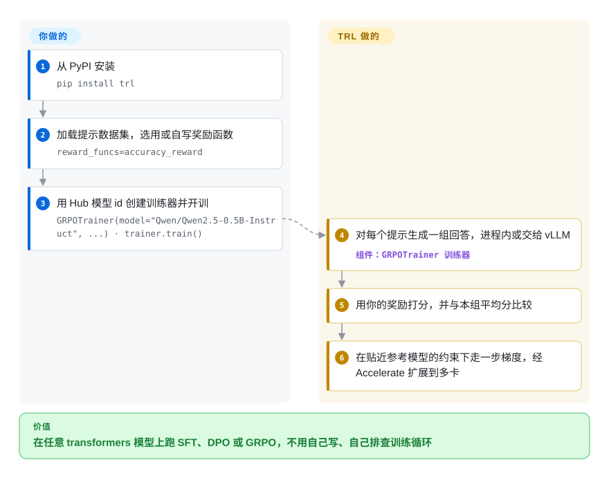

# Hugging Face TRL

每换一种后训练方法就手写一遍训练循环，意味着每次都要重新实现聊天模板的掩码、参考模型的对数概率、边训边生成——哪个细节错了，它不会报错，只会安安静静地在垃圾上训练。TRL 把 SFT、DPO、GRPO 等十几种方法做成建在 Hugging Face transformers 之上的训练器类，一次训练就是一个数据集、一个模型 id 加一句 `trainer.train()`。

## 何时使用

你是一名机器学习工程师，手里有一个开源权重模型（Hugging Face Hub 上的 Qwen、Llama 或 Gemma），计划是：先用自己的对话记录做监督微调，再用 DPO 做偏好对齐，或者用 GRPO 针对一个可验证的奖励（比如“最终答案对不对”）做强化学习。你的技术栈本来就是 `transformers` + `datasets` + PEFT。自己写循环最容易出事的地方是：聊天模板连用户那一轮也拿去训练，模型开始模仿你的客户说话；或者 GRPO 循环里生成从不在轮次结束符处停下，`completions/clipped_ratio` 一直贴近 1。你选 TRL，是因为每种方法都是一个经过测试的训练器类——`SFTTrainer`、`DPOTrainer`、`GRPOTrainer`、`KTOTrainer`、`RewardTrainer`——吃一个 Hub 模型 id 和数据集，用同一套 Accelerate 启动方式就能从一张卡跑到多张卡。

它胜过邻居的地方在于：在 Hugging Face 技术栈内部，方法覆盖最广、立场最中立。相对 [verl](verl.zh.md)，你放弃集群规模下的生成吞吐，换来一句 `pip install`、不用搭 Ray 集群；相对 [Unsloth](unsloth.zh.md)，你得到不绑厂商的代码和更多方法，而且照样能接入 Unsloth 的算子（TRL 已集成）；相对 [Axolotl](axolotl.zh.md) 或 [LlamaFactory](llamafactory.zh.md)，你是对着训练器 API 写 Python，而不是写 YAML 或点 Web 界面——当你的奖励函数或数据管线是自定义代码时，这一点很关键。

## 怎么用起来

TRL 的每个训练器都是 transformers `Trainer`（Hugging Face 的通用训练循环）上薄薄的一层：它补上该方法专属的数据处理和损失函数，checkpoint、日志和多卡能力则直接继承自 Accelerate、DeepSpeed ZeRO 或 FSDP——三种把模型显存切到多张 GPU 上的方式。以 GRPO 为例：训练器对每个提示采样一“组”回答，用你的奖励函数（普通的 Python 函数，输入一批回答，各返回一个分数）逐个打分，再拿每个回答和本组平均分比高低，于是不用另外训练一个评论家模型；然后走一步梯度更新，同时约束模型别离冻结的参考副本太远。生成可以在训练器内部完成，也可以交给 vLLM（一个高吞吐推理引擎）大幅提速——要么和训练共用 GPU（`colocate`，默认），要么放在单独的 GPU 上（`server`）。TRL 替你做的：格式化、掩码、生成、奖励记账、损失和分布式。你自己要做的：按它支持的格式准备数据集、写奖励函数、定配置、准备硬件。另有命令行工具 `trl`，SFT、DPO、KTO 可以一行代码都不写。

<!-- flow-steps:begin (generated from flows/trl.json by tools/flow_card.py — do not edit) -->

流程文字版

1. **你**：从 PyPI 安装 — `pip install trl`
2. **你**：加载提示数据集，选用或自写奖励函数 — `reward_funcs=accuracy_reward`
3. **你**：用 Hub 模型 id 创建训练器并开训 — `GRPOTrainer(model="Qwen/Qwen2.5-0.5B-Instruct", ...) · trainer.train()`
4. **Hugging Face TRL**：对每个提示生成一组回答，进程内或交给 vLLM — 组件：`GRPOTrainer 训练器`
5. **Hugging Face TRL**：用你的奖励打分，并与本组平均分比较
6. **Hugging Face TRL**：在贴近参考模型的约束下走一步梯度，经 Accelerate 扩展到多卡

**价值**：在任意 transformers 模型上跑 SFT、DPO 或 GRPO，不用自己写、自己排查训练循环

<!-- flow-steps:end -->

## 何时不用

- **在多机上对大模型或 MoE 模型做 RL，生成吞吐是主要瓶颈。** TRL 靠 Accelerate、DeepSpeed、FSDP 扩展训练，也能把生成交给 vLLM 服务，但它没有 Megatron 式的张量／专家并行，也没有用 Ray 编排的资源池。70B 以上或 MoE 的 RL 用 [verl](verl.zh.md)（FSDP 或 Megatron，vLLM 或 SGLang）或 [Miles](miles.zh.md)（SGLang + Megatron）。
- **你想用生产环境里已有智能体的轨迹来调优它。** TRL 要求你在训练器里自己掌握数据集和奖励函数。[Agent Lightning](agent-lightning.zh.md) 或 [ART](art.zh.md) 能把现有智能体的执行过程包进 RL 训练，对智能体本身改动更少。
- **团队想要零代码微调或图形界面。** 命令行只覆盖 SFT／DPO／KTO，大部分定制得写 Python。[LlamaFactory](llamafactory.zh.md) 有 Web 界面和庞大的模型矩阵；[Axolotl](axolotl.zh.md) 把一切放进一份 YAML。
- **只有一张消费级显卡，显存是硬墙。** 纯 TRL 加 PEFT／QLoRA 也能跑，但 [Unsloth](unsloth.zh.md) 的算子能在同样显存里塞下更大的模型；这种情况用 Unsloth（它本身就跑在 TRL 训练器之上）。
- **你需要一个变化缓慢的 API。** 大约两周一个版本（2026-08-26 到 2026-10-06 从 v1.12 走到 v1.14.2），支持的 vLLM 版本是一个滚动窗口（v1.14.2 的 `vllm` 附加依赖只允许 `>=0.21,<=0.31`），补丁版本里仍在修“训练悄悄出错”的问题（v1.14.2：GRPO 在 Gemma／Phi 模型上越过轮次结束符继续训练）。把 `trl`、`transformers`、`vllm` 一起锁版本，升级时重新验证；做不到的话，换哪个库都得为这种变动留出预算。
- **你的模型不是 transformers 模型。** 训练器通过 transformers 和 Hub 的约定加载模型；不在这套体系里的自定义架构，更适合用纯 PyTorch 训练循环或 torchtitan（未收录）。

## 横向对比

| 替代品 | 是否收录 | 我们的评价 | 取舍 |
|---|---|---|---|
| [verl](verl.zh.md) | ✅ | 模型需要跨节点用 FSDP 或 Megatron 切分、还要独立生成引擎来跑 GRPO／PPO 时，选 verl；SFT／DPO／GRPO 用几张卡的数据并行就装得下时，选 TRL。 | verl 换来集群规模的生成吞吐和权重重分片，代价是 Ray、Hydra 配置和更重的环境；TRL 从 PyPI 安装，留在 transformers 体系内。 |
| [Unsloth](unsloth.zh.md) | ✅ | 单张显存吃紧的 GPU 选 Unsloth；多卡、更多方法或不绑厂商的代码选 TRL。 | Unsloth 的算子省显存省时间，但把你绑在它的模型支持和厂商上；TRL 是 Unsloth 自己也依赖的中立底座。 |
| [Axolotl](axolotl.zh.md) | ✅ | 整个训练应当是一份可审阅的 YAML、数据也符合它的格式时，选 Axolotl；奖励或数据管线是自定义 Python 时，选 TRL。 | 以配置为先的可复现性，对比对训练器和奖励的编程级控制。 |
| [LlamaFactory](llamafactory.zh.md) | ✅ | 团队想要 Web 界面和覆盖 100 多个模型家族的预设时，选 LlamaFactory；要在代码层面控制 SFT→DPO→GRPO 时，选 TRL。 | 图形界面和预设的广度，对比更小、可脚本化的 API。 |
| OpenRLHF（OpenRLHF/OpenRLHF） | 未收录 | 已经在运维 Ray + vLLM + DeepSpeed、想把 PPO／GRPO 扩到单机之外又不想上 Megatron 时，可以考虑 OpenRLHF；一次 Accelerate 启动够用时，留在 TRL。 | 基于 Ray 的分布式 RL，演员／评论家／生成各自成组，对比 TRL 单次启动的简单设计。本次同步未复核。 |

## 技术栈

- **语言：** Python（截至 2026-10-08，主分支要求 ≥3.11；PyPI 上 v1.14.2 的包声明 ≥3.10）。
- **底座：** transformers `Trainer`，用 Accelerate 做分布式（DDP、DeepSpeed ZeRO、FSDP），datasets，聊天模板用 Jinja2。
- **训练器：** `SFTTrainer`、`DPOTrainer`、`GRPOTrainer`、`RLOOTrainer`、`KTOTrainer`、`RewardTrainer`、`OnlineDPOTrainer`、蒸馏训练器，以及放在 `trl.experimental` 下的不稳定训练器。
- **生成：** 在线方法可选用 vLLM，`colocate` 或 `server` 两种模式。
- **命令行：** `trl sft`、`trl dpo`、`trl kto`，不写代码也能跑。
- **可选集成：** PEFT（LoRA／QLoRA）、bitsandbytes、Liger 算子、Unsloth、DeepSpeed、math-verify 奖励、Harbor 和 OpenReward 环境。

## 依赖

- **核心**（`pyproject.toml`）：`accelerate>=1.4.0`、`datasets>=4.7.0`、`jinja2`、`packaging`、`transformers>=4.56.2`；PyTorch 经由 transformers／accelerate 引入。
- **附加依赖：** `trl[peft]`、`trl[vllm]`（vLLM 锁在一个窗口内，目前是 `>=0.21.0,<=0.31.0`）、`trl[deepspeed]`、`trl[liger]`、`trl[quantization]`（bitsandbytes）、`trl[vlm]`、`trl[math_verify]`。
- **硬件：** 正经训练需要 CUDA GPU（XPU、NPU、MLU、MPS 也被识别为加速器）；用 vLLM 生成需要 vLLM 支持的 GPU。
- **网络：** 模型和数据集通常来自 Hugging Face Hub；此外每次实例化训练器都会发一个匿名使用统计请求，除非你关掉遥测。

## 运维难度

**低到中等。** 单卡训练就是 `pip install trl` 加一个 Python 脚本；多卡是带 DeepSpeed 或 FSDP 配置的 `accelerate launch`。加上 vLLM 后变成中等：`server` 模式下你要单独运行并规划一个推理服务，而且 trl／transformers／vllm 三者的版本必须一起锁定。使用统计遥测默认开启——上报 TRL 版本、训练器类名、模型架构、分布式后端和 GPU 型号（据文档不含数据和路径）；在受限环境里设置 `HF_HUB_DISABLE_TELEMETRY=1`（或 `HF_HUB_OFFLINE=1`）。

## 健康度与可持续性

- **维护——非常活跃（截至 2026-10-08）。** 每天都有提交；v1.0.0 于 2026-03-31 发布，此后约两周一个小版本（v1.14.2 发布于 2026-10-06）。雷达样本里 issue 首次响应的中位数是 10.3 小时。
- **治理与 bus factor——公司主导、高度集中。** 归属 Hugging Face 组织。2026-10-08 重新评分后治理轴为 B：12 个月内有 50 名活跃维护者，但第一名占提交的 37.7%、前三名合计 81.1%。直接数提交也一致：过去 12 个月约 1,900 次提交里，两位 Hugging Face 工程师（albertvillanova、qgallouedec）贡献了约 70%。路线图由 Hugging Face 掌握。
- **年龄与 Lindy——强。** 创建于 2020-03（约 6.5 年），至今仍保持一到两周一版：又老又活跃，正是值得下注的 Lindy 情形。
- **采用度。** 上个月 2,540,661 次 PyPI 下载（雷达快照）、约 19.5k stars，而且是其他工具的训练器底座：Axolotl 锁定 `trl==1.14.1`，Unsloth 依赖 `trl<=1.13.0`（见它们的 `pyproject.toml`，2026-10-08）。
- **风险信号。** Apache-2.0，无改协议历史。风险在于 API 变动（`trl.experimental`“可能在任何版本中更改或移除”）和默认开启的使用遥测；Hugging Face 是风投支持的公司，长期托管取决于它。

## 存疑（未验证）

- [推断] 下游锁版本（Axolotl `trl==1.14.1`、Unsloth `trl<=1.13.0`）意味着这些工具会有意滞后于 TRL 发布；它们内部如何使用 TRL 没有追查。
- [推断] 前两位作者约 70% 的提交占比来自 GitHub 提交 API 对默认分支的统计（2025-10-08 → 2026-10-08），数的是提交次数，不是代码行数或审阅工作量。
- [未验证] 不支持 Megatron／张量并行训练，是根据依赖清单和文档目录推断的（没有 Megatron 附加依赖或指南），没有读训练器源码确认。
- [未验证] 对 OpenRLHF 的描述（Ray + vLLM + DeepSpeed，演员／评论家／生成分组）来自既有认知和索引内其他页面，本次同步没有重读其仓库。
- [未验证] 遥测内容以 `docs/source/usage_stats.md` 的描述为准，没有实际抓包检查网络请求。
