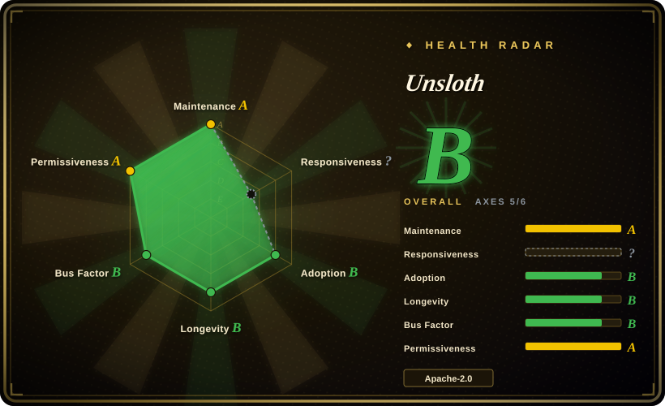
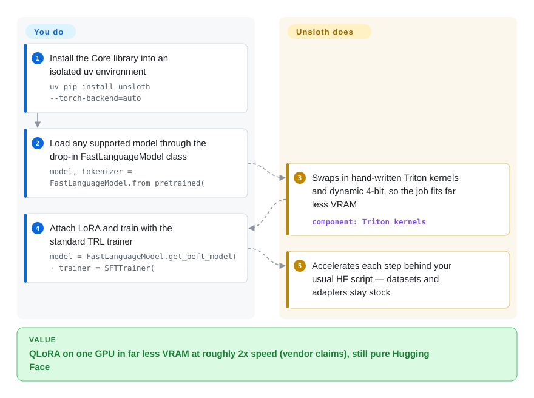

# Unsloth

Fine-tuning on a single GPU keeps hitting CUDA out-of-memory, and one epoch crawls; then you still need another tool just to run the result. Unsloth is a near drop-in Hugging Face training library whose hand-written Triton kernels and dynamic 4-bit quantization make the same LoRA/QLoRA job fit in far less VRAM and finish faster ("up to 2x faster with up to 70% less VRAM" — vendor claim); in 2026 it has grown into three surfaces: a native Desktop app, the Studio web UI, and the original Core Python library.

## When to use

You're a developer or solo researcher with a single consumer or workstation GPU (e.g. an RTX 4090, or a free Colab/Kaggle T4) and you want to fine-tune a Llama, Qwen, Mistral, Gemma or gpt-oss model on your own dataset. With stock Hugging Face + PEFT you keep hitting CUDA out-of-memory on QLoRA runs, or a single epoch takes long enough that iteration is painful. Unsloth swaps in its own Triton kernels (RoPE, MLP, attention, padding-free packing) and dynamic 4-bit quantization behind a near drop-in `FastLanguageModel` API, so the same QLoRA job fits in far less VRAM and finishes faster — the vendor cites "up to 2x faster with up to 70% less VRAM," "80% less VRAM for GRPO" runs, and "12x faster MoE training."

The project has since grown past the library: the README now leads with a **native Desktop app** (Windows/macOS/Linux, runs *and* trains models locally), with **Unsloth Studio** (a self-hosted web UI you install via `curl -fsSL https://unsloth.ai/install.sh | sh`, serving models through an OpenAI/Anthropic-compatible API and hooking them into coding agents like Claude Code or Codex via `unsloth start`) and **Unsloth Core** (the original code library). Reach for Unsloth when you want one vendor across the loop — fine-tune a LoRA on your GPU, merge, export to GGUF, serve it to your apps and agents on the same machine — instead of assembling Hugging Face-ecosystem pieces yourself. Beyond text LLMs it also trains vision, embedding, TTS and diffusion models, per the docs.

## How it works

Unsloth works underneath your training script, between your code and the GPU. You still write a standard Hugging Face loop — load a model, attach LoRA, run a `trl` trainer — but `FastLanguageModel` reroutes the hottest math to hand-written Triton kernels (programs for GPU tensor cores that replace PyTorch's default RoPE, MLP and attention computations), packs sequences without padding waste, and substitutes its own dynamic 4-bit quantization (storing weights in four bits with per-block scaling, what makes a 70B-shaped job fit one card) for the stock bitsandbytes path. The payoff is a QLoRA run that needs far less VRAM and finishes faster with, per the vendor, no accuracy loss. What stays yours: dataset formatting, hyperparameters, and multi-GPU orchestration — the docs run that through manual `accelerate launch train.py` / `torchrun` setup on top of Accelerate/DeepSpeed. The Desktop app and Studio web UI wrap the same engine plus a llama.cpp-based runner (Vulkan/CUDA/ROCm/CPU backends) in forms that need no Python.

<!-- flow-steps:begin (generated from flows/unsloth.json by tools/flow_card.py — do not edit) -->

Text version of the flow

1. **You**: Install the Core library into an isolated uv environment — `uv pip install unsloth --torch-backend=auto`
2. **You**: Load any supported model through the drop-in FastLanguageModel class — `model, tokenizer = FastLanguageModel.from_pretrained(`
3. **Unsloth**: Swaps in hand-written Triton kernels and dynamic 4-bit, so the job fits far less VRAM — component: `Triton kernels`
4. **You**: Attach LoRA and train with the standard TRL trainer — `model = FastLanguageModel.get_peft_model( · trainer = SFTTrainer(`
5. **Unsloth**: Accelerates each step behind your usual HF script — datasets and adapters stay stock

**Value**: QLoRA on one GPU in far less VRAM at roughly 2x speed (vendor claims), still pure Hugging Face

<!-- flow-steps:end -->

## When NOT to use

- **Turnkey multi-GPU / multi-node training.** The open-source docs confirm multi-GPU works via Accelerate/DeepSpeed (FSDP and DDP) — but they also say "the process can be complex and requires manual setup" and that simpler official multi-GPU support is still pending. The historical free-vs-paid line around multi-GPU has also been contested (see Caveats). If you want polished sharding out of the box today, [Axolotl](axolotl.md) or [LlamaFactory](llamafactory.md) are safer.
- **Full-parameter fine-tuning of large models.** The README lists full fine-tuning, but the tuned envelope is parameter-efficient (LoRA/QLoRA) runs on one or a few GPUs; large-scale full fine-tunes that need serious sharded infrastructure are where Axolotl/DeepSpeed-native stacks are the better fit. [推断]
- **Unsupported architectures.** The supported-model list is large but curated; a brand-new or exotic architecture may lack optimized kernels until the maintainers add it.
- **Vendor-shape concerns.** This is a startup product (org `unslothai/`), headline speed/VRAM numbers are vendor claims, and the project has historically layered commercial offerings over the open core; the free/paid line can move. Budget the risk before betting a production pipeline.
- **You only want to run models locally.** The Desktop/Studio serving path overlaps with dedicated local runtimes; if you will never fine-tune, [Ollama](../llm-inference/local-runtimes/ollama.md) or [llama.cpp](../llm-inference/local-runtimes/llama-cpp.md) is the simpler story. [推断：调优深度未实测]
- **You want a fully config-driven, reproducible team workflow.** Unsloth is library/notebook/app-first; [LlamaFactory](llamafactory.md) (YAML + LlamaBoard UI) is more team/repro oriented.
- **Maintenance cadence risk.** Releases ship on a near-daily beta line (v0.1.815-beta published 2026-09-23, GitHub releases API); pin versions, because kernel/model support and APIs shift quickly.

## Comparison

| Alternative | In index | Our verdict | Tradeoff |
|---|---|---|---|
| [LLaMA-Factory](llamafactory.md) | ✅ | Choose LLaMA-Factory when broad method/model coverage, YAML, web UI, and multi-GPU matter more than single-GPU speed. | It can use Unsloth as a backend; Unsloth stays narrower but faster on one GPU. |
| [ART](art.md) | ✅ | Choose ART when the training problem is multi-step agent GRPO with tasks, rewards, and rollout orchestration. | ART is agent-first; Unsloth is a general fine-tuning/RL acceleration layer. |
| [Agent Lightning](agent-lightning.md) | ✅ | Choose Agent Lightning when existing agents need RL from execution traces with minimal code changes. | It decouples agent execution from training; Unsloth optimizes kernels rather than agent orchestration. |
| [Axolotl](axolotl.md) | ✅ | Choose Axolotl when first-class multi-GPU FSDP/DeepSpeed and multimodal support matter after outgrowing one GPU. | Stronger for scale-out workflows; Unsloth wins on single-GPU speed and VRAM. |
| [torchtune](torchtune.md) | ✅ | Choose torchtune when native PyTorch recipes with explicit `torch.compile` control are the priority. | More explicit and lower-level, but with narrower model coverage than Unsloth's curated fast path. |
| HF TRL ([trl](trl.md)) | ✅ | Choose TRL when Hugging Face's reference SFT/DPO/GRPO trainer classes are preferable to an accelerated wrapper. | Unsloth builds on TRL and accelerates it with custom kernels; TRL gives you the unaccelerated but fully transparent path. |

## Tech stack

- **Language:** Python (Core) with a TypeScript Studio UI component.
- **Core acceleration:** hand-written Triton kernels (RoPE, MLP, attention), padding-free packing, dynamic 4-bit quantization; FP8/16-bit/4-bit training paths.
- **Training methods:** LoRA, QLoRA, full fine-tune, pretraining, and RL (GRPO/DPO) via a near drop-in `FastLanguageModel` API layered over `transformers`/`trl`; embedding, TTS and diffusion training are also documented.
- **Run/serve path:** a llama.cpp-based runner with Vulkan/CUDA/ROCm/CPU backends (`UNSLOTH_LLAMA_CPP_BACKEND` install flag), OpenAI- and Anthropic-compatible APIs, GGUF "Dynamic" quantized model downloads.
- **Surfaces:** Unsloth Core (code library, Apache-2.0), Unsloth Studio (web UI) and the Unsloth Desktop app; the README's License section states the repo uses dual Apache-2.0 + AGPL-3.0 licensing, with the Studio UI under AGPL-3.0.

## Dependencies

- PyTorch + CUDA for NVIDIA (README lists RTX 30/40/50, Blackwell, DGX); AMD via ROCm (dedicated `unsloth/unsloth-rocm` Docker image and AMD guide), Intel GPUs and CPU/Vulkan per the README's feature line; Windows, Linux, WSL and macOS all named as supported platforms.
- Triton (kernel compilation).
- Hugging Face `transformers`, `peft`, `trl`, `datasets`, and tokenizers.
- A 4-bit quantization stack (Unsloth ships its own dynamic 4-bit variants rather than stock bitsandbytes).
- llama.cpp underneath the run/GGUF path (thanked explicitly in the README).
- Recommended Core install path: an isolated uv environment on Python 3.13 (`uv venv unsloth_env --python 3.13 · uv pip install unsloth --torch-backend=auto`).

## Ops difficulty

**Low to medium.** For the intended path — one GPU, a Colab/Kaggle/notebook or a single script — it's low: install, swap to `FastLanguageModel`, train; the Desktop app and one-line Studio installer push "low" even further for non-coders. Difficulty rises to medium when you fight CUDA/Triton/PyTorch version matrices on bespoke hardware, or when you drive the documented-but-manual multi-GPU setup (`accelerate launch`/`torchrun`), where the OSS path works but is explicitly not polished yet.

## Health & viability

- **Maintenance — very active (as of 2026-09).** Repo pushed the day of this check (2026-09-28, GitHub API); latest release v0.1.815-beta on 2026-09-23 on a near-daily beta cadence tracking new model releases. ~1,259 open issues with ~76.9k stars — high volume, proportional to a fast-expanding hardware/model matrix. The flip side is churn: kernel/model support and APIs shift quickly, so pin versions.
- **Governance & backing.** Org-owned (`unslothai/`) — a VC-backed startup with commercial products around the open core, not a foundation (see Caveats). The library, Studio and Desktop app share one roadmap controlled by the vendor; viability tracks the company's runway, and the free-vs-paid line can move.
- **Age & Lindy verdict — young but fast-proving (created 2023-11, ~2.8y).** Too young for a strong Lindy prior, but ~76.9k stars (GitHub API 2026-09-28) and heavy ecosystem use mean it has cleared the "is anyone using this" bar; treat as an established-but-still-young bet, not a decade-stable one [推断].
- **Risk flags.** The project pivoted its headline from "fine-tuning library" to "desktop app that runs and trains models" within the last year — surface and positioning move fast. Open-core lineage: headline perf numbers are vendor claims and commercial products sit around the OSS core. Dual licensing is now explicit in the README (Apache-2.0 core + AGPL-3.0 Studio UI), which matters if you embed Studio components in a closed product.

## Caveats (unverified)

- [未验证] Specific speed/VRAM multipliers ("2x faster," "70% less VRAM," "80% less VRAM for GRPO," "12x faster MoE") are vendor claims quoted from the README; real gains depend on model, sequence length, batch size and GPU.
- [推断] Multi-GPU status resolved this pass from the official docs (`multi-gpu-training-with-unsloth`, read 2026-09-28): OSS supports FSDP/DDP via manual `accelerate launch`/`torchrun` setup, with "official" simpler support pending — earlier third-party claims that multi-GPU is entirely Pro-gated were not re-checked against current pricing pages.
- [推断] "VC-backed startup" is inferred from the org, product surface and hiring signals; no funding disclosure was verified this pass.
- [未验证] Per-architecture kernel coverage and the supported-model list vary release-to-release; the README's model names (Qwen3.8, Gemma 4, gpt-oss …) were read 2026-09-28 — verify your exact model before relying on optimized kernels.
- [推断] The AGPL-3.0 Studio component's effect on a closed product embedding it is a standard AGPL consequence, not a legal review.
