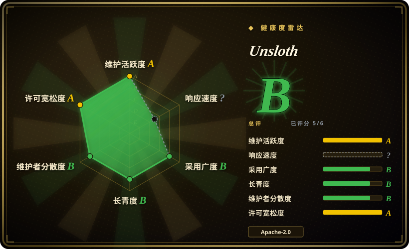
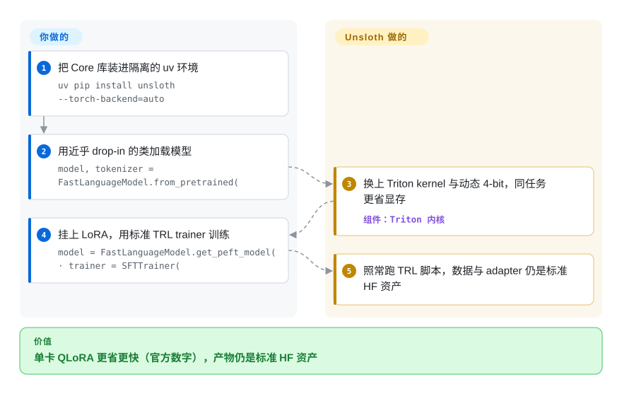

# Unsloth

单卡微调总是撞上 CUDA 显存不足，一个 epoch 慢到让人放弃迭代；训完还得另找工具把模型跑起来。Unsloth 是一个近乎 drop-in 的 Hugging Face 训练库，用手写 Triton kernel 与动态 4-bit 量化让同一个 LoRA/QLoRA 任务占用远更少显存、更快跑完（官方宣称「最高 2x 提速、最高省 70% 显存」）；2026 年起它长成三种形态：原生桌面应用、Studio 网页界面，以及原来的 Core Python 库。

## 何时使用

你是一名开发者或独立研究者，手头只有一张消费级或工作站 GPU（比如 RTX 4090，或免费的 Colab/Kaggle T4），想在自己的数据集上微调 Llama、Qwen、Mistral、Gemma 或 gpt-oss。用原生 Hugging Face + PEFT 时，你的 QLoRA 任务总是撞上 CUDA 显存不足，或者跑一个 epoch 慢到让迭代变得痛苦。Unsloth 在近乎 drop-in 的 `FastLanguageModel` API 背后换上自家 Triton kernel（RoPE、MLP、attention、padding-free packing）和动态 4-bit 量化，于是同一个 QLoRA 任务占用更少显存、更快跑完——官方宣称「最高 2x 提速、最高省 70% 显存」、GRPO 强化学习「省 80% 显存」、MoE 训练「快 12x」。

项目早已不只是一个库：README 的头牌现在是**原生桌面应用 Unsloth Desktop**（Windows/macOS/Linux，本地跑模型也训模型），旁边是 **Unsloth Studio**（自托管 Web UI，用 `curl -fsSL https://unsloth.ai/install.sh | sh` 一行装好，通过 OpenAI/Anthropic 兼容 API 对外服务，还能用 `unsloth start` 把本地模型接到 Claude Code、Codex 这类编码 agent）和 **Unsloth Core**（原来的代码库）。当你想要一个厂商打通整个闭环——在自己 GPU 上微调 LoRA、合并、导出 GGUF、同一台机器上服务给应用和 agent——而不是自己拼装 Hugging Face 生态零件时，选 Unsloth。除文本 LLM 外，文档还覆盖视觉、embedding、TTS 与扩散模型的训练。

## 怎么用起来

Unsloth 工作在你的训练脚本之下、代码与 GPU 之间。你写的仍是标准 Hugging Face 流程——加载模型、挂 LoRA、跑 `trl` 训练器——但 `FastLanguageModel` 把最热的计算改道到手写 Triton kernel（替代 PyTorch 默认 RoPE、MLP、attention 计算的 GPU 张量核心程序）、用无 padding 浪费的 packing 打包序列，并用自己的动态 4-bit 量化（把权重按分块缩放存成 4 bit，正是让 70B 形状的任务塞进单卡的东西）替换 bitsandbytes 的常规路径。收益是更省显存、更快的 QLoRA，官方称无精度损失。仍然归你管的：数据集格式化、超参数，以及多卡编排——官方文档给的路径是在 Accelerate/DeepSpeed 之上手动 `accelerate launch train.py`/`torchrun`。桌面应用与 Studio 网页则把同一个引擎加上基于 llama.cpp 的运行器（Vulkan/CUDA/ROCm/CPU 后端）包成不用写 Python 的形态。

<!-- flow-steps:begin (generated from flows/unsloth.json by tools/flow_card.py — do not edit) -->

流程文字版

1. **你**：把 Core 库装进隔离的 uv 环境 — `uv pip install unsloth --torch-backend=auto`
2. **你**：用近乎 drop-in 的类加载模型 — `model, tokenizer = FastLanguageModel.from_pretrained(`
3. **Unsloth**：换上 Triton kernel 与动态 4-bit，同任务更省显存 — 组件：`Triton 内核`
4. **你**：挂上 LoRA，用标准 TRL trainer 训练 — `model = FastLanguageModel.get_peft_model( · trainer = SFTTrainer(`
5. **Unsloth**：照常跑 TRL 脚本，数据与 adapter 仍是标准 HF 资产

**价值**：单卡 QLoRA 更省更快（官方数字），产物仍是标准 HF 资产

<!-- flow-steps:end -->

## 何时不用

- **即开即用的多卡/多机训练。** 开源文档确认多卡可用：经 Accelerate/DeepSpeed 走 FSDP 与 DDP——但同一篇文档也说「过程可能复杂、需要手动搭建」，更简单的官方多卡支持仍在路上。历史上多卡与付费层的纠葛也时有争论（见存疑）。今天就要打磨好的分片体验，选 [Axolotl](axolotl.zh.md) 或 [LlamaFactory](llamafactory.zh.md) 更稳。
- **大模型全参微调为主业。** README 列了全参微调，但它调优的舒适区是能塞进一两张卡的参数高效（LoRA/QLoRA）训练；需要真正分片基础设施的大规模全参微调，更适合 Axolotl/DeepSpeed 原生栈。[推断]
- **不受支持的架构。** 支持模型列表大但是经过筛选的；全新或冷门架构在维护者补上前可能没有优化 kernel。
- **对厂商形态有顾虑。** 这是初创公司产品（组织 `unslothai/`），头条性能数字是厂商宣称，且历史上围绕开源核心有商业产品线；免费与付费的分界线可能移动，投产前要为此留预算。
- **你只想本地跑模型。** Desktop/Studio 的服务路径与专门的本地运行时重叠；如果你永远不会微调，[Ollama](../llm-inference/local-runtimes/ollama.zh.md) 或 [llama.cpp](../llm-inference/local-runtimes/llama-cpp.zh.md) 的故事更简单。[推断：调优深度未实测]
- **想要完全配置驱动、可复现的团队工作流。** Unsloth 偏库/notebook/应用；[LlamaFactory](llamafactory.zh.md)（YAML + LlamaBoard UI）更面向团队与复现。
- **维护节奏风险。** 发布以近乎每日的 beta 线推进（v0.1.815-beta 发布于 2026-09-23，GitHub releases API）；请锁版本，因为 kernel/模型支持和 API 变动很快。

## 横向对比

| 替代品 | 是否收录 | 我们的评价 | 取舍 |
|---|---|---|---|
| [LLaMA-Factory](llamafactory.zh.md) | ✅ | 广泛方法／模型覆盖、YAML、Web UI 和多卡体验比单卡速度更重要时，选 LLaMA-Factory。 | 它甚至可把 Unsloth 当后端；Unsloth 范围更窄，但单卡更快。 |
| [ART](art.zh.md) | ✅ | 训练问题是多步 agent GRPO，包含任务、奖励和 rollout 编排时，选 ART。 | ART 是 agent-first；Unsloth 是通用微调／RL 加速层。 |
| [Agent Lightning](agent-lightning.zh.md) | ✅ | 现有 agent 需要以最小代码改动从执行轨迹中做 RL 时，选 Agent Lightning。 | 它解耦 agent 执行与训练；Unsloth 优化 kernel，而不是 agent 编排。 |
| [Axolotl](axolotl.zh.md) | ✅ | 超出单卡后需要一等公民式多卡 FSDP/DeepSpeed 和多模态支持时，选 Axolotl。 | 它更适合横向扩展工作流；Unsloth 胜在单卡速度和显存。 |
| [torchtune](torchtune.zh.md) | ✅ | 原生 PyTorch recipe 和显式 `torch.compile` 控制是优先项时，选 torchtune。 | 它更显式、更底层，但模型覆盖窄于 Unsloth 的精选快速路径。 |
| HF TRL（[trl](trl.zh.md)） | ✅ | Hugging Face 参考 SFT/DPO/GRPO trainer 比加速包装层更合适时，选 TRL。 | Unsloth 构建在 TRL 之上并用自定义 kernel 加速它；TRL 给你未加速但完全透明的路径。 |

## 技术栈

- **语言：** Core 为 Python，Studio UI 为 TypeScript。
- **核心加速：** 手写 Triton kernel（RoPE、MLP、attention）、padding-free packing、动态 4-bit 量化；FP8/16-bit/4-bit 训练路径。
- **训练方法：** LoRA、QLoRA、全参微调、继续预训练，以及经由近乎 drop-in 的 `FastLanguageModel`（叠加在 `transformers`/`trl` 上）做 RL（GRPO/DPO）；文档还覆盖 embedding、TTS 与扩散模型训练。
- **运行/服务路径：** 基于 llama.cpp 的运行器，支持 Vulkan/CUDA/ROCm/CPU 后端（安装时用 `UNSLOTH_LLAMA_CPP_BACKEND` 指定），OpenAI 与 Anthropic 兼容 API，另有 GGUF「Dynamic」量化模型下载。
- **形态：** Unsloth Core（代码库，Apache-2.0）、Unsloth Studio（Web UI）与 Unsloth Desktop（桌面应用）；README 的 License 一节写明仓库采用 Apache-2.0 + AGPL-3.0 双许可，Studio UI 部分属 AGPL-3.0。

## 依赖

- NVIDIA 走 PyTorch + CUDA（README 点名 RTX 30/40/50、Blackwell、DGX）；AMD 有 ROCm（专用镜像 `unsloth/unsloth-rocm` 与 AMD 指南），Intel GPU 与 CPU/Vulkan 也在 README 的支持清单里；Windows、Linux、WSL、macOS 全部点名支持。
- Triton（kernel 编译）。
- Hugging Face `transformers`、`peft`、`trl`、`datasets` 与 tokenizers。
- 4-bit 量化栈（Unsloth 自带动态 4-bit 变体，而非原样 bitsandbytes）。
- GGUF/运行路径底层是 llama.cpp（README 的致谢一节明确点名）。
- Core 推荐安装路径：Python 3.13 的隔离 uv 环境（`uv venv unsloth_env --python 3.13 · uv pip install unsloth --torch-backend=auto`）。

## 运维难度

**低到中。** 走它设计的路径——单卡、一个 Colab/Kaggle/notebook 或单脚本——难度低：装好、换成 `FastLanguageModel`、开训；桌面应用与一行装好的 Studio 把「低」推得更远（不写代码也能用）。当你在定制硬件上跟 CUDA/Triton/PyTorch 版本矩阵搏斗、或走文档已给但需手动搭建的多卡路径（`accelerate launch`/`torchrun`）时，难度升到中——该路径可用，但官方明确说还没打磨好。

## 健康度与可持续性

- **维护——非常活跃（截至 2026-09）。** 核查当天（2026-09-28）仓库仍有推送（GitHub API）；最新发布 v0.1.815-beta（2026-09-23），以近乎每日的 beta 节奏紧跟新模型。约 76.9k star 对应约 1,259 个未决 issue——量大，但与快速扩张的硬件/模型矩阵成比例。代价是 churn：kernel/模型支持和 API 变动很快，请锁版本。
- **治理与背书。** 组织所有（`unslothai/`）——有商业产品线的初创公司，而非基金会（见存疑）。Core、Studio 与桌面应用共享一条由厂商掌控的路线图；可持续性取决于公司跑道，免费与付费的分界线可能移动。
- **年龄与 Lindy 判断——年轻但快速证明自己（创建于 2023-11，约 2.8 年）。** 太年轻，给不了强 Lindy 先验；但约 76.9k star（GitHub API，2026-09-28）加上生态的重度使用，说明它已越过「到底有没有人用」这道坎；当作一个已立足但仍年轻的押注，而非十年稳态的对象 [推断]。
- **风险标志。** 一年内把头牌从「微调库」换成「能跑也能训的桌面应用」——形态与定位变动很快。开放核心谱系：头条性能数字是厂商宣称，开源核心周围有商业产品。双许可已写进 README（Apache-2.0 核心 + AGPL-3.0 的 Studio UI），把 Studio 组件嵌进闭源产品时要当回事。

## 存疑（未验证）

- [未验证] 具体的提速/省显存倍率（「2x 提速」「省 70% 显存」「GRPO 省 80% 显存」「MoE 快 12x」）均为 README 里的厂商宣称；真实收益取决于模型、序列长度、batch 大小和 GPU。
- [推断] 多卡问题本轮据官方文档裁决（`multi-gpu-training-with-unsloth`，2026-09-28 读取）：开源版经手动 `accelerate launch`/`torchrun` 支持 FSDP/DDP，「更简单的官方支持」待定——旧的「多卡完全锁在 Pro」第三方说法未再对照当前定价页核实。
- [推断] 「VC 资助初创」由组织形态、产品线与招聘信号推断；本轮未核实融资披露。
- [未验证] 各架构 kernel 覆盖与支持模型列表逐版本变动；README 点名的模型（Qwen3.8、Gemma 4、gpt-oss……）为 2026-09-28 读取——依赖具体模型前请核实其优化 kernel 支持。
- [推断] 把 AGPL-3.0 的 Studio 组件嵌入闭源产品的后果是 AGPL 的标准结论，不构成法律意见。
