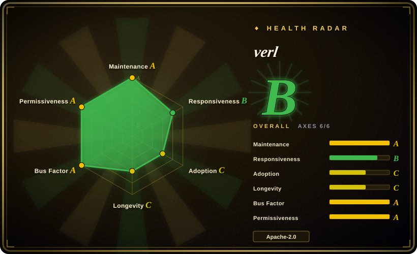
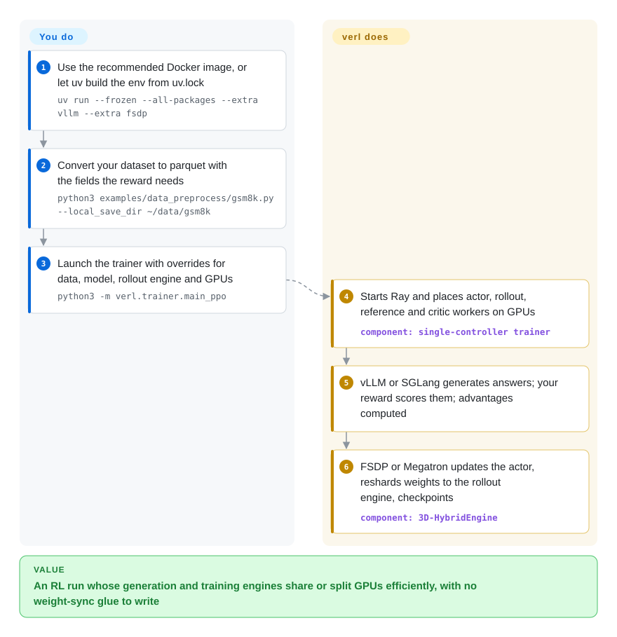

# verl

RL post-training a language model means two jobs fighting over the same GPUs — generating thousands of answers, then learning from their scores — with the model's weights shuttled between them every step; wired by hand, most GPUs sit idle waiting for the other half. verl (the open-source HybridFlow framework started by ByteDance Seed) describes the RL loop in a few lines of Python and maps generation, scoring and training onto pluggable engines across a Ray cluster, swapping the weights between them for you.

## When to use

You're on a post-training team with a GPU cluster — from one 8-GPU node up to dozens of nodes of H100s, AMD MI300X or Ascend NPUs — and you need to run PPO, GRPO, DAPO or a newer variant on a 7B–235B model, often with verifiable rewards (math answers, unit tests) or multi-turn tool-calling rollouts. A single-process trainer gets you started, but at this size the step log tells the story: `timing/gen` dwarfs `timing/update_actor`, generation runs on a slow Hugging Face `generate()`, or the 32B policy does not fit next to its reference model and critic. You reach for verl because it lets you put each role (actor, rollout, reference, critic, reward) on chosen GPUs, use vLLM or SGLang for generation and FSDP or Megatron-LM for training, and it reshards the weights between the two layouts without a full copy.

It is the general-purpose choice among the cluster-scale RL frameworks: over [Miles](miles.md) it keeps engine choice (vLLM *or* SGLang; FSDP, Megatron, VeOmni or TorchTitan backends) and a far larger recipe and community base; over [Hugging Face TRL](trl.md) it trades a `pip install` and a single launch for real multi-node rollout throughput. Many agent-RL projects (Agent Lightning, Search-R1, RAGEN, TinyZero) are built on it, so a paper's reproduction code is often a verl recipe.

## How it works

verl uses a *single controller*: one driver process holds the RL loop as ordinary Python (generate → score → compute advantages → update), while Ray (a framework for running Python actors across many machines) starts worker groups on the GPUs for each role. Per step, the rollout engine (vLLM or SGLang, both high-throughput inference servers) generates responses, your reward function or reward model scores them, the advantage — how much better each answer was than expected — is computed, and the training engine (FSDP or Megatron-LM, two ways of splitting a model across GPUs) updates the actor; then the new weights are pushed back into the rollout engine. Its "3D-HybridEngine" lets training and generation share the same GPUs and switch layouts without keeping two full copies of the weights. What verl does for you: worker placement, engine integration, weight resharding, checkpointing, logging. What stays yours: preparing the dataset as parquet with the fields the reward needs, writing or choosing the reward, and setting a long list of Hydra overrides (`data.*`, `actor_rollout_ref.*`, `trainer.*`) that size batches, parallelism and memory. Afterwards `verl.model_merger` turns a sharded checkpoint back into a Hugging Face model.

<!-- flow-steps:begin (generated from flows/verl.json by tools/flow_card.py — do not edit) -->

Text version of the flow

1. **You**: Use the recommended Docker image, or let uv build the env from uv.lock — `uv run --frozen --all-packages --extra vllm --extra fsdp`
2. **You**: Convert your dataset to parquet with the fields the reward needs — `python3 examples/data_preprocess/gsm8k.py --local_save_dir ~/data/gsm8k`
3. **You**: Launch the trainer with overrides for data, model, rollout engine and GPUs — `python3 -m verl.trainer.main_ppo`
4. **verl**: Starts Ray and places actor, rollout, reference and critic workers on GPUs — component: `single-controller trainer`
5. **verl**: vLLM or SGLang generates answers; your reward scores them; advantages computed
6. **verl**: FSDP or Megatron updates the actor, reshards weights to the rollout engine, checkpoints — component: `3D-HybridEngine`

**Value**: An RL run whose generation and training engines share or split GPUs efficiently, with no weight-sync glue to write

<!-- flow-steps:end -->

## When NOT to use

- **You only need SFT or DPO.** verl has an SFT trainer, but its reason to exist is the online RL loop. For supervised or preference tuning, [Hugging Face TRL](trl.md), [Axolotl](axolotl.md) or [LlamaFactory](llamafactory.md) need no Ray cluster and no parquet conversion.
- **One consumer GPU, or a quick experiment.** The quick start asks for a GPU with at least 24 GB, CUDA ≥ 12.8, and Docker or a uv-managed environment built from `uv.lock`. For single-GPU GRPO on a small model, use [Unsloth](unsloth.md) or TRL.
- **You want to train an existing agent from its live traces without writing a verl rollout.** [Agent Lightning](agent-lightning.md) wraps verl for exactly that, and [ART](art.md) offers a client-server loop with LLM-judge rewards.
- **You need a stable API across upgrades.** Minor releases land every 2–3 months (v0.7.0 2026-01 → v0.9.1 2026-09) with migrations (the `recipe/` directory moved to a separate repo in 2026-01; supported vLLM moved to ≥0.18); downstream projects pin it (Agent Lightning requires `verl>=0.7.1,<0.9.0`). Pin a release or a recipe's `REQUIRED_VERL.txt` commit and re-validate on upgrades; TRL changes faster but is lighter to re-test.
- **Your stack is committed to SGLang + Megatron and the MoE train/inference mismatch is your main failure.** [Miles](miles.md) narrows to that path and spends its effort on it (routing replay, token-in-token-out). verl has router replay too, but as one option among many.
- **AMD with SGLang.** On ROCm, vLLM is the validated rollout engine; the README says SGLang support there is still in progress.

## Comparison

| Alternative | In index | Our verdict | Tradeoff |
|---|---|---|---|
| [Miles](miles.md) | ✅ | Committed to SGLang + Megatron on large MoE models with train/inference mismatch as the main risk? Pick Miles; for engine choice, broader algorithms and a bigger recipe base, pick verl. | Miles goes deeper on one stack and churns faster; verl stays general and has the larger community. |
| [Hugging Face TRL](trl.md) | ✅ | For SFT/DPO/GRPO that fits data-parallel training on a few GPUs, pick TRL; once rollout throughput and cross-node sharding dominate cost, pick verl. | TRL installs from PyPI and runs in one launch; verl needs Ray and a heavy environment but scales generation and training separately. |
| OpenRLHF (OpenRLHF/OpenRLHF) | not indexed | For a Ray + vLLM + DeepSpeed team whose models fit without Megatron parallelism, OpenRLHF is the simpler alternative; pick verl when you need Megatron, SGLang or its recipe ecosystem. | Fewer backends and moving parts versus verl's broader engine matrix. Not reviewed in this sync. |
| NeMo RL (NVIDIA-NeMo/RL) | not indexed | Inside an NVIDIA/NeMo-aligned stack, consider NeMo RL; pick verl for vendor-neutral hardware coverage (AMD, Ascend) and community recipes. | NVIDIA roadmap backing versus a community project with broad hardware and engine support. Not reviewed in this sync. |
| [Agent Lightning](agent-lightning.md) | ✅ | To RL-train an agent you already run, with minimal code changes, pick Agent Lightning (it runs verl underneath); to own the RL loop and its rollout logic, use verl directly. | A thin agent-to-trainer layer versus full control, with Agent Lightning pinned to older verl versions. |

## Tech stack

- **Language:** Python; configs via Hydra (`key=value` overrides); orchestration via Ray.
- **Training backends:** FSDP, FSDP2, Megatron-LM; engine workers also for Automodel, VeOmni and TorchTitan.
- **Rollout backends:** vLLM, SGLang, Hugging Face Transformers; multi-turn tool-calling agent loops.
- **Algorithms:** PPO, GRPO, ReMax, REINFORCE++, RLOO, plus GSPO, DAPO, PRIME, DrGRPO and others as recipes in the separate `verl-recipe` repo; SFT; LoRA RL; model-based and function-based rewards; vision-language models.
- **Scale features:** expert parallelism up to 671B models, sequence packing, Ulysses sequence parallelism, Liger kernels, FSDP2 CPU offload.
- **Tracking:** wandb, swanlab, mlflow, tensorboard.

## Dependencies

- **Environment:** Python ≥3.10 (the uv workflow targets 3.12 on Linux x86_64/aarch64), CUDA ≥ 12.8; Docker images recommended, or `uv run` from `uv.lock` with one inference extra (`vllm` *or* `sglang`) plus one training extra (`fsdp` or `megatron`).
- **Core Python deps** (`verl[verl-core]`): `ray[default]>=2.41.0`, `transformers`, `accelerate`, `peft`, `datasets`, `hydra-core`, `tensordict`, `torchdata`, `pyarrow`, `wandb`, `tensorboard`, `fastapi`, `uvicorn`, `TransferQueue`, among others; backend extras pin torch 2.13.0 and a specific vLLM (0.29.0 in the `vllm` extra).
- **Hardware:** NVIDIA GPUs (≥24 GB for the quick start), AMD MI300X/MI325X/MI355X via ROCm images, Ascend NPUs via a separate requirements file and images.
- **Data:** datasets converted to parquet by a preprocessing script (`examples/data_preprocess/`).
- **Optional services:** experiment trackers, sandbox services for code rewards (Sandbox Fusion), search tools for agentic RL.

## Ops difficulty

**High.** A single-node run already involves a pinned CUDA/torch/vLLM-or-SGLang environment, a Ray runtime that every worker must share (`ray_kwargs.ray_init.runtime_env.py_executable` for uv), dataset conversion, and dozens of Hydra settings whose interactions decide whether you run out of memory. Multi-node adds a Ray cluster, fast interconnect, shared checkpoint storage and the choice of colocated versus separate GPU pools. Upgrades are re-validation exercises because backend versions move together. The upside is a large body of example scripts per model (`examples/grpo_trainer/run_*.sh`) and a performance-tuning guide.

## Health & viability

- **Maintenance — very active (as of 2026-10-08).** About 1,600 commits on main in the last 12 months, commits in all of the last 13 weeks, releases v0.7.0 (2026-01-05) through v0.9.1 (2026-09-20). Responsiveness improved to A on the radar this cycle: median first response on issues 17.0 h.
- **Governance & bus factor — broad.** Initiated by ByteDance Seed, moved in 2026-01 to the neutral `verl-project` org "maintained by the verl community"; 73 active maintainers in 12 months with the top contributor at 0.108 of commits — no single-person risk. Contributors listed in the README include Alibaba Qwen, NVIDIA, Moonshot AI, Microsoft Research and many universities.
- **Age & Lindy — young but entrenched.** The repo dates from 2024-10 (~2 years), so Lindy gives only modest credit; what compensates is its role as the default substrate for RL research code (DAPO, Seed-Thinking, Search-R1, TinyZero).
- **Adoption.** Measured PyPI pull is small (26,607 downloads in the last month, per the radar) because most users run from git, Docker images or recipe-pinned commits [推断]; ~23.8k stars and 4.7k forks reflect research usage better.
- **Risk flags.** Apache-2.0, no relicensing. ~1,300 open issues and PRs and fast-moving backends are the practical risk; Volcano Engine (ByteDance's cloud) promotes it, but the project is not gated behind a commercial tier.

## Caveats (unverified)

- [推断] That low PyPI downloads understate usage because people install from git, Docker or pinned commits is an inference from the install docs; no image-pull counts were checked.
- [未验证] Throughput and scale claims ("state-of-the-art throughput", 671B models on hundreds of GPUs) come from the README and talks; not reproduced.
- [未验证] OpenRLHF and NeMo RL descriptions come from prior knowledge and other index pages; neither repo was reread in this sync.
- [未验证] The organizations listed as adopters/contributors are the README's own list.
- [推断] "Not gated behind a commercial tier" means no paid edition was found in the repo or docs; Volcano Engine's hosted offerings were not reviewed.
