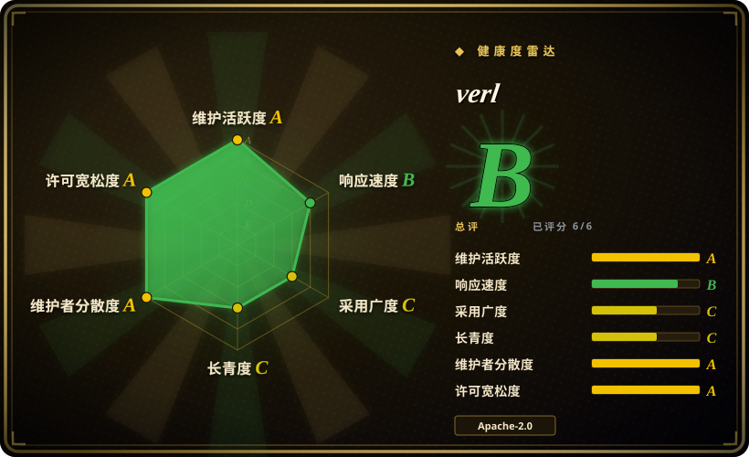
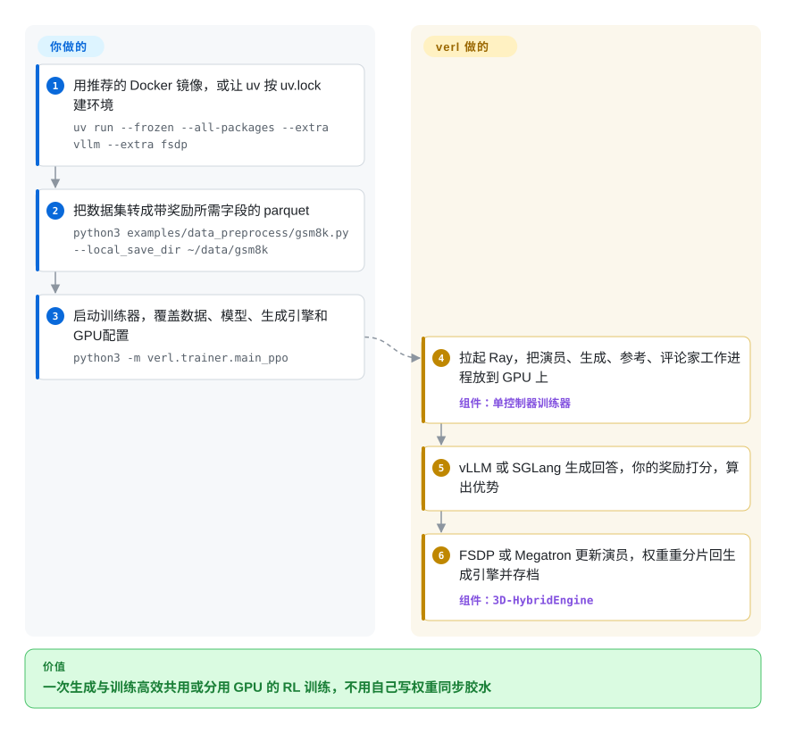

# verl

给大模型做强化学习后训练，是两件事在抢同一批 GPU：先生成成千上万个回答，再根据打分去学习，而且每一步都要把模型权重在两边之间搬来搬去；手工拼起来的话，大部分 GPU 都在干等另一半。verl（由字节跳动 Seed 团队发起的开源 HybridFlow 框架）用几行 Python 描述 RL 流程，把生成、打分、训练分派到 Ray 集群上可替换的引擎里，并替你在它们之间切换权重。

## 何时使用

你在一个有 GPU 集群的后训练团队里——从一台 8 卡机到几十台 H100、AMD MI300X 或昇腾 NPU——要在 7B 到 235B 的模型上跑 PPO、GRPO、DAPO 或更新的变体，奖励往往是可验证的（数学答案、单元测试），或者要做多轮工具调用的生成。单进程训练器能让你起步，但到了这个规模，步骤日志会说明问题：`timing/gen` 远大于 `timing/update_actor`，生成跑在慢吞吞的 Hugging Face `generate()` 上，或者 32B 策略模型和它的参考模型、评论家模型根本塞不进同一批卡。你选 verl，是因为它让你把每个角色（演员、生成、参考、评论家、奖励）放到指定的 GPU 上，生成用 vLLM 或 SGLang，训练用 FSDP 或 Megatron-LM，并且在两种布局之间重分片权重而不必整份复制。

在集群规模的 RL 框架里，它是通用型的那个：相对 [Miles](miles.zh.md)，它保留了引擎选择（vLLM 或 SGLang；FSDP、Megatron、VeOmni 或 TorchTitan 后端），配方和社区基础也大得多；相对 [Hugging Face TRL](trl.zh.md)，它放弃一句 `pip install` 和单次启动，换来真正的多机生成吞吐。很多智能体 RL 项目（Agent Lightning、Search-R1、RAGEN、TinyZero）都建在它之上，所以一篇论文的复现代码往往就是一个 verl 配方。

## 怎么用起来

verl 采用“单控制器”结构：一个驱动进程用普通 Python 写着 RL 循环（生成 → 打分 → 算优势 → 更新），Ray（一个把 Python 对象分布到多台机器上运行的框架）则在 GPU 上为每个角色拉起一组工作进程。每一步里，生成引擎（vLLM 或 SGLang，都是高吞吐推理服务）产出回答，你的奖励函数或奖励模型给它们打分，再算出优势——每个回答比预期好多少——然后训练引擎（FSDP 或 Megatron-LM，两种把模型切到多张 GPU 上的方式）更新演员模型，最后把新权重推回生成引擎。它的“3D-HybridEngine”让训练和生成可以共用同一批 GPU，切换布局时不必同时保留两份完整权重。verl 替你做的：工作进程放置、引擎集成、权重重分片、checkpoint、日志。你自己要做的：把数据集整理成带奖励所需字段的 parquet，写或选奖励函数，以及设置一长串 Hydra 覆盖参数（`data.*`、`actor_rollout_ref.*`、`trainer.*`），它们决定批大小、并行方式和显存占用。训练结束后，用 `verl.model_merger` 把分片 checkpoint 合回 Hugging Face 模型。

<!-- flow-steps:begin (generated from flows/verl.json by tools/flow_card.py — do not edit) -->

流程文字版

1. **你**：用推荐的 Docker 镜像，或让 uv 按 uv.lock 建环境 — `uv run --frozen --all-packages --extra vllm --extra fsdp`
2. **你**：把数据集转成带奖励所需字段的 parquet — `python3 examples/data_preprocess/gsm8k.py --local_save_dir ~/data/gsm8k`
3. **你**：启动训练器，覆盖数据、模型、生成引擎和 GPU 配置 — `python3 -m verl.trainer.main_ppo`
4. **verl**：拉起 Ray，把演员、生成、参考、评论家工作进程放到 GPU 上 — 组件：`单控制器训练器`
5. **verl**：vLLM 或 SGLang 生成回答，你的奖励打分，算出优势
6. **verl**：FSDP 或 Megatron 更新演员，权重重分片回生成引擎并存档 — 组件：`3D-HybridEngine`

**价值**：一次生成与训练高效共用或分用 GPU 的 RL 训练，不用自己写权重同步胶水

<!-- flow-steps:end -->

## 何时不用

- **你只需要 SFT 或 DPO。** verl 有 SFT 训练器，但它存在的理由是在线 RL 循环。监督或偏好微调用 [Hugging Face TRL](trl.zh.md)、[Axolotl](axolotl.zh.md) 或 [LlamaFactory](llamafactory.zh.md)，不需要 Ray 集群，也不用转 parquet。
- **只有一张消费级显卡，或者只是快速试验。** 快速上手要求至少 24 GB 显存、CUDA ≥ 12.8，以及 Docker 或由 `uv.lock` 构建的 uv 环境。小模型的单卡 GRPO 用 [Unsloth](unsloth.zh.md) 或 TRL。
- **你想用现有智能体的真实轨迹来训练它，又不想写 verl 的生成逻辑。** [Agent Lightning](agent-lightning.zh.md) 就是为此包装了 verl；[ART](art.zh.md) 提供带大模型裁判奖励的客户端—服务端循环。
- **你需要跨升级稳定的 API。** 小版本每 2–3 个月一发（2026-01 的 v0.7.0 到 2026-09 的 v0.9.1），伴随迁移（2026-01 把 `recipe/` 目录拆到独立仓库；支持的 vLLM 提到 ≥0.18）；下游项目都锁版本（Agent Lightning 要求 `verl>=0.7.1,<0.9.0`）。锁定一个发布版本或配方 `REQUIRED_VERL.txt` 里的提交，升级时重新验证；TRL 变得更快，但重新测试更轻。
- **你已认定 SGLang + Megatron，且 MoE 训推不一致是主要故障。** [Miles](miles.zh.md) 只走这一条路并在上面下足功夫（路由重放、token 进 token 出）。verl 也有路由重放，但只是众多选项之一。
- **AMD 卡上用 SGLang。** 在 ROCm 上，经过验证的生成引擎是 vLLM；README 写明 SGLang 在 ROCm 上的支持仍在进行中。

## 横向对比

| 替代品 | 是否收录 | 我们的评价 | 取舍 |
|---|---|---|---|
| [Miles](miles.zh.md) | ✅ | 在大型 MoE 模型上认定 SGLang + Megatron、训推不一致是主要风险时，选 Miles；要引擎选择、更广的算法和更大的配方库，选 verl。 | Miles 在单一技术栈上挖得更深、变动更快；verl 保持通用，社区更大。 |
| [Hugging Face TRL](trl.zh.md) | ✅ | SFT／DPO／GRPO 用几张卡的数据并行就装得下时，选 TRL；一旦生成吞吐和跨节点切分成为主要成本，选 verl。 | TRL 从 PyPI 安装、一次启动即可；verl 需要 Ray 和沉重的环境，但能把生成和训练分开扩展。 |
| OpenRLHF（OpenRLHF/OpenRLHF） | 未收录 | 团队用 Ray + vLLM + DeepSpeed、模型不需要 Megatron 并行时，OpenRLHF 是更简单的替代；需要 Megatron、SGLang 或 verl 的配方生态时，选 verl。 | 后端和组件更少，对比 verl 更宽的引擎矩阵。本次同步未复核。 |
| NeMo RL（NVIDIA-NeMo/RL） | 未收录 | 在与 NVIDIA／NeMo 绑定的技术栈里，可以考虑 NeMo RL；需要不绑厂商的硬件覆盖（AMD、昇腾）和社区配方时，选 verl。 | NVIDIA 路线图背书，对比一个硬件和引擎支持面更广的社区项目。本次同步未复核。 |
| [Agent Lightning](agent-lightning.zh.md) | ✅ | 想以最少的代码改动对已在运行的智能体做 RL 训练，选 Agent Lightning（底层就是 verl）；想自己掌控 RL 循环和生成逻辑，直接用 verl。 | 一层薄薄的智能体到训练器的桥接，对比完全掌控；而且 Agent Lightning 锁在较旧的 verl 版本上。 |

## 技术栈

- **语言：** Python；配置用 Hydra（`key=value` 覆盖）；编排用 Ray。
- **训练后端：** FSDP、FSDP2、Megatron-LM；另有 Automodel、VeOmni、TorchTitan 的引擎工作进程。
- **生成后端：** vLLM、SGLang、Hugging Face Transformers；支持多轮工具调用的智能体循环。
- **算法：** PPO、GRPO、ReMax、REINFORCE++、RLOO，以及放在独立 `verl-recipe` 仓库里的 GSPO、DAPO、PRIME、DrGRPO 等配方；SFT；LoRA RL；基于模型和基于函数的奖励；视觉语言模型。
- **规模特性：** 专家并行可到 671B 模型，序列打包，Ulysses 序列并行，Liger 算子，FSDP2 CPU 卸载。
- **实验追踪：** wandb、swanlab、mlflow、tensorboard。

## 依赖

- **环境：** Python ≥3.10（uv 工作流以 Linux x86_64／aarch64 上的 3.12 为目标），CUDA ≥ 12.8；推荐用 Docker 镜像，或从 `uv.lock` 执行 `uv run`，选一个推理附加依赖（`vllm` 或 `sglang`）加一个训练附加依赖（`fsdp` 或 `megatron`）。
- **核心 Python 依赖**（`verl[verl-core]`）：`ray[default]>=2.41.0`、`transformers`、`accelerate`、`peft`、`datasets`、`hydra-core`、`tensordict`、`torchdata`、`pyarrow`、`wandb`、`tensorboard`、`fastapi`、`uvicorn`、`TransferQueue` 等；后端附加依赖锁定 torch 2.13.0 和特定的 vLLM（`vllm` 附加依赖里是 0.29.0）。
- **硬件：** NVIDIA GPU（快速上手需 ≥24 GB），通过 ROCm 镜像支持 AMD MI300X／MI325X／MI355X，通过单独的依赖文件和镜像支持昇腾 NPU。
- **数据：** 用预处理脚本（`examples/data_preprocess/`）把数据集转成 parquet。
- **可选服务：** 实验追踪服务、代码类奖励用的沙箱服务（Sandbox Fusion）、智能体 RL 用的搜索工具。

## 运维难度

**高。** 单机跑一次就已经涉及：锁版本的 CUDA／torch／vLLM 或 SGLang 环境，所有工作进程必须共享的 Ray 运行时（uv 下要设 `ray_kwargs.ray_init.runtime_env.py_executable`），数据集转换，以及几十个相互影响、决定会不会爆显存的 Hydra 参数。多机还要加上 Ray 集群、高速互联、共享的 checkpoint 存储，以及共置还是分开 GPU 池的选择。各后端版本一起变动，所以升级就是重新验证。好处是每个模型都有大量示例脚本（`examples/grpo_trainer/run_*.sh`），还有一份性能调优指南。

## 健康度与可持续性

- **维护——非常活跃（截至 2026-10-08）。** 过去 12 个月主分支约 1,600 次提交，最近 13 周每周都有提交，发布从 v0.7.0（2026-01-05）到 v0.9.1（2026-09-20）。本轮雷达的响应速度升到 A：issue 首次响应中位数 17.0 小时。
- **治理与 bus factor——分散。** 由字节跳动 Seed 发起，2026-01 迁到中立的 `verl-project` 组织，“由 verl 社区维护”；12 个月内有 73 位活跃维护者，头号贡献者只占 0.108 的提交——没有单人风险。README 列出的参与方包括阿里通义千问、NVIDIA、月之暗面、微软研究院和多所大学。
- **年龄与 Lindy——年轻但已扎根。** 仓库始于 2024-10（约 2 年），Lindy 只给少量加分；弥补它的是它作为 RL 研究代码默认底座的地位（DAPO、Seed-Thinking、Search-R1、TinyZero）。
- **采用度。** 雷达测到的 PyPI 拉取量不大（上个月 26,607 次下载），因为多数用户从 git、Docker 镜像或配方锁定的提交安装 [推断]；约 23.8k stars、4.7k forks 更能反映研究圈的使用。
- **风险信号。** Apache-2.0，无改协议历史。实际风险是约 1,300 个未关闭的 issue 和 PR，以及快速变动的后端；火山引擎（字节跳动的云）在推广它，但项目没有被锁在商业版本后面。

## 存疑（未验证）

- [推断] PyPI 下载量低估了实际使用、因为大家从 git、Docker 或锁定提交安装——这是根据安装文档推断的，没有查镜像拉取量。
- [未验证] 吞吐和规模宣称（“业界领先吞吐”、数百张 GPU 上跑 671B 模型）来自 README 和演讲，未复现。
- [未验证] 对 OpenRLHF 和 NeMo RL 的描述来自既有认知和索引内其他页面，本次同步没有重读这两个仓库。
- [未验证] 列为使用者／贡献者的机构来自 README 自己的名单。
- [推断] “没有被锁在商业版本后面”指在仓库和文档里没找到付费版；火山引擎的托管服务没有评估。
