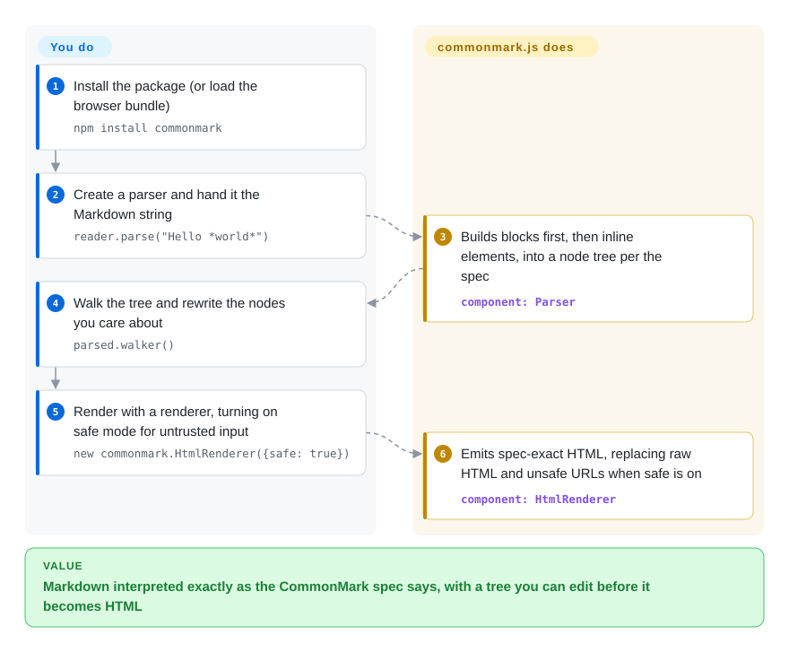

# CommonMark

The same Markdown file renders differently in two tools — a nested list collapses, `*emphasis*` next to punctuation stays literal — and you cannot tell which tool is wrong. commonmark.js is the JavaScript reference implementation of the CommonMark spec, written by the spec's author: it parses Markdown into a tree you can inspect and edit, then renders it to HTML exactly as the spec says.

## When to use

You're building something where "what does the spec say this Markdown means?" is the question: a new Markdown parser or linter that must agree with CommonMark, a conformance test harness, an editor that shows the document structure, or a migration tool that rewrites old docs. Your current renderer turns `- a\n - b` into one flat list while GitHub nests it, and you need a ground truth to compare against. You import commonmark.js, feed it the edge case, and inspect the tree it produces — its author, John MacFarlane, also wrote the spec, and the library tracks spec 0.31.2 with the spec's own test suite.

The second reason to pick it is the tree itself. Instead of turning Markdown straight into an HTML string, it gives you a node tree (`document`, `paragraph`, `emph`, `link`, `code_block`…) with a walker you can use to rewrite nodes — de-linkify, strip raw HTML, run code blocks through a highlighter — before rendering with the built-in HTML or XML renderer. Over [markdown-it](markdown-it.md) or [marked](marked.md) you gain strict spec behaviour and an editable tree; over [remark](remark.md) you get a single small library instead of a plugin ecosystem. The price is CommonMark only: no tables, task lists or strikethrough.

## How it works

Parsing follows the two phases the spec itself describes: first the lines are split into blocks (paragraphs, lists, quotes, code blocks) and link reference definitions are collected; then the text inside each paragraph and heading is parsed into inline elements such as emphasis, links and code spans. The result is an abstract syntax tree — a tree of node objects, each with a type, its children and source positions. What commonmark.js does for you: the spec's parsing rules, including the hard cases (emphasis next to punctuation, lazy continuation lines, link reference resolution), plus two renderers (HTML and an XML dump of the tree) and a `commonmark` command-line tool. What stays yours: any transformation of the tree, any Markdown extension (it has no plugin API), and safety — raw HTML and `javascript:` links pass through unless you turn on the renderer's `safe` option or run the output through a sanitizer. Think of it as the dictionary that other renderers are checked against, not the fastest press for printing pages.

<!-- flow-steps:begin (generated from flows/commonmark.json by tools/flow_card.py — do not edit) -->

Text version of the flow

1. **You**: Install the package (or load the browser bundle) — `npm install commonmark`
2. **You**: Create a parser and hand it the Markdown string — `reader.parse("Hello *world*")`
3. **CommonMark**: Builds blocks first, then inline elements, into a node tree per the spec — component: `Parser`
4. **You**: Walk the tree and rewrite the nodes you care about — `parsed.walker()`
5. **You**: Render with a renderer, turning on safe mode for untrusted input — `new commonmark.HtmlRenderer({safe: true})`
6. **CommonMark**: Emits spec-exact HTML, replacing raw HTML and unsafe URLs when safe is on — component: `HtmlRenderer`

**Value**: Markdown interpreted exactly as the CommonMark spec says, with a tree you can edit before it becomes HTML

<!-- flow-steps:end -->

## When NOT to use

- **You need GitHub Flavored Markdown (tables, task lists, strikethrough, extended autolinks).** commonmark.js implements CommonMark only and has no extension API. Use [markdown-it](markdown-it.md) (GFM tables/strikethrough plus plugins) or [remark](remark.md) with `remark-gfm`.
- **You need a plugin ecosystem — math, footnotes, containers, syntax highlighting as plugins.** There is none; you would write tree transforms yourself. markdown-it or remark/[micromark](micromark.md) have large plugin catalogs.
- **You render untrusted user input and plan to use the defaults.** By default raw HTML passes through and link URLs are not sanitized (the README's security note). Set `new commonmark.HtmlRenderer({safe: true})` and still run a sanitizer such as DOMPurify for defense in depth — or choose a renderer whose defaults disable HTML, such as markdown-it (`html: false` by default).
- **You need the reference implementation for a non-JavaScript stack.** The C reference implementation, cmark (not indexed), is the one embedded in many languages and much faster; in Go, use [Goldmark](goldmark.md).
- **You need speed beyond "on par with marked".** The README's benchmarks are from 2015 (commonmark.js 0.22 vs marked 0.3.5); modern markdown-it and marked have changed since, and no current numbers were found. If throughput matters, benchmark, and consider cmark via native bindings.

## Comparison

| Alternative | In index | Our verdict | Tradeoff |
|---|---|---|---|
| [markdown-it](markdown-it.md) | ✅ | For production Markdown→HTML in JS with GFM tables and plugins, pick markdown-it; pick commonmark.js when spec-exact output and an editable node tree matter more than extensions. | markdown-it is CommonMark-compliant plus extensions and safer defaults; it exposes a token stream rather than a nested node tree. |
| [marked](marked.md) | ✅ | When you just want a fast one-call renderer with GFM on by default, pick marked; pick commonmark.js when you must match the spec on edge cases. | marked prioritizes speed and simplicity and is not spec-strict; commonmark.js gives up GFM for spec fidelity. |
| [remark](remark.md) | ✅ | For an AST pipeline that lints, transforms and re-serializes Markdown with many plugins, pick remark; pick commonmark.js for a single dependency-light parser plus renderer. | remark's mdast ecosystem is far broader but heavier and multi-package; commonmark.js is one small package with three dependencies. |
| [micromark](micromark.md) | ✅ | If you need a low-level, extensible CommonMark tokenizer (with GFM via extensions) to build your own tooling, pick micromark; pick commonmark.js when you want a ready node tree and renderer. | micromark is the extensible engine under remark; you assemble the tree and rendering layers yourself. |
| cmark (commonmark/cmark) | not indexed | For the reference implementation outside JavaScript, or when parsing speed matters, pick cmark; pick commonmark.js for in-browser or Node use without native code. | Same author and spec; cmark is C with bindings in many languages, commonmark.js is pure JavaScript. |

## Tech stack

- **Language:** JavaScript; source in ES modules under `lib/`, with a CommonJS bundle in `dist/` built by Rollup, so it runs in Node.js and browsers.
- **API:** `Parser` (option `smart` for typographic quotes and dashes), `HtmlRenderer` and `XmlRenderer` (options `safe`, `sourcepos`, `softbreak`, `esc`), `Node` with tree-editing methods, and `NodeWalker` for traversal.
- **CLI:** a `commonmark` executable that converts files or stdin to HTML.
- **Spec alignment:** tracks CommonMark spec 0.31.2 (released 2024-01-28); the test suite runs the spec's examples.

## Dependencies

- **Runtime:** three small npm packages — `entities` (HTML entity decoding), `mdurl` (URL encoding) and `minimist` (CLI argument parsing).
- **Install:** `npm install commonmark`, or load `dist/commonmark.js` / `commonmark.min.js` in the browser (also served by unpkg).
- **Output safety:** no sanitizer is bundled; use the `safe` renderer option and/or an HTML sanitizer for untrusted input.

## Ops difficulty

**Low.** A library with no server, database or native build step. The operational work is choosing and enforcing the `safe` option (or a sanitizer) for user content, and writing your own tree transforms for anything beyond core CommonMark. Upgrades are infrequent and follow spec revisions.

## Health & viability

- **Maintenance — slow, steady, spec-driven (as of 2026-10-08).** The last release is 0.31.2 (2024-09-19), but fixes keep landing on master (entities inside autolinks and reference-label case folding in 2026-09). The radar's maintenance B reflects commits in 4 of the last 13 weeks.
- **Governance & bus factor — one author at heart.** John MacFarlane (jgm) holds ~926 of the commits; recent fixes come from a handful of contributors. The radar's governance A measures the last 12 months' spread among 6 active maintainers, which overstates the bus factor for long-term evolution [推断].
- **Age & Lindy — strong.** Repo created 2015-01 (CommonMark itself dates from 2014), still receiving fixes after more than a decade: old and still active.
- **Adoption.** 2,771,418 npm downloads in the last month and 6,702 dependent repositories per the radar — far more production use than its "reference implementation" label suggests.
- **Risk flags.** BSD-2-Clause (the `LICENSE` file is the two-clause text; GitHub reports `NOASSERTION`, which is why the radar's license axis is `?`). No relicensing, no commercial tier. The real risk is scope: it will stay CommonMark-only.

## Caveats (unverified)

- [未验证] Performance relative to current markdown-it and marked is unknown; the only published numbers are the README's 2015 benchmarks.
- [推断] The bus-factor reading rests on lifetime commit counts (jgm ~926 of ~1,000); it does not measure who reviews or triages issues.
- [未验证] Whether `safe: true` covers every XSS vector of concern (e.g. attribute injection through renderer customizations) was not tested; the README itself recommends a sanitizer as the alternative.
- [推断] Dependent-repository and download counts include transitive use through other packages, so they overstate direct choice of commonmark.js.
