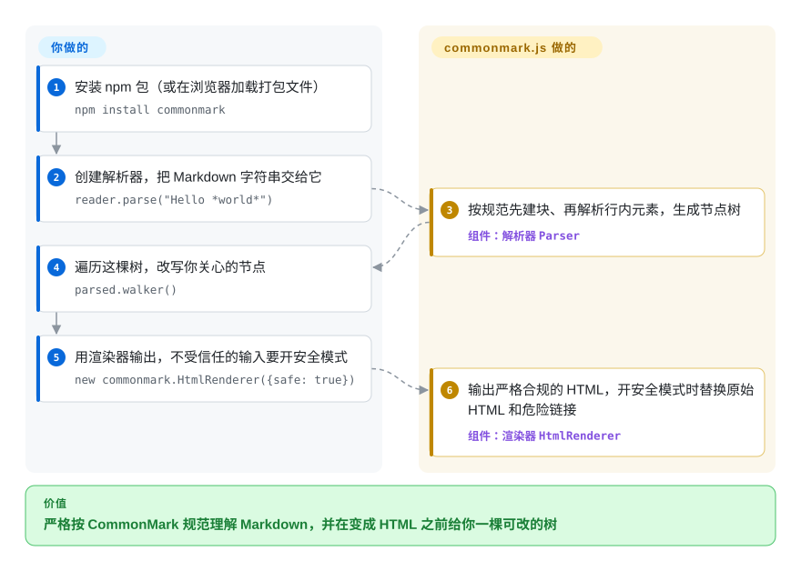

# CommonMark

同一份 Markdown 在两个工具里渲染得不一样——嵌套列表被压平了，紧挨标点的 `*强调*` 原样露出星号——而你判断不了到底是哪个工具错了。commonmark.js 是 CommonMark 规范的 JavaScript 参考实现，由规范作者本人编写：它把 Markdown 解析成一棵你能查看、能修改的树，再严格按规范渲染成 HTML。

## 何时使用

你在做的东西，核心问题是“按规范这段 Markdown 到底是什么意思”：一个必须和 CommonMark 一致的新解析器或 linter、一套合规测试工具、一个展示文档结构的编辑器，或者一个改写旧文档的迁移工具。你现有的渲染器把 `- a\n - b` 渲染成一个平铺列表，GitHub 却把它嵌套了，你需要一个可以对照的标准答案。你引入 commonmark.js，把这个边界情况喂进去，检查它生成的树——它的作者 John MacFarlane 也是规范的作者，库跟踪的是规范 0.31.2，并用规范自带的测试用例做测试。

选它的第二个理由是这棵树本身。它不是把 Markdown 直接变成一串 HTML，而是给你一棵节点树（`document`、`paragraph`、`emph`、`link`、`code_block`……），配一个遍历器，你可以在渲染前改写节点——去掉链接、剥离原始 HTML、把代码块交给高亮库——再用内置的 HTML 或 XML 渲染器输出。相对 [markdown-it](markdown-it.zh.md) 或 [marked](marked.zh.md)，你得到严格的规范行为和一棵可编辑的树；相对 [remark](remark.zh.md)，你得到的是一个小巧的单一库，而不是一整套插件生态。代价是只有 CommonMark：没有表格、任务列表和删除线。

## 怎么用起来

解析按规范自己描述的两个阶段进行：先把各行切分成块（段落、列表、引用、代码块），同时收集链接引用定义；再把每个段落和标题里的文字解析成行内元素，比如强调、链接和代码片段。结果是一棵抽象语法树——由节点对象组成的树，每个节点有类型、子节点和源码位置。commonmark.js 替你做的：规范的全部解析规则，包括最难的那些（紧挨标点的强调、惰性续行、链接引用解析），外加两个渲染器（HTML，以及把树导出成 XML）和一个 `commonmark` 命令行工具。你自己要做的：对树的任何改写、任何 Markdown 扩展（它没有插件 API），以及安全——原始 HTML 和 `javascript:` 链接默认会原样通过，除非你打开渲染器的 `safe` 选项，或者把输出交给消毒器处理。可以把它想成其他渲染器拿来对照的那本词典，而不是印得最快的那台印刷机。

<!-- flow-steps:begin (generated from flows/commonmark.json by tools/flow_card.py — do not edit) -->

流程文字版

1. **你**：安装 npm 包（或在浏览器加载打包文件） — `npm install commonmark`
2. **你**：创建解析器，把 Markdown 字符串交给它 — `reader.parse("Hello *world*")`
3. **CommonMark**：按规范先建块、再解析行内元素，生成节点树 — 组件：`解析器 Parser`
4. **你**：遍历这棵树，改写你关心的节点 — `parsed.walker()`
5. **你**：用渲染器输出，不受信任的输入要开安全模式 — `new commonmark.HtmlRenderer({safe: true})`
6. **CommonMark**：输出严格合规的 HTML，开安全模式时替换原始 HTML 和危险链接 — 组件：`渲染器 HtmlRenderer`

**价值**：严格按 CommonMark 规范理解 Markdown，并在变成 HTML 之前给你一棵可改的树

<!-- flow-steps:end -->

## 何时不用

- **你需要 GitHub Flavored Markdown（表格、任务列表、删除线、扩展自动链接）。** commonmark.js 只实现 CommonMark，也没有扩展 API。改用 [markdown-it](markdown-it.zh.md)（自带 GFM 表格和删除线，另有插件）或配合 `remark-gfm` 的 [remark](remark.zh.md)。
- **你需要插件生态——数学公式、脚注、容器块、作为插件的语法高亮。** 它没有插件生态，你只能自己写树变换。markdown-it 或 remark／[micromark](micromark.zh.md) 有庞大的插件目录。
- **你要渲染不受信任的用户输入，还打算用默认配置。** 默认情况下原始 HTML 会透传、链接 URL 不做消毒（README 的安全说明）。设置 `new commonmark.HtmlRenderer({safe: true})`，并且仍然套一层 DOMPurify 之类的消毒器做纵深防御——或者选一个默认禁用 HTML 的渲染器，比如 markdown-it（默认 `html: false`）。
- **你需要在非 JavaScript 技术栈里使用参考实现。** C 语言参考实现 cmark（未收录）被嵌入到许多语言中，而且快得多；Go 项目用 [Goldmark](goldmark.zh.md)。
- **你需要的速度超出“与 marked 相当”。** README 里的基准测试是 2015 年的（commonmark.js 0.22 对 marked 0.3.5）；现代的 markdown-it 和 marked 早已变化，没找到当前的数据。吞吐量重要的话自己测，并考虑通过原生绑定使用 cmark。

## 横向对比

| 替代品 | 是否收录 | 我们的评价 | 取舍 |
|---|---|---|---|
| [markdown-it](markdown-it.zh.md) | ✅ | 在 JS 里做生产级 Markdown→HTML、需要 GFM 表格和插件时，选 markdown-it；当严格合规的输出和可编辑的节点树比扩展更重要时，选 commonmark.js。 | markdown-it 在合规之外还有扩展和更安全的默认值；它暴露的是 token 流，而不是嵌套节点树。 |
| [marked](marked.zh.md) | ✅ | 只想要一个默认开启 GFM、一次调用就出结果的快速渲染器，选 marked；必须在边界情况上与规范一致时，选 commonmark.js。 | marked 优先速度和简单，不严格遵循规范；commonmark.js 为了规范保真放弃了 GFM。 |
| [remark](remark.zh.md) | ✅ | 需要一条能 lint、变换、再序列化 Markdown 且插件众多的 AST 管线时，选 remark；想要一个依赖很少的解析器加渲染器时，选 commonmark.js。 | remark 的 mdast 生态宽得多，但更重、由多个包组成；commonmark.js 是一个只有三个依赖的小包。 |
| [micromark](micromark.zh.md) | ✅ | 需要一个底层、可扩展的 CommonMark 分词器（GFM 通过扩展获得）来搭自己的工具时，选 micromark；想要现成的节点树和渲染器时，选 commonmark.js。 | micromark 是 remark 底下那个可扩展引擎；树和渲染层要你自己搭。 |
| cmark（commonmark/cmark） | 未收录 | 在 JavaScript 之外需要参考实现，或解析速度很重要时，选 cmark；在浏览器或 Node 里、不想引入原生代码时，选 commonmark.js。 | 同一作者、同一规范；cmark 用 C 写成、有多种语言绑定，commonmark.js 是纯 JavaScript。 |

## 技术栈

- **语言：** JavaScript；源码是 `lib/` 下的 ES 模块，由 Rollup 打包出 `dist/` 里的 CommonJS 版本，Node.js 和浏览器都能用。
- **API：** `Parser`（选项 `smart` 把直引号和连字符变成印刷体）、`HtmlRenderer` 和 `XmlRenderer`（选项 `safe`、`sourcepos`、`softbreak`、`esc`）、带树编辑方法的 `Node`，以及用于遍历的 `NodeWalker`。
- **命令行：** `commonmark` 可执行文件，把文件或标准输入转成 HTML。
- **规范对齐：** 跟踪 CommonMark 规范 0.31.2（2024-01-28 发布）；测试套件运行规范里的示例。

## 依赖

- **运行时：** 三个小型 npm 包——`entities`（HTML 实体解码）、`mdurl`（URL 编码）和 `minimist`（命令行参数解析）。
- **安装：** `npm install commonmark`，或在浏览器里加载 `dist/commonmark.js`／`commonmark.min.js`（unpkg 也有托管）。
- **输出安全：** 没有内置消毒器；处理不受信任的输入时，用 `safe` 渲染选项和／或 HTML 消毒器。

## 运维难度

**低。** 它是一个库，没有服务器、数据库，也没有原生编译步骤。运维上要做的是：为用户内容选定并强制使用 `safe` 选项（或消毒器），以及为核心 CommonMark 之外的需求自己写树变换。升级不频繁，跟随规范修订。

## 健康度与可持续性

- **维护——缓慢、稳定、由规范驱动（截至 2026-10-08）。** 最新发布是 0.31.2（2024-09-19），但修复仍在不断合入 master（2026-09 修了自动链接里的实体，以及引用标签的大小写折叠）。雷达维护轴的 B 反映的是最近 13 周里有 4 周有提交。
- **治理与 bus factor——本质上是单一作者。** John MacFarlane（jgm）贡献了约 926 次提交；近期修复来自少数几位贡献者。雷达治理轴的 A 衡量的是过去 12 个月里 6 位活跃维护者之间的分布，高估了长期演进上的 bus factor [推断]。
- **年龄与 Lindy——强。** 仓库创建于 2015-01（CommonMark 本身始于 2014 年），十多年后仍在接收修复：又老又仍活跃。
- **采用度。** 据雷达，上个月 npm 下载 2,771,418 次，依赖仓库 6,702 个——生产使用远比“参考实现”这个标签暗示的多。
- **风险信号。** BSD-2-Clause（`LICENSE` 文件是两条款文本；GitHub 报告为 `NOASSERTION`，所以雷达的许可证轴是 `?`）。无改协议历史，无商业版本。真正的风险是范围：它会一直只做 CommonMark。

## 存疑（未验证）

- [未验证] 相对当前 markdown-it 和 marked 的性能未知；唯一公开的数据是 README 里 2015 年的基准测试。
- [推断] bus factor 的判断基于累计提交数（jgm 约占 1,000 次中的 926 次）；它衡量不了谁在审阅和分拣 issue。
- [未验证] 没有测试 `safe: true` 是否覆盖你关心的所有 XSS 途径（例如经自定义渲染器注入属性）；README 本身也把消毒器列为另一种做法。
- [推断] 依赖仓库数和下载量包含经由其他包的间接使用，因此高估了直接选用 commonmark.js 的程度。
