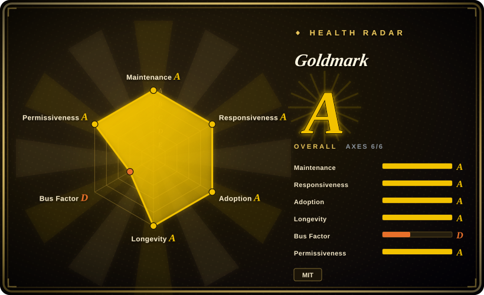
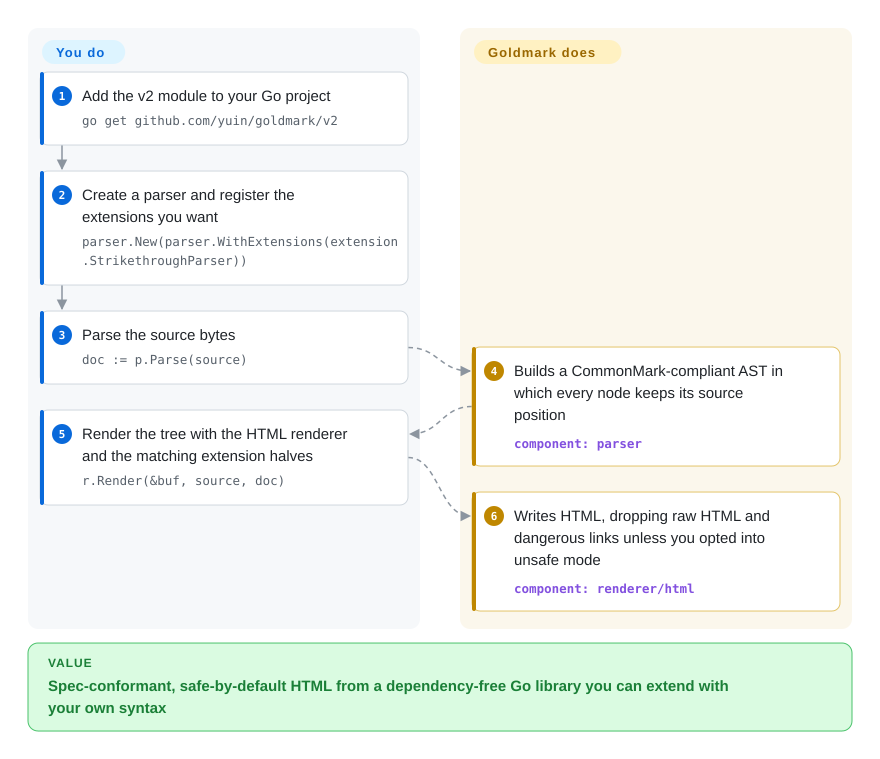

# Goldmark

Your Go program has to turn Markdown into HTML, and the Go parser you have either renders some documents differently from GitHub and every other CommonMark (the de-facto Markdown spec) tool, or leaves `これは**「重要」**です。` un-bolded, or gives you no clean way to add your own `@mention` syntax. Goldmark is a standard-library-only Go parser that follows CommonMark 0.31.2, ships GFM extensions and CJK-specific switches, and lets you plug in your own parsers, AST transforms and renderers.

## When to use

You maintain a Go service or tool that renders Markdown someone else wrote — a docs or blog generator, a wiki/CMS backend, a CLI that previews README files, a chat bot that formats replies. Your current parser (often the older `blackfriday`) drifts from what GitHub shows: a nested list collapses, a link with parentheses breaks, and Chinese or Japanese authors complain that `**「重要」**` stays literal asterisks. You reach for Goldmark because it is the CommonMark-compliant default of the Go ecosystem (Hugo's Markdown engine is Goldmark v1), it adds tables, strikethrough, task lists, footnotes and definition lists as built-in extensions, it offers explicit CJK switches (`parser.WithParseDelimiterFunc`, `parser.WithEscapedSpace`, East-Asian line-break strategies), and it pulls in no third-party Go modules.

Pick it over `gomarkdown/markdown` when spec conformance and an extension API matter more than staying on a blackfriday-shaped API; pick it over Lute when you want a plain library rather than an editor-oriented engine. Since v2 (2026-08-27) it also keeps source positions and the concrete syntax used on every node, so it is the Go choice when you need to analyse or rewrite Markdown, not just render it — for example in an LSP server or an agent tool that edits `.md` files.

## How it works

Goldmark separates two jobs. The parser walks your bytes once and builds an AST — a tree of typed nodes (heading, paragraph, link, emphasis) that remembers where in the source each one came from; the renderer walks that tree and writes HTML into an `io.Writer`. What it does for you: the whole CommonMark algorithm, the built-in GFM-style extensions, and safe defaults — raw HTML and `javascript:`-style links are dropped unless you pass `html.WithUnsafe()`. What you do: choose which extensions to register on the parser *and* the matching renderer halves (each extension is a pair), and, if you need custom syntax, write a block or inline parser plus a node renderer against its documented extension API. In v2 the old one-call `goldmark.New().Convert()` facade is gone — you call `parser.New()` and `html.New()` explicitly, which is also what lets you build an AST in code or render it to something other than HTML.

<!-- flow-steps:begin (generated from flows/goldmark.json by tools/flow_card.py — do not edit) -->

Text version of the flow

1. **You**: Add the v2 module to your Go project — `go get github.com/yuin/goldmark/v2`
2. **You**: Create a parser and register the extensions you want — `parser.New(parser.WithExtensions(extension.StrikethroughParser))`
3. **You**: Parse the source bytes — `doc := p.Parse(source)`
4. **Goldmark**: Builds a CommonMark-compliant AST in which every node keeps its source position — component: `parser`
5. **You**: Render the tree with the HTML renderer and the matching extension halves — `r.Render(&buf, source, doc)`
6. **Goldmark**: Writes HTML, dropping raw HTML and dangerous links unless you opted into unsafe mode — component: `renderer/html`

**Value**: Spec-conformant, safe-by-default HTML from a dependency-free Go library you can extend with your own syntax

<!-- flow-steps:end -->

## When NOT to use

- **Your app or an extension you rely on is still on goldmark v1.** v2 (2026-08-27) changed the module path to `github.com/yuin/goldmark/v2`, removed the `goldmark.New()/Convert()` facade and the `Extender` interface, and the README's extension list marks most third-party extensions (mathjax, toc, frontmatter, mermaid, KaTeX, PDF/LaTeX renderers…) as v2 status unknown. Stay on v1 — still patched under the "one major version back" policy — until your extensions port, or follow the upstream migration guide.
- **You render untrusted Markdown with `html.WithUnsafe()`.** Goldmark is safe only in its default mode; once you let raw HTML through, run the output through an HTML sanitizer such as bluemonday, as the README itself recommends.
- **Your stack is not Go.** In JS use [markdown-it](markdown-it.md) or [micromark](micromark.md); in Rust use pulldown-cmark or comrak (not indexed). Calling a Go library across a process boundary only to render Markdown costs more than it saves.
- **You need to convert between many document formats** (DOCX, LaTeX, EPUB, reStructuredText), not just Markdown→HTML. Use [Pandoc](pandoc.md); Goldmark's non-HTML renderers are third-party and mostly not yet on v2.
- **You need a WYSIWYG editor engine with round-trip editing modes.** Lute (not indexed) is built for the SiYuan/Vditor editors; Goldmark is a parser/renderer library.

## Comparison

| Alternative | In index | Our verdict | Tradeoff |
|---|---|---|---|
| gomarkdown/markdown | not indexed | Choose gomarkdown when you are migrating off blackfriday and want the same API shape with active maintenance; choose Goldmark when CommonMark conformance and a documented extension API decide it. | gomarkdown is a maintained blackfriday fork with a familiar API, but it is not CommonMark-conformant and has a much smaller extension ecosystem than Goldmark. |
| blackfriday | not indexed | Treat blackfriday as legacy: keep it only in code that already depends on it, and choose Goldmark for new Go projects because blackfriday's default branch has not moved since 2024-01. | No migration cost if you already use it; you inherit non-CommonMark output and no active upstream. |
| Lute | not indexed | Choose Lute when you are building an editor (it powers SiYuan and Vditor) and need its editing-oriented rendering modes; choose Goldmark for a plain server-side parser library. | Lute bundles editor-specific features and runs in Go and JS; Goldmark is narrower but simpler to embed and has more third-party extensions. |
| [markdown-it](markdown-it.md) | ✅ | In a JavaScript/TypeScript stack pick markdown-it; in Go pick Goldmark — both are CommonMark parsers with a plugin model, the runtime decides. | markdown-it has the larger plugin catalog; Goldmark keeps source positions on every node and has no third-party dependencies. |
| [Pandoc](pandoc.md) | ✅ | When the output is DOCX, LaTeX, EPUB or another non-HTML format, pick Pandoc; when you only need Markdown→HTML inside a Go binary, pick Goldmark. | Pandoc is a separate Haskell executable covering dozens of formats; Goldmark is an in-process library with HTML as the first-class target. |

## Tech stack

- **Language:** Go; v2 module `github.com/yuin/goldmark/v2` declares `go 1.25` and uses generics (v1 module `github.com/yuin/goldmark` declares `go 1.22`).
- **Architecture:** separate `parser` (block/inline parsers, paragraph and AST transformers) and `renderer/html` packages connected by an `ast` package; every v2 node carries its start position and concrete-syntax details (ATX vs Setext heading, `&amp;` vs `&`).
- **Spec:** CommonMark 0.31.2; built-in extensions for GFM tables, strikethrough, autolinks (Linkify) and task lists, plus definition lists, footnotes and typographer.
- **Testing:** CommonMark spec tests and `go test --fuzz`.

## Dependencies

- **Runtime:** none beyond the Go standard library (README: "Depends only on standard libraries").
- **Optional extensions:** separate modules such as `goldmark-highlighting`, `goldmark-meta`, `goldmark-emoji` (all marked v2-ready) and a long community list, most of which are v1-only or unconfirmed for v2.
- **Install:** `go get github.com/yuin/goldmark/v2` (or the v1 module path for v1).

## Ops difficulty

**Low.** It is an in-process library: no service, no datastore, no cgo. The work is upgrade management — pin the major version, check every extension's v1/v2 support before moving to v2, and keep `html.WithUnsafe()` off (or add a sanitizer) for untrusted input.

## Health & viability

- **Maintenance — very active (as of 2026-10-08).** v2.0.0 shipped 2026-08-27 and v2.1.6 on 2026-09-27; the v1 line still received v1.8.6 on 2026-09-03, matching the stated policy of security and bug fixes for one major version back.
- **Governance — single-author project.** Yusuke Inuzuka (`yuin`) wrote about 90% of the commits and owns the roadmap; contributors are occasional. This is the radar's weak axis (governance D): the v2 rewrite was one person's decision, and a long absence would stall the project.
- **Age & Lindy — ~7.5 years old and still shipping.** Created 2019-04; the age × still-active combination is strong, and the author just invested in a major redesign rather than coasting.
- **Adoption & ecosystem — the Go default.** Hugo pins `github.com/yuin/goldmark v1.8.6`, and the Go module proxy lists six-figure dependent counts for the v1 path; the extension ecosystem is large but currently split between v1 and v2.
- **Risk flags.** MIT, no relicensing. The live risk is the v1→v2 split: dependents (Hugo included) may stay on v1 for a while, so check which line your extensions target.

## Caveats (unverified)

- [未验证] The 131,427 dependent-repos figure is the health scorer's registry count for the v1 module path on 2026-10-08; how many of those are direct dependents was not checked.
- [推断] "Most third-party extensions are not yet on v2" is read from the README extension table, where most rows show v2 status `❓`; individual extensions may have ported since.
- [未验证] gomarkdown/markdown's CommonMark non-conformance and extension-ecosystem size were not re-measured in this pass; they rest on its README positioning as a blackfriday fork.
- [未验证] Lute's role in SiYuan/Vditor comes from its repository description and general knowledge, not a fresh read of those projects.
- [推断] Hugo staying on v1 for some time is inferred from its `go.mod` on 2026-10-08 pinning v1.8.6; Hugo's migration plans were not checked.
