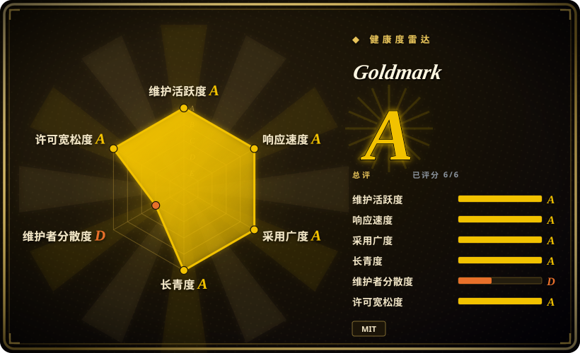
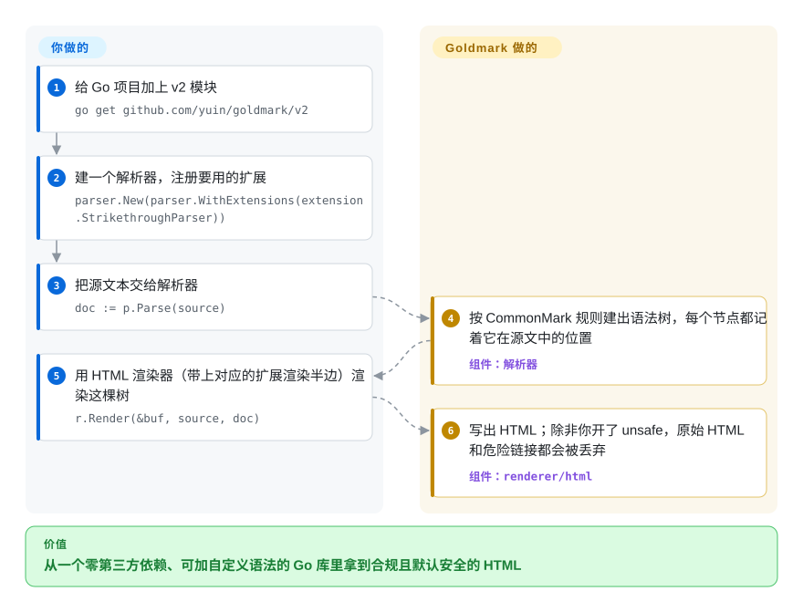

# Goldmark

你的 Go 程序要把 Markdown 转成 HTML，手上的 Go 解析器却总有几篇文档渲染得和 GitHub 不一样，`これは**「重要」**です。` 这种中日文加粗原样露出星号，想加个自己的 `@提及` 语法也无从下手。Goldmark 是只依赖 Go 标准库的解析器：按 CommonMark（事实上的 Markdown 标准）0.31.2 解析，自带 GFM 扩展和专门照顾中日韩文本的开关，还允许你插入自己的语法解析器、语法树变换和渲染器。

## 何时使用

你维护一个要渲染别人写的 Markdown 的 Go 服务或工具：文档或博客生成器、wiki/CMS 后端、预览 README 的命令行、给回复排版的聊天机器人。现在用的解析器（常见的是老牌 `blackfriday`）和 GitHub 的显示对不上：嵌套列表塌掉、带括号的链接断开，中文、日文作者抱怨 `**「重要」**` 还是一串星号。这时你会想到 Goldmark：它是 Go 生态里符合 CommonMark 的默认选择（Hugo 的 Markdown 引擎就是 Goldmark v1），表格、删除线、任务列表、脚注、定义列表都是内置扩展，还有专门的中日韩开关（`parser.WithParseDelimiterFunc`、`parser.WithEscapedSpace`、东亚换行策略），而且不引入任何第三方 Go 模块。

和 `gomarkdown/markdown` 比，规范一致性和扩展 API 比沿用 blackfriday 式 API 更重要时选它；和 Lute 比，你要的是一个普通库而不是面向编辑器的引擎时选它。v2（2026-08-27）起它在每个节点上保留源码位置和原始写法，所以当你要分析或改写 Markdown、而不只是渲染时（比如 LSP 服务、帮 agent 改 `.md` 文件的工具），它也是 Go 里的首选。

## 怎么用起来

Goldmark 把活拆成两段。解析器把字节扫一遍，建出一棵语法树（AST：由标题、段落、链接、强调等带类型的节点组成，每个节点记得自己来自源文的哪里）；渲染器再遍历这棵树，把 HTML 写进一个 `io.Writer`。它替你做的：整套 CommonMark 算法、内置的 GFM 类扩展，以及安全默认值——除非你传 `html.WithUnsafe()`，原始 HTML 和 `javascript:` 一类链接都会被丢掉。你要做的：决定注册哪些扩展，并且解析器和渲染器两边都要注册（每个扩展都是成对的）；需要自定义语法时，按文档化的扩展 API 写一个块级或行内解析器，再配一个节点渲染器。v2 去掉了旧的一行式 `goldmark.New().Convert()` 门面，你要显式调用 `parser.New()` 和 `html.New()`——也正因为拆开了，你才能在代码里直接拼一棵语法树，或把它渲染成 HTML 以外的格式。

<!-- flow-steps:begin (generated from flows/goldmark.json by tools/flow_card.py — do not edit) -->

流程文字版

1. **你**：给 Go 项目加上 v2 模块 — `go get github.com/yuin/goldmark/v2`
2. **你**：建一个解析器，注册要用的扩展 — `parser.New(parser.WithExtensions(extension.StrikethroughParser))`
3. **你**：把源文本交给解析器 — `doc := p.Parse(source)`
4. **Goldmark**：按 CommonMark 规则建出语法树，每个节点都记着它在源文中的位置 — 组件：`解析器`
5. **你**：用 HTML 渲染器（带上对应的扩展渲染半边）渲染这棵树 — `r.Render(&buf, source, doc)`
6. **Goldmark**：写出 HTML；除非你开了 unsafe，原始 HTML 和危险链接都会被丢弃 — 组件：`renderer/html`

**价值**：从一个零第三方依赖、可加自定义语法的 Go 库里拿到合规且默认安全的 HTML

<!-- flow-steps:end -->

## 何时不用

- **你的应用或依赖的扩展还停在 goldmark v1。** v2（2026-08-27）把模块路径改成 `github.com/yuin/goldmark/v2`，删掉了 `goldmark.New()/Convert()` 门面和 `Extender` 接口；README 的扩展列表里，大多数第三方扩展（mathjax、toc、frontmatter、mermaid、KaTeX、PDF/LaTeX 渲染器等）的 v2 状态是“未知”。扩展没迁移之前，继续用 v1（按“维护到上一个大版本”的政策仍有修复），或者照上游迁移指南改。
- **你开了 `html.WithUnsafe()` 去渲染不可信的 Markdown。** Goldmark 只在默认模式下安全；一旦放行原始 HTML，就要像 README 建议的那样，再过一遍 bluemonday 之类的 HTML 消毒器。
- **你的技术栈不是 Go。** JS 用 [markdown-it](markdown-it.zh.md) 或 [micromark](micromark.zh.md)；Rust 用 pulldown-cmark 或 comrak（未收录）。只为渲染 Markdown 跨进程调一个 Go 库，得不偿失。
- **你要在多种文档格式之间互转**（DOCX、LaTeX、EPUB、reStructuredText），而不只是 Markdown→HTML。用 [Pandoc](pandoc.zh.md)；Goldmark 的非 HTML 渲染器都是第三方的，而且大多还没跟上 v2。
- **你要的是带“所见即所得”编辑模式的编辑器引擎。** Lute（未收录）就是为思源笔记、Vditor 这类编辑器做的；Goldmark 只是解析/渲染库。

## 横向对比

| 替代品 | 是否收录 | 我们的评价 | 取舍 |
|---|---|---|---|
| gomarkdown/markdown | 未收录 | 从 blackfriday 迁出、想保留同样的 API 形状又要有人维护时选 gomarkdown；规范一致性和文档化的扩展 API 是决定因素时选 Goldmark。 | gomarkdown 是仍在维护的 blackfriday 分叉，API 熟悉；但它不符合 CommonMark，扩展生态也比 Goldmark 小得多。 |
| blackfriday | 未收录 | 把 blackfriday 当遗留依赖：只在已经依赖它的代码里保留，新 Go 项目选 Goldmark，因为它的默认分支自 2024-01 起再没动过。 | 已在用就没有迁移成本；代价是输出不合 CommonMark，上游也不再活跃。 |
| Lute | 未收录 | 你在做编辑器（思源笔记、Vditor 都基于它）、需要它面向编辑的渲染模式时选 Lute；只要一个服务端解析库时选 Goldmark。 | Lute 带编辑器专用能力，Go 和 JS 都能跑；Goldmark 功能更窄，但更容易嵌入，第三方扩展也更多。 |
| [markdown-it](markdown-it.zh.md) | ✅ | 技术栈是 JavaScript/TypeScript 就选 markdown-it，是 Go 就选 Goldmark——两者都是带插件模型的 CommonMark 解析器，由运行时决定。 | markdown-it 插件目录更大；Goldmark 每个节点都保留源码位置，且没有第三方依赖。 |
| [Pandoc](pandoc.zh.md) | ✅ | 产出是 DOCX、LaTeX、EPUB 等非 HTML 格式时选 Pandoc；只需在 Go 二进制里做 Markdown→HTML 时选 Goldmark。 | Pandoc 是覆盖几十种格式的独立 Haskell 可执行文件；Goldmark 是进程内的库，HTML 是一等目标。 |

## 技术栈

- **语言：** Go；v2 模块 `github.com/yuin/goldmark/v2` 声明 `go 1.25` 并使用泛型（v1 模块 `github.com/yuin/goldmark` 声明 `go 1.22`）。
- **架构：** `parser`（块级/行内解析器、段落与语法树变换器）和 `renderer/html` 两个包分开，中间以 `ast` 包衔接；v2 每个节点都带起始位置和原始写法细节（ATX 还是 Setext 标题、`&amp;` 还是 `&`）。
- **规范：** CommonMark 0.31.2；内置扩展覆盖 GFM 的表格、删除线、自动链接（Linkify）、任务列表，另有定义列表、脚注和排版符号替换（typographer）。
- **测试：** CommonMark 规范测试加 `go test --fuzz` 模糊测试。

## 依赖

- **运行时：** 只用 Go 标准库（README 原话：“Depends only on standard libraries”）。
- **可选扩展：** `goldmark-highlighting`、`goldmark-meta`、`goldmark-emoji` 等独立模块（这三个已标明支持 v2），以及一长串社区扩展，其中大多数只支持 v1 或 v2 状态未确认。
- **安装：** `go get github.com/yuin/goldmark/v2`（v1 用 v1 的模块路径）。

## 运维难度

**低。** 它是进程内的库：没有服务、没有数据存储、不需要 cgo。要操心的是升级：锁定大版本，迁到 v2 前逐个确认扩展是否支持，处理不可信输入时保持 `html.WithUnsafe()` 关闭（或加消毒器）。

## 健康度与可持续性

- **维护——非常活跃（截至 2026-10-08）。** v2.0.0 于 2026-08-27 发布，v2.1.6 于 2026-09-27 发布；v1 线在 2026-09-03 仍发了 v1.8.6，与“安全和缺陷修复覆盖上一个大版本”的声明一致。
- **治理——单作者项目。** Yusuke Inuzuka（`yuin`）贡献了约九成提交并掌握路线图，其他贡献者都是零星参与。这是雷达上的短板（治理 D）：v2 重写是一个人的决定，作者长期缺席项目就会停摆。
- **年龄与 Lindy——约 7.5 岁且仍在发版。** 2019-04 创建；年龄 × 仍活跃的组合很强，作者刚投入了一次大重构，而不是在吃老本。
- **采用与生态——Go 的默认选择。** Hugo 锁定 `github.com/yuin/goldmark v1.8.6`，Go 模块代理上 v1 路径的依赖方数量是六位数；扩展生态很大，但目前分裂在 v1 和 v2 两边。
- **风险信号。** MIT 许可，无改许可证历史。眼下的实际风险是 v1→v2 的分裂：包括 Hugo 在内的依赖方可能还会在 v1 上停留一段时间，先确认你的扩展跟的是哪条线。

## 存疑（未验证）

- [未验证] 131,427 个依赖仓库是健康度评分器在 2026-10-08 对 v1 模块路径的注册表计数；其中多少是直接依赖未核实。
- [推断] “大多数第三方扩展还没上 v2”读自 README 的扩展表，表中多数行的 v2 状态是 `❓`；个别扩展此后可能已迁移。
- [未验证] gomarkdown/markdown 不符合 CommonMark、扩展生态较小，本轮没有重新测量，依据是它自述为 blackfriday 分叉。
- [未验证] Lute 支撑思源笔记、Vditor 来自它的仓库描述和一般认知，没有重新读这两个项目。
- [推断] Hugo 还会在 v1 停留一段时间，依据是 2026-10-08 它的 `go.mod` 锁定 v1.8.6；没有查 Hugo 的迁移计划。
