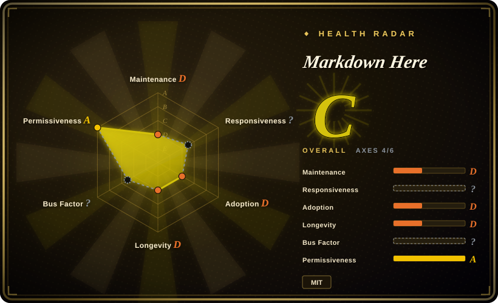
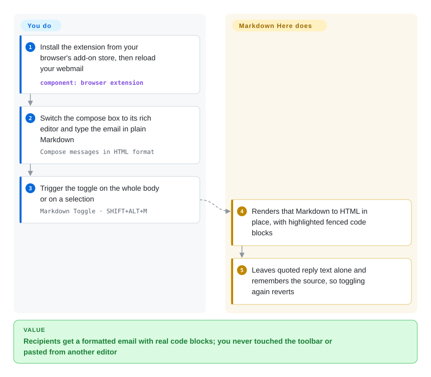

# Markdown Here

A Chrome/Firefox/Thunderbird browser extension that converts Markdown you type into a supported email or web textarea into rendered HTML in place — one click before you hit send.

## When to use

You're an engineer who writes a lot of email — code review notes, incident summaries, "here's how to reproduce it" walkthroughs — and your webmail compose box gives you a bare textarea with a clumsy WYSIWYG toolbar. You want a bulleted list, a fenced code block with syntax highlighting, a table, and a couple of links, and hand-formatting all of that with the toolbar is slow and ugly. You install Markdown Here, type the message in plain Markdown the way you'd write a `README`, and when it's ready you hit the toggle (or a hotkey): the extension parses the Markdown in that field and replaces it with rendered HTML right inside the compose area, so the recipient sees a properly formatted message in any mail client. If you got something wrong you can toggle back to the Markdown source, fix it, and re-render. It also lights up in a number of non-mail web textareas (Google Groups, some blogging/forum compose fields), so the same muscle memory works beyond email.

It earns its place precisely because it's *inline and on-demand* in fields you don't control: you're not exporting a file or running a build, you're turning the text already in the compose box into HTML at the moment you send. For the narrow job of "write this one email in Markdown," it's far lighter than drafting in an external editor and pasting.

## How it works

Markdown Here is a browser extension that works on the compose box you already have open; the Markdown parser (`marked.js`) and the code highlighter (highlight.js, the part that colours keywords inside fenced code blocks) ship inside the extension, so ordinary conversion needs no server or account. **What it does for you:** when you hit the toggle, it reads the Markdown in the compose field (or just the text you selected), renders it to HTML, and swaps that HTML into the field in place, leaving any quoted email you are replying to untouched. It also keeps your original Markdown, so a second toggle turns the rendered block back into source — but edits you made to the rendered HTML are lost when you do. **What you do:** install it, make sure the compose box is in rich/HTML mode (a plain-text compose box has nowhere to put HTML), write Markdown, and press the toggle before you hit send. Think of it as a "format this" button that understands Markdown rather than a toolbar.

<!-- flow-steps:begin (generated from flows/markdown-here.json by tools/flow_card.py — do not edit) -->

Text version of the flow

1. **You**: Install the extension from your browser's add-on store, then reload your webmail — component: `browser extension`
2. **You**: Switch the compose box to its rich editor and type the email in plain Markdown — `Compose messages in HTML format`
3. **You**: Trigger the toggle on the whole body or on a selection — `Markdown Toggle · SHIFT+ALT+M`
4. **Markdown Here**: Renders that Markdown to HTML in place, with highlighted fenced code blocks
5. **Markdown Here**: Leaves quoted reply text alone and remembers the source, so toggling again reverts

**Value**: Recipients get a formatted email with real code blocks; you never touched the toolbar or pasted from another editor

<!-- flow-steps:end -->

## When NOT to use

- **Maintenance / longevity risk — the sharpest reason.** The original repo is widely treated as low-maintenance/effectively stale: high star count, but slow release cadence and a long backlog. [推断] Don't build a workflow that *depends* on it receiving timely fixes.
- **Browser-extension viability under Manifest V3.** It's a content-script extension living inside Chrome's MV3 migration; an unmaintained MV3 extension can be delisted or broken by a browser update, which is an availability risk outside your control. [未验证]
- **It only converts on demand, in *supported* fields.** It's not a universal "Markdown everywhere" layer — it works in the mail clients and textareas it has integrations for, and only when you trigger the toggle. If your target field isn't supported, it does nothing.
- **You need a Markdown *renderer/library* for a program.** This is a UI convenience, not an API. To parse Markdown to HTML in code (a site, a docs build, a server), use a parsing library like marked — Markdown Here is not embeddable.
- **Docs / publishing pipelines.** For a static site, knowledge base, or CI-rendered docs you want a deterministic build step and a real renderer, not a browser extension toggling one compose box at a time.

## Comparison

| Alternative | In index | Our verdict | Tradeoff |
|---|---|---|---|
| [marked](marked.md) | ✅ | Choose marked when you need a Markdown→HTML *parsing library* you call from JavaScript. | A Markdown→HTML *parsing library* you call from JavaScript; the right tool when you need rendering inside an app or pipeline — but it's not a browser UI, you wire up the editor/compose integration yourself. |
| Browser-native rich-text compose (Gmail/Outlook toolbars) | 未收录 | Choose browser-native rich-text compose when you need mail-client built-ins and no extension install. | Built into the mail client, nothing to install; but it's WYSIWYG-by-toolbar with no Markdown and weak code-block/table support — exactly the friction Markdown Here removes. |
| Obsidian / editor Markdown plugins | 未收录 | Choose editor Markdown plugins for first-class Markdown authoring with live preview inside a document editor. | First-class Markdown authoring with live preview, but inside a *document editor*, not your webmail compose box; you'd draft there and paste, losing the in-field, at-send-time conversion. |
| Markdown Here Revival (fork/successor) | 未收录 | Choose a revival fork when you specifically need a community-maintained successor path, especially around Thunderbird. | A community fork aimed at keeping the idea alive (notably for Thunderbird), as the original stalled; hosting and its own maintenance status should be verified before relying on it (see Caveats). |

## Tech stack

- **Language:** JavaScript — a browser/WebExtension content-script extension (the compose-field code runs in the page, the conversion logic is bundled with the extension).
- **Markdown rendering:** Markdown is parsed to HTML and code blocks get syntax highlighting; the project bundles its own JS rendering/highlighting rather than calling out to a service (see Caveats).
- **Targets:** packaged for Chrome (and Chromium/Opera), Firefox, and Thunderbird, plus integrations for a set of webmail and web-textarea compose surfaces.

## Dependencies

- **Runtime:** a supported browser (Chrome/Chromium/Opera, Firefox) or Thunderbird — there is no server, account, or backend; everything runs client-side in the extension.
- **Distribution:** installed from the browser/add-on store or loaded as an unpacked/packaged extension; subject to that store's review and Manifest-version requirements.
- **Build:** to build from source you need a Node/JS toolchain; the exact versions are governed by the repo's tooling at build time.

## Ops difficulty

**Low.** There is nothing to operate — no service, datastore, or deployment. For an end user it's an install-and-toggle extension. The real "ops" cost is *longevity*, not running it: because the original project moves slowly, the practical risk is that a future browser change (especially in the MV3 transition) breaks or delists it and no timely fix lands, at which point you'd migrate to a maintained fork or a different approach. Treat it as a convenience you can lose, not infrastructure you depend on.

## Health & viability

- **Responsiveness**: Cannot be scored — no_traffic.
- **Maintenance — effectively stale (last commit and release v2.16.0 on 2025-07-10, nothing since; as of 2026-10-08).** No archive flag; after three releases in 2025-06/07 the repo went quiet for 15 months, and the backlog is long and the backlog long relative to popularity; treat as coasting-toward-abandoned, not actively maintained [推断]. The README does not declare it dead — but don't expect timely fixes.
- **Governance & bus factor — single-maintainer flag.** `User`-owned (`adam-p/`) with ~60k stars: a classic bus-factor risk where huge adoption rests on one person's attention, which has clearly tapered. The community response is the "Markdown Here Revival" fork, signalling the original is no longer the maintained path [推断].
- **Age & Lindy verdict — old but abandoned ⇒ fails Lindy.** Created 2012 (~14y old): age alone looks reassuring, but age × *still-active* is the test, and activity has stopped. A long-lived-then-stalled project is the case where the Lindy prior turns *negative* — bet on the maintained fork, not the original.
- **Risk flags.** Browser-extension viability under Manifest V3: an unmaintained MV3 content-script extension can be delisted or broken by a browser update with no fix landing — an availability risk outside your control [未验证]. MIT-licensed, so forking is unencumbered (the Revival fork exists).

## Caveats (unverified)

- ~60.3k GitHub stars, last default-branch commit and v2.16.0 release on 2025-07-10 (GitHub API, 2026-10-08); star counts are time-sensitive.
- [推断] "Low-maintenance / effectively stale" is inferred from the slow release cadence and large open backlog relative to the star count, not from any deprecation notice in the README — the README does not declare the project dead.
- [未验证] Manifest V3 status and whether the extension is currently listed/installable in each browser's store shift over time; verify in the target browser before relying on it.
- [未验证] The exact set of supported mail clients and web textareas, and how each integration holds up, varies and may have regressed — confirm your specific compose surface works.
- [未验证] "Markdown Here Revival" exists as a community fork/successor (notably for Thunderbird) but its canonical hosting and current maintenance status were not confirmed here — verify before adopting it.
- [未验证] Ordinary Markdown/code-block conversion uses the bundled `marked.js` + highlight.js; whether the optional TeX-math rendering calls an external image service was not checked in this pass (2026-10-08) — check the options page before using it on confidential mail.
