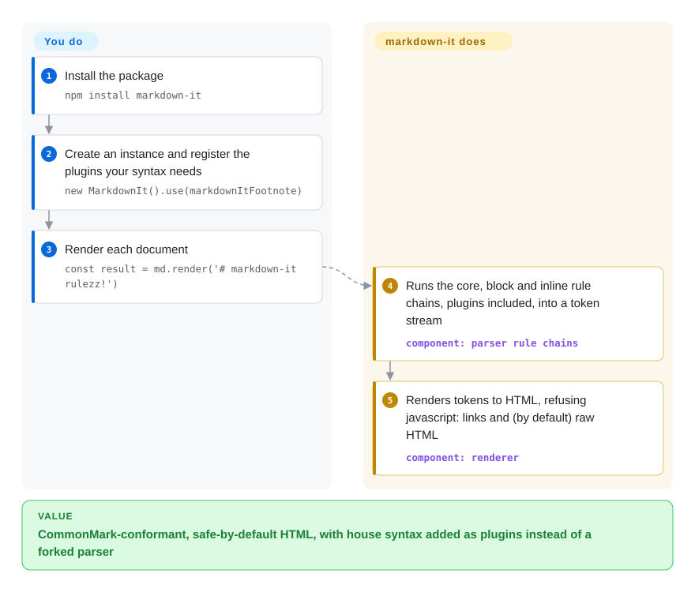

# markdown-it

Your site renders authors' Markdown in JavaScript, and you keep hitting one of two walls: the simple renderer turns edge cases into HTML that differs from what GitHub or CommonMark (the de-facto Markdown spec) would show, or your team wants its own syntax — `::: warning` boxes, footnotes, heading anchors — and there is no clean place to add it. markdown-it is a CommonMark parser for Node and browsers whose every syntax rule is a replaceable plugin, and it is safe by default: raw HTML is off and `javascript:` links are refused.

## When to use

You are building a docs site, a static site generator, a CMS editor preview or a chat UI in JavaScript/TypeScript, and authors write Markdown that you turn into HTML. The pain is concrete: a link like `[docs](https://example.com/a_(b))` or a nested list renders differently from what authors see on GitHub, and product asks for "callout boxes", footnotes and `#` anchors on every heading. You reach for markdown-it because its core follows the CommonMark spec, it ships tables, strikethrough, typographer and linkify as options, and everything else is an npm plugin you register with `.use()` — `markdown-it-container`, `markdown-it-footnote`, `markdown-it-anchor` and hundreds more. VitePress builds on it, so the docs-site plugin catalog is large.

Pick it over [marked](marked.md) when spec conformance, safe defaults and custom syntax matter more than the smallest one-call API; pick it over [remark](remark.md) when you want Markdown→HTML with plugins, not a syntax-tree toolchain for linting, rewriting or MDX.

## How it works

markdown-it parses in three nested rule chains — `core`, `block` (headings, lists, fences, tables) and `inline` (emphasis, links, code spans) — and produces a flat token stream: a list of objects like "paragraph opens", "text", "link opens" that record what was found. A renderer then walks those tokens and writes HTML. What it does for you: the CommonMark algorithm, link validation (it refuses `javascript:`, `vbscript:`, `file:` and most `data:` URLs), and the built-in options (`html`, `linkify`, `typographer`, the `commonmark` / `default` / `zero` presets). What you do: choose a preset and options, register plugins, and — when you need custom syntax or output — add or replace a rule in a chain or override a renderer rule for one token type. Think of it as an assembly line with named stations: plugins insert, swap or remove stations, the line itself stays the same.

<!-- flow-steps:begin (generated from flows/markdown-it.json by tools/flow_card.py — do not edit) -->

Text version of the flow

1. **You**: Install the package — `npm install markdown-it`
2. **You**: Create an instance and register the plugins your syntax needs — `new MarkdownIt().use(markdownItFootnote)`
3. **You**: Render each document — `const result = md.render('# markdown-it rulezz!')`
4. **markdown-it**: Runs the core, block and inline rule chains, plugins included, into a token stream — component: `parser rule chains`
5. **markdown-it**: Renders tokens to HTML, refusing javascript: links and (by default) raw HTML — component: `renderer`

**Value**: CommonMark-conformant, safe-by-default HTML, with house syntax added as plugins instead of a forked parser

<!-- flow-steps:end -->

## When NOT to use

- **You need a syntax-tree toolchain** — linting, rewriting Markdown back to Markdown, MDX, arbitrary AST passes. markdown-it's flat token stream is built for rendering; use [remark](remark.md) (mdast trees, unified plugins).
- **You want the smallest, simplest one-call renderer for trusted content.** [marked](marked.md) has a smaller API and fewer concepts; markdown-it's rule chains and plugin model are weight you only need if you extend it.
- **You must let users write raw HTML.** That requires `html: true`, and then the output is no longer safe by default — add a sanitizer such as DOMPurify or sanitize-html (not indexed), or keep HTML off and offer the feature through plugins, as markdown-it's own safety docs recommend.
- **You need React elements or non-HTML output.** The core renderer emits HTML strings; for React components from Markdown use react-markdown (not indexed, remark-based), and for DOCX/LaTeX/EPUB use [Pandoc](pandoc.md).
- **You depend on third-party plugins or deep imports and cannot touch them yet.** v15.0.0 (2026-07-30) removed `markdown-it/lib/*` subpath exports, removed `StateBlock#ddIndent`, and moved to `linkify-it` v6 (no fuzzy `example.com` links by default). Plugins from the markdown-it org are v15-compatible; for others, pin 14.x until their authors confirm v15.
- **You need byte-exact positions for every construct** (editors, linters reporting columns). Use [micromark](micromark.md), which emits concrete tokens with positional info for everything.

## Comparison

| Alternative | In index | Our verdict | Tradeoff |
|---|---|---|---|
| [marked](marked.md) | ✅ | For trusted Markdown where a tiny API and quick setup matter most, pick marked; when you need CommonMark conformance, safe defaults or custom syntax plugins, pick markdown-it. | marked is simpler and long-established but not CommonMark-strict and does not sanitize; markdown-it costs more concepts (rules, tokens) in exchange for extensibility. |
| [remark](remark.md) | ✅ | When the job is transforming, linting or serializing Markdown/MDX, pick remark; when the job is rendering Markdown to HTML with a few extensions, pick markdown-it. | remark gives a full mdast tree and the unified plugin ecosystem, at the cost of a multi-package pipeline; markdown-it is one package with a render call. |
| [micromark](micromark.md) | ✅ | Pick micromark when you need the smallest spec-exact parser or positional tokens for every byte; pick markdown-it when you want a large catalog of ready-made syntax plugins. | micromark matches the reference parsers more strictly and powers remark, but its syntax extensions are hard to write; markdown-it extensions are easy to write and plentiful. |
| [CommonMark](commonmark.md) | ✅ | Use commonmark.js as a conformance yardstick or when you want the reference implementation verbatim; use markdown-it for production rendering with GFM tables and plugins. | The reference implementation tracks the spec exactly but has no plugin system or GFM extras. |
| Showdown | not indexed | Keep Showdown only in legacy code that already depends on it; new projects should pick markdown-it for its CommonMark core and safe defaults. | Showdown is an older converter that predates CommonMark; switching costs a migration of options and extensions. |
| [Goldmark](goldmark.md) | ✅ | In Go services (Hugo, Go backends) pick Goldmark; in JavaScript/TypeScript pick markdown-it — the runtime decides. | Both are CommonMark parsers with extension APIs; Goldmark has no third-party deps and keeps source positions, markdown-it has the bigger plugin catalog. |

## Tech stack

- **Language:** TypeScript since v15.0.0 (was JavaScript); bundled type declarations replace `@types/markdown-it`.
- **Distribution:** prebuilt ESM and CJS under `dist/`, plus a `markdown-it/browser` export (ESM and UMD minified); a `markdown-it` CLI binary.
- **Architecture:** `core` → `block` → `inline` rule chains producing a token stream; a renderer with per-token-type rules; plugins hook in via `.use()`.
- **Syntax:** CommonMark core; tables and strikethrough built in; linkify and typographer as options. Footnotes, task lists, containers, anchors, math come from plugins.

## Dependencies

- **Runtime (npm):** `entities`, `linkify-it` (v6), `mdurl`, `punycode.js`, `uc.micro`, and `argparse` for the CLI. No services.
- **Plugins:** each is a separate npm package registered with `.use()`; the markdown-it org maintains the common ones.
- **Install:** `npm install markdown-it`, or a CDN mirror of npm for browsers.

## Ops difficulty

**Low.** A library with no service, datastore or daemon. The upkeep is plugin hygiene — each plugin is another dependency to audit and keep compatible across majors (v15 just broke deep imports) — and the security posture: keep `html` off for untrusted input, or sanitize when you turn it on. Cap input size if users can submit huge documents; v15.0.1 and v15.0.2 fixed several quadratic-time cases.

## Health & viability

- **Maintenance — active (as of 2026-10-08).** v15.0.0 (2026-07-30) was a TypeScript migration and packaging overhaul; v15.0.1 (2026-08-27) and v15.0.2 (2026-09-11) followed with parsing and security fixes.
- **Governance — small team, one lead.** Owned by the `markdown-it` GitHub org; Vitaly Puzrin (`puzrin`) wrote nearly all recent commits, and over the last year most commits come from one person (governance D). Not vendor-controlled, no commercial tier.
- **Age & Lindy — ~12 years old and still shipping majors.** Created 2014-12; a strong age × still-active signal.
- **Adoption — very high.** 119,440,414 npm downloads last month and 205,037 dependent repositories (2026-10-08 scorer); VitePress depends on it.
- **Risk flags.** MIT, no relicensing. v15 broke internal imports and changed linkify defaults — check third-party plugins before upgrading.

## Caveats (unverified)

- [未验证] The plugin-catalog size ("hundreds") is not counted; it rests on the npm `markdown-it-plugin` keyword the README links.
- [推断] marked not sanitizing and not being CommonMark-strict is taken from the micromark README's comparison and the marked page, not re-tested here.
- [未验证] VuePress's dependency on markdown-it was not re-checked in this pass; VitePress's `package.json` lists `markdown-it ^14.3.2` (2026-10-08), so it had not yet moved to v15.
- [推断] Performance relative to marked or micromark depends on document size, plugin count and runtime; no benchmark was run.
- [未验证] The download and dependent-repo figures come from the health scorer's registry query on 2026-10-08.
