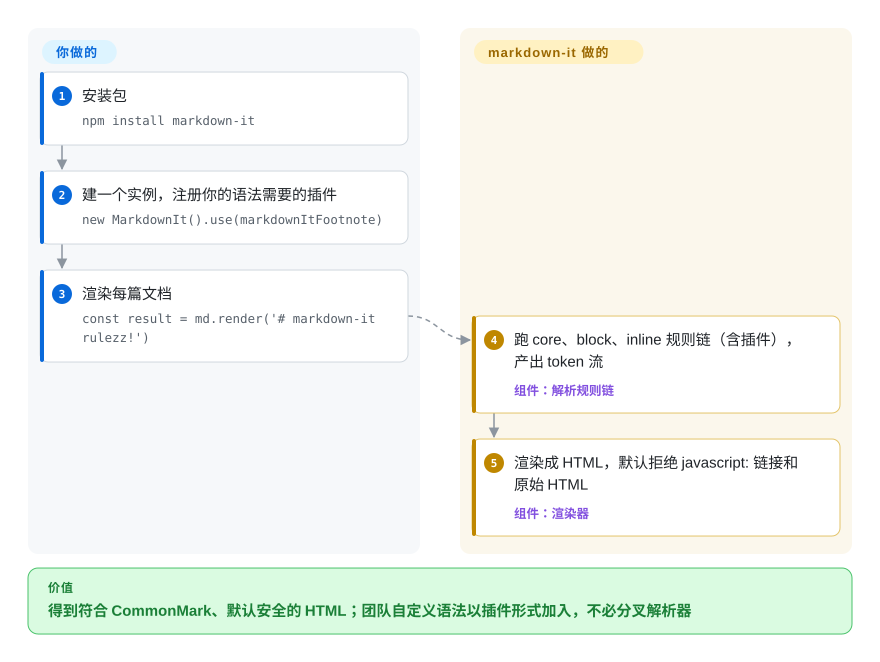

# markdown-it

你的网站用 JavaScript 渲染作者写的 Markdown，总撞上两堵墙之一：简单的渲染器把边角情况渲染得和 GitHub、CommonMark（事实上的 Markdown 标准）不一样；或者团队想要自己的语法——`::: warning` 提示框、脚注、标题锚点——却找不到干净的地方加。markdown-it 是一个跑在 Node 和浏览器里的 CommonMark 解析器，每条语法规则都能用插件替换，而且默认安全：原始 HTML 关闭，`javascript:` 链接直接拒绝。

## 何时使用

你在用 JavaScript/TypeScript 做文档站、静态站点生成器、CMS 编辑预览或聊天界面，作者写 Markdown，你要把它转成 HTML。痛点很具体：`[docs](https://example.com/a_(b))` 这样的链接、或者一个嵌套列表，渲染出来和作者在 GitHub 上看到的不一样；产品又要“提示框”、脚注、每个标题带 `#` 锚点。这时你会想到 markdown-it：核心按 CommonMark 规范实现，表格、删除线、排版符号替换（typographer）、自动链接（linkify）都是现成选项，其余一切都是用 `.use()` 注册的 npm 插件——`markdown-it-container`、`markdown-it-footnote`、`markdown-it-anchor` 以及上百个别的。VitePress 就建在它上面，所以文档站方向的插件很多。

和 [marked](marked.zh.md) 比，规范一致性、安全默认值和自定义语法比最小的一行式 API 更重要时选它；和 [remark](remark.zh.md) 比，你要的是“Markdown→HTML 加插件”，而不是用来检查、改写或做 MDX 的语法树工具链时选它。

## 怎么用起来

markdown-it 的解析分三条嵌套的规则链——`core`、`block`（标题、列表、代码块、表格）、`inline`（强调、链接、行内代码）——产出一条扁平的 token 流：一串“段落开始”“文本”“链接开始”这样记录解析结果的对象。渲染器再顺着这串 token 写出 HTML。它替你做的：CommonMark 算法、链接校验（拒绝 `javascript:`、`vbscript:`、`file:` 和大部分 `data:` 链接），以及内置选项（`html`、`linkify`、`typographer`，和 `commonmark` / `default` / `zero` 三个预设）。你要做的：选预设和选项、注册插件；需要自定义语法或输出时，往某条规则链里加一条规则、替换一条，或者为某种 token 覆盖渲染规则。可以把它想成一条每个工位都有名字的流水线：插件负责插入、替换、拆掉工位，流水线本身不变。

<!-- flow-steps:begin (generated from flows/markdown-it.json by tools/flow_card.py — do not edit) -->

流程文字版

1. **你**：安装包 — `npm install markdown-it`
2. **你**：建一个实例，注册你的语法需要的插件 — `new MarkdownIt().use(markdownItFootnote)`
3. **你**：渲染每篇文档 — `const result = md.render('# markdown-it rulezz!')`
4. **markdown-it**：跑 core、block、inline 规则链（含插件），产出 token 流 — 组件：`解析规则链`
5. **markdown-it**：渲染成 HTML，默认拒绝 javascript: 链接和原始 HTML — 组件：`渲染器`

**价值**：得到符合 CommonMark、默认安全的 HTML；团队自定义语法以插件形式加入，不必分叉解析器

<!-- flow-steps:end -->

## 何时不用

- **你需要语法树工具链**——检查、把 Markdown 改写回 Markdown、MDX、任意的语法树遍历。markdown-it 的扁平 token 流是为渲染设计的；请用 [remark](remark.zh.md)（mdast 语法树加 unified 插件）。
- **你只想给可信内容找一个最小、最简单的一行式渲染器。** [marked](marked.zh.md) API 更小、概念更少；markdown-it 的规则链和插件模型，只有在你要扩展时才值得背。
- **你必须允许用户写原始 HTML。** 这要开 `html: true`，输出就不再默认安全了——再加一层 DOMPurify 或 sanitize-html（未收录）这样的消毒器；或者按 markdown-it 自己安全文档的建议，保持 HTML 关闭，用插件提供功能。
- **你要 React 元素或非 HTML 输出。** 核心渲染器输出 HTML 字符串；要从 Markdown 得到 React 组件用 react-markdown（未收录，基于 remark），要 DOCX/LaTeX/EPUB 用 [Pandoc](pandoc.zh.md)。
- **你依赖的第三方插件或深层导入暂时改不动。** v15.0.0（2026-07-30）删掉了 `markdown-it/lib/*` 子路径导出、删掉了 `StateBlock#ddIndent`，并升级到 `linkify-it` v6（默认不再识别 `example.com` 这类模糊链接）。markdown-it 组织自己的插件都兼容 v15；其他插件在作者确认前先锁定 14.x。
- **你需要每个语法结构精确到字节的位置**（编辑器、要报告列号的检查器）。用 [micromark](micromark.zh.md)，它为一切结构输出带位置信息的具体 token。

## 横向对比

| 替代品 | 是否收录 | 我们的评价 | 取舍 |
|---|---|---|---|
| [marked](marked.zh.md) | ✅ | 内容可信、最看重 API 小和上手快时选 marked；需要 CommonMark 一致性、安全默认值或自定义语法插件时选 markdown-it。 | marked 更简单、历史更久，但不严格遵循 CommonMark，也不做消毒；markdown-it 多了规则、token 这些概念，换来可扩展性。 |
| [remark](remark.zh.md) | ✅ | 要做的是变换、检查或序列化 Markdown/MDX 时选 remark；要做的是带少量扩展的 Markdown→HTML 渲染时选 markdown-it。 | remark 提供完整的 mdast 语法树和 unified 插件生态，代价是多包组成的管线；markdown-it 是一个包加一次 render 调用。 |
| [micromark](micromark.zh.md) | ✅ | 需要最小、最贴合规范的解析器，或者每个字节都要有位置信息的 token 时选 micromark；想要大量现成语法插件时选 markdown-it。 | micromark 与参考解析器对得更严，也是 remark 的底座，但语法扩展很难写；markdown-it 的扩展好写、数量也多。 |
| [CommonMark](commonmark.zh.md) | ✅ | 把 commonmark.js 当一致性标尺、或想原样使用参考实现时选它；生产渲染要 GFM 表格和插件时选 markdown-it。 | 参考实现与规范完全同步，但没有插件系统，也没有 GFM 附加语法。 |
| Showdown | 未收录 | 只在已经依赖 Showdown 的遗留代码里保留它；新项目选 markdown-it，看重它的 CommonMark 核心和安全默认值。 | Showdown 是早于 CommonMark 的老转换器；换掉它要迁移选项和扩展。 |
| [Goldmark](goldmark.zh.md) | ✅ | Go 服务（Hugo、Go 后端）选 Goldmark，JavaScript/TypeScript 选 markdown-it——由运行时决定。 | 两者都是带扩展 API 的 CommonMark 解析器；Goldmark 无第三方依赖并保留源码位置，markdown-it 的插件目录更大。 |

## 技术栈

- **语言：** v15.0.0 起改为 TypeScript（此前是 JavaScript）；自带类型声明，不再需要 `@types/markdown-it`。
- **分发：** `dist/` 下预构建的 ESM 和 CJS，外加 `markdown-it/browser` 导出（压缩过的 ESM 与 UMD）；还带一个 `markdown-it` 命令行。
- **架构：** `core` → `block` → `inline` 规则链产出 token 流；渲染器按 token 类型分规则；插件通过 `.use()` 接入。
- **语法：** CommonMark 核心；表格、删除线内置；linkify 和 typographer 是选项。脚注、任务列表、容器、锚点、数学公式来自插件。

## 依赖

- **运行时（npm）：** `entities`、`linkify-it`（v6）、`mdurl`、`punycode.js`、`uc.micro`，以及命令行用的 `argparse`。不需要任何服务。
- **插件：** 每个都是独立的 npm 包，用 `.use()` 注册；常用的由 markdown-it 组织维护。
- **安装：** `npm install markdown-it`；浏览器可用任意 npm 的 CDN 镜像。

## 运维难度

**低。** 它是库，没有服务、数据存储或守护进程。要操心的是插件卫生——每个插件都是一个要审计、要跨大版本保持兼容的依赖（v15 刚刚打破了深层导入）——以及安全姿态：处理不可信输入时保持 `html` 关闭，开了就要消毒。如果用户能提交超大文档，记得限制输入大小；v15.0.1 和 v15.0.2 修了好几处会退化成平方级耗时的情况。

## 健康度与可持续性

- **维护——活跃（截至 2026-10-08）。** v15.0.0（2026-07-30）完成了 TypeScript 迁移和打包重构；随后 v15.0.1（2026-08-27）、v15.0.2（2026-09-11）发布了解析和安全修复。
- **治理——小团队，一人主导。** 归属 GitHub 上的 `markdown-it` 组织；最近的提交几乎都出自 Vitaly Puzrin（`puzrin`），过去一年多数提交来自一个人（治理 D）。不受厂商控制，没有商业版。
- **年龄与 Lindy——约 12 岁，仍在发大版本。** 2014-12 创建；年龄 × 仍活跃的信号很强。
- **采用——非常广。** 上月 119,440,414 次 npm 下载、205,037 个依赖仓库（2026-10-08 评分器数据）；VitePress 依赖它。
- **风险信号。** MIT 许可，无改许可证历史。v15 打破了内部导入、改了 linkify 默认值——升级前先确认第三方插件。

## 存疑（未验证）

- [未验证] 插件目录“上百个”没有实际计数，依据是 README 链接的 npm `markdown-it-plugin` 关键词。
- [推断] marked 不做消毒、不严格遵循 CommonMark，取自 micromark README 的对比和本索引的 marked 页面，本轮没有重新测试。
- [未验证] VuePress 依赖 markdown-it 本轮没有重新核实；VitePress 的 `package.json`（2026-10-08）写的是 `markdown-it ^14.3.2`，也就是还没升到 v15。
- [推断] 相对 marked 或 micromark 的性能取决于文档大小、插件数量和运行环境；没有跑基准测试。
- [未验证] 下载量和依赖仓库数来自健康度评分器 2026-10-08 的注册表查询。
