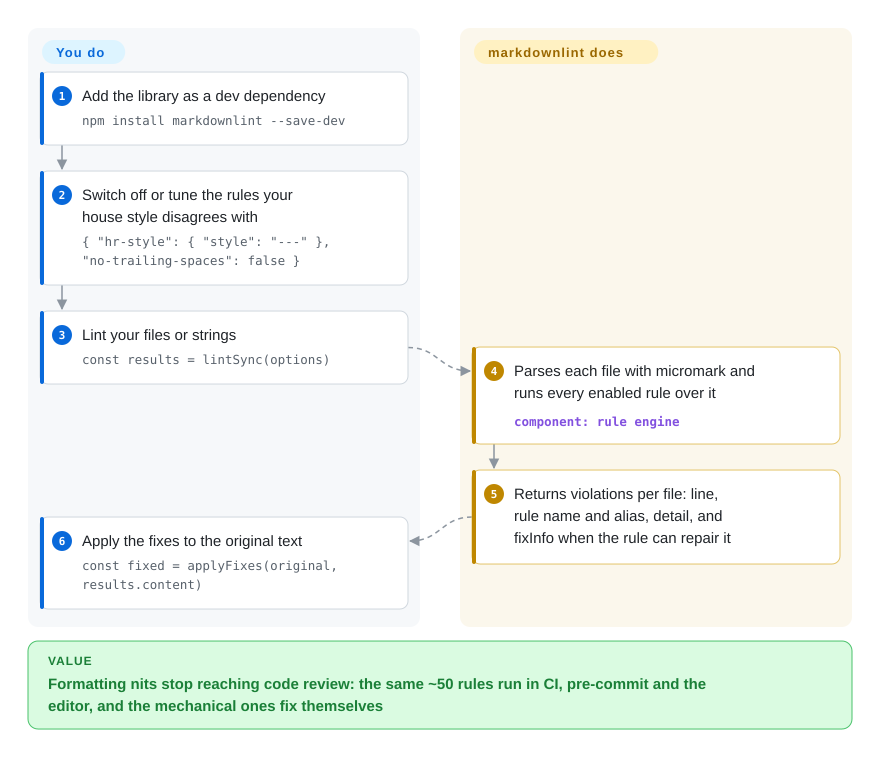

# markdownlint

Twenty people write your docs and the Markdown shows it: `*` and `-` bullets mixed in one list, headings that jump from `#` to `###`, trailing spaces, code fences with no language, and a reviewer leaving the same nit on every PR. markdownlint is a JavaScript library of ~50 numbered rules (MD001–MD060) that finds those style and structure problems in Markdown files — and can rewrite the mechanically fixable ones for you.

## When to use

You own a repository where Markdown is a deliverable — a docs site's source, an engineering handbook, a library's README and CHANGELOG, a folder of agent prompts — and review time is going to formatting nits instead of content. Or a renderer is quietly disagreeing with your authors: `#Install` without a space after the hash (`MD018`) renders as a plain paragraph instead of a heading, or a `[link](#install)` points at a heading that was renamed (`MD051`). You want one shared rule set that runs the same way in CI, in a pre-commit hook and in the editor, with a config file to switch off the rules your house style disagrees with.

You reach for markdownlint because it is the most widely used implementation of the `MDxxx` rule IDs that most Markdown lint configs in the wild are written against, its parser is micromark (CommonMark plus GFM tables, autolinks, footnotes, math and directives), and the same author ships the CLI (`markdownlint-cli2`) and the VS Code extension on top of it. Pick it over remark-lint when you want a ready rule catalog with config-file defaults rather than assembling a unified plugin pipeline, and over Vale when the problem is Markdown structure rather than prose wording.

## How it works

markdownlint is the engine, not the command: you either call its `lint` function from code, or — more commonly — install a wrapper that calls it for you (`markdownlint-cli2` on the command line and in CI, the `vscode-markdownlint` extension in the editor). For every file it parses the Markdown with micromark (a spec-compliant parser that records the exact position of every element), then runs each enabled rule over that parse and collects violations: line number, rule name and alias (`MD010` / `no-hard-tabs`), a detail string, and — for rules that can repair themselves — `fixInfo`, a description of the exact edit. What you decide: which rules run and how (`options.config`, or a `.markdownlint.*` file read by the wrappers), where to suppress a rule with an HTML comment such as `<!-- markdownlint-disable-next-line MD001 -->`, and whether to apply the fixes. HTML comments and front matter are ignored by most rules, and all rules are on by default.

<!-- flow-steps:begin (generated from flows/markdownlint.json by tools/flow_card.py — do not edit) -->

Text version of the flow

1. **You**: Add the library as a dev dependency — `npm install markdownlint --save-dev`
2. **You**: Switch off or tune the rules your house style disagrees with — `{ "hr-style": { "style": "---" }, "no-trailing-spaces": false }`
3. **You**: Lint your files or strings — `const results = lintSync(options)`
4. **markdownlint**: Parses each file with micromark and runs every enabled rule over it — component: `rule engine`
5. **markdownlint**: Returns violations per file: line, rule name and alias, detail, and fixInfo when the rule can repair it
6. **You**: Apply the fixes to the original text — `const fixed = applyFixes(original, results.content)`

**Value**: Formatting nits stop reaching code review: the same ~50 rules run in CI, pre-commit and the editor, and the mechanical ones fix themselves

<!-- flow-steps:end -->

## When NOT to use

- **You want a ready command, not a library.** This repository is the API. For a CLI, CI step or pre-commit hook use markdownlint-cli2 (same author, config-file driven) or markdownlint-cli (not indexed); both bundle this library.
- **You need prose style checks** — banned words, passive voice, product-name spelling across a style guide. markdownlint checks Markdown structure; use Vale (not indexed), which lints wording against configurable style packages.
- **You want every file rewritten into one canonical format.** markdownlint only auto-fixes rules that provide `fixInfo` and leaves the rest as reports; use Prettier or mdformat (not indexed) as a formatter, and keep markdownlint for the rules a formatter cannot express.
- **Your Markdown already flows through a unified/remark pipeline** (MDX, custom transforms). Use remark-lint plugins on top of [remark](remark.md) so linting reuses the same syntax tree instead of parsing a second time.
- **You are on Node 20 or older.** v0.41.0 (2026-06) removed Node 20 support and the package now declares `node >=22` and ships as ES modules; pin v0.40.x or upgrade Node.
- **You need guaranteed long-term multi-maintainer stewardship.** One maintainer writes essentially all non-bot commits (see Health). If that is a hard constraint, budget for a fork or for a reimplementation of the same rule IDs such as rumdl (not indexed).

## Comparison

| Alternative | In index | Our verdict | Tradeoff |
|---|---|---|---|
| remark-lint | not indexed | If your docs already go through remark/unified or are MDX, pick remark-lint; for a plain Markdown repo that wants a ready rule catalog and config file, pick markdownlint. | remark-lint reuses the pipeline's syntax tree and composes with transforms; you assemble the rule set plugin by plugin instead of starting from ~50 enabled rules. |
| Vale | not indexed | When the review pain is wording — terminology, tone, a corporate style guide — pick Vale; when it is Markdown structure and formatting, pick markdownlint. Many repos run both. | Vale is markup-aware prose linting with style packages (a Go binary); it does not check heading levels, list markers or table pipes. |
| Prettier | not indexed | If you want formatting decided by a tool with no per-rule debate, pick Prettier; pick markdownlint when you need checks a formatter cannot fix, such as broken link fragments or required headings. | Prettier rewrites the whole file deterministically; markdownlint reports and fixes per rule, so it is configurable but leaves non-fixable issues to humans. |
| rumdl | not indexed | Choose rumdl when lint speed on a very large Markdown tree or a no-Node toolchain decides it; choose markdownlint when you want the implementation that most existing `MDxxx` configs were written for. | rumdl is a Rust linter and formatter; compatibility with markdownlint configs is its own claim, not verified here. |
| mdl (Ruby) | not indexed | Choose the Ruby `mdl` only in a Ruby-only toolchain that already uses it; choose this Node library otherwise — it took over the original rules and has the larger tool ecosystem. | Same rule lineage and numbering origins; separate codebase and configuration, so results differ in detail. |

## Tech stack

- **Language:** JavaScript, published as ES modules with TypeScript declarations; entry points `markdownlint` (fix helpers), `markdownlint/sync`, `markdownlint/async`, `markdownlint/promise`, plus `markdownlint/helpers` for custom-rule authors.
- **Parser:** micromark with `micromark-extension-gfm-*` (autolinks, footnotes, tables), `micromark-extension-math` and `micromark-extension-directive` (inline directives deliberately disabled since v0.41.0).
- **Rules:** MD001–MD060 with named aliases and tags; custom rules via `options.customRules`; an optional `markdownItFactory` hook only for custom rules that still need markdown-it.
- **Browser:** a browser bundle and an online demo exist alongside the Node API.

## Dependencies

- **Runtime:** Node.js ≥ 22. npm dependencies are exact-pinned micromark packages (core, GFM autolink/footnote/table, math, directive) plus `string-width`; no services.
- **Wrappers you probably also install:** `markdownlint-cli2` (CLI, also via Homebrew) and/or the VS Code extension; both pull this library in.

## Ops difficulty

**Low.** It is a dev-time library with nothing to run in production. The real cost is the first rollout: on an existing docs tree it will report hundreds of violations, so start with a config that turns off the noisiest rules (often `MD013` line length), apply the auto-fixes in one commit, then tighten. Rule behavior changes in minor releases (0.x versioning), so pin the version CI uses.

## Health & viability

- **Maintenance — active, on a branch.** Day-to-day work lands on the `next` branch (commits on 2026-10-07 and 2026-10-08), and `main` moves at release time; the last releases were v0.40.0 (2025-12), v0.41.0 (2026-06) and v0.41.1 (2026-07). The radar's maintenance B reflects the quieter default branch, not inactivity.
- **Governance — one maintainer.** David Anson writes essentially all non-bot commits (governance C). He also maintains the CLI and the VS Code extension, so the whole toolchain shares one bus factor.
- **Age & Lindy — 11+ years and still shipping.** Created 2015-03, with new rules still being added (MD059, MD060 in 2025); a strong age × still-active signal.
- **Adoption — very high.** 12,773,003 npm downloads last month and 33,289 dependent repositories (2026-10-08 scorer); it sits under GitHub Super-Linter, editor plugins and the CLI wrappers.
- **Risk flags.** MIT, no relicensing. Pre-1.0 versioning means breaking changes ship in minor releases (v0.41.0 removed `resultVersion` and `LintResults.toString`).

## Caveats (unverified)

- [推断] "Most Markdown lint configs in the wild are written against the `MDxxx` IDs" is inferred from the number of tools in the README's Related list that wrap this library and from rumdl's positioning, not measured.
- [未验证] rumdl's compatibility with markdownlint configuration and its speed advantage are its own claims; not tested in this pass.
- [未验证] Whether markdownlint handles MDX/JSX content gracefully was not tested; the recommendation to use remark-lint for MDX is based on remark being the MDX toolchain.
- [推断] Day-to-day development on the `next` branch is read from branch commit history on 2026-10-08, not from a documented workflow.
- [未验证] The download and dependent-repo figures come from the health scorer's registry query on 2026-10-08.
