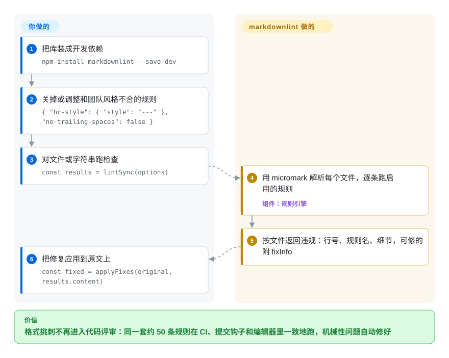

# markdownlint

二十个人一起写文档，Markdown 就成了大杂烩：同一个列表里 `*` 和 `-` 混用，标题从 `#` 直接跳到 `###`，行尾多空格，代码块不写语言，评审在每个 PR 里重复提同一条格式意见。markdownlint 是一个 JavaScript 库，带约 50 条编号规则（MD001–MD060），专门找出 Markdown 文件里这类格式和结构问题，能机械修复的还会直接帮你改掉。

## 何时使用

你负责的仓库里 Markdown 本身就是交付物：文档站的源文件、工程手册、库的 README 和 CHANGELOG、一整个目录的 agent 提示词——而评审时间都耗在了格式挑刺上。或者渲染结果在悄悄和作者作对：`#Install` 的井号后面少一个空格（`MD018`），渲染出来就是普通段落而不是标题；`[link](#install)` 指向的标题早被改名了（`MD051`）。你想要一套共享规则，在 CI、提交钩子和编辑器里跑出同样的结果，再用一个配置文件关掉和团队风格不合的规则。

这时你会想到 markdownlint：它是 `MDxxx` 规则编号最常用的实现，外面多数 Markdown 检查配置都是照这套编号写的；它的解析器是 micromark（CommonMark 加 GFM 的表格、自动链接、脚注，以及数学公式和指令语法）；同一位作者还在它之上维护了命令行工具 `markdownlint-cli2` 和 VS Code 扩展。和 remark-lint 比，你想要一份现成的规则目录加配置文件默认值、而不是自己拼 unified 插件管线时选它；和 Vale 比，问题出在 Markdown 结构而不是遣词造句时选它。

## 怎么用起来

markdownlint 是引擎，不是命令：你可以在代码里调用它的 `lint` 函数，更常见的是装一个替你调用它的外壳——命令行和 CI 用 `markdownlint-cli2`，编辑器里用 `vscode-markdownlint` 扩展。它对每个文件先用 micromark（一个严格按规范解析、记录每个元素精确位置的解析器）解析，再让每条启用的规则遍历解析结果，收集违规：行号、规则名和别名（`MD010` / `no-hard-tabs`）、细节说明，能自我修复的规则还附带 `fixInfo`，即一份精确的编辑描述。你要决定的是：跑哪些规则、怎么跑（`options.config`，或外壳读取的 `.markdownlint.*` 配置文件），在哪里用 `<!-- markdownlint-disable-next-line MD001 -->` 这样的 HTML 注释临时关掉某条规则，以及要不要应用修复。多数规则会忽略 HTML 注释和 front matter，默认所有规则都开启。

<!-- flow-steps:begin (generated from flows/markdownlint.json by tools/flow_card.py — do not edit) -->

流程文字版

1. **你**：把库装成开发依赖 — `npm install markdownlint --save-dev`
2. **你**：关掉或调整和团队风格不合的规则 — `{ "hr-style": { "style": "---" }, "no-trailing-spaces": false }`
3. **你**：对文件或字符串跑检查 — `const results = lintSync(options)`
4. **markdownlint**：用 micromark 解析每个文件，逐条跑启用的规则 — 组件：`规则引擎`
5. **markdownlint**：按文件返回违规：行号、规则名、细节，可修的附 fixInfo
6. **你**：把修复应用到原文上 — `const fixed = applyFixes(original, results.content)`

**价值**：格式挑刺不再进入代码评审：同一套约 50 条规则在 CI、提交钩子和编辑器里一致地跑，机械性问题自动修好

<!-- flow-steps:end -->

## 何时不用

- **你要一个现成命令，而不是库。** 这个仓库是 API。命令行、CI 步骤或提交钩子请用 markdownlint-cli2（同一作者，按配置文件驱动）或 markdownlint-cli（未收录），两者都内置了本库。
- **你要检查文字风格**——禁用词、被动语态、产品名拼写这类风格指南条目。markdownlint 只查 Markdown 结构；请用 Vale（未收录），它按可配置的风格包检查措辞。
- **你想把每个文件都重写成统一格式。** markdownlint 只自动修复提供了 `fixInfo` 的规则，其余只报告；要格式化器请用 Prettier 或 mdformat（未收录），markdownlint 留着管格式化器表达不了的规则。
- **你的 Markdown 已经走 unified/remark 管线**（MDX、自定义变换）。在 [remark](remark.zh.md) 之上用 remark-lint 插件，让检查复用同一棵语法树，而不是再解析一遍。
- **你还在 Node 20 或更老的版本上。** v0.41.0（2026-06）去掉了 Node 20 支持，包现在声明 `node >=22` 并以 ES 模块发布；要么锁定 v0.40.x，要么升级 Node。
- **你要求长期、多人共同维护的保障。** 非机器人提交几乎全出自一位维护者（见健康度）。如果这是硬约束，要么预留分叉的成本，要么考虑 rumdl（未收录）这类沿用同一套规则编号的重新实现。

## 横向对比

| 替代品 | 是否收录 | 我们的评价 | 取舍 |
|---|---|---|---|
| remark-lint | 未收录 | 文档已经走 remark/unified 或者是 MDX 时选 remark-lint；普通 Markdown 仓库想要现成规则目录和配置文件时选 markdownlint。 | remark-lint 复用管线里的语法树，能和变换组合；代价是规则要一个插件一个插件地拼，而不是从约 50 条默认开启的规则起步。 |
| Vale | 未收录 | 评审痛点在措辞——术语、语气、公司风格指南——时选 Vale；在 Markdown 结构和格式时选 markdownlint。很多仓库两个一起跑。 | Vale 是懂标记语言的文字风格检查器（Go 二进制），靠风格包工作；它不查标题层级、列表符号或表格竖线。 |
| Prettier | 未收录 | 想让工具一锤定音决定格式、不再逐条争论时选 Prettier；需要格式化器修不了的检查（失效的锚点链接、必需的标题结构）时选 markdownlint。 | Prettier 确定性地重写整个文件；markdownlint 按规则报告和修复，可配置，但修不了的问题留给人。 |
| rumdl | 未收录 | 超大 Markdown 目录的检查速度、或不想引入 Node 是决定因素时选 rumdl；想要多数现有 `MDxxx` 配置所针对的那份实现时选 markdownlint。 | rumdl 是 Rust 写的检查器兼格式化器；它与 markdownlint 配置兼容是它自己的说法，本页未核实。 |
| mdl（Ruby 版） | 未收录 | 只有在已经用着它的纯 Ruby 工具链里才选 Ruby 版 `mdl`；其他情况选这个 Node 库——它继承了最初那批规则，周边工具生态也更大。 | 规则同源、编号出处相同；但代码库和配置各自独立，检查结果在细节上有差异。 |

## 技术栈

- **语言：** JavaScript，以 ES 模块发布并附 TypeScript 声明；入口有 `markdownlint`（修复辅助函数）、`markdownlint/sync`、`markdownlint/async`、`markdownlint/promise`，以及给自定义规则作者用的 `markdownlint/helpers`。
- **解析器：** micromark，加上 `micromark-extension-gfm-*`（自动链接、脚注、表格）、`micromark-extension-math` 和 `micromark-extension-directive`（v0.41.0 起刻意关闭了行内指令）。
- **规则：** MD001–MD060，各有别名和标签；可通过 `options.customRules` 加自定义规则；`markdownItFactory` 钩子只给仍需要 markdown-it 的自定义规则用。
- **浏览器：** 除 Node API 外还有浏览器打包和在线演示。

## 依赖

- **运行时：** Node.js ≥ 22。npm 依赖是精确锁版本的 micromark 系列包（核心、GFM 自动链接/脚注/表格、数学公式、指令）加 `string-width`；不需要任何服务。
- **你多半还会装的外壳：** `markdownlint-cli2`（命令行，也能用 Homebrew 装）和/或 VS Code 扩展，两者都会把本库带进来。

## 运维难度

**低。** 它是开发期的库，生产环境里没有任何东西要跑。真正的成本在首次落地：在现有文档目录上它会报出成百上千条违规，所以先用一份配置关掉最吵的规则（常见的是 `MD013` 行长度），用一次提交应用全部自动修复，再逐步收紧。规则行为会在小版本里变化（0.x 版本号），CI 用的版本要锁定。

## 健康度与可持续性

- **维护——活跃，工作在分支上。** 日常开发落在 `next` 分支（2026-10-07、2026-10-08 都有提交），`main` 在发版时才前进；最近几次发布是 v0.40.0（2025-12）、v0.41.0（2026-06）、v0.41.1（2026-07）。雷达上维护 B 反映的是默认分支较安静，而不是项目不活跃。
- **治理——一位维护者。** 非机器人提交几乎全由 David Anson 完成（治理 C）。命令行工具和 VS Code 扩展也是他维护，整条工具链共用同一个 bus factor。
- **年龄与 Lindy——11 年以上且仍在发版。** 2015-03 创建，仍在新增规则（MD059、MD060 都是 2025 年加的）；年龄 × 仍活跃的信号很强。
- **采用——非常广。** 上月 12,773,003 次 npm 下载、33,289 个依赖仓库（2026-10-08 评分器数据）；GitHub Super-Linter、各家编辑器插件和命令行外壳都建在它上面。
- **风险信号。** MIT 许可，无改许可证历史。1.0 之前的版本号意味着破坏性变更会出现在小版本里（v0.41.0 删除了 `resultVersion` 和 `LintResults.toString`）。

## 存疑（未验证）

- [推断] “外面多数 Markdown 检查配置照 `MDxxx` 编号写”是根据 README 的 Related 列表里有多少工具包装了本库、以及 rumdl 的定位推出来的，没有统计。
- [未验证] rumdl 与 markdownlint 配置兼容、速度更快都是它自己的说法，本轮没有测试。
- [未验证] markdownlint 处理 MDX/JSX 内容是否稳妥没有测试；对 MDX 推荐 remark-lint 的依据是 remark 本身就是 MDX 的工具链。
- [推断] 日常开发在 `next` 分支，是从 2026-10-08 的分支提交历史读出来的，没有找到文档化的工作流说明。
- [未验证] 下载量和依赖仓库数来自健康度评分器 2026-10-08 的注册表查询。
