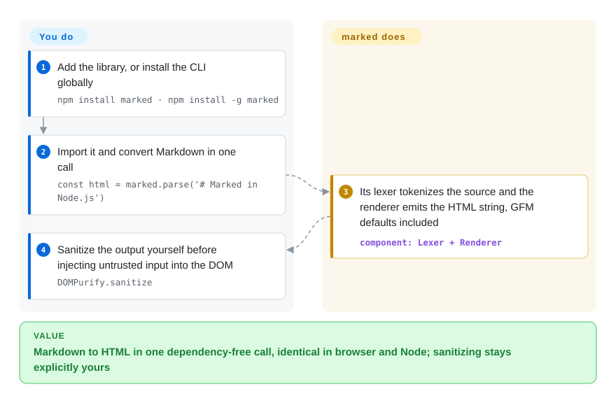

# marked

You need Markdown → HTML in your app and don't want a toolchain: hand-rolled regexes break on nested lists, and full parsers drag in AST machinery you'll never use. marked is a single `marked.parse(src)` call that returns an HTML string, fast, identically in browser and Node — with one catch that is deliberate: sanitizing the output stays yours.

## When to use

You're building a web app — a comment box, a docs viewer, a chat client, a README renderer — and you need to turn user- or author-written Markdown into HTML, in the browser or in Node, without pulling in a heavy toolchain. You want `import { marked } from 'marked'` and then `marked.parse(src)` to just give you an HTML string, fast, with sane GFM-leaning defaults (tables, fenced code, autolinks). You drop it in, wire the output into your DOM (after sanitizing — see below), and you're done; there's no AST to learn, no plugin manifest to assemble, no build step beyond your normal bundler.

It's the right reach when *throughput and simplicity* matter more than strict spec conformance: rendering many small Markdown snippets per page, server-side rendering a docs site, or any place where you'd otherwise hand-roll a regex and regret it. marked compiles to a compact bundle, runs the same in Node and the browser, and exposes just enough hooks (a `renderer`, a `walkTokens` pass, a lexer you can call directly) to customize output without adopting a whole pipeline.

## How it works

marked is a two-stage compiler in one small package. Its lexer scans Markdown into a flat token list (headings, paragraphs, list items, code spans), and a renderer walks those tokens to emit an HTML string — there is no persistent AST to learn unless you want one; customization happens through `marked.use()` extensions, a custom `Renderer`/`Tokenizer`, or a `walkTokens` hook that edits tokens before rendering. GFM conventions (tables, strikethrough, task lists, autolinks, fenced code) ship on by default, and one call — `marked.parse(src)` — is the whole API surface for the common case; the same code runs unchanged in a browser, in Node, or through the bundled `marked` CLI. What stays yours: the security boundary. marked emits HTML exactly as the Markdown says, raw `` and all — sanitizing untrusted output with DOMPurify or equivalent is explicitly outside its scope, and treating that as someone else's job is how XSS ships.

<!-- flow-steps:begin (generated from flows/marked.json by tools/flow_card.py — do not edit) -->

Text version of the flow

1. **You**: Add the library, or install the CLI globally — `npm install marked · npm install -g marked`
2. **You**: Import it and convert Markdown in one call — `const html = marked.parse('# Marked in Node.js')`
3. **marked**: Its lexer tokenizes the source and the renderer emits the HTML string, GFM defaults included — component: `Lexer + Renderer`
4. **You**: Sanitize the output yourself before injecting untrusted input into the DOM — `DOMPurify.sanitize`

**Value**: Markdown to HTML in one dependency-free call, identical in browser and Node; sanitizing stays explicitly yours

<!-- flow-steps:end -->

## When NOT to use

- **You need 100% CommonMark conformance.** marked is fast and CommonMark/GFM-*leaning* but is **not** fully spec-compliant by default — edge cases diverge from the reference. If exact spec behavior is a hard requirement, use markdown-it (CommonMark-strict) or remark. [推断]
- **You're rendering untrusted Markdown without sanitizing.** marked does **not** sanitize its output HTML — raw HTML and crafted links pass straight through, so naive use is an XSS hole. You **must** run the output through DOMPurify (or equivalent) yourself; sanitization was deliberately removed from marked's own scope.
- **You want to transform Markdown as an AST / mdast pipeline.** marked's token model is for rendering, not a general document-transform toolchain. For linting, rewriting, MDX, or plugin-based AST passes, reach for remark / unified.
- **You depend on a large plugin ecosystem.** marked has extensions but nothing like markdown-it's plugin catalog. If you need footnotes, containers, KaTeX, task lists, etc. as off-the-shelf plugins, markdown-it or remark will have more ready-made parts.

## Comparison

| Alternative | In index | Our verdict | Tradeoff |
|---|---|---|---|
| [markdown-it](markdown-it.md) | ✅ | Choose markdown-it when you need CommonMark-strict parsing, pluggable architecture, and a rich plugin ecosystem. | CommonMark-strict, pluggable architecture with a rich plugin ecosystem; heavier API and a touch slower than marked, but the choice when spec conformance and plugins matter. |
| [remark](remark.md) | ✅ | Choose remark when you need a full mdast AST pipeline for parsing, transforming, linting, and serializing Markdown or MDX. | Full mdast AST pipeline for parsing, transforming, linting, and serializing (Markdown, MDX); far more powerful and far heavier — a toolchain, not a one-call renderer. |
| [micromark](micromark.md) | ✅ | Choose micromark when you need the low-level CommonMark/GFM tokenizer underneath remark. | The low-level CommonMark/GFM tokenizer underneath remark; correct and streaming-oriented, but you build the rendering layer yourself. |
| [CommonMark](commonmark.md) | ✅ | Choose CommonMark when you need the spec's own reference implementation. | The spec's own reference implementation; the conformance yardstick, but fewer GFM niceties and not optimized as a production renderer. |

## Tech stack

- **Language:** TypeScript (GitHub languages 2026-09: TypeScript ~140.3k bytes vs JavaScript ~140.3k vs HTML ~109.6k — the source and the docs/tooling are split roughly between TS and legacy JS; the published package ships JS builds plus TypeScript type definitions).
- **Runtime targets:** runs in Node and in the browser; distributed as ESM and UMD/CJS builds and via CDN. Supported Node.js versions: current and LTS only (README Compatibility).
- **Architecture:** a lexer/tokenizer that turns Markdown into tokens, then a parser/renderer that emits HTML; customization via `marked.use()`, a `Renderer`, `Tokenizer`, `walkTokens` hook, and an extension API.
- **Flavors:** GFM-leaning defaults (tables, strikethrough, autolinks, fenced code) on top of a CommonMark-ish core.

## Dependencies

- **Runtime:** zero dependencies (verified against npm registry metadata for `marked@18.0.14`, 2026-09-28 — the package declares no `dependencies`).
- **Sanitizer (yours to add):** for any untrusted input you must pair it with DOMPurify (recommended in the README), sanitize-html or insane — not bundled, deliberately your responsibility.
- **Install:** `npm install marked` (in-browser/Node) or `npm install -g marked` (CLI); CDN bundles (`lib/marked.umd.js`, `lib/marked.esm.js`) are shown in the README.

## Ops difficulty

**Low.** It's a library, not a service — there is nothing to deploy or operate beyond adding a dependency to your app. The only real operational concern is the security one: remember to sanitize output before injecting it into the DOM, and pin/track the major version since the API has changed across majors. No datastore, no runtime, no infra.

## Health & viability

- **Responsiveness**: Grade A — median first-response time 4.1 hours across 14 qualifying issues/PRs.
- **Maintenance — active (as of 2026-09).** Regular patch releases through the v18.x line (v18.0.14 published 2026-09-22, GitHub releases API; repo pushed the same day); 22 open issues at ~37.2k stars — a healthy, low-issue tracker for a mature parser whose scope is deliberately small and settled.
- **Governance & bus factor.** `Org`-owned (`markedjs/`) — a maintainer team / org rather than a single person, which de-risks the bus factor versus a one-author library [推断]. Long-running community project, not vendor-controlled; no commercial tier gating features.
- **Age & Lindy verdict — old and still active ⇒ strong Lindy.** Created 2011-07 (~15 years old) and still shipping in 2026: the textbook age × still-active signal. A 15-year-old parser still cutting releases is about as safe a longevity bet as this category offers; the API has moved across majors, so pin and track the major version.
- **Risk flags — minimal, but security is on you.** MIT-licensed (LICENSE file and npm metadata confirm MIT; GitHub's auto-detection reports NOASSERTION because of the contribution-agreement preamble — hence the radar's `?` on the license axis). No relicensing history, no open-core gating. The one standing caveat is by design: marked does **not** sanitize output, so untrusted input must be passed through DOMPurify yourself — a usage responsibility, not a project-health flag.

## Caveats (unverified)

- [推断] "Not fully CommonMark-compliant by default" reflects marked's long-standing positioning as a speed-first, spec-leaning parser; exact divergences depend on the version and your config — verify against the current spec test suite if conformance is critical.
- [未验证] The CommonMark/GFM conformance posture was not re-measured against the spec suite this pass; the README's claims list ("low-level compiler… without caching or blocking") was read 2026-09-28 but benchmark numbers were not reproduced.
- [推断] "~15 years, created 2011-07" comes from the repo `created_at` (GitHub API 2026-09-28); the project predates the repo's GitHub presence, so the true age is a floor.
