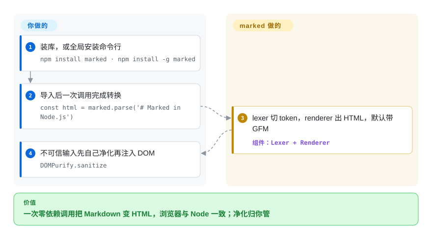

# marked

你的应用需要把 Markdown 变成 HTML，却不想为此拖进一套工具链：手搓正则会被嵌套列表绊倒，完整解析器又带着你永远用不上的 AST 机制。marked 就是一次 `marked.parse(src)` 调用，快速返回 HTML 字符串，浏览器和 Node 行为一致——而净化输出这件事，是刻意留给你的。

## 何时使用

你在做一个 Web 应用——评论框、文档浏览器、聊天客户端、README 渲染——需要把用户或作者写的 Markdown 转成 HTML，无论在浏览器还是 Node 里，而又不想拉进一整套重型工具链。你想要 `import { marked } from 'marked'`，然后 `marked.parse(src)` 直接给你一个 HTML 字符串，又快，默认就带合理的 GFM 倾向（表格、围栏代码、自动链接）。你把它接进去，把输出接到 DOM（先做净化——见下文），就完事了；没有 AST 要学，没有插件清单要拼装，除了你本来的打包器之外没有额外构建步骤。

当*吞吐和简洁*比严格规范一致更重要时，它是对的选择：一个页面里渲染大量小段 Markdown、服务端渲染一个文档站，或任何你本来会手搓正则然后后悔的地方。marked 打包体积紧凑，在 Node 和浏览器里行为一致，并暴露刚好够用的钩子（一个 `renderer`、一次 `walkTokens` 遍历、一个可直接调用的 lexer），让你不用引入整条管线就能定制输出。

## 怎么用起来

marked 是一个小而快的两级编译器。它的 lexer 把 Markdown 扫成一条扁平的 token 序列（标题、段落、列表项、代码段），再由 renderer 遍历这些 token 输出 HTML 字符串——默认不需要学习什么常驻 AST；要定制，用 `marked.use()` 扩展、自定义 `Renderer`/`Tokenizer`，或在渲染前改 token 的 `walkTokens` 钩子。GFM 惯例（表格、删除线、任务列表、自动链接、围栏代码）默认开启，常见场景的 API 面就是 `marked.parse(src)` 一次调用；同样的代码在浏览器、Node 和自带的 `marked` 命令行里行为一致。仍然归你管的是安全边界：marked 严格按 Markdown 字面输出 HTML，`` 这类东西原样透传——用 DOMPurify 或同类库净化不可信的输出，被明确划在它职责之外，把这件事当别人的责任就是 XSS 上线的方式。

<!-- flow-steps:begin (generated from flows/marked.json by tools/flow_card.py — do not edit) -->

流程文字版

1. **你**：装库，或全局安装命令行 — `npm install marked · npm install -g marked`
2. **你**：导入后一次调用完成转换 — `const html = marked.parse('# Marked in Node.js')`
3. **marked**：lexer 切 token，renderer 出 HTML，默认带 GFM — 组件：`Lexer + Renderer`
4. **你**：不可信输入先自己净化再注入 DOM — `DOMPurify.sanitize`

**价值**：一次零依赖调用把 Markdown 变 HTML，浏览器与 Node 一致；净化归你管

<!-- flow-steps:end -->

## 何时不用

- **你需要 100% CommonMark 一致。** marked 快、且向 CommonMark/GFM *倾斜*，但默认**并非**完全规范一致——边界情况会偏离参考实现。若精确的规范行为是硬性要求，请用 markdown-it（CommonMark 严格）或 remark。[推断]
- **你要渲染不可信 Markdown 又不做净化。** marked **不**净化它输出的 HTML——原始 HTML 和精心构造的链接会原样透传，所以朴素用法就是个 XSS 漏洞。你**必须**自己把输出过一遍 DOMPurify（或同类）；净化是被有意从 marked 自身职责里移除的。
- **你想把 Markdown 当 AST / mdast 管线来变换。** marked 的 token 模型是为渲染服务的，不是通用文档变换工具链。要做 lint、改写、MDX 或基于插件的 AST 遍历，请用 remark / unified。
- **你依赖庞大的插件生态。** marked 有扩展机制，但远不如 markdown-it 的插件目录。若你需要脚注、容器、KaTeX、任务列表等现成插件，markdown-it 或 remark 的现成零件更多。

## 横向对比

| 替代品 | 是否收录 | 我们的评价 | 取舍 |
|---|---|---|---|
| [markdown-it](markdown-it.zh.md) | ✅ | 需要 CommonMark 严格、可插拔架构和丰富插件生态时，选 markdown-it。 | CommonMark 严格、可插拔架构，插件生态丰富；API 更重、比 marked 略慢，但当规范一致和插件重要时它是首选。 |
| [remark](remark.zh.md) | ✅ | 需要完整 mdast AST 管线来解析、变换、lint、序列化 Markdown/MDX 时，选 remark。 | 完整的 mdast AST 管线，能解析、变换、lint、序列化（Markdown、MDX）；强大得多也重得多——是工具链，不是一次调用的渲染器。 |
| [micromark](micromark.zh.md) | ✅ | 需要 remark 底层的 CommonMark/GFM 分词器并自建渲染层时，选 micromark。 | remark 底下那个低层 CommonMark/GFM 分词器；正确、面向流式，但渲染层要你自己搭。 |
| [CommonMark](commonmark.zh.md) | ✅ | 需要规范自己的参考实现作为一致性标尺时，选 CommonMark。 | 规范自己的参考实现；是一致性标尺，但 GFM 便利特性更少，也未针对生产渲染做优化。 |

## 技术栈

- **语言：** TypeScript（GitHub 语言统计 2026-09：TypeScript 约 140.3k 字节、JavaScript 约 140.3k、HTML 约 109.6k——源码与文档/工具大致分属 TS 和遗留 JS；发布包为 JS 构建产物加 TypeScript 类型定义）。
- **运行目标：** 在 Node 和浏览器里都能跑；以 ESM 与 UMD/CJS 形式分发，也走 CDN。Node.js 仅支持当前与 LTS 版本（README Compatibility）。
- **架构：** lexer/分词器把 Markdown 变成 token，parser/renderer 输出 HTML；通过 `marked.use()`、`Renderer`、`Tokenizer`、`walkTokens` 钩子和扩展 API 做定制。
- **风味：** 在 CommonMark 风格内核之上带 GFM 倾向的默认项（表格、删除线、自动链接、围栏代码）。

## 依赖

- **运行时：** 零依赖（2026-09-28 对照 npm registry 上 `marked@18.0.14` 的元数据核验——包未声明任何 `dependencies`）。
- **净化器（你自己加）：** 对任何不可信输入，你必须搭配 DOMPurify（README 推荐）、sanitize-html 或 insane——不内置，被有意留作你的职责。
- **安装：** `npm install marked`（浏览器/Node）或 `npm install -g marked`（CLI）；README 给了 CDN bundle（`lib/marked.umd.js`、`lib/marked.esm.js`）。

## 运维难度

**低。** 它是库不是服务——除了给应用加一个依赖，没有任何要部署或运维的东西。唯一真正的运维顾虑是安全那条：记得在把输出注入 DOM 前先净化，并锁定/跟踪大版本，因为 API 在跨大版本时变过。没有数据存储、没有运行时、没有基础设施。

## 健康度与可持续性

- **响应速度**：Grade A——中位首次响应时间 4.1 小时，基于 14 个 qualifying issues/PRs。
- **维护——活跃（截至 2026-09）。** v18.x 线持续规律发版（v18.0.14 发布于 2026-09-22，GitHub releases API；仓库同日有推送）；约 37.2k star 下仅 22 个 open issue——对一个范围刻意做小、已经稳定的成熟解析器，这是健康的低 issue 曲线。
- **治理与 bus factor。** `Org` 所有（`markedjs/`）——是维护者团队/组织而非单人，相对单作者库降低了 bus factor 风险 [推断]。长期运行的社区项目，非厂商掌控；没有锁特性的商业层。
- **年龄与 Lindy 判断——老且仍活跃 ⇒ 强 Lindy。** 创建于 2011-07（约 15 年），到 2026 年仍在发版：教科书式的「年龄 × 仍活跃」信号。一个 15 岁仍在出版本的解析器，在这一类里几乎是最稳的寿命押注；不过 API 跨大版本有变动，请锁定并跟踪大版本。
- **风险标记——很少，但安全责任在你。** MIT 许可（LICENSE 文件与 npm 元数据均确认 MIT；GitHub 自动识别因贡献协议前言显示 NOASSERTION——这就是雷达许可轴为 `?` 的原因）。无 relicense 历史，无开放核心锁特性。唯一长期存在的告诫是设计使然：marked **不**净化输出，不可信输入必须你自己过一遍 DOMPurify——这是使用责任，不是项目健康度标记。

## 存疑（未验证）

- [推断]「默认非完全 CommonMark 一致」反映 marked 长期以来「速度优先、向规范倾斜」的定位；具体偏离取决于版本和你的配置——若一致性关键，请对照当前规范测试集核实。
- [未验证] 本轮未重新跑 CommonMark/GFM 一致性测试集；README 的说法（「low-level compiler… without caching or blocking」）2026-09-28 读取，性能数字未复现。
- [推断]「约 15 年、创建于 2011-07」来自仓库 `created_at`（GitHub API 2026-09-28）；项目早于其 GitHub 仓库存在，真实年龄只多不少。
