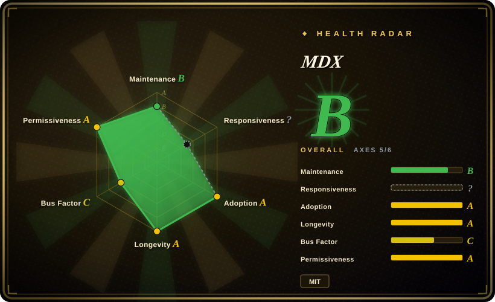
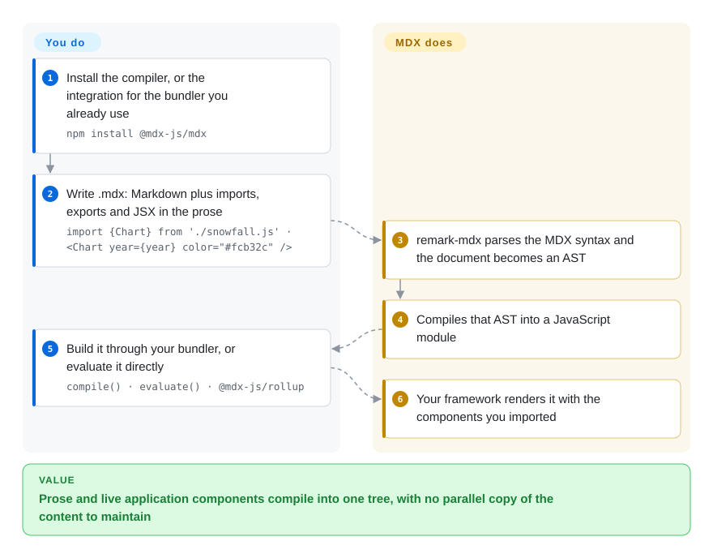

# MDX

An authorable format that puts JSX inside Markdown: a `.mdx` file can `import` components and render them inline, and the compiler turns the whole document into JavaScript that a React, Preact or Vue app renders.

## When to use

Your documentation lives inside a JavaScript application — a product's docs site, a component library's story pages, a blog on a React framework — and the prose keeps needing things Markdown cannot express: a live chart fed by real data, an interactive example, a callout component from your design system. Copy-pasting HTML into Markdown or maintaining a parallel set of React pages for the same content are both worse than the problem.

Reach for MDX when **components must be embedded in prose and rendered by your own app**: you pick it over a static-site approach because the document *is* a module — it can import, export, take props and be composed like any other component. Against [Quarkdown](../typesetting/quarkdown.md) or [Asciidoctor](../typesetting/asciidoctor.md) the deciding difference is direction of travel: they compile markup to *documents* (HTML pages, PDF, EPUB), while MDX compiles markup into your *application's* component graph, which is what you want if the docs must share state, theming and build tooling with the product.

## How it works

A `.mdx` file is Markdown plus JavaScript: you `import {Chart} from './snowfall.js'`, `export const year = 2013` at the top, and then use `{year}` and `<Chart year={year} color="#fcb32c" />` inside the prose. **You can either run the compiler yourself — `@mdx-js/mdx` exposes `compile()`, `evaluate()`, `run()` and their sync variants — or, far more commonly, plug an integration into the bundler you already use** (`@mdx-js/rollup`, `@mdx-js/esbuild`, `@mdx-js/loader` for webpack, or a framework's own MDX plugin). Under the hood the Markdown is parsed through the unified/remark pipeline extended by `remark-mdx`, producing an AST that the compiler emits as a JavaScript module. **You write prose with components and choose the integration; MDX parses, compiles to JavaScript, and hands the result to your framework's runtime**, which renders it with the components you imported.

<!-- flow-steps:begin (generated from flows/mdx.json by tools/flow_card.py — do not edit) -->

Text version of the flow

1. **You**: Install the compiler, or the integration for the bundler you already use — `npm install @mdx-js/mdx`
2. **You**: Write .mdx: Markdown plus imports, exports and JSX in the prose — `import {Chart} from './snowfall.js' · <Chart year={year} color="#fcb32c" />`
3. **MDX**: remark-mdx parses the MDX syntax and the document becomes an AST
4. **MDX**: Compiles that AST into a JavaScript module
5. **You**: Build it through your bundler, or evaluate it directly — `compile() · evaluate() · @mdx-js/rollup`
6. **MDX**: Your framework renders it with the components you imported

**Value**: Prose and live application components compile into one tree, with no parallel copy of the content to maintain

<!-- flow-steps:end -->

## When NOT to use

- **The deliverable is a standalone document — a PDF, a book, a printed report.** MDX has no output of its own beyond JavaScript; use [LaTeX](../typesetting/latex.md) or [Typst](../typesetting/typst.md) for print, or [Quarkdown](../typesetting/quarkdown.md) / [Asciidoctor](../typesetting/asciidoctor.md) for publishable documents from a plain-text source.
- **You are not already in a JavaScript project.** Taking on Node, a bundler and a component runtime just to write documents is a bad trade when [Quarkdown](../typesetting/quarkdown.md) or [Asciidoctor](../typesetting/asciidoctor.md) will produce the site or the PDF from a plain-text source.
- **You need the file to render where it sits — GitHub, an editor preview, a wiki.** `.mdx` does not render as Markdown in generic tooling; if in-place rendering is a requirement, keep plain Markdown and let your site generator transform it.
- **The content comes from untrusted authors.** MDX compiles to JavaScript, so an MDX document is executable code; the project maintains a Security page for exactly that reason. If readers can submit content, use plain Markdown with a sanitizing renderer instead. `[推断]`
- **You need a full site generator — routing, versioning, search, i18n.** MDX is a compiler plus bundler integrations, not a documentation framework; reach for a site generator built on it — [Docusaurus](../web-ui/frameworks/docusaurus.md), [Nextra](../web-ui/frameworks/nextra.md) or [Astro](../web-ui/frameworks/astro.md) — and evaluate that product instead.
- **You need frequent, versioned releases.** The release line is slow: 3.1.1 (2025-08-29), 3.1.0 (2024-10-18), 3.0.1 (2024-02-12). The API is stable and the open-issue count is tiny, but do not expect a fast-moving dependency.
- **You only need to convert an existing document into another format.** Use [Pandoc](pandoc.md) — it handles MDX as an input format without requiring you to adopt the JS toolchain.

## Comparison

| Alternative | In index | Our verdict | Tradeoff |
|---|---|---|---|
| [Quarkdown](../typesetting/quarkdown.md) | ✅ | Choose Quarkdown when the artifact is a document (PDF, slides, docs site) authored in Markdown by people outside your codebase; choose MDX when the artifact is a page inside your app that must import your components. | MDX gains component embedding, app-level theming and the npm ecosystem; it pays with a Node/React runtime, no print or book output, and a source that only developers can edit. |
| [Asciidoctor](../typesetting/asciidoctor.md) | ✅ | Choose Asciidoctor when technical documentation must publish as standalone HTML, DocBook, EPUB or man pages under MIT; choose MDX when the docs live inside a React product and share its build. | Asciidoctor gains multi-format publishing, a document model and three runtimes; it pays with no component model — you cannot interpolate live application state into the prose. |
| [Pandoc](pandoc.md) | ✅ | Choose Pandoc when you are converting between existing formats; choose MDX when you are authoring pages whose content depends on your application's components. | Pandoc gains the broadest format matrix; it pays with no execution model — it transforms markup, it does not render your React tree. |
| Markdown plus a hand-rolled template layer | 未收录 | Choose a hand-rolled layer only when the component surface is tiny and you would rather own 50 lines than a toolchain; choose MDX when components, props and imports are recurring needs. | Hand-rolled gains zero dependencies and full control; it pays with a bespoke parser or regex pipeline that keeps growing as the content gets richer — the problem MDX already solved. |

## Tech stack

- **Language:** JavaScript/TypeScript, published as **ESM only** (Node 16+). The core package is `@mdx-js/mdx`.
- **Pipeline:** built on the unified/remark ecosystem — `remark-mdx` extends the Markdown parser (micromark) with the MDX syntax, and the compiler emits a JS module from the resulting AST.
- **Integrations in this repo:** `@mdx-js/loader` (webpack), `@mdx-js/rollup`, `@mdx-js/esbuild`, `@mdx-js/node-loader`, plus runtime packages for `react`, `preact` and `vue`.
- **Evaluation API:** `compile()`, `compileSync()`, `evaluate()`, `evaluateSync()`, `run()`, `runSync()`, and `createProcessor()` for custom pipelines.

## Dependencies

- **Node 16+ and an ESM-capable toolchain.** The package is ESM-only, which matters if your build still assumes CommonJS.
- **A bundler or framework integration for real use.** The bare `compile()`/`evaluate()` API is for tooling; day-to-day authoring goes through Rollup, esbuild, webpack, or a framework plugin such as Next.js's.
- **A component runtime only if you use one.** JSX in the source needs React, Preact or Vue at render time — MDX compiles the document, it does not supply the renderer.
- **No service, no account, no network dependency.** Compilation and rendering happen inside your existing build and app.

## Ops difficulty

**Low, with your own build as the real surface.** Adding MDX is an npm dependency plus a bundler plugin; there is no service to run and no state to migrate. The friction is that MDX becomes part of your front-end build: an MDX syntax error surfaces as a build failure, version upgrades have to be coordinated with the framework's plugin, and the ESM-only constraint can bite older pipelines. Content authors need enough JavaScript to import and interpolate, which is a real cost if your writers are not developers.

## Health & viability

- **Maintenance — quiet, and quieter than `pushed_at` suggests (as of 2026-09-20).** GitHub's `pushed_at` is 2026-09-18T22:12:00Z, but that field also moves for non-default-branch and bot activity: the measured last commit on the default branch is **77 days** old and only **1 of the last 13 weeks** showed activity, which is why the radar grades maintenance `C`. Releases are rarer still — 3.1.1 (2025-08-29), 3.1.0 (2024-10-18), 3.0.1 (2024-02-12) — while the open-issue count is only **19**, and the scorer found no qualifying first-response window at all (`?`). Read this as a stabilizing project in a low-touch maintenance mode, not an abandoned one.
- **Governance and bus factor — a small core with corporate backing.** The repo belongs to the `mdx-js` organization; contribution totals concentrate in `johno` (727) and `wooorm` (367), with `timneutkens` (Next.js) also in the top contributors. The MIT license is held by "Compositor and Vercel, Inc.", and the README lists Vercel, HashiCorp, Netlify and others as sponsors — so there is an interested vendor, but no foundation.
- **Backing and Lindy — old and still active.** Created 2017-12-24, about 8.7 years old as of 2026-09, with a stable 3.x API and continuous maintenance. The Lindy prior applies: this is not a young hyped project.
- **Adoption and ecosystem — very large, mostly through the React documentation world.** ~19.8k stars, ~1.2k forks, and MDX is the content layer of several widely used documentation frameworks; the practical dependency is on those frameworks' continued MDX integration rather than on this repo alone.
- **Risk flags — executable content and a slow release line.** MDX documents are code, so untrusted input is a security boundary the project documents explicitly; the release cadence is slow enough that security fixes would arrive as commits rather than releases. MIT, no relicense history found.

## Caveats (unverified)

- `[未验证]` **The security model in detail.** The project maintains a Security page, but its contents were not read here; the "treat untrusted MDX as untrusted code" line is inferred from the fact that MDX compiles to JavaScript rather than quoted from the project's own guidance. `[推断]`
- `[未验证]` **Whether any recent security advisory exists** for MDX or its remark/micromark dependencies.
- `[未验证]` **The two-year release gap's cause** (maintenance mode, stability, or maintainer availability) was not established from project communications.
- `[未验证]` **Framework integration health** — how current the Next.js, Astro and Docusaurus MDX integrations are was not checked; this page only asserts the integrations in this repo.
- `[未验证]` **The claim that MDX is "the content layer" of named documentation frameworks** is a general characterisation; no specific framework was audited for its MDX usage.
- `[未验证]` **Performance on large documentation corpora** was not measured.
- `[推断]` **A 19-open-issue count alongside one active week in thirteen quarters reads as a project in low-touch maintenance mode**, but issue counts alone cannot distinguish "healthy and stable" from "nobody is filing"; the commit-activity measurement is the stronger half of that reading.
