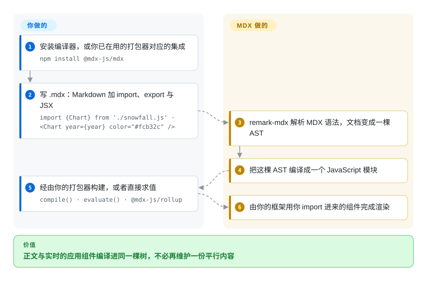

# MDX

把 JSX 写进 Markdown 的可创作格式：`.mdx` 文件可以 `import` 组件并在正文里直接渲染，编译器把整份文档变成 JavaScript，交由 React、Preact 或 Vue 应用渲染。

## 何时使用

你的文档活在 JavaScript 应用里——某个产品的文档站、组件库的示例页、跑在 React 框架上的博客——而正文总需要 Markdown 表达不了的东西：接真实数据的实时图表、可交互示例、来自你们设计系统的提示组件。把 HTML 复制粘贴进 Markdown，或者为同一份内容再维护一套平行的 React 页面，二者都比原问题更糟。

当**组件必须嵌入正文、并由你自己的应用渲染**时，选 MDX：相对静态站点路线，它的区别在于文档**本身就是模块**——可以 import、export、接收 props，像任何组件一样被组合。相对 [Quarkdown](../typesetting/quarkdown.zh.md) 或 [Asciidoctor](../typesetting/asciidoctor.zh.md)，决定性的差异是产物流向：那两者把标记编译成**文档**（HTML 页面、PDF、EPUB），MDX 把标记编译进**你应用的组件图**——当文档必须与产品共享状态、主题与构建工具链时，这正是你要的。

## 怎么用起来

`.mdx` 文件是 Markdown 加 JavaScript：开头写 `import {Chart} from './snowfall.js'`、`export const year = 2013`，然后在正文里用 `{year}` 与 `<Chart year={year} color="#fcb32c" />`。**你既可以自己跑编译器——`@mdx-js/mdx` 暴露 `compile()`、`evaluate()`、`run()` 及各自的同步版本——更常见的是把集成插件接进你已经在用的打包器**（`@mdx-js/rollup`、`@mdx-js/esbuild`、给 webpack 用的 `@mdx-js/loader`，或者框架自带的 MDX 插件）。底层是：Markdown 经 unified／remark 管线解析，并由 `remark-mdx` 扩展出 MDX 语法，得到 AST 后由编译器输出为一个 JavaScript 模块。**你写带组件的正文并选定集成方式；MDX 负责解析、编译成 JavaScript，再把结果交给你的框架运行时**，由它用你 import 进来的组件渲染。

<!-- flow-steps:begin (generated from flows/mdx.json by tools/flow_card.py — do not edit) -->

流程文字版

1. **你**：安装编译器，或你已在用的打包器对应的集成 — `npm install @mdx-js/mdx`
2. **你**：写 .mdx：Markdown 加 import、export 与 JSX — `import {Chart} from './snowfall.js' · <Chart year={year} color="#fcb32c" />`
3. **MDX**：remark-mdx 解析 MDX 语法，文档变成一棵 AST
4. **MDX**：把这棵 AST 编译成一个 JavaScript 模块
5. **你**：经由你的打包器构建，或者直接求值 — `compile() · evaluate() · @mdx-js/rollup`
6. **MDX**：由你的框架用你 import 进来的组件完成渲染

**价值**：正文与实时的应用组件编译进同一棵树，不必再维护一份平行内容

<!-- flow-steps:end -->

## 何时不用

- **交付物是独立文档——PDF、书、打印报告。** MDX 除了 JavaScript 之外没有自己的产物；印刷改用 [LaTeX](../typesetting/latex.zh.md) 或 [Typst](../typesetting/typst.zh.md)，从纯文本源出版文档则用 [Quarkdown](../typesetting/quarkdown.zh.md) 或 [Asciidoctor](../typesetting/asciidoctor.zh.md)。
- **你本来就不在 JavaScript 项目里。** 只为写文档而引入 Node、打包器和组件运行时是很差的交换——[Quarkdown](../typesetting/quarkdown.zh.md) 或 [Asciidoctor](../typesetting/asciidoctor.zh.md) 能用纯文本源产出站点或 PDF。
- **你需要文件就地渲染——GitHub、编辑器预览、wiki。** `.mdx` 在通用工具里不会按 Markdown 渲染；若就地渲染是硬需求，就继续用纯 Markdown，让站点生成器去转换。
- **内容来自不可信的作者。** MDX 编译成 JavaScript，所以一份 MDX 文档就是可执行代码；项目专门维护了一页 Security 说明，原因正在于此。若读者可以投稿内容，请改用纯 Markdown 加会消毒的渲染器。`[推断]`
- **你需要完整的站点生成器——路由、版本、搜索、i18n。** MDX 是编译器加打包器集成，不是文档框架；请选建立在它之上的站点生成器——[Docusaurus](../web-ui/frameworks/docusaurus.zh.md)、[Nextra](../web-ui/frameworks/nextra.zh.md) 或 [Astro](../web-ui/frameworks/astro.zh.md)——并改为评估那个产品。
- **你需要频繁的版本化发布。** 发布线很慢：3.1.1（2025-08-29）、3.1.0（2024-10-18）、3.0.1（2024-02-12）。API 稳定、未关闭 issue 极少，但不要指望一个快速迭代的依赖。
- **你只是想把手上的文档转成另一种格式。** 改用 [Pandoc](pandoc.zh.md)——它能把 MDX 当输入格式处理，不需要你引入整套 JS 工具链。

## 横向对比

| 替代品 | 是否收录 | 我们的评价 | 取舍 |
|---|---|---|---|
| [Quarkdown](../typesetting/quarkdown.zh.md) | ✅ | 当产物是由代码库之外的人用 Markdown 撰写的文档（PDF、幻灯片、文档站）时选 Quarkdown；当产物是你应用里的某个页面、必须 import 你的组件时选 MDX。 | MDX 换来组件嵌入、应用级主题与 npm 生态；代价是 Node／React 运行时、没有印刷或图书输出，以及只有开发者能编辑的源文件。 |
| [Asciidoctor](../typesetting/asciidoctor.zh.md) | ✅ | 当技术文档必须以独立 HTML、DocBook、EPUB 或 man page 发布、且要 MIT 许可时选 Asciidoctor；当文档活在 React 产品内部并共用其构建时选 MDX。 | Asciidoctor 换来多格式出版、文档模型与三种运行时；代价是没有组件模型——你无法把应用里的实时状态插进正文。 |
| [Pandoc](pandoc.zh.md) | ✅ | 当你在已有格式之间互转时选 Pandoc；当你在创作「内容依赖应用组件」的页面时选 MDX。 | Pandoc 换来最广的格式矩阵；代价是没有执行模型——它转换标记，不会渲染你的 React 树。 |
| Markdown 加自搭模板层 | 未收录 | 只有组件面很小、且你宁愿自己拥有 50 行代码而不是一套工具链时，才选自搭方案；当组件、props 与 import 是反复出现的需求时选 MDX。 | 自搭换来零依赖与完全掌控；代价是一个自制的解析器或正则管线，内容越丰富它越会长——而这正是 MDX 已经解决的问题。 |

## 技术栈

- **语言：** JavaScript／TypeScript，以 **ESM only** 形式发布（Node 16+）。核心包是 `@mdx-js/mdx`。
- **流水线：** 建立在 unified／remark 生态上——`remark-mdx` 把 MDX 语法扩展进 Markdown 解析器（micromark），编译器再从得到的 AST 输出 JS 模块。
- **本仓库内的集成：** `@mdx-js/loader`（webpack）、`@mdx-js/rollup`、`@mdx-js/esbuild`、`@mdx-js/node-loader`，以及面向 `react`、`preact`、`vue` 的运行时包。
- **求值 API：** `compile()`、`compileSync()`、`evaluate()`、`evaluateSync()`、`run()`、`runSync()`，以及用于自定义管线的 `createProcessor()`。

## 依赖

- **Node 16+ 与支持 ESM 的工具链。** 该包是 ESM only，如果你的构建仍假设 CommonJS，这一点会咬人。
- **真实使用需要打包器或框架集成。** 裸的 `compile()`／`evaluate()` API 是给工具用的；日常写作走 Rollup、esbuild、webpack，或 Next.js 这类框架插件。
- **只有你用到组件运行时才有该依赖。** 源里的 JSX 在渲染时需要 React、Preact 或 Vue——MDX 编译文档，不提供渲染器。
- **无服务、无账号、无网络依赖。** 编译与渲染都发生在你既有的构建与应用内部。

## 运维难度

**低，但真正的操作面是你自己的构建。** 引入 MDX 就是加一个 npm 依赖和一个打包器插件；没有服务要跑，也没有状态要迁移。摩擦在于 MDX 会成为你前端构建的一部分：语法错误表现为构建失败，升级版本要与框架插件同步，ESM only 的约束会卡住较老的管线。内容作者需要懂足以 import 与插值的 JavaScript——如果写手不是开发者，这是真实成本。

## 健康度与可持续性

- **维护活跃度——安静，而且比 `pushed_at` 显示的更安静（截至 2026-09-20）。** GitHub 的 `pushed_at` 为 2026-09-18T22:12:00Z，但该字段也会因非默认分支与机器人活动而变动：实测默认分支上最后一次提交距今 **77 天**，最近 13 周里只有 **1 周**有活动，这也是雷达把维护活跃度评为 `C` 的原因。发布更稀疏——3.1.1（2025-08-29）、3.1.0（2024-10-18）、3.0.1（2024-02-12）——而未关闭 issue 只有 **19** 个，评分器干脆找不到合格的首次响应窗口（`?`）。请把它读作进入低干预维护模式的稳定项目，而不是被放弃的项目。
- **治理与维护者分散度——小核心加公司背书。** 仓库属于 `mdx-js` 组织；贡献集中在 `johno`（727）与 `wooorm`（367），顶层贡献者里还有 `timneutkens`（Next.js）。MIT 许可的版权方是「Compositor and Vercel, Inc.」，README 里列了 Vercel、HashiCorp、Netlify 等赞助方——有利益相关的厂商，但没有基金会。
- **背书与寿命——又老又仍然活跃。** 创建于 2017-12-24，截至 2026-09 约 8.7 年，3.x API 稳定且持续维护。Lindy 先验在这里成立：这不是一个年轻的热门项目。
- **采用与生态——规模很大，且主要集中在 React 文档世界。** 约 19.8k star、约 1.2k fork，MDX 是若干广泛使用的文档框架的内容层；实际依赖更多落在那些框架对 MDX 的持续集成上，而不只是这个仓库。
- **风险旗标——可执行内容与慢发布线。** MDX 文档就是代码，所以不可信输入是一条项目明确写出来的安全边界；发布节奏慢到安全修复更可能以提交而非版本的形式出现。MIT，未发现换证历史。

## 存疑（未验证）

- `[未验证]` **安全模型的细节。** 项目专门维护了 Security 页面，但本文没有读取其内容；「把不可信 MDX 当作不可信代码」这句是从「MDX 编译成 JavaScript」这一事实推断的，不是引用项目的原话。`[推断]`
- `[未验证]` **MDX 或其 remark／micromark 依赖是否已有安全公告。**
- `[未验证]` **两年发布间隔的成因**（维护模式、刻意稳定，还是维护者精力）没有从项目沟通中确认。
- `[未验证]` **框架集成的健康度**——Next.js、Astro、Docusaurus 的 MDX 集成是否跟得上版本没有检查；本页只主张本仓库内的那些集成。
- `[未验证]` **「MDX 是若干文档框架的内容层」这一说法是总体描述**；没有审计某个具体框架对 MDX 的使用。
- `[未验证]` **大文档集上的性能**没有测量。
- `[推断]` **19 个未关闭 issue 加上十三周里只有一周有活动，读起来是处于低干预维护模式的项目**；但仅凭 issue 数量无法区分「健康稳定」与「没人提」，这个判断更强的依据是提交活跃度的实际测量。
