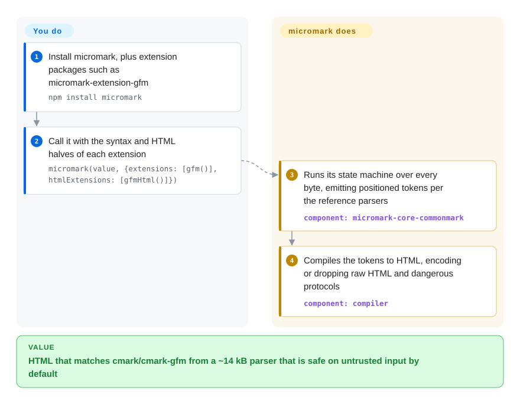

# micromark

You need Markdown parsed in JavaScript exactly the way the reference C parsers (`cmark`, `cmark-gfm`) do it — in a ~14 kB bundle, safe by default — or you are building a linter or editor and must know which exact characters every heading, link and emphasis came from. micromark is a small state-machine parser that accounts for every byte as a positioned token and, by default, compiles those tokens straight to HTML.

## When to use

You are in one of two seats. Either you render Markdown to HTML in a browser or edge bundle and the 100 kB-class parsers are too big, but "close enough to CommonMark" is not good enough because users paste content from GitHub and expect the same result. Or you are writing tooling — a Markdown linter, an editor with precise highlighting, a converter that needs source positions — and a parser that hands you only HTML or a lossy tree leaves you guessing where `**bold**` started. In both seats micromark fits: it is 100% CommonMark-compliant and follows the reference parsers' behavior with ±2k tests, its GFM, MDX, math, frontmatter and directive extensions are separate packages, and it is the parser underneath [remark](remark.md) and [markdownlint](markdownlint.md).

Pick it over [markdown-it](markdown-it.md) when spec exactness, bundle size or byte-level positions decide it; pick markdown-it when you need many custom syntax plugins quickly. Pick it over [marked](marked.md) when content is untrusted or must match CommonMark/GFM. If you need a syntax tree to transform, you usually do not call micromark directly — use remark, which builds on it.

## How it works

micromark reads your Markdown as a state machine — a reader that moves through fixed states such as "inside a code fence" or "after a list marker" one character at a time — and emits concrete tokens ("events") that cover every byte with start and end positions. By default it then compiles those events directly to an HTML string, so for plain rendering it is a one-function library: `micromark(markdown)` in, HTML out. What it does for you: CommonMark parsing to the reference parsers' behavior, and safety — raw HTML and dangerous protocols such as `javascript:` are encoded or dropped unless you set `allowDangerousHtml` / `allowDangerousProtocol`. What you do: pick syntax extensions (each comes as a syntax half and an HTML half, e.g. `gfm()` + `gfmHtml()`), and, for tooling, consume the events through the mdast utilities that remark uses rather than through micromark's narrow API. A `micromark/stream` entry accepts piped input, but it buffers before finishing — some work happens as chunks arrive, the result does not.

<!-- flow-steps:begin (generated from flows/micromark.json by tools/flow_card.py — do not edit) -->

Text version of the flow

1. **You**: Install micromark, plus extension packages such as micromark-extension-gfm — `npm install micromark`
2. **You**: Call it with the syntax and HTML halves of each extension — `micromark(value, {extensions: [gfm()], htmlExtensions: [gfmHtml()]})`
3. **micromark**: Runs its state machine over every byte, emitting positioned tokens per the reference parsers — component: `micromark-core-commonmark`
4. **micromark**: Compiles the tokens to HTML, encoding or dropping raw HTML and dangerous protocols — component: `compiler`

**Value**: HTML that matches cmark/cmark-gfm from a ~14 kB parser that is safe on untrusted input by default

<!-- flow-steps:end -->

## When NOT to use

- **You want to transform, lint or serialize Markdown.** micromark gives tokens or HTML, not a tree you can edit and write back; use [remark](remark.md), which wraps micromark with mdast trees and the unified plugin ecosystem.
- **You need several custom syntax extensions fast.** micromark's own README says its extensions are "rather complex to write"; [markdown-it](markdown-it.md) has an easier rule API and a large catalog of ready plugins.
- **You need true streaming of a growing document**, such as rendering an LLM reply token by token. micromark's stream "in the end" buffers the whole input; for incremental AI output look at [TanStack Markdown](tanstack-markdown.md)'s streaming extension, which tolerates half-open constructs while text accumulates.
- **Your toolchain is CommonJS-only or runs Node < 16.** micromark is ESM only; [markdown-it](markdown-it.md) ships CJS builds.
- **You are not in JavaScript.** In Go use [Goldmark](goldmark.md); in Rust the same authors maintain the sibling `markdown-rs` (not indexed).

## Comparison

| Alternative | In index | Our verdict | Tradeoff |
|---|---|---|---|
| [remark](remark.md) | ✅ | When you need to inspect or transform Markdown as a tree (plugins, linting, MDX, Markdown output), pick remark; when you only need HTML or raw positioned tokens, pick micromark directly. | remark adds mdast trees and a large plugin ecosystem on top of micromark at the cost of more packages and a pipeline to configure. |
| [markdown-it](markdown-it.md) | ✅ | For Markdown→HTML with lots of custom syntax, pick markdown-it; for the smallest bundle and the strictest match to cmark, pick micromark. | markdown-it extensions are easy to write and plentiful and it ships CJS; micromark is smaller and stricter but ESM-only with hard-to-write extensions. |
| [marked](marked.md) | ✅ | For trusted content and a familiar, long-lived API, pick marked; for untrusted input or exact CommonMark/GFM output, pick micromark. | marked is not CommonMark-strict and is unsafe by default; micromark is safe by default but its option names and extension pairs take more learning. |
| [CommonMark](commonmark.md) | ✅ | Use commonmark.js when you want the spec's own JS reference implementation and its AST; use micromark when you need GFM, MDX or math extensions and a smaller parser. | commonmark.js tracks the spec by definition but has no extension system; micromark matches it in behavior and adds extensions. |
| markdown-rs | not indexed | In Rust (or when compiling a Rust parser to WASM), pick markdown-rs; in JS, pick micromark — they are siblings from the same authors. | Same design and extensions in Rust; using it from JS means a WASM boundary. |
| [Goldmark](goldmark.md) | ✅ | In Go services pick Goldmark; in JS pick micromark. | Both are CommonMark-compliant with extensions; Goldmark's extension API is easier, micromark is smaller and stricter. |

## Tech stack

- **Language:** JavaScript, shipping `.d.ts` TypeScript declarations; published as ESM only (`"type": "module"`), with `micromark` and `micromark/stream` entries and a `development` export condition for instrumented debug builds.
- **Architecture:** preprocess → parse (state-machine "constructs" emitting events) → postprocess → compile to HTML; the monorepo splits this into `micromark-core-commonmark`, `micromark-factory-*` and `micromark-util-*` packages.
- **Spec:** 100% CommonMark; extensions for GFM, MDX, directives, frontmatter and math live in separate `micromark-extension-*` packages.
- **Testing:** ~650 CommonMark tests plus more than 1.2k extra tests checked against the reference parsers, 100% coverage, fuzzing.

## Dependencies

- **Runtime (npm):** 18 declared dependencies, mostly its own `micromark-core-commonmark`, `micromark-factory-*` and `micromark-util-*` pieces, plus `debug`, `devlop` and `decode-named-character-reference`. No services. (Earlier versions of this page said "zero dependencies"; that is wrong for the npm package.)
- **Optional:** `micromark-extension-*` packages for GFM, MDX, math, frontmatter, directives.
- **Install:** `npm install micromark` (Node 16+, Deno or browsers via esm.sh).

## Ops difficulty

**Low.** A library with no service to run. Two operational notes from its security docs: keep `allowDangerousHtml` / `allowDangerousProtocol` off for user content, and cap input size (it suggests 500 kB) and parse in a worker you can stop, because large or adversarial inputs — thousands of unclosed links or emphasis — can exhaust memory or time.

## Health & viability

- **Maintenance — mature and still patched.** v4.0.3 shipped 2026-09-26 with performance and correctness fixes, after a 19-month gap since v4.0.2 (2025-02); the API has been stable since v4.0.0 (2023-06). This is a finished core that gets fixes, not a feature treadmill (maintenance B).
- **Responsiveness — fast.** Pull requests get a first response almost immediately in the scorer's window (responsiveness A, up from B).
- **Governance — effectively one maintainer.** Titus Wormer (`wooorm`) wrote about 636 of the commits; others contribute single digits (governance D). It sits in the unified collective, funded through OpenCollective and GitHub Sponsors, so the backing is a collective but the bus factor is one person.
- **Age & Lindy — ~8 years and still active.** Created 2018-11 and now the engine under remark and markdownlint; age × still-active is solid.
- **Adoption — very high, mostly indirect.** Its packages see hundreds of millions of npm downloads a month (the scorer's 2026-10-09 figures for the `micromark` package itself are 245,406,015 downloads in the last month and 151,327 dependent repositories), almost all pulled in through remark, MDX and markdownlint; the ~2.2k stars understate this.
- **Risk flags.** MIT, no relicensing, semver since 3.0.0.

## Caveats (unverified)

- [未验证] "~14 kB" and "smallest CommonMark parser" are the README's own claims; bundle size was not measured here.
- [推断] Consuming events through the mdast utilities rather than micromark's API is inferred from the README's API section (only `micromark` and `stream` are documented exports) and remark's design.
- [未验证] TanStack Markdown's streaming extension as a substitute for incremental AI output rests on that page's description; the two were not benchmarked against each other.
- [未验证] The download and dependent counts come from the health scorer (ecosyste.ms data), not from a separate check against npm.
- [推断] The "rather complex to write" extension judgment is the authors' own; how it compares to writing a markdown-it rule depends on the syntax.
