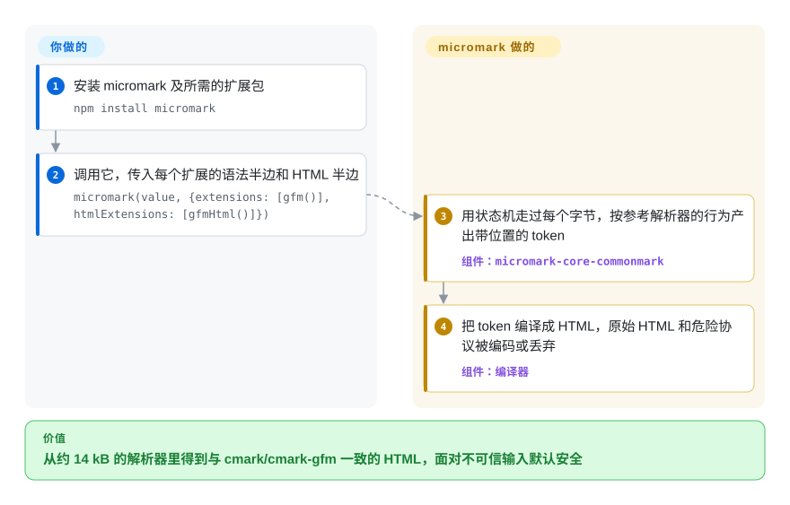

# micromark

你要在 JavaScript 里解析 Markdown，结果必须和参考实现的 C 解析器（`cmark`、`cmark-gfm`）一模一样，打包后还得只有约 14 kB、默认安全；或者你在写检查器、编辑器，必须知道每个标题、链接、加粗究竟来自源文的哪几个字符。micromark 是一个小巧的状态机解析器：把每个字节都记成带位置的 token，默认再把这些 token 直接编译成 HTML。

## 何时使用

你通常坐在两个位置之一。要么你在浏览器或边缘函数的包里把 Markdown 渲染成 HTML，100 kB 量级的解析器太大，但“差不多符合 CommonMark”又不够——用户从 GitHub 粘内容过来，期待看到同样的结果。要么你在写工具——Markdown 检查器、需要精确高亮的编辑器、要源码位置的转换器——而只吐 HTML 或有损语法树的解析器让你只能猜 `**加粗**` 从哪里开始。两种情况 micromark 都合适：它 100% 符合 CommonMark，并用约 2 千个测试对齐参考解析器的行为；GFM、MDX、数学公式、frontmatter、指令语法都是独立的扩展包；[remark](remark.zh.md) 和 [markdownlint](markdownlint.zh.md) 底下用的都是它。

和 [markdown-it](markdown-it.zh.md) 比，规范精确度、包体积或字节级位置是决定因素时选它；要快速加很多自定义语法插件时选 markdown-it。和 [marked](marked.zh.md) 比，内容不可信或必须与 CommonMark/GFM 一致时选它。如果你要的是一棵能改写的语法树，通常不直接调 micromark，而是用建在它上面的 remark。

## 怎么用起来

micromark 用状态机读你的 Markdown——像一个阅读者，一次一个字符，在“代码块内部”“列表符号之后”这样固定的状态之间切换——并产出具体的 token（“事件”），覆盖每个字节，带起止位置。默认情况下它随即把这些事件直接编译成 HTML 字符串，所以单纯渲染时它就是一个函数的库：`micromark(markdown)` 进，HTML 出。它替你做的：按参考解析器的行为解析 CommonMark，以及安全——除非你设置 `allowDangerousHtml` / `allowDangerousProtocol`，原始 HTML 和 `javascript:` 这类危险协议都会被编码或丢弃。你要做的：挑选语法扩展（每个扩展分语法半边和 HTML 半边，如 `gfm()` + `gfmHtml()`）；做工具时，通过 remark 所用的 mdast 工具包去消费这些事件，而不是走 micromark 自己很窄的 API。`micromark/stream` 入口可以接管道输入，但结束前仍要缓冲全文——部分工作能随数据块到达而进行，结果却不能。

<!-- flow-steps:begin (generated from flows/micromark.json by tools/flow_card.py — do not edit) -->

流程文字版

1. **你**：安装 micromark 及所需的扩展包 — `npm install micromark`
2. **你**：调用它，传入每个扩展的语法半边和 HTML 半边 — `micromark(value, {extensions: [gfm()], htmlExtensions: [gfmHtml()]})`
3. **micromark**：用状态机走过每个字节，按参考解析器的行为产出带位置的 token — 组件：`micromark-core-commonmark`
4. **micromark**：把 token 编译成 HTML，原始 HTML 和危险协议被编码或丢弃 — 组件：`编译器`

**价值**：从约 14 kB 的解析器里得到与 cmark/cmark-gfm 一致的 HTML，面对不可信输入默认安全

<!-- flow-steps:end -->

## 何时不用

- **你要变换、检查或序列化 Markdown。** micromark 给的是 token 或 HTML，不是一棵能修改再写回的树；请用 [remark](remark.zh.md)，它在 micromark 之上加了 mdast 语法树和 unified 插件生态。
- **你要快速加好几个自定义语法扩展。** micromark 自己的 README 都说它的扩展“写起来相当复杂”；[markdown-it](markdown-it.zh.md) 的规则 API 更好上手，现成插件也多。
- **你要真正流式地渲染一份不断增长的文档**，比如逐 token 渲染大模型的回复。micromark 的流接口“最终”还是要缓冲全文；增量 AI 输出请看 [TanStack Markdown](tanstack-markdown.zh.md) 的 streaming 扩展，它能容忍文本累积过程中未闭合的结构。
- **你的工具链只支持 CommonJS，或运行在 Node 16 以下。** micromark 只发布 ESM；[markdown-it](markdown-it.zh.md) 提供 CJS 构建。
- **你不在 JavaScript 里。** Go 用 [Goldmark](goldmark.zh.md)；Rust 用同一批作者维护的姊妹项目 `markdown-rs`（未收录）。

## 横向对比

| 替代品 | 是否收录 | 我们的评价 | 取舍 |
|---|---|---|---|
| [remark](remark.zh.md) | ✅ | 要把 Markdown 当树来检查或变换（插件、检查、MDX、输出 Markdown）时选 remark；只需要 HTML 或带位置的原始 token 时直接用 micromark。 | remark 在 micromark 之上加了 mdast 语法树和庞大的插件生态，代价是更多的包和一条要配置的管线。 |
| [markdown-it](markdown-it.zh.md) | ✅ | Markdown→HTML 且要大量自定义语法时选 markdown-it；要最小的包体积和与 cmark 最严格的一致性时选 micromark。 | markdown-it 扩展好写、数量多，还提供 CJS；micromark 更小更严格，但只有 ESM，扩展难写。 |
| [marked](marked.zh.md) | ✅ | 内容可信、想要熟悉且历史悠久的 API 时选 marked；输入不可信或必须精确符合 CommonMark/GFM 时选 micromark。 | marked 不严格遵循 CommonMark，且默认不安全；micromark 默认安全，但选项命名和成对的扩展需要更多学习。 |
| [CommonMark](commonmark.zh.md) | ✅ | 想要规范自己的 JS 参考实现及其语法树时用 commonmark.js；需要 GFM、MDX、数学公式扩展和更小的解析器时用 micromark。 | commonmark.js 按定义就与规范同步，但没有扩展系统；micromark 行为上与之一致，又加了扩展。 |
| markdown-rs | 未收录 | 在 Rust 里（或要把 Rust 解析器编译成 WASM 时）选 markdown-rs；在 JS 里选 micromark——两者是同一批作者的姊妹项目。 | Rust 版设计和扩展相同；从 JS 调用它要跨一层 WASM 边界。 |
| [Goldmark](goldmark.zh.md) | ✅ | Go 服务里选 Goldmark，JS 里选 micromark。 | 两者都符合 CommonMark 且有扩展；Goldmark 的扩展 API 更容易，micromark 更小也更严格。 |

## 技术栈

- **语言：** JavaScript，附带 `.d.ts` TypeScript 声明；只发布 ESM（`"type": "module"`），入口是 `micromark` 和 `micromark/stream`，另有 `development` 导出条件用于带断言和调试信息的构建。
- **架构：** 预处理 → 解析（状态机“构造”产出事件）→ 后处理 → 编译成 HTML；单仓库把这些拆成 `micromark-core-commonmark`、`micromark-factory-*`、`micromark-util-*` 等包。
- **规范：** 100% CommonMark；GFM、MDX、指令、frontmatter、数学公式扩展放在独立的 `micromark-extension-*` 包里。
- **测试：** 约 650 个 CommonMark 测试，外加 1.2 千多个对照参考解析器确认过的额外测试，100% 覆盖率，另做模糊测试。

## 依赖

- **运行时（npm）：** 声明了 18 个依赖，多数是它自己的 `micromark-core-commonmark`、`micromark-factory-*`、`micromark-util-*` 小包，另有 `debug`、`devlop`、`decode-named-character-reference`。不需要任何服务。（本页旧版写的“零依赖”对 npm 包而言是错的。）
- **可选：** GFM、MDX、数学公式、frontmatter、指令等 `micromark-extension-*` 包。
- **安装：** `npm install micromark`（Node 16+；Deno 和浏览器可经 esm.sh 引入）。

## 运维难度

**低。** 它是库，没有服务要运行。安全文档里有两条运维要点：处理用户内容时保持 `allowDangerousHtml` / `allowDangerousProtocol` 关闭；限制输入大小（它建议 500 kB），并在可随时终止的 worker 里解析，因为超大或恶意构造的输入（成千上万个未闭合的链接或强调）会耗尽内存或时间。

## 健康度与可持续性

- **维护——成熟且仍在修补。** v4.0.3 于 2026-09-26 发布，带来性能和正确性修复，距 v4.0.2（2025-02）隔了 19 个月；API 自 v4.0.0（2023-06）起保持稳定。这是一个已完工、持续修补的内核，而不是不停加功能的项目（维护 B）。
- **响应——很快。** 在评分器的统计窗口里，PR 几乎立刻得到首次回复（响应度 A，由 B 上调）。
- **治理——实际上只有一位维护者。** Titus Wormer（`wooorm`）贡献了约 636 次提交，其他人都是个位数（治理 D）。它属于 unified 集体，经 OpenCollective 和 GitHub Sponsors 筹款，所以有集体背书，但 bus factor 是一个人。
- **年龄与 Lindy——约 8 年且仍活跃。** 2018-11 创建，如今是 remark 和 markdownlint 的引擎；年龄 × 仍活跃的信号扎实。
- **采用——非常广，且多为间接。** 它的各个包每月有数亿次 npm 下载（评分器 2026-10-09 对 `micromark` 包本身的读数是上月下载 245,406,015 次、依赖它的仓库 151,327 个），几乎都是经 remark、MDX、markdownlint 拉进来的；约 2.2k 的 star 数严重低估了这一点。
- **风险信号。** MIT 许可，无改许可证历史，3.0.0 起遵循语义化版本。

## 存疑（未验证）

- [未验证] “约 14 kB”和“最小的 CommonMark 解析器”是 README 自己的说法，本页没有实测包体积。
- [推断] 通过 mdast 工具包而不是 micromark 自身 API 消费事件，是从 README 的 API 章节（只文档化了 `micromark` 和 `stream` 两个导出）和 remark 的设计推出来的。
- [未验证] 用 TanStack Markdown 的 streaming 扩展替代增量 AI 输出，依据是那个页面的描述，两者没有做过对比测试。
- [未验证] 下载量和依赖仓库数来自健康度评分器（ecosyste.ms 数据），没有另外对照 npm 核对。
- [推断] 扩展“写起来相当复杂”是作者自己的评价；和写一条 markdown-it 规则相比难多少，取决于具体语法。
