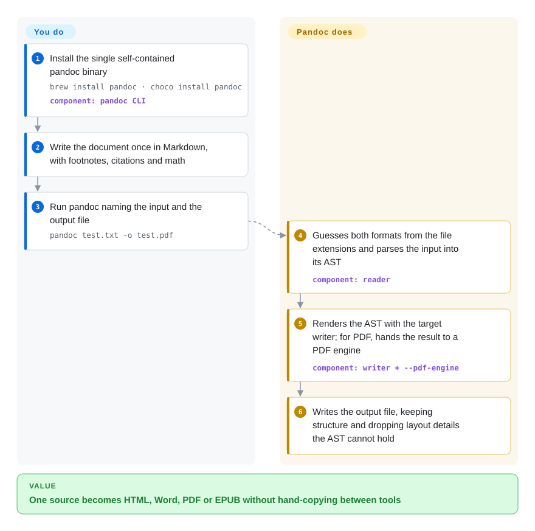

# Pandoc

You wrote the report once in Markdown, and now the editor wants a `.docx`, the website wants HTML and the archive wants a PDF — copy-pasting into Word breaks the footnotes and citations every time. Pandoc reads the source into one neutral document tree and writes that tree back out in whichever of dozens of formats you name, so the same file becomes all three.

## When to use

You're a researcher, technical writer or docs engineer who keeps content in plain text (Markdown, Org, reStructuredText, LaTeX) but has to deliver it in formats other people use: a Word file with the publisher's styles, an EPUB, a PDF, a Jira or MediaWiki page, a Typst or LaTeX source. Your current workflow is "export, open, fix the citations by hand", and a single run of `pandoc paper.md -o paper.docx` replaces it. You also reach for it in the other direction — pulling a colleague's `.docx` into Markdown for version control.

You pick Pandoc over a JavaScript Markdown pipeline such as [remark](remark.md) or [markdown-it](markdown-it.md) because those stop at Markdown/HTML, while Pandoc speaks dozens of formats in both directions (the README lists about 50 input and 70 output formats) and adds citations (`--citeproc`), templates and a Word style reference (`--reference-doc`). You pick it over [MarkItDown](../document-parsing/markitdown.md) when you need output *other than* Markdown and when the input is a structured markup file rather than a scanned page.

## How it works

Pandoc is a translator with a neutral language in the middle. A *reader* parses your input into Pandoc's own document tree — an AST, i.e. a structured list of headings, paragraphs, tables, citations and so on — and a *writer* renders that tree into the target format; adding a format only means adding a reader or a writer. You run one command and name the files; Pandoc guesses the formats from the extensions, and `-s` asks for a complete standalone document rather than a fragment. If you want to change the document on the way through (renumber figures, drop internal notes), you pass a Lua filter (`--lua-filter`) that edits the tree between reader and writer; Pandoc ships its own Lua interpreter, so nothing else needs installing. What Pandoc does *not* do for you is layout: margins, page size and Word styles come from a template or a reference document you supply, and PDF output is handed off to an external engine (LaTeX by default, or Typst, WeasyPrint and others) that you must install separately.

<!-- flow-steps:begin (generated from flows/pandoc.json by tools/flow_card.py — do not edit) -->

Text version of the flow

1. **You**: Install the single self-contained pandoc binary — `brew install pandoc · choco install pandoc` — component: `pandoc CLI`
2. **You**: Write the document once in Markdown, with footnotes, citations and math
3. **You**: Run pandoc naming the input and the output file — `pandoc test.txt -o test.pdf`
4. **Pandoc**: Guesses both formats from the file extensions and parses the input into its AST — component: `reader`
5. **Pandoc**: Renders the AST with the target writer; for PDF, hands the result to a PDF engine — component: `writer + --pdf-engine`
6. **Pandoc**: Writes the output file, keeping structure and dropping layout details the AST cannot hold

**Value**: One source becomes HTML, Word, PDF or EPUB without hand-copying between tools

<!-- flow-steps:end -->

## When NOT to use

- **You need a pixel-faithful conversion of a richly formatted document.** The upstream README says conversions from formats more expressive than Pandoc Markdown "can be expected to be lossy" — complex tables, margins and page layout do not survive the AST. For high-fidelity Office ↔ PDF conversion, run LibreOffice headless (not indexed) instead.
- **You need to extract text from scanned or layout-heavy PDFs.** Pandoc can *write* PDF but cannot *read* it. For PDF → Markdown with layout analysis and OCR, use [Docling](../document-parsing/docling.md) or [Marker](../document-parsing/marker.md).
- **You only need Markdown → HTML inside a Node or browser app.** Shelling out to a ~35–40 MB native binary for that is overkill; use [marked](marked.md), [markdown-it](markdown-it.md), or [remark](remark.md) when you also need to lint or transform the tree in JavaScript.
- **You will run it on untrusted user uploads without hardening.** The manual's security note warns that `include` directives (LaTeX, Org, RST, Typst), embedded images and HTML `iframe` fetching can leak local files or enable SSRF (CVE-2025-51591), and `--pdf-engine` adds risks `--sandbox` does not cover. Use `pandoc server` or the WASM build, sanitize HTML output, and put a timeout on every run — or pick a narrower converter.
- **You want to link its Haskell library into a closed-source product.** Pandoc is GPL-2.0-or-later; calling the CLI as a separate process is the usual way around that, but embedding the library makes your binary a GPL derivative. For a permissive in-process Markdown converter, use [markdown-it](markdown-it.md) or [goldmark](goldmark.md).
- **You want a typesetting system, not a converter.** If the goal is beautifully laid-out PDFs authored natively, write in [Typst](../typesetting/typst.md) directly (Pandoc can then convert *into* Typst when needed).

## Comparison

| Alternative | In index | Our verdict | Tradeoff |
|---|---|---|---|
| [MarkItDown](../document-parsing/markitdown.md) | ✅ | When an LLM or RAG job needs Office/PDF files flattened into Markdown, pick MarkItDown; pick Pandoc when you need to write Word, PDF, EPUB or LaTeX back out. | MarkItDown is one-way into Markdown and takes PDFs; Pandoc goes both directions across dozens of formats but cannot read PDF. |
| [Docling](../document-parsing/docling.md) | ✅ | For scanned or multi-column PDFs, choose Docling, because its layout and OCR models rebuild reading order that Pandoc never sees; choose Pandoc when the source is already structured markup. | Docling brings ML models and heavier runtime; Pandoc is a single binary with no models, but only for text-based markup inputs. |
| [remark](remark.md) | ✅ | Inside a JavaScript docs pipeline that lints and transforms Markdown, choose remark; choose Pandoc when the output must leave the Markdown/HTML world. | remark stays in-process in Node with an npm plugin ecosystem; Pandoc covers far more formats but runs as an external binary. |
| [Asciidoctor](../typesetting/asciidoctor.md) | ✅ | If your team authors in AsciiDoc and wants a dedicated toolchain for HTML/PDF/EPUB books, choose Asciidoctor; choose Pandoc to move content between AsciiDoc and many other formats. | Asciidoctor implements AsciiDoc fully, including its own PDF converter; Pandoc is broader but reads AsciiDoc through its generic AST. |
| LibreOffice (headless) | not indexed | For layout-faithful DOCX ↔ PDF/ODT conversion, run LibreOffice headless; use Pandoc when structure, not layout, is what must survive. | LibreOffice preserves page layout but is a full office suite to install and drive; Pandoc is lightweight and scriptable but drops formatting details. |

## Tech stack

- **Language:** Haskell; the project is both a Hackage library (`pandoc`) and a command-line tool built on it.
- **Architecture:** readers → Pandoc AST → writers; filters (JSON over stdin/stdout, or Lua via `--lua-filter`) edit the AST in between. A Lua interpreter is built in.
- **Extras in the same repo:** `--citeproc` citation processing (CSL styles), templates per output format, `pandoc server` (an HTTP API that runs in sandboxed mode), and a WebAssembly build used by the online demo.

## Dependencies

- **Runtime:** none for most conversions — releases ship a self-contained binary (installers for Windows/macOS, tarballs for Linux, Homebrew, Chocolatey, winget, conda-forge, Docker images).
- **PDF output:** an external engine you install yourself — by default `pdflatex` from a TeX distribution (TeX Live/MiKTeX), or `xelatex`/`lualatex`, `typst`, `weasyprint`, `wkhtmltopdf`, `context`, `groff`, and others via `--pdf-engine`.
- **Optional:** `rsvg-convert` for SVG images in PDF/docx, and Python or other interpreters only if you use non-Lua filters.
- **Building from source:** GHC and cabal or stack — not needed if you use the release binary.

## Ops difficulty

**Low as a desktop or CI tool, medium as a server-side service.** Locally it is one binary and a command; the usual chore is installing and pinning a TeX distribution for PDF output, which dwarfs Pandoc itself in size. Running it behind a web form is a different job: the manual asks you to sandbox (`--sandbox` or `pandoc server`), sanitize generated HTML, cap memory (`+RTS -M512M -RTS`) and set timeouts against pathological parser inputs.

## Health & viability

- **Maintenance — very active (2026-10-08).** Releases ship every few weeks (3.10.1 in July, 3.11 in August, 3.12 on 2026-09-29, 3.12.1 on 2026-10-08), and commits land weekly.
- **Governance — single-author concentration.** John MacFarlane (`jgm`) wrote about 90% of the commits; Albert Krewinkel (`tarleb`) is the most active co-maintainer. The radar's governance D reflects that bus factor, even though dozens of people contribute each year.
- **Backing & Lindy.** No company or foundation; it is a personal project of an academic author that has been actively maintained since 2006 (repo on GitHub since 2010). Twenty years of continuous releases is a strong Lindy signal, tempered by the dependence on one person.
- **Adoption.** It is the conversion engine behind Quarto, R Markdown and many static-site and publishing workflows, ships in most Linux distributions, and its release binaries have tens of millions of downloads.
- **Risk flags.** GPL-2.0-or-later (radar license D for copyleft); a 2025 SSRF CVE in HTML `iframe` handling shows that server-side use needs the documented hardening.

## Caveats (unverified)

- [推断] The "about 50 input / 70 output formats" count comes from counting the README format lists on 2026-10-08 (52 / 74 entries); aliases and deprecated names make the exact number fuzzy.
- [未验证] "Engine behind Quarto and R Markdown" comes from those projects' public documentation, not from this repo; confirm the version coupling before relying on it.
- [推断] The ~35–40 MB size is the 3.12.1 download archive per platform (GitHub release assets); unpacked size was not measured.
- [推断] The radar's governance D comes from commit share; it does not measure how many people can cut a release if `jgm` steps away.
