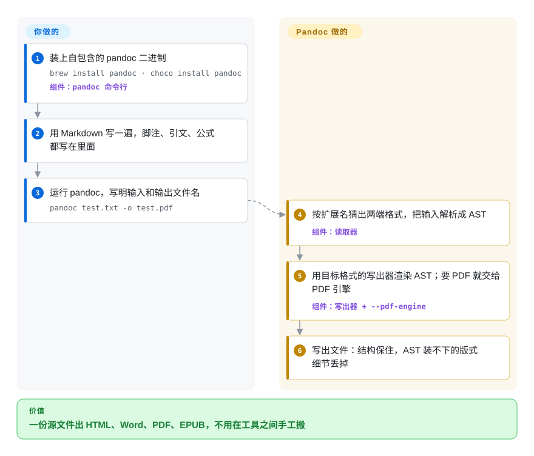

# Pandoc

报告你用 Markdown 写了一遍，编辑要 `.docx`，网站要 HTML，归档要 PDF——每次粘进 Word，脚注和引文都会乱掉。Pandoc 先把源文件读成一棵与格式无关的文档树，再按你点名的格式写出去，同一个文件就能变成这三样。

## 何时使用

你是研究者、技术写作者或文档工程师，内容平时放在纯文本里（Markdown、Org、reStructuredText、LaTeX），交付时却要变成别人用的格式：套着出版社样式的 Word、EPUB、PDF、Jira 或 MediaWiki 页面、Typst 或 LaTeX 源文件。你现在的流程是“导出、打开、手工修引文”，一条 `pandoc paper.md -o paper.docx` 就能替掉。反方向也常用：把同事的 `.docx` 转回 Markdown，放进版本库。

和 [remark](remark.zh.md)、[markdown-it](markdown-it.zh.md) 这类 JavaScript Markdown 管线比，你选 Pandoc 是因为它们只到 Markdown/HTML 为止，而 Pandoc 双向支持几十种格式（README 列了约 50 种输入、70 种输出），还带引文处理（`--citeproc`）、模板和 Word 样式参考文档（`--reference-doc`）。和 [MarkItDown](../document-parsing/markitdown.zh.md) 比，当你要的输出“不是” Markdown，且输入是结构化标记文件而不是扫描页面时，选 Pandoc。

## 怎么用起来

Pandoc 像一个中间带“世界语”的翻译：*读取器*（reader）把输入解析成 Pandoc 自己的文档树——也就是 AST，一份结构化的标题、段落、表格、引文清单——*写出器*（writer）再把这棵树渲染成目标格式；新增一种格式，只要加一个读取器或写出器。你只跑一条命令、写明文件名，Pandoc 按扩展名猜格式，`-s` 表示输出完整的独立文档而不是片段。想在转换途中改内容（重排图号、去掉内部批注），就传一个 Lua 过滤器（`--lua-filter`），它在读取和写出之间改这棵树；Pandoc 自带 Lua 解释器，不用另装。Pandoc 不替你做的是版式：页边距、纸张大小、Word 样式来自你提供的模板或参考文档；输出 PDF 时它会把活交给一个外部引擎（默认 LaTeX，也可以是 Typst、WeasyPrint 等），这个引擎要你自己装。

<!-- flow-steps:begin (generated from flows/pandoc.json by tools/flow_card.py — do not edit) -->

流程文字版

1. **你**：装上自包含的 pandoc 二进制 — `brew install pandoc · choco install pandoc` — 组件：`pandoc 命令行`
2. **你**：用 Markdown 写一遍，脚注、引文、公式都写在里面
3. **你**：运行 pandoc，写明输入和输出文件名 — `pandoc test.txt -o test.pdf`
4. **Pandoc**：按扩展名猜出两端格式，把输入解析成 AST — 组件：`读取器`
5. **Pandoc**：用目标格式的写出器渲染 AST；要 PDF 就交给 PDF 引擎 — 组件：`写出器 + --pdf-engine`
6. **Pandoc**：写出文件：结构保住，AST 装不下的版式细节丢掉

**价值**：一份源文件出 HTML、Word、PDF、EPUB，不用在工具之间手工搬

<!-- flow-steps:end -->

## 何时不用

- **你要把格式丰富的文档逐像素地转过去。** 上游 README 明说，从比 Pandoc Markdown 表达力更强的格式转换“可能有损”——复杂表格、页边距、页面版式过不了 AST。要高保真的 Office ↔ PDF 转换，用 LibreOffice 无头模式（未收录）。
- **你要从扫描件或版式复杂的 PDF 里抽文字。** Pandoc 能“写” PDF，不能“读” PDF。要带版面分析和 OCR 的 PDF → Markdown，用 [Docling](../document-parsing/docling.zh.md) 或 [Marker](../document-parsing/marker.zh.md)。
- **你只是要在 Node 或浏览器应用里把 Markdown 渲染成 HTML。** 为此去调用一个约 35–40 MB 的原生二进制太重了；用 [marked](marked.zh.md)、[markdown-it](markdown-it.zh.md)，或者还要在 JavaScript 里 lint、改树时用 [remark](remark.zh.md)。
- **你要拿它处理不可信的用户上传，又不做加固。** 手册的安全说明警告：`include` 指令（LaTeX、Org、RST、Typst）、内嵌图片、HTML 的 `iframe` 抓取都可能泄露本地文件或造成 SSRF（CVE-2025-51591），而 `--pdf-engine` 带来的风险 `--sandbox` 也挡不住。要么用 `pandoc server` 或 WASM 版本、对 HTML 输出做清洗、给每次运行加超时，要么换一个更窄的转换器。
- **你想把它的 Haskell 库链接进闭源产品。** Pandoc 是 GPL-2.0 及以上；作为独立进程调用 CLI 是常见的绕法，但把库嵌进来会让你的二进制成为 GPL 衍生作品。要宽松许可、进程内的 Markdown 转换器，用 [markdown-it](markdown-it.zh.md) 或 [goldmark](goldmark.zh.md)。
- **你要的是排版系统，不是转换器。** 目标是原生写出版式漂亮的 PDF，就直接用 [Typst](../typesetting/typst.zh.md) 写（需要时再用 Pandoc 转“成” Typst）。

## 横向对比

| 替代品 | 是否收录 | 我们的评价 | 取舍 |
|---|---|---|---|
| [MarkItDown](../document-parsing/markitdown.zh.md) | ✅ | LLM 或 RAG 任务要把 Office/PDF 压平成 Markdown 时选 MarkItDown；要写回 Word、PDF、EPUB 或 LaTeX 时选 Pandoc。 | MarkItDown 只单向转成 Markdown，但能吃 PDF；Pandoc 在几十种格式间双向转，却读不了 PDF。 |
| [Docling](../document-parsing/docling.zh.md) | ✅ | 面对扫描件或多栏 PDF 选 Docling，因为它的版面和 OCR 模型能还原 Pandoc 根本看不到的阅读顺序；源文件已经是结构化标记时选 Pandoc。 | Docling 要带 ML 模型、运行时更重；Pandoc 是不带模型的单个二进制，但只适合文本类标记输入。 |
| [remark](remark.zh.md) | ✅ | 在 JavaScript 文档管线里 lint、改写 Markdown 选 remark；输出必须走出 Markdown/HTML 世界时选 Pandoc。 | remark 在 Node 进程内运行、有 npm 插件生态；Pandoc 覆盖的格式多得多，但要作为外部二进制调用。 |
| [Asciidoctor](../typesetting/asciidoctor.zh.md) | ✅ | 团队用 AsciiDoc 写作、要一套专门产出 HTML/PDF/EPUB 书籍的工具链时选 Asciidoctor；要在 AsciiDoc 和许多其他格式之间搬内容时选 Pandoc。 | Asciidoctor 完整实现 AsciiDoc，还有自己的 PDF 转换器；Pandoc 更广，但读 AsciiDoc 时要经过通用 AST。 |
| LibreOffice（无头模式） | 未收录 | 要版式保真的 DOCX ↔ PDF/ODT 转换，用 LibreOffice 无头模式；要保住的是结构而不是版式时用 Pandoc。 | LibreOffice 保留页面版式，但要安装和驱动整套办公软件；Pandoc 轻量、好脚本化，但会丢格式细节。 |

## 技术栈

- **语言：** Haskell；项目既是 Hackage 上的库（`pandoc`），也是基于这个库的命令行工具。
- **架构：** 读取器 → Pandoc AST → 写出器；过滤器（通过 stdin/stdout 交换 JSON，或经 `--lua-filter` 用 Lua）在中间改 AST。内置 Lua 解释器。
- **同仓库的附加能力：** `--citeproc` 引文处理（CSL 样式）、每种输出格式的模板、`pandoc server`（以沙箱模式运行的 HTTP API），以及在线演示所用的 WebAssembly 版本。

## 依赖

- **运行时：** 大多数转换不需要任何依赖——发布包是自包含二进制（Windows/macOS 安装包、Linux tarball、Homebrew、Chocolatey、winget、conda-forge、Docker 镜像）。
- **PDF 输出：** 需要你自己装的外部引擎——默认是 TeX 发行版（TeX Live/MiKTeX）里的 `pdflatex`，也可以经 `--pdf-engine` 换成 `xelatex`/`lualatex`、`typst`、`weasyprint`、`wkhtmltopdf`、`context`、`groff` 等。
- **可选：** PDF/docx 里要放 SVG 图时需要 `rsvg-convert`；只有用非 Lua 过滤器时才需要 Python 等解释器。
- **从源码构建：** 需要 GHC 加 cabal 或 stack——用发布的二进制就不需要。

## 运维难度

**当桌面或 CI 工具用是低，当服务端服务用是中。** 本地就是一个二进制加一条命令；常见的麻烦是为 PDF 输出安装并锁定一套 TeX 发行版，它的体积远超 Pandoc 本身。放到网页表单后面就是另一回事：手册要求开沙箱（`--sandbox` 或 `pandoc server`）、清洗生成的 HTML、限制内存（`+RTS -M512M -RTS`），并设置超时以防病态输入拖垮解析器。

## 健康度与可持续性

- **维护——非常活跃（2026-10-08）。** 每隔几周发一版（7 月 3.10.1、8 月 3.11、2026-09-29 的 3.12、2026-10-08 的 3.12.1），每周都有提交。
- **治理——集中在一个作者身上。** John MacFarlane（`jgm`）写了约 90% 的提交；Albert Krewinkel（`tarleb`）是最活跃的共同维护者。雷达上治理轴的 D 反映的就是这个巴士因子，尽管每年有几十人贡献。
- **背书与 Lindy。** 没有公司或基金会；它是一位学者的个人项目，从 2006 年起持续维护（2010 年迁到 GitHub）。二十年不断发布是很强的 Lindy 信号，但要打上“依赖一个人”的折扣。
- **采用度。** 它是 Quarto、R Markdown 以及许多静态站点和出版流程背后的转换引擎，多数 Linux 发行版都打包了它，发布的二进制下载量以千万计。
- **风险信号。** GPL-2.0 及以上（雷达许可证轴给 D 是因为 copyleft）；2025 年 HTML `iframe` 处理中的一个 SSRF CVE 说明，服务端使用必须照文档加固。

## 存疑（未验证）

- [推断] “约 50 种输入、70 种输出”是 2026-10-08 数 README 格式列表得来的（52 / 74 条）；别名和已弃用的名字让精确数字有出入。
- [未验证] “Quarto、R Markdown 背后的引擎”来自那些项目的公开文档，不是本仓库；依赖它之前要确认版本耦合关系。
- [推断] 约 35–40 MB 是 3.12.1 各平台下载包的大小（GitHub release 资源）；解压后的大小没有测。
- [推断] 雷达的治理 D 来自提交占比，衡量不了 `jgm` 退出后有多少人能发版。
