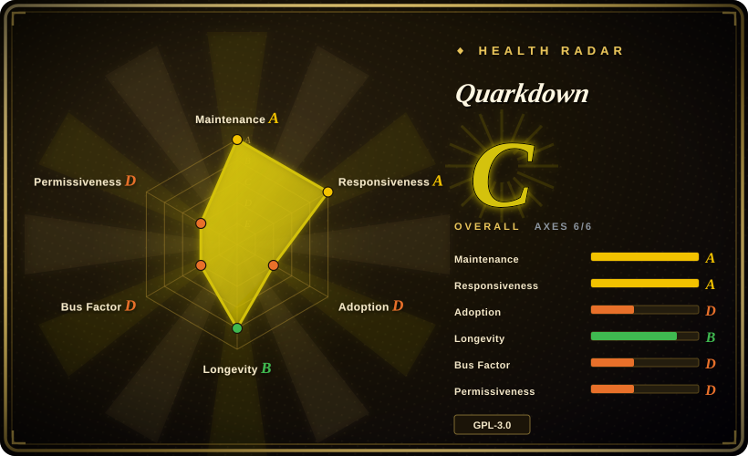
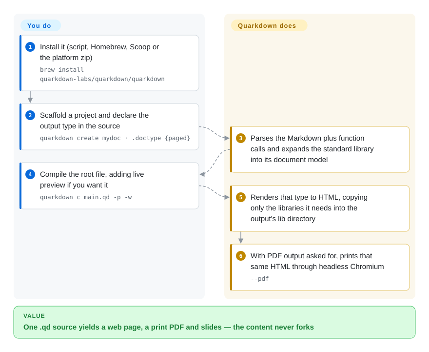

# Quarkdown

A Markdown-superset typesetting compiler: one `.qd` source compiles to continuous HTML, paged HTML/PDF, reveal.js slides, a docs site with a local search index and `llms.txt`, GFM Markdown or plain text — with a Turing-complete function layer on top of CommonMark/GFM.

## When to use

You write technical documents for a living — a design doc that also has to become a slide deck, an internal wiki, an article you want to hand someone as a PDF — and you settled on Markdown because LaTeX's `\begin{}` scaffolding is unmaintainable, but plain Markdown gives you no page layout, no themes, no numbered figures, and no way to reuse a block across documents. You need one source to serve several audiences at once.

Reach for Quarkdown when the *document* is the artifact and the source itself should stay Markdown-legible, and when the multi-target compile is the deciding feature: `.doctype {plain}` gives a continuous web page, `{paged}` a print layout, `{slides}` a reveal.js deck, `{docs}` a wiki that also emits a client-side search index and an agent-facing `llms.txt` — switched by one line, with the content untouched. That is the line against the nearby options: [Pandoc](pandoc.md) converts formats but gives you no document language or layout model; Typst and LaTeX reach higher print fidelity by asking you to learn and maintain a markup language that is not Markdown; Asciidoctor keeps a plain-text source but has no scripting layer and needs extra pieces for PDF and slides. What you pay for this: your PDF is the browser's print pipeline, not a purpose-built typesetting engine.

## How it works

A `.qd` file is ordinary Markdown (CommonMark/GFM) plus **function calls**: a line starting with `.` is a call, and the indented block beneath it is that call's body argument — `.doctype {paged}` picks the output type, `.center` with an indented block centers it, `.tableofcontents` emits a table of contents. The compiler parses your source into its own document model, evaluates every call — built-in standard-library functions, your own `.function` definitions, variables, conditionals and loops — then hands the model to the renderer that `.doctype` selected. **You write content plus layout declarations; Quarkdown resolves the function layer, emits per-type HTML, copies only the third-party scripts, styles and fonts that output actually needs into a `lib/` directory beside it, and for `--pdf` prints that same HTML through a headless Chromium.** Because every target is a renderer over one model, re-targeting the document costs one line instead of a content fork.

<!-- flow-steps:begin (generated from flows/quarkdown.json by tools/flow_card.py — do not edit) -->

Text version of the flow

1. **You**: Install it (script, Homebrew, Scoop or the platform zip) — `brew install quarkdown-labs/quarkdown/quarkdown`
2. **You**: Scaffold a project and declare the output type in the source — `quarkdown create mydoc · .doctype {paged}`
3. **Quarkdown**: Parses the Markdown plus function calls and expands the standard library into its document model
4. **You**: Compile the root file, adding live preview if you want it — `quarkdown c main.qd -p -w`
5. **Quarkdown**: Renders that type to HTML, copying only the libraries it needs into the output's lib directory
6. **Quarkdown**: With PDF output asked for, prints that same HTML through headless Chromium — `--pdf`

**Value**: One .qd source yields a web page, a print PDF and slides — the content never forks

<!-- flow-steps:end -->

## When NOT to use

- **The deliverable is a Word `.docx` that someone else will edit.** Quarkdown's documented targets are HTML, PDF, GFM Markdown and plain text — there is no Word writer. Use [Pandoc](pandoc.md) to convert Markdown to `.docx`, or an OOXML generation library if the file must be built programmatically.
- **You must embed the renderer in a closed-source product, or run the CLI as a hosted service.** The core is **GPL-3.0** while `quarkdown-cli` and `quarkdown-lsp` are **AGPL-3.0** (read from the repo's own `LICENSE` files), and the CLI is the entry point ordinary users invoke. `[推断]` That combination reaches into both redistribution and network-service use. Choose Typst (Apache-2.0), Asciidoctor (MIT) or MDX (MIT) instead when permissive licensing is a hard constraint.
- **Print fidelity is the requirement — journal submission, camera-ready, heavy cross-referencing.** Use Typst or LaTeX: Quarkdown's PDF is documented as "the content of the HTML output" printed by Chrome, so pagination quality is paged.js's, and the 2.6.x release notes are still landing fixes for split tables losing rows, clipped code blocks and cut-off table rows in `paged` mode. That is an engine still converging, not a solved one.
- **You only need format conversion.** Use [Pandoc](pandoc.md): decades of format coverage and a template ecosystem beat learning a document language you do not need.
- **Your Markdown has to stay portable.** Once a file contains `.func {arg}` calls it is no longer Markdown — GitHub, Obsidian, IDEs and pipelines that do not run the Quarkdown compiler will show the raw calls. If portability is non-negotiable, keep plain Markdown and convert at the edge instead.
- **You need a single static binary, or a slim CI image.** Quarkdown is a JVM application, and the PDF path additionally needs a Chromium-family browser on the same machine. If the build image cannot carry a JVM plus a browser, pick Typst (Rust, one binary) or produce HTML only with [markdown-it](markdown-it.md).
- **You need governance beyond one person.** See `Health & viability`: if "the maintainer stops" is an unacceptable single point of failure for a format you intend to keep for a decade, choose a project with a foundation or a larger core team, and treat Quarkdown as the fast-moving option you migrate to once its output already meets your bar.

## Comparison

| Alternative | In index | Our verdict | Tradeoff |
|---|---|---|---|
| [Pandoc](pandoc.md) | ✅ | Choose Pandoc when the job is converting between formats you already have and its format matrix matters more than layout control; choose Quarkdown when one source must become a themed web page, a print PDF and a slide deck without a content fork. | Pandoc gains format breadth, a long release history and a template ecosystem; it pays with no document language — no variables, no functions, no per-type layout model — so layout lives in templates you maintain beside the content. |
| Typst | 未收录 | Choose Typst when print-quality PDF and a permissive license are the hard constraints and you can adopt its language; choose Quarkdown when keeping the source as Markdown and emitting HTML, slides and docs from the same file outweighs typesetting fidelity. | Typst gains a purpose-built typesetting engine (stronger pagination and math), Apache-2.0 licensing and a single Rust binary; it pays with a bespoke language you and your collaborators must learn, and no direct Markdown authoring path. |
| LaTeX | 未收录 | Choose LaTeX when a venue mandates its class files or you need decades of packages and full typographic control; choose Quarkdown when nobody will maintain `\begin{}` scaffolding and a web version is also required. | LaTeX gains unmatched print maturity, journal templates and a vast package archive; it pays with a steep learning curve, opaque error messages, and effectively no HTML or slides path from the same source. |
| Asciidoctor | 未收录 | Choose Asciidoctor when you want a mature plain-text authoring language under MIT with an established docs-site toolchain; choose Quarkdown when you need scripting, or PDF and slides from the same source without assembling extra toolchain pieces. | Asciidoctor gains maturity, MIT licensing and a broad extension ecosystem (PDF, diagrams, EPUB); it pays with no Turing-complete scripting layer, and slide/PDF output that depends on additional components. |
| MDX | 未收录 | Choose MDX when the destination is a React application and components are the point; choose Quarkdown when the destination is a typeset document and no JS framework is involved. | MDX gains first-class embedding in the JS/React build pipeline and the whole npm ecosystem; it pays with a Node/React runtime requirement and no print, paged or slide model of its own. |

## Tech stack

- **Language:** Kotlin on the JVM, organized as a Gradle multi-module build. GitHub's byte counts put Kotlin (~3.0 MB) far ahead of TypeScript (~473 KB), SCSS and HTML — the latter are the browser runtime and themes, not the compiler.
- **Pipeline modules:** `quarkdown-core` (parser, AST, document model, permission system), `quarkdown-stdlib` (28 top-level function modules — Layout, Math, Mermaid, Bibliography, Slides, TableComputation, Collection, Flow, Logical, Strings, Text, Reference, Html, Markdown, Process, Data and more), `quarkdown-html` (esbuild-bundled browser runtime), `quarkdown-html-pdf`, `quarkdown-markdown` (GFM export), `quarkdown-plaintext`, `quarkdown-lsp`, `quarkdown-server` (live preview), `quarkdown-quarkdoc` (docs generator).
- **Browser runtime, bundled at build time:** paged.js 0.4, reveal.js 6, KaTeX 0.17, highlight.js 11, Mermaid 11, MiniSearch 7, Bootstrap Icons, Fontsource webfonts (`quarkdown-html/package.json`).
- **CLI layer:** Clikt 5, kotlinx-coroutines, `directory-watcher` for watch mode.
- **Dogfooded docs:** the wiki published at quarkdown.com/wiki lives in the repo as 119 `.qd` files under `docs/`.

## Dependencies

- **A JVM.** The published per-platform zip is ~64–68 MB and the install scripts never install a JDK, so the archive appears to ship its own runtime `[推断]`; from source you build with `./gradlew installDist` or `distZip`. All four platform zips (linux-x64, macos-x64, macos-aarch64, windows-x64) are published per release.
- **A Chromium-family browser, only for PDF.** `--pdf` defaults to `chrome-headless-shell`; `--chrome-path` or `QD_CHROME_PATH` points at a Chrome, Chromium or Edge you already have, and the packaged `scripts/install-chrome.sh` / `.ps1` fetches the recommended build. HTML output needs no browser at all.
- **No network egress at render time.** The renderer copies the third-party scripts, styles and webfonts an output needs into `lib/` beside the generated files — the source comments call this "fully offline HTML rendering" — so a compiled page does not call a CDN.
- **No account, no hosted service, no telemetry.** Compilation is local, and `quarkdown repl` plus `-p -w` live preview run from the same local binary.
- **A permission gate on document capabilities.** Documents start with `project-read` only; reading outside the project (`global-read`), fetching remote media (`network`) or reading environment variables (`process`) requires an explicit `--allow`, with the final set computed as defaults + allowed − denied.

## Ops difficulty

**Low to medium.** Install is a script, Homebrew, Scoop or an unzip; compile is one command; `quarkdown create` scaffolds the project. Medium enters only at PDF export: it is the one path that needs a browser binary, containers and CI are where that bites (Docker builds without a working PDF setup recur in the issue tracker), and the `--pdf-no-sandbox` escape hatch is documented as potentially unsafe. There is no database, no long-running service and no state to migrate — the operational surface is "get a JVM and a headless browser into the image, then run a CLI."

## Health & viability

- **Maintenance — very active (as of 2026-09-20).** `pushed_at` is 2026-09-20T04:05:01Z and the latest release v2.6.1 landed 2026-09-18, with minors roughly monthly (v2.5.0 on 2026-08-04, v2.6.0 on 2026-09-08). A sampled issue list shows same-day or next-day closures. Not archived.
- **Governance and bus factor — the weakest axis.** The repository is owned by a `User` account (`iamgio`), and all-time contributor totals run 3,686 / 25 / 19 for `iamgio` / `OverSamu` / `luojiyin1987`. A `quarkdown-labs` organization does exist (created 2025-06-15, 14 public repos covering the VS Code extension, install scripts, installer tests and the website) but it has two public members. Roadmap and essentially all core code rest with one person.
- **Backing and Lindy — young and fast, so age is not yet a safety signal.** Created 2024-01-30, about 2.6 years old as of 2026-09, with ~16.1k stars and 507 forks. That is the "young and hot" shape: it says people want it, not that it has survived anything. Unlike a 12-year-old still-active project, time has not yet been the test here.
- **Adoption and ecosystem — unusually complete tooling for the age.** VS Code and IntelliJ extensions, a Homebrew formula and Scoop bucket, a `setup-quarkdown` GitHub Action, a separate `generated` repository publishing finished PDF artifacts for every theme, the quarkdown.com site plus the 119-file offline wiki shipped with the install, and a bundled agent skill (`skills/quarkdown/SKILL.md`) that the project maintains as a first-class artifact.
- **The adoption axis is unscored (`?`).** The radar grades adoption from package-registry reach, and Quarkdown publishes no package on npm/PyPI/crates.io — it ships as per-platform zips and package-manager formulas. So the 5/6 coverage in the card is a measurement gap, not a verdict on whether people use it. `[推断]`
- **Risk flags — dual copyleft plus pre-3.0 churn.** GPL-3.0 core with AGPL-3.0 CLI/LSP; still on 2.x, and v2.6.1 already shipped a breaking change (the log-level JVM property was replaced by `--log-level`). No relicense history found in the repo, and `CONTRIBUTING.md` requires only a content-authorship agreement, not a CLA.

## Caveats (unverified)

- `[未验证]` **The release zip ships its own runtime.** Inferred from the ~64–68 MB per-platform size and from `install.sh` never installing a JDK; the archive was not unpacked here.
- `[推断]` **AGPL on `quarkdown-cli` governs ordinary CLI use in practice**, since that binary is the normal entry point. Whether a specific deployment triggers AGPL obligations is a legal question and was not assessed.
- `[未验证]` **"The official wiki (100+ subdocuments) compiles in ~2 seconds"** is the README's own performance claim. The subdocument count is checkable and checks out (119 `.qd` files under `docs/`); the compile time was not reproduced.
- `[未验证]` **The agent-skill evaluation** published at `quarkdown.com/blog/agent-skill/` is author-published; no independent replication was found.
- `[未验证]` **The bundled agent skill's real-world effectiveness.** The file exists in-repo and prescribes a verification loop (`quarkdown c <main>.qd --strict --out /tmp/quarkdown-verify`), but no third-party evaluation of agent-authored `.qd` quality was located.
- `[未验证]` **Windows and Linux end-to-end behaviour.** Installers, a Scoop bucket, a Homebrew formula and binaries for linux-x64 / macos-x64 / macos-aarch64 / windows-x64 all exist, but nothing was installed or compiled during this review.
- `[未验证]` **The absence of any Word/`.docx` target** is taken from the documented target list and the module set; absence from documentation is not proof that no such path exists.
- `[推断]` **The `paged` renderer's remaining rough edges** are read from recent release headliners (split tables losing rows, clipped code blocks, cut-off table rows) rather than from a systematic pagination test.
- `[未验证]` **Organization facts beyond hosting.** Whether `quarkdown-labs` holds roadmap or trademark authority independently of the maintainer, and its funding model (a GitHub Sponsors link appears in the README), were not verified.
- `[未验证]` **"Turing-complete" is the README's own wording.** The standard library does document conditionals and loops and the language supports user-defined functions, but computational universality was not assessed here; treat the phrase as a project claim.
- `[未验证]` **Whether the PDF output is print-ready for a specific venue.** "Supports all document types and features of the HTML target" and the renderer's fidelity are documented and illustrated by published artifacts, not independently tested against any press or journal requirement.
