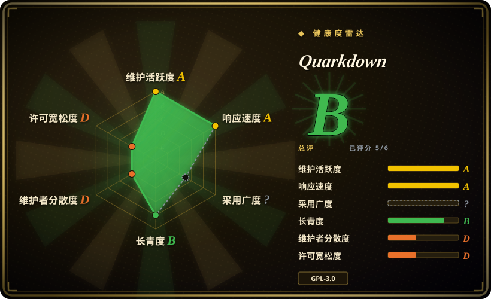
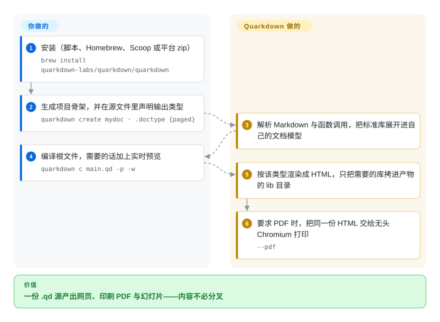

# Quarkdown

基于 Markdown 的超集排版编译器：一份 `.qd` 源文件可编译为连续流 HTML、分页 HTML／PDF、reveal.js 幻灯片、带本地搜索索引与 `llms.txt` 的文档站、GFM Markdown 或纯文本——在 CommonMark／GFM 之上叠加了图灵完备的函数层。

## 何时使用

你以写技术文档为生——一份设计文档同时还要变成幻灯片，一个内部 wiki，一篇你想直接发给别人 PDF 的文章——而你之所以选 Markdown，是因为 LaTeX 那套 `\begin{}` 脚手架根本维护不动；可纯 Markdown 又给不了分页版式、主题、图表编号，也没有跨文档复用段落的手段。你需要一份源同时服务好几拨读者。

当**文档本身**才是交付物、源文件又应当保持 Markdown 那样可读时，选 Quarkdown；当「一次编写、多目标产出」是决定性的功能时，也选它：`.doctype {plain}` 得到连续流网页，`{paged}` 得到印刷版式，`{slides}` 得到 reveal.js 演示，`{docs}` 得到 wiki 并附带客户端搜索索引与面向 agent 的 `llms.txt`——一行切换，内容不动。这正是它与近邻的分界线：[Pandoc](pandoc.zh.md) 只做格式转换，没有文档语言也没有版式模型；Typst 与 LaTeX 能拿到更高的印刷保真度，代价是你要学习和维护一门不是 Markdown 的标记语言；Asciidoctor 同样保留纯文本源，但既无脚本层，导出 PDF 与幻灯片还得再拼装额外组件。你为此付出的代价是：你的 PDF 走的是浏览器打印流水线，而不是专门的排版引擎。

## 怎么用起来

`.qd` 文件就是普通 Markdown（CommonMark／GFM）加上**函数调用**：以 `.` 开头的一行即一次调用，紧跟在它下面缩进的块就是这次调用的 body 参数——`.doctype {paged}` 选定输出类型，`.center` 带一个缩进块把它居中，`.tableofcontents` 生成目录。编译器先把你的源解析成自己的文档模型，再求值每一次调用——内置标准库函数、你自己用 `.function` 定义的函数、变量、条件与循环——然后把模型交给 `.doctype` 选定的渲染器。**你负责写内容和版式声明；Quarkdown 负责解析函数层、按类型产出 HTML，只把该输出真正需要的第三方脚本、样式与字体拷进旁边的 `lib/` 目录，并在 `--pdf` 时把同一份 HTML 交给无头 Chromium 打印。** 因为所有目标都是同一模型上的渲染器，换输出类型只花一行，而不是把内容分叉。

<!-- flow-steps:begin (generated from flows/quarkdown.json by tools/flow_card.py — do not edit) -->

流程文字版

1. **你**：安装（脚本、Homebrew、Scoop 或平台 zip） — `brew install quarkdown-labs/quarkdown/quarkdown`
2. **你**：生成项目骨架，并在源文件里声明输出类型 — `quarkdown create mydoc · .doctype {paged}`
3. **Quarkdown**：解析 Markdown 与函数调用，把标准库展开进自己的文档模型
4. **你**：编译根文件，需要的话加上实时预览 — `quarkdown c main.qd -p -w`
5. **Quarkdown**：按该类型渲染成 HTML，只把需要的库拷进产物的 lib 目录
6. **Quarkdown**：要求 PDF 时，把同一份 HTML 交给无头 Chromium 打印 — `--pdf`

**价值**：一份 .qd 源产出网页、印刷 PDF 与幻灯片——内容不必分叉

<!-- flow-steps:end -->

## 何时不用

- **交付物是别人还要接着改的 Word `.docx`。** Quarkdown 有文档记载的目标只有 HTML、PDF、GFM Markdown 和纯文本，没有 Word 写出器。改用 [Pandoc](pandoc.zh.md) 把 Markdown 转成 `.docx`，或者用 OOXML 生成库自己构建。
- **你要把渲染器嵌进闭源产品，或把 CLI 作为托管服务对外提供。** 核心是 **GPL-3.0**，而 `quarkdown-cli` 与 `quarkdown-lsp` 是 **AGPL-3.0**（读自仓库自带的 `LICENSE` 文件），而普通用户实际调用的入口正是 CLI。`[推断]` 这个组合会同时触及再分发与网络服务两种用法。若宽松许可不可让步，请改用 Typst（Apache-2.0）、Asciidoctor（MIT）或 MDX（MIT）。
- **印刷保真度是硬要求——期刊投稿、camera-ready、大量交叉引用。** 改用 Typst 或 LaTeX：Quarkdown 的 PDF 在文档里被定义为「HTML 输出内容」交给 Chrome 打印，所以分页质量就是 paged.js 的质量，而 2.6.x 的发布说明仍在修 `paged` 模式下表格跨页丢行、代码块被裁切、表行被切掉这类问题。这是一个还在收敛的引擎，不是已经解决的方案。
- **你只需要格式转换。** 用 [Pandoc](pandoc.zh.md)：几十年的格式覆盖与模板生态，胜过为不需要的文档语言付学习成本。
- **你的 Markdown 必须保持可移植。** 文件里一旦出现 `.func {arg}` 调用，它就不再是 Markdown——不跑 Quarkdown 编译器的 GitHub、Obsidian、IDE 和流水线只会把原始调用显示出来。若可移植性不可让步，就继续用纯 Markdown，在边上做转换。
- **你需要单一静态二进制，或极瘦的 CI 镜像。** Quarkdown 是 JVM 应用，PDF 路径还要求同一台机器上有 Chromium 系浏览器。如果构建镜像装不下 JVM 加浏览器，请选 Typst（Rust，单二进制），或只用 [markdown-it](markdown-it.zh.md) 产出 HTML。
- **你需要超出个人的治理结构。** 见「健康度与可持续性」：如果「维护者停手」是你打算用十年的格式不可接受的单点故障，就选有基金会或更大核心团队的项目，并把 Quarkdown 当作「等它的输出已经够用之后再迁过去」的快迭代选项。

## 横向对比

| 替代品 | 是否收录 | 我们的评价 | 取舍 |
|---|---|---|---|
| [Pandoc](pandoc.zh.md) | ✅ | 当你手上已有各种格式、只需互转、且格式矩阵比版式控制更重要时选 Pandoc；当你需要一份源不经内容分叉就变成主题化网页、印刷 PDF 与幻灯片时选 Quarkdown。 | Pandoc 换来格式广度、长期发布历史与模板生态；代价是没有文档语言——没有变量、没有函数、没有按类型的版式模型——所以版式落在你要另行维护的模板里。 |
| Typst | 未收录 | 当印刷级 PDF 与宽松许可是硬约束、并且你能接受学习它的语言时选 Typst；当「源保持 Markdown、同一份文件还能出 HTML／幻灯片／文档站」比排版保真度更重要时选 Quarkdown。 | Typst 换来专门打造的排版引擎（分页与数学更强）、Apache-2.0 许可与单一 Rust 二进制；代价是一门你和协作者都得学的专有语言，且没有直接的 Markdown 书写路径。 |
| LaTeX | 未收录 | 当投稿方指定 class 文件、或你需要几十年的宏包积累与完整排版控制时选 LaTeX；当没人愿意维护 `\begin{}` 脚手架、而且还需要网页版本时选 Quarkdown。 | LaTeX 换来无可比拟的印刷成熟度、期刊模板与庞大宏包库；代价是陡峭的学习曲线、难读的报错，以及几乎无法从同一份源产出 HTML 或幻灯片。 |
| Asciidoctor | 未收录 | 当你想要一门 MIT 许可下成熟、纯文本的写作语言并自带文档站工具链时选 Asciidoctor；当你需要脚本能力，或不想再拼装额外组件就要从同一份源出 PDF 与幻灯片时选 Quarkdown。 | Asciidoctor 换来成熟度、MIT 许可与广泛的扩展生态（PDF、图表、EPUB）；代价是没有图灵完备的脚本层，且幻灯片与 PDF 输出依赖额外组件。 |
| MDX | 未收录 | 当目标是 React 应用、组件本身就是重点时选 MDX；当目标是排版成品、且完全不涉及 JS 框架时选 Quarkdown。 | MDX 换来与 JS／React 构建流水线的原生集成和整个 npm 生态；代价是 Node／React 运行时要求，以及自身完全没有印刷、分页或幻灯片模型。 |

## 技术栈

- **语言：** JVM 上的 Kotlin，组织为 Gradle 多模块构建。GitHub 的字节统计里 Kotlin（约 3.0 MB）远超 TypeScript（约 473 KB）、SCSS 与 HTML——后者是浏览器运行时与主题，不是编译器。
- **流水线模块：** `quarkdown-core`（解析器、AST、文档模型、权限系统）、`quarkdown-stdlib`（28 个顶层函数模块——Layout、Math、Mermaid、Bibliography、Slides、TableComputation、Collection、Flow、Logical、Strings、Text、Reference、Html、Markdown、Process、Data 等）、`quarkdown-html`（用 esbuild 打包的浏览器运行时）、`quarkdown-html-pdf`、`quarkdown-markdown`（GFM 导出）、`quarkdown-plaintext`、`quarkdown-lsp`、`quarkdown-server`（实时预览）、`quarkdown-quarkdoc`（文档生成）。
- **构建期打包进产物的浏览器运行时：** paged.js 0.4、reveal.js 6、KaTeX 0.17、highlight.js 11、Mermaid 11、MiniSearch 7、Bootstrap Icons、Fontsource 网页字体（见 `quarkdown-html/package.json`）。
- **CLI 层：** Clikt 5、kotlinx-coroutines、用于监听模式的 `directory-watcher`。
- **自举的文档：** 发布在 quarkdown.com/wiki 的 wiki 就放在仓库里，是 `docs/` 下的 119 个 `.qd` 文件。

## 依赖

- **一个 JVM。** 各平台发布 zip 约 64–68 MB，而安装脚本从不安装 JDK，因此该压缩包看起来自带运行时 `[推断]`；从源码构建则用 `./gradlew installDist` 或 `distZip`。每个版本都发布四个平台包（linux-x64、macos-x64、macos-aarch64、windows-x64）。
- **Chromium 系浏览器，仅 PDF 需要。** `--pdf` 默认使用 `chrome-headless-shell`；`--chrome-path` 或 `QD_CHROME_PATH` 可指向你已有的 Chrome／Chromium／Edge，包内还带 `scripts/install-chrome.sh`／`.ps1` 下载推荐版本。HTML 输出完全不需要浏览器。
- **渲染期不产生外部网络访问。** 渲染器会把该输出所需的第三方脚本、样式与网页字体拷进产物旁边的 `lib/`——源码注释原话是「fully offline HTML rendering」——所以生成出来的页面不会去访问 CDN。
- **无账号、无托管服务、无遥测。** 编译在本地进行，`quarkdown repl` 与 `-p -w` 实时预览也都跑在同一个本地二进制上。
- **对文档能力有权限闸门。** 文档默认只有 `project-read`；读取项目之外的文件（`global-read`）、抓取远程媒体（`network`）、读环境变量（`process`）都需要显式 `--allow`，最终权限集合按 defaults + allowed − denied 计算。

## 运维难度

**低到中等。** 安装是一条脚本、Homebrew、Scoop 或解压；编译只有一条命令；`quarkdown create` 负责生成项目骨架。中等的部分只出现在 PDF 导出：它是唯一需要浏览器二进制的路径，而容器与 CI 正是它出问题的地方（Docker 构建里 PDF 不可用的 issue 反复出现），且 `--pdf-no-sandbox` 这个逃生口被文档明确标注为可能不安全。这里没有数据库、没有常驻服务、没有要迁移的状态——运维面就是「把 JVM 和无头浏览器装进镜像，然后跑一个 CLI」。

## 健康度与可持续性

- **维护活跃度——非常活跃（截至 2026-09-20）。** `pushed_at` 为 2026-09-20T04:05:01Z，最新版本 v2.6.1 发布于 2026-09-18，minor 大约按月推进（v2.5.0 在 2026-08-04，v2.6.0 在 2026-09-08）。抽样的 issue 列表显示当天或次日关闭。未归档。
- **治理与维护者分散度——最弱的一轴。** 仓库属于 `User` 账号（`iamgio`），历史贡献数分别为 `iamgio` 3,686、`OverSamu` 25、`luojiyin1987` 19。确实存在 `quarkdown-labs` 组织（建于 2025-06-15，14 个公开仓库，覆盖 VS Code 插件、安装脚本、安装测试与官网），但公开成员只有两人。路线图和几乎全部核心代码都压在一个人身上。
- **背书与 Lindy——年轻且快，所以年龄此刻还不是安全信号。** 创建于 2024-01-30，截至 2026-09 约 2.6 年，约 16.1k star、507 fork。这正是「年轻 + 当红」的形态：它说明大家想要这个东西，不说明它经历过考验。与一个 12 年且仍在活跃的项目不同，时间还没有在这里充当过筛选器。
- **采用与生态——以这个年龄来说工具链异常完整。** VS Code 与 IntelliJ 插件、Homebrew formula 与 Scoop bucket、`setup-quarkdown` GitHub Action、单独一个 `generated` 仓库为每种主题发布成品 PDF、quarkdown.com 站点以及随安装包分发的 119 文件离线 wiki，还有一个被当作一等产物维护的内置 agent skill（`skills/quarkdown/SKILL.md`）。
- **采用广度这一轴未评分（`?`）。** 雷达依据包管理器的触达来评采用，而 Quarkdown 在 npm／PyPI／crates.io 上都没有发布包——它以各平台 zip 和包管理器 formula 的形式分发。所以卡片上的 5/6 是度量缺口，不是「有没有人用」的结论。`[推断]`
- **风险旗标——双重 copyleft 加 3.0 之前的持续变动。** 核心 GPL-3.0、CLI／LSP 为 AGPL-3.0；仍在 2.x，且 v2.6.1 已经带了一次破坏性变更（日志级别从 JVM 属性改为 `--log-level`）。仓库里没发现换证历史，`CONTRIBUTING.md` 也只要求贡献内容归属声明，不要求签 CLA。

## 存疑（未验证）

- `[未验证]` **发布 zip 自带运行时。** 依据是各平台约 64–68 MB 的体积以及 `install.sh` 从不安装 JDK；本文没有解压验证。
- `[推断]` **`quarkdown-cli` 上的 AGPL 在实践中约束着普通 CLI 用法**，因为那个二进制才是常规入口。具体部署是否会触发 AGPL 义务属于法律问题，本文未作评估。
- `[未验证]` **「官方 wiki（100+ 子文档）约 2 秒编译完成」是 README 的自述性能。** 子文档数量可核对，且核对通过（`docs/` 下 119 个 `.qd` 文件）；编译耗时未复现。
- `[未验证]` **内置 agent skill 的评测**发布在 `quarkdown.com/blog/agent-skill/`，属作者自测，未找到独立复现。
- `[未验证]` **内置 agent skill 的实际有效性。** 该文件确实在仓库里，并规定了自检回路（`quarkdown c <main>.qd --strict --out /tmp/quarkdown-verify`），但没有找到对 agent 生成的 `.qd` 质量的第三方评估。
- `[未验证]` **Windows 与 Linux 的端到端行为。** 安装脚本、Scoop bucket、Homebrew formula 以及 linux-x64／macos-x64／macos-aarch64／windows-x64 二进制都存在，但本次审查没有安装或编译过任何东西。
- `[未验证]` **「不存在 Word／`.docx` 目标」**这一结论取自文档化的目标列表与模块集合；文档里没有不等于代码里没有。
- `[推断]` **`paged` 渲染器仍有的粗糙边缘**读自近期发布的主要条目（表格跨页丢行、代码块被裁切、表行被切掉），而非来自系统性的分页测试。
- `[未验证]` **组织层面的事实。** `quarkdown-labs` 是否在维护者之外独立掌握路线图或商标权，以及它的资助模式（README 中有 GitHub Sponsors 链接），均未核实。
- `[未验证]` **「图灵完备」是 README 的自述措辞。** 标准库确实有文档化的条件与循环，语言也支持用户自定义函数，但本文没有评估其计算完备性；请把这句当作项目主张。
- `[未验证]` **PDF 是否满足某个具体机构的印刷要求。** 「支持 HTML 目标的全部文档类型与特性」以及渲染保真度都有文档和已发布产物为证，但没有针对任何出版社或期刊要求的独立测试。
