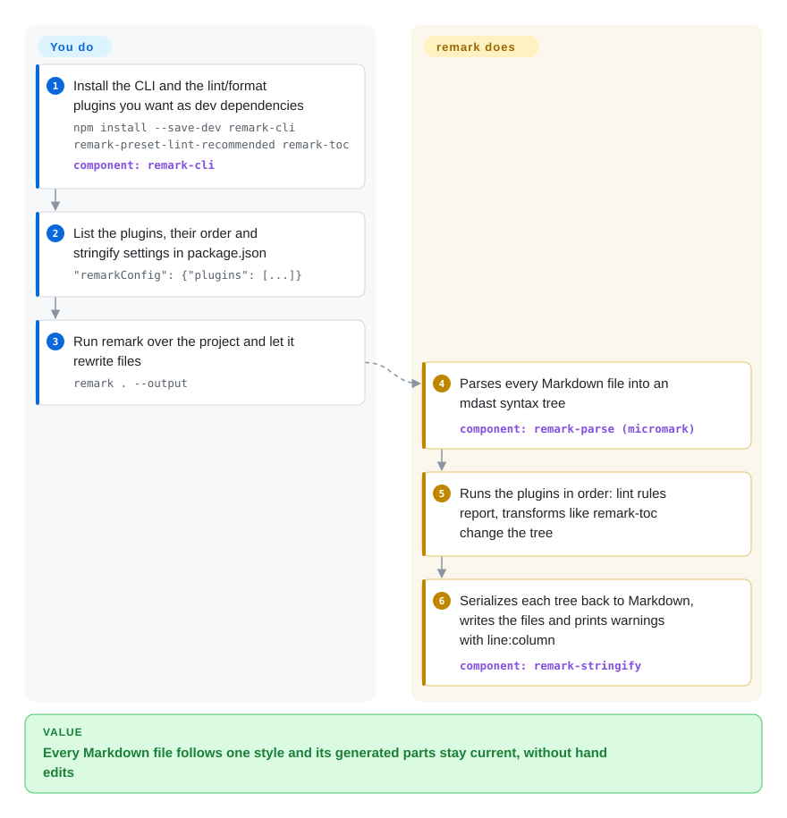

# remark

Your docs repo has 400 Markdown files where half the lists use `*` and half use `-`, links rot silently, and every page needs a hand-maintained table of contents — a renderer that only turns Markdown into HTML can't fix any of that. remark parses each file into a tree of headings, lists and links that small plugins can check and rewrite, then writes it back as Markdown (or hands it on to HTML).

## When to use

You maintain a documentation site, a blog engine or a content pipeline in Node.js, and "render Markdown" is the easy part. What hurts is everything around it: a contributor's PR writes `1) Step one` where the style guide says `1.`, a heading level is skipped, the table of contents is out of date, image paths must be rewritten for the CDN. You reach for remark because it turns Markdown into **mdast** — a JSON tree where each heading, list item and link is a node — and lets you stack plugins that inspect or change that tree: `remark-lint` presets flag the `1)` as `ordered-list-marker-style`, `remark-toc` regenerates the contents section, `remark-gfm` adds tables and task lists, and `remark-rehype` hands the tree to the HTML side when you finally render.

You choose it over [marked](marked.md) or [markdown-it](markdown-it.md) when you need to *edit* Markdown, not just display it — those emit HTML and have no Markdown-to-Markdown round trip. You choose it over [markdownlint](markdownlint.md) when checking is only half the job and you also want the fix, the transform and the rendering in one pipeline with one parser.

## How it works

remark is a set of plugins for **unified**, a general engine that runs content through three stages: a parser turns text into a syntax tree, transformer plugins inspect or change the tree, and a compiler turns it back into text. remark supplies the Markdown parser (`remark-parse`, built on the CommonMark-compliant tokenizer [micromark](micromark.md)) and the Markdown compiler (`remark-stringify`); the `remark` package bundles both, and `remark-cli` wraps them for the terminal. You pick the plugins — from 150+ in the ecosystem — and their order; remark does the parsing, runs the plugins in sequence, keeps positions for error messages, and serializes the result. Two ways in: from the terminal, `remark . --output` checks and rewrites every Markdown file using the plugins listed in `package.json`; from code, `unified().use(remarkParse).use(…).process(text)` does the same on a string, and adding `remark-rehype` + `rehype-stringify` ends in HTML instead.

<!-- flow-steps:begin (generated from flows/remark.json by tools/flow_card.py — do not edit) -->

Text version of the flow

1. **You**: Install the CLI and the lint/format plugins you want as dev dependencies — `npm install --save-dev remark-cli remark-preset-lint-recommended remark-toc` — component: `remark-cli`
2. **You**: List the plugins, their order and stringify settings in package.json — `"remarkConfig": {"plugins": [...]}`
3. **You**: Run remark over the project and let it rewrite files — `remark . --output`
4. **remark**: Parses every Markdown file into an mdast syntax tree — component: `remark-parse (micromark)`
5. **remark**: Runs the plugins in order: lint rules report, transforms like remark-toc change the tree
6. **remark**: Serializes each tree back to Markdown, writes the files and prints warnings with line:column — component: `remark-stringify`

**Value**: Every Markdown file follows one style and its generated parts stay current, without hand edits

<!-- flow-steps:end -->

## When NOT to use

- **You only need Markdown → HTML with a few extensions.** remark's own README says so: use [micromark](micromark.md) directly, or [marked](marked.md) / [markdown-it](markdown-it.md) for a one-call renderer with a smaller dependency tree.
- **You render untrusted Markdown and expect it to be safe by default.** Going to HTML through `remark-rehype` can open you to cross-site scripting; the README requires adding `rehype-sanitize`. If you cannot guarantee that step in every pipeline, a renderer you wrap with a dedicated sanitizer at one choke point (e.g. [marked](marked.md) + DOMPurify) is easier to audit.
- **Your build is CommonJS-only or pinned to old Node.** `remark` and the unified 11 line are ESM-only (`"type": "module"`) and target maintained Node.js versions (the README says Node 16+). For a CommonJS project you cannot migrate, [markdown-it](markdown-it.md) is simpler to drop in.
- **Your team only wants a style check in CI.** [markdownlint](markdownlint.md) gives a ready rule set and editor integration with less plugin wiring; choose remark-lint when you also need transforms on the same tree.
- **You need conversion between Word, LaTeX, EPUB and Markdown.** remark covers Markdown (and MDX via plugins); for cross-format document conversion use [Pandoc](pandoc.md).
- **You need fresh releases of the core.** The `remark` package has been at 15.0.1 since 2023-09 and `remark-cli` at 12.0.1 since 2024-04; recent repo commits are mostly plugin-list edits. That is stability, not abandonment, but bug fixes in the core arrive slowly — new behavior lives in plugins.

## Comparison

| Alternative | In index | Our verdict | Tradeoff |
|---|---|---|---|
| [marked](marked.md) | ✅ | When you only need to show Markdown as HTML in an app, pick marked for its single `parse` call; pick remark when you must lint, transform or write Markdown back. | marked is one small package and fast; it has no AST round trip, so edits to the source are out of reach. |
| [markdown-it](markdown-it.md) | ✅ | For a CommonMark-strict HTML renderer with token-level plugins and CommonJS support, pick markdown-it; pick remark when plugins must rewrite the document and emit Markdown again. | markdown-it's token stream is simpler to extend for rendering; remark's mdast tree is richer for editing but costs more packages and ESM. |
| [micromark](micromark.md) | ✅ | When you want the raw, spec-compliant tokenizer underneath remark (or just HTML output), use micromark alone; add remark once you need a tree and plugins. | micromark is smaller and faster to start; you write every transform yourself. |
| [markdownlint](markdownlint.md) | ✅ | For a drop-in Markdown style checker with editor and CI integrations, pick markdownlint; pick remark-lint when checks and automatic fixes should share one parser with your build. | markdownlint needs no pipeline design; remark-lint is configured as plugins and can be combined with transforms. |
| [Pandoc](pandoc.md) | ✅ | When content must move between Markdown and Word, LaTeX, EPUB or PDF, use Pandoc; stay with remark inside a JavaScript docs build. | Pandoc covers dozens of formats from one binary; it is not an npm library and its filters are Lua or JSON, not JS plugins. |

## Tech stack

- **Language:** JavaScript (ES modules) with JSDoc types; the README states the remark organization and the unified collective are fully typed with TypeScript, and mdast types ship as `@types/mdast`.
- **Packages in this monorepo:** `remark-parse` (Markdown → mdast), `remark-stringify` (mdast → Markdown), `remark` (unified + both), `remark-cli` (command line).
- **Architecture:** unified pipeline — parser → transformer plugins → compiler; parsing is done by micromark; trees follow the mdast spec; HTML output goes through the sibling **rehype** ecosystem.
- **Ecosystem:** 150+ plugins (`remark-gfm`, `remark-lint`, `remark-toc`, `remark-rehype`, `remark-frontmatter`, `remark-mdx`, …), some maintained in the `@remarkjs` org and many by third parties.

## Dependencies

- **Runtime:** a maintained Node.js version (the current release line aims for Node 16+) or a bundler for the browser; ESM only.
- **Core install:** `remark` pulls `unified`, `remark-parse`, `remark-stringify` and `@types/mdast`; every capability beyond plain CommonMark is a separate plugin package.
- **No services:** a library and CLI — nothing to run or host.

## Ops difficulty

**Low to run, medium to keep coherent.** There is no server; the work is dependency management. A real pipeline pulls in 5–15 plugin packages from different authors, and a unified major version bump (ESM switch, mdast type changes) has to land across all of them together. Third-party plugin quality varies — the README itself tells you to vet plugins like any dependency. Debugging transforms means inspecting trees (`unist-util-inspect`) rather than reading HTML.

## Health & viability

- **Maintenance — stable core, active ecosystem (2026-10-08).** The core packages have not needed a release since 2023-09 (`remark` 15.0.1) and 2024-04 (`remark-cli` 12.0.1); the repo still sees commits every few weeks, mostly plugin-list updates and tooling. The radar's maintenance B matches that "mature, coasting core" profile — plugins such as `remark-lint` and `remark-gfm` last shipped in early 2025.
- **Governance & bus factor.** Run by the unified collective, not one company; the radar counts 7 active maintainers in the last 12 months with no one above ~15% of recent commits. Historically Titus Wormer (`wooorm`) wrote most of the code, so the collective's depth matters more than the commit share suggests.
- **Backing & Lindy.** Funded through Open Collective, with sponsors listed in the README including Vercel, Netlify, HashiCorp, GitBook and Gatsby. The repo dates from 2014 and is still maintained — a strong Lindy prior for a JavaScript library.
- **Adoption.** The README calls it the most popular Markdown parser; the radar's registry figures run to hundreds of millions of monthly npm downloads and hundreds of thousands of dependent repositories, largely through MDX, Docusaurus, Gatsby and similar doc tools.
- **Risk flags — low.** MIT, no open-core tier or relicense history; the practical risk is ecosystem-wide major bumps that ripple through many packages at once.

## Caveats (unverified)

- [推断] "Stable, not abandoned" is read from release dates plus continuing commits; there is no maintainer statement about the core's release plans.
- [未验证] The health radar's download and dependent counts (see the `health:` block) may count the whole package family, not only `remark`.
- [未验证] Adoption by MDX, Docusaurus and Gatsby is based on those projects' documentation and dependency graphs; check the version you use.
- [推断] The "Node 16+" target is the README's compatibility statement; with Node 16 itself end-of-life, real support is "maintained Node versions".
