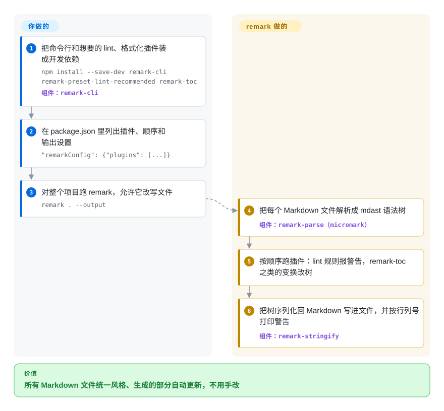

# remark

你的文档库有 400 个 Markdown 文件，一半列表用 `*`、一半用 `-`，链接悄悄失效，每页的目录还得手工维护——只会把 Markdown 渲染成 HTML 的渲染器一样也管不了。remark 把每个文件解析成一棵由标题、列表、链接组成的树，让一个个小插件去检查、改写，再写回 Markdown（或交给 HTML 那一侧）。

## 何时使用

你在 Node.js 里维护文档站、博客引擎或内容流水线，“渲染 Markdown”反而是最容易的部分。麻烦在周边：贡献者的 PR 写了 `1) Step one`，而规范要求 `1.`；标题跳级；目录过期；图片路径要改成 CDN 地址。你用 remark，是因为它把 Markdown 变成 **mdast**——一棵 JSON 树，每个标题、列表项、链接都是一个节点——并允许你叠加插件去检查或修改这棵树：`remark-lint` 预设会把 `1)` 标成 `ordered-list-marker-style` 警告，`remark-toc` 重新生成目录，`remark-gfm` 加上表格和任务列表，`remark-rehype` 在最后渲染时把树交给 HTML 那一侧。

当你要“改” Markdown 而不只是显示它时，选它而不是 [marked](marked.zh.md) 或 [markdown-it](markdown-it.zh.md)——那两个输出 HTML，没有 Markdown 到 Markdown 的往返。当检查只是一半工作、你还想在同一条流水线、同一个解析器里完成修复、变换和渲染时，选它而不是 [markdownlint](markdownlint.zh.md)。

## 怎么用起来

remark 是 **unified** 的一组插件。unified 是个通用引擎，内容在里面走三段：解析器把文本变成语法树，变换插件检查或修改树，编译器再把树变回文本。remark 提供 Markdown 解析器（`remark-parse`，底层是符合 CommonMark 的分词器 [micromark](micromark.zh.md)）和 Markdown 编译器（`remark-stringify`）；`remark` 包把两者打在一起，`remark-cli` 再包成命令行。你负责挑插件（生态里有 150 多个）和定顺序；remark 负责解析、按顺序跑插件、为报错保留行列位置，最后序列化结果。入口有两个：在终端里，`remark . --output` 按 `package.json` 里列的插件检查并改写所有 Markdown 文件；在代码里，`unified().use(remarkParse).use(…).process(text)` 对一段字符串做同样的事，接上 `remark-rehype` + `rehype-stringify` 就以 HTML 收尾。

<!-- flow-steps:begin (generated from flows/remark.json by tools/flow_card.py — do not edit) -->

流程文字版

1. **你**：把命令行和想要的 lint、格式化插件装成开发依赖 — `npm install --save-dev remark-cli remark-preset-lint-recommended remark-toc` — 组件：`remark-cli`
2. **你**：在 package.json 里列出插件、顺序和输出设置 — `"remarkConfig": {"plugins": [...]}`
3. **你**：对整个项目跑 remark，允许它改写文件 — `remark . --output`
4. **remark**：把每个 Markdown 文件解析成 mdast 语法树 — 组件：`remark-parse（micromark）`
5. **remark**：按顺序跑插件：lint 规则报警告，remark-toc 之类的变换改树
6. **remark**：把树序列化回 Markdown 写进文件，并按行列号打印警告 — 组件：`remark-stringify`

**价值**：所有 Markdown 文件统一风格、生成的部分自动更新，不用手改

<!-- flow-steps:end -->

## 何时不用

- **你只要把 Markdown 转成 HTML，外加几个扩展。** remark 自己的 README 就这么说：直接用 [micromark](micromark.zh.md)，或者用 [marked](marked.zh.md) / [markdown-it](markdown-it.zh.md) 这种一次调用的渲染器，依赖树更小。
- **你要渲染不可信的 Markdown，又指望它默认安全。** 经 `remark-rehype` 走到 HTML 可能带来跨站脚本（XSS）风险，README 要求加上 `rehype-sanitize`。如果没法保证每条流水线都有这一步，在一个统一出口上用专门清洗器包住的渲染器（比如 [marked](marked.zh.md) + DOMPurify）更容易审计。
- **你的构建只能用 CommonJS，或锁在老版本 Node 上。** `remark` 和 unified 11 这条线只发 ESM（`"type": "module"`），面向仍在维护的 Node.js 版本（README 写的是 Node 16+）。迁不动的 CommonJS 项目，用 [markdown-it](markdown-it.zh.md) 更省事。
- **团队只想在 CI 里做风格检查。** [markdownlint](markdownlint.zh.md) 自带现成规则集和编辑器集成，插件接线更少；只有还要在同一棵树上做变换时才选 remark-lint。
- **你要在 Word、LaTeX、EPUB 和 Markdown 之间转换。** remark 只管 Markdown（以及经插件支持的 MDX）；跨格式文档转换用 [Pandoc](pandoc.zh.md)。
- **你需要核心包频繁发新版。** `remark` 包从 2023-09 起一直是 15.0.1，`remark-cli` 从 2024-04 起是 12.0.1；仓库近期的提交多是插件列表的增改。这是稳定而不是废弃，但核心的修复来得慢——新行为都在插件里。

## 横向对比

| 替代品 | 是否收录 | 我们的评价 | 取舍 |
|---|---|---|---|
| [marked](marked.zh.md) | ✅ | 只想在应用里把 Markdown 显示成 HTML，选 marked，一次 `parse` 调用就够；要 lint、变换或写回 Markdown 时选 remark。 | marked 只有一个小包、速度快；没有 AST 往返，改不了源文件。 |
| [markdown-it](markdown-it.zh.md) | ✅ | 要严格遵循 CommonMark、插件在 token 层、还支持 CommonJS 的 HTML 渲染器，选 markdown-it；插件要改写文档并再输出 Markdown 时选 remark。 | markdown-it 的 token 流做渲染扩展更简单；remark 的 mdast 树更适合编辑，代价是包更多、只能 ESM。 |
| [micromark](micromark.zh.md) | ✅ | 只要 remark 底下那个符合规范的原始分词器（或只要 HTML 输出），单用 micromark；需要树和插件时再加 remark。 | micromark 更小、上手更快；所有变换都得自己写。 |
| [markdownlint](markdownlint.zh.md) | ✅ | 要即插即用、带编辑器和 CI 集成的 Markdown 风格检查器，选 markdownlint；希望检查和自动修复跟构建共用一个解析器时选 remark-lint。 | markdownlint 不用设计流水线；remark-lint 以插件形式配置，能和变换组合。 |
| [Pandoc](pandoc.zh.md) | ✅ | 内容要在 Markdown 与 Word、LaTeX、EPUB、PDF 之间搬时用 Pandoc；在 JavaScript 文档构建里留在 remark。 | Pandoc 一个二进制覆盖几十种格式；它不是 npm 库，过滤器用 Lua 或 JSON 写，不是 JS 插件。 |

## 技术栈

- **语言：** JavaScript（ES 模块）加 JSDoc 类型；README 说明 remark 组织和整个 unified 集体都用 TypeScript 完整类型化，mdast 类型在 `@types/mdast`。
- **本 monorepo 里的包：** `remark-parse`（Markdown → mdast）、`remark-stringify`（mdast → Markdown）、`remark`（unified 加上这两者）、`remark-cli`（命令行）。
- **架构：** unified 流水线——解析器 → 变换插件 → 编译器；解析由 micromark 完成；树遵循 mdast 规范；HTML 输出走姊妹生态 **rehype**。
- **生态：** 150 多个插件（`remark-gfm`、`remark-lint`、`remark-toc`、`remark-rehype`、`remark-frontmatter`、`remark-mdx` 等），一部分由 `@remarkjs` 组织维护，很多来自第三方。

## 依赖

- **运行时：** 仍在维护的 Node.js 版本（当前发布线以 Node 16+ 为目标），或在浏览器里配打包器使用；只支持 ESM。
- **核心安装：** `remark` 会带上 `unified`、`remark-parse`、`remark-stringify` 和 `@types/mdast`；纯 CommonMark 以外的每项能力都是单独的插件包。
- **没有服务：** 就是库和命令行——不用部署、不用托管。

## 运维难度

**跑起来低，保持协调中等。** 没有服务器，活儿在依赖管理上。一条真实流水线会引入 5–15 个不同作者的插件包，unified 一次大版本升级（改 ESM、mdast 类型变化）要在所有包上一起落地。第三方插件质量参差——README 自己也提醒要像审其他依赖一样审插件。调试变换要看树（`unist-util-inspect`），而不是看 HTML。

## 健康度与可持续性

- **维护——核心稳定，生态活跃（2026-10-08）。** 核心包自 2023-09（`remark` 15.0.1）和 2024-04（`remark-cli` 12.0.1）以来没有再发版的需要；仓库每隔几周仍有提交，主要是插件列表和工具链更新。雷达上维护轴的 B 正对应这种“成熟、核心在滑行”的状态——`remark-lint`、`remark-gfm` 等插件最近一次发版在 2025 年初。
- **治理与巴士因子。** 由 unified 集体运营，不属于某家公司；雷达统计近 12 个月有 7 位活跃维护者，没人超过近期提交的约 15%。历史上大部分代码出自 Titus Wormer（`wooorm`），所以集体的实际梯队深度比提交占比显示的更关键。
- **背书与 Lindy。** 通过 Open Collective 筹资，README 列出的赞助方包括 Vercel、Netlify、HashiCorp、GitBook 和 Gatsby。仓库始于 2014 年，至今仍在维护——对 JavaScript 库来说是很强的 Lindy 先验。
- **采用度。** README 自称是最流行的 Markdown 解析器；雷达的注册表数字显示每月 npm 下载以亿计、依赖仓库以十万计，主要经由 MDX、Docusaurus、Gatsby 等文档工具。
- **风险信号——低。** MIT 许可，没有开放核心付费层，也没有改许可证的历史；实际风险是整个生态的大版本升级会同时波及许多包。

## 存疑（未验证）

- [推断] “稳定而非废弃”是根据发版日期加持续提交判断的；维护者没有就核心的发版计划表态。
- [未验证] 健康度雷达的下载量和依赖仓库数（见 `health:` 块）可能统计的是整个包家族，而不只是 `remark`。
- [未验证] MDX、Docusaurus、Gatsby 采用 remark 依据的是这些项目的文档和依赖图；请按你用的版本核对。
- [推断] “Node 16+”是 README 的兼容性说明；Node 16 本身已停止维护，实际支持范围是“仍在维护的 Node 版本”。
