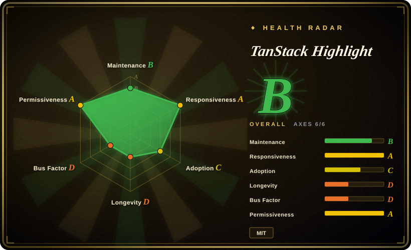
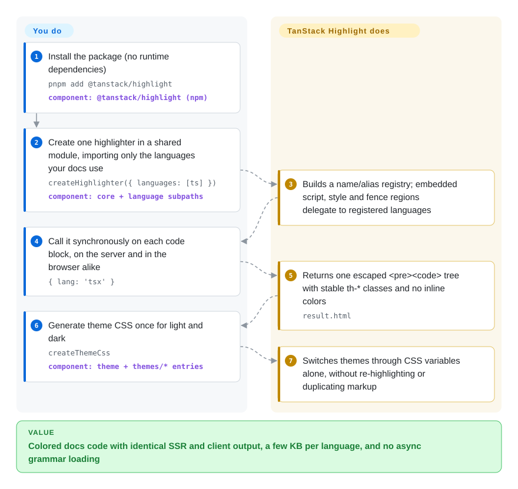

# TanStack Highlight

Your docs site ships a code highlighter that is heavier than the page it decorates — Shiki's grammars and async startup, or highlight.js pulling in languages you never write — and the colors flash or mismatch when the client re-renders what the server already highlighted. TanStack Highlight is a few-kilobyte, synchronous highlighter for code blocks in blogs and docs: you import only the languages you use, and it returns the same small class-only HTML on the server and in the browser.

## When to use

You maintain the docs or blog for a TypeScript project, rendered with SSR (TanStack Start, Next.js, Astro, an MDX pipeline) and hydrated on the client. Every page has a dozen fenced blocks in `ts`, `tsx`, `bash` and `json`, nothing more exotic. With Shiki you pay an initialization step and language loading before the first block — about 22 ms and 47 ms in the project's own comparison, before 182 ms of highlighting on 334 docs snippets — its output inlines colors, so a light/dark switch means dual-theme markup, and the HTML payload runs to 1,257 KiB where this library emits 365 KiB for the same corpus. With highlight.js or Prism you get a bigger modular core and grammar machinery built for languages your docs never use.

You reach for TanStack Highlight when the language list is **known and short** and the deciding criteria are bundle size, synchronous SSR/client parity and small class-based HTML: core plus TSX is about 4 KB gzip, every language is a separate import, and a theme is a CSS file over stable `th-*` classes. You pick it over Sugar High (smaller, but JS/TS-only and — in the same repo's benchmark — about 7× more HTML) when you also need CSS/HTML/shell/SQL/YAML fences, embedded `<script>`/`<style>` regions, line annotations, or ready adapters for remark, rehype and MDX. You do **not** pick it when "looks exactly like VS Code" is the requirement — that is Shiki's job, and the project says so itself.

## How it works

It is a small tokenizer, not a grammar engine. You build a highlighter by passing it explicit language definitions; each language is a list of priority-ordered regular expressions (plus hand-written stateful scanners for the three hard cases: JS/TS strings, template literals and JSX; markup tags with embedded `<script>`/`<style>`; shell heredocs) that returns character ranges labeled with a semantic class such as `th-keyword`. The core fills the gaps with plain text, applies optional line or character-range decorations (the `{2,4-6}`, `ins=`, `del=` markers in a fence's info string), escapes everything and emits one `<pre><code>` tree. Colors never appear in that HTML: a theme is a small object turned into CSS variables, so switching light/dark is a stylesheet change, like changing the paint without re-laying the bricks. What you own: choosing the languages, calling it on each block (or dropping in the remark/rehype/Markdown/Octane adapter so your Markdown pipeline calls it), injecting the returned HTML, and adding the theme CSS once. What it does not do: guess a block's language, load VS Code themes, or promise correct colors on malformed or rare syntax.

<!-- flow-steps:begin (generated from flows/tanstack-highlight.json by tools/flow_card.py — do not edit) -->

Text version of the flow

1. **You**: Install the package (no runtime dependencies) — `pnpm add @tanstack/highlight` — component: `@tanstack/highlight (npm)`
2. **You**: Create one highlighter in a shared module, importing only the languages your docs use — `createHighlighter({ languages: [ts] })` — component: `core + language subpaths`
3. **TanStack Highlight**: Builds a name/alias registry; embedded script, style and fence regions delegate to registered languages
4. **You**: Call it synchronously on each code block, on the server and in the browser alike — `{ lang: 'tsx' }`
5. **TanStack Highlight**: Returns one escaped <pre><code> tree with stable th-* classes and no inline colors — `result.html`
6. **You**: Generate theme CSS once for light and dark — `createThemeCss` — component: `theme + themes/* entries`
7. **TanStack Highlight**: Switches themes through CSS variables alone, without re-highlighting or duplicating markup

**Value**: Colored docs code with identical SSR and client output, a few KB per language, and no async grammar loading

<!-- flow-steps:end -->

## When NOT to use

- **If you need VS Code-grade accuracy, TextMate grammars or VS Code themes, use Shiki instead, because** this project explicitly lists "TextMate or VS Code theme compatibility" and "exact parity with language compilers or IDEs" as non-goals; its tokenizers are regexes plus three hand-written scanners, and quality is only targeted at "common, valid code found in blogs and documentation".
- **If your content mixes many or rare languages (Rust, Java, Kotlin, C#, Ruby, Swift, Haskell…), use Shiki or highlight.js instead, because** v0.1.0 ships 30 languages (`apache` … `yaml`) and "hundreds of languages" is a stated non-goal; an unregistered or unknown language falls back to escaped plain text silently, so the block renders uncolored rather than failing loudly. Writing your own `LanguageDefinition` is supported but means owning a tokenizer.
- **If you highlight user-supplied snippets of unknown language (paste bins, chat, forums), use highlight.js instead, because** it has automatic language detection and TanStack Highlight deliberately does not.
- **If you are building an editor or live IDE-like view, use CodeMirror/Lezer or Monaco instead, because** there is no incremental parsing or editor state — every call re-tokenizes the whole block — and semantic tokens from a language service are out of scope.
- **If you need a long-stable API right now, pin the exact version or prefer Prism/highlight.js, because** the package is `0.x`, two months old at verification (created 2026-07-21, v0.1.0 on 2026-09-11) and already moved from 0.0.x to 0.1.0 with language additions; semver guarantees before 1.0 are weak.
- **If your stack is JS/TS-only and every byte counts, Sugar High is smaller** (3.28 KB vs 4.11 KB gzip in this repo's own measurement) — pick TanStack Highlight only when its extra languages, class-based output or adapters are worth the ~830 bytes.
- **Do not treat its HTML output as a sanitizer.** It escapes code text and decoration values, but the FAQ states it "is not a general HTML sanitizer"; untrusted surrounding Markdown still needs your normal pipeline (for example `rehype-sanitize` after the remark/rehype stage).

## Comparison

| Alternative | In index | Our verdict | Tradeoff |
| --- | --- | --- | --- |
| Shiki (`shikijs/shiki`) | not indexed | When the docs must look exactly like VS Code or cover many languages, pick Shiki; pick TanStack Highlight when the language list is short and you want synchronous, class-only output with no grammar loading. | Shiki brings TextMate grammars, VS Code themes and broad coverage at the cost of async init, larger runtime and ~3.4× more HTML in this repo's fixture comparison (author-run). Not added in this tab-intake batch. |
| highlight.js (`highlightjs/highlight.js`) | not indexed | When you highlight snippets whose language you do not know, or need hundreds of languages (core plus third-party grammars) with a long-stable API, pick highlight.js; for known-language docs with SSR parity, TanStack Highlight is lighter per language. | highlight.js (since 2011, BSD-3-Clause) is a veteran project with auto-detection and a huge language set; its grammar core is larger and it has no built-in line/range decorations. Not added in this tab-intake batch. |
| Prism (`PrismJS/prism`) | not indexed | When you want a mature plugin ecosystem (line numbers, copy button, diff) on a static site and do not mind client-side grammar composition, pick Prism; pick TanStack Highlight for small isomorphic output wired into remark/rehype. | Prism (since 2012) has years of grammars and plugins, but its plugin/hook architecture is more surface than a docs pipeline needs, and there is no single-definition-per-language SSR contract. Not added in this tab-intake batch. |
| Sugar High (`huozhi/sugar-high`) | not indexed | When your docs are JS/TS/JSX only and bundle size is the only metric, pick Sugar High; pick TanStack Highlight once you need other languages, embedded regions or much smaller HTML. | Sugar High is ~0.8 KB gzip smaller but, in this repo's benchmark on 5,040 JS/TS blocks, ~5× slower and 44.8 MiB vs 6.7 MiB of generated HTML (author-run). Not added in this tab-intake batch. |
| Starry Night (`wooorm/starry-night`) | not indexed | When you want GitHub.com-identical highlighting with TextMate scopes and are fine loading WASM plus grammars, pick Starry Night; pick TanStack Highlight when footprint and synchronous startup matter more than GitHub fidelity. | Starry Night reuses GitHub's grammars (very broad, accurate) through a WASM regex engine, so its footprint and startup are far heavier. Not added in this tab-intake batch. |

It plugs into the Markdown tools in this category rather than competing with them: its adapters target [remark](remark.md) (emits HAST data) and rehype, and [MDX](mdx.md)-style pipelines via the Octane MDX entry. Within the TanStack family it is the highlighter behind TanStack Markdown, which has its own dedicated adapter (`@tanstack/highlight/markdown`).

## Tech stack

- **Language/build:** TypeScript compiled with `tsc` to ESM only (`"type": "module"`, no CJS build), `sideEffects: false`, subpath exports per language (`./languages/*`) and per theme (`./themes/*`); Node ≥18 for tooling.
- **Engine:** a registry of `LanguageDefinition` objects; priority-ordered regex tokenizers, with small stateful scanners for JS/TS/JSX and templates, markup with embedded script/style, and shell heredocs; recursion guard for nested template literals. Renderers output HTML strings or HAST.
- **Adapters (all dependency-free):** `./remark`, `./rehype`, `./markdown` (TanStack Markdown), `./octane` (Octane MDX), `./react` (props for your own component, no React import).
- **Quality gates:** Vitest suites, 334 real-docs fixtures extracted from TanStack docs, `publint`, bundle-size budgets and a ~10,000-block throughput budget in `pnpm run verify`; Changesets + npm trusted publishing from GitHub Actions.

## Dependencies

- **Runtime:** none — the published `package.json` has no `dependencies` or `peerDependencies`. Adapters produce plain data (HAST nodes, HTML strings, props) instead of importing unified, React or Octane.
- **You bring:** a bundler that respects ESM subpath exports and tree-shaking (the root entry pulls every shipped language), your Markdown pipeline if you use the adapters, and the theme CSS you generate once.
- **No services, no WASM, no grammar files** to host or load.

## Ops difficulty

**Low.** It is a pure function inside your build or render step: no server, no async init, no assets to serve beyond one CSS string. The real maintenance cost is correctness drift — when a snippet in your docs uses syntax the heuristics miss, you file a bug or patch a tokenizer yourself — and version churn while it is `0.x`. Pin the version and snapshot a few representative code blocks in your own tests if exact coloring matters.

## Health & viability

- **Maintenance (2026-09-28).** Active but bursty: 39 commits since creation (2026-07-21), 3 GitHub releases and 8 tags (v0.0.4 → v0.1.0), latest v0.1.0 on 2026-09-11; after a burst on 2026-09-10/11 there were no commits in the following two weeks. Automated Changesets release pipeline with npm trusted publishing.
- **Governance / bus factor.** TanStack organization repo, but effectively a one-maintainer project: Tanner Linsley authored 33 of 39 counted contributions; two outside contributors (Go, Gruvbox; README banner) were merged. Feature requests are answered by the maintainer re-implementing them (PHP, C++/CMake landed 2026-09-11 after community issues #9 and #12), and three TSX bug reports (#5–#7, 2026-08-03) were fixed within two days. Zero open issues at verification.
- **Backing & longevity.** Two months old — the Lindy prior gives it almost nothing on its own; its survival case rests on TanStack's track record (Query, Table, Router) and on dogfooding: it has an adapter purpose-built for TanStack Markdown and its fixtures are TanStack's own docs, so it is likely to stay maintained as long as TanStack's docs use it [推断].
- **Adoption.** 78 stars and 1 fork, but 143,499 npm downloads in the last month (health scorer, 2026-09-28) and ~60k in the week to 2026-09-27, rising from ~22k in its second week. That ratio suggests the downloads come mostly from being a transitive dependency inside the TanStack toolchain rather than from direct adopters [未验证].
- **Risk flags.** MIT, no relicense history, no CLA. Pre-1.0 API; narrow language set is a deliberate, documented boundary rather than a gap likely to close. The repo also ships agent "skills" (`skills/`) installed through `@tanstack/intent` — harmless, but it is extra surface in the published tarball.

## Caveats (unverified)

- [未验证] All size and speed numbers (4.11 KB vs 3.28 KB gzip, 78 ms vs 377 ms, 4.6 ms vs 182 ms, 365 KiB vs 1,257 KiB HTML) are the project's own local benchmarks from its README/docs (`pnpm run compare:*`); they were not reproduced in this batch, and the authors note they "do not imply equivalent grammar depth".
- [未验证] The source of the ~60k weekly npm downloads was not traced; the "transitive dependency inside TanStack tooling" reading is inferred from the star/download mismatch. The published `@tanstack/markdown` 0.0.15 manifest does not list it as a dependency, so the actual dependents are unknown.
- [推断] "Likely to stay maintained while TanStack's docs use it" is inferred from the dedicated TanStack Markdown adapter and TanStack-docs fixtures; there is no public roadmap or support commitment.
- [推断] The claim that every call re-tokenizes the whole block comes from the documented synchronous per-block API and the "no incremental parsing" non-goal, not from profiling.
- [未验证] Comparison cells for Shiki, highlight.js, Prism, Sugar High and Starry Night rest on repo metadata fetched 2026-09-28, this project's own comparison doc and general ecosystem knowledge; their feature sets and footprints were not re-measured.
- [未验证] Coloring quality for the non-JS languages (Go, PHP, C++, CMake, SQL, etc.) was not spot-checked; the project states its bar is valid documentation code, not full language conformance.
