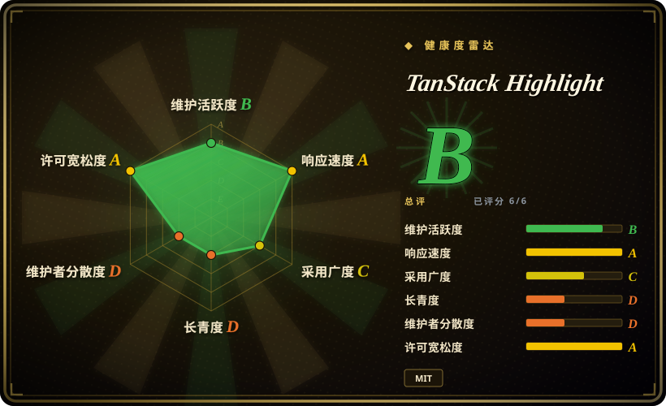
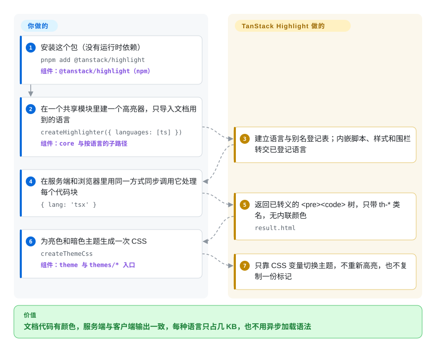

# TanStack Highlight

文档站为了给代码块上色，引入的高亮库比页面本身还重——Shiki 要异步加载语法和主题，highlight.js 带着一堆你从不写的语言——而且服务端渲染好的颜色，到了浏览器重新渲染时还可能闪一下或对不上。TanStack Highlight 是一个只有几 KB、同步执行的文档代码高亮库：只导入你用到的语言，服务端和浏览器输出同一份只带类名的小 HTML。

## 何时使用

你在维护一个 TypeScript 项目的文档或博客，用 SSR 渲染（TanStack Start、Next.js、Astro 或某条 MDX 管线），再在客户端水合。每页有十来个代码块，语言无非 `ts`、`tsx`、`bash`、`json`。换成 Shiki，第一个代码块之前要先初始化、再加载语言——项目自己的对比里分别约 22 ms 和 47 ms，然后 334 个文档片段高亮用 182 ms；它的输出把颜色写成内联样式，亮暗切换就得输出双主题标记；同一批语料生成的 HTML 有 1,257 KiB，而这个库是 365 KiB。换成 highlight.js 或 Prism，你拿到的是更大的模块化核心，以及为文档里根本不出现的语言准备的语法机制。

当语言清单**已知且很短**、决定因素是包体积、服务端与客户端同步一致、以及小而只带类名的 HTML 时，就该想到它：core 加 TSX 大约 4 KB（gzip），每种语言单独导入，主题就是一段挂在稳定 `th-*` 类名上的 CSS。和 Sugar High 相比，后者更小，但只支持 JS/TS，而且在同一仓库的基准里生成的 HTML 约多 7 倍；当你还需要 CSS、HTML、shell、SQL、YAML 代码块，需要内嵌的 `<script>`/`<style>` 区域、行级标注，或者现成的 remark、rehype、MDX 适配器时，选它。如果需求是“看起来和 VS Code 一模一样”，**不要**选它——那是 Shiki 的活，项目自己也这么说。

## 怎么用起来

它是个小分词器，不是语法引擎。你把明确的语言定义交给它，建出一个高亮器；每种语言就是一组按优先级排好的正则表达式（外加三处手写的有状态扫描器，处理最难的情况：JS/TS 的字符串、模板字符串和 JSX；带内嵌 `<script>`/`<style>` 的标记标签；shell 的 heredoc），返回一段段字符区间，每段标上语义类名，比如 `th-keyword`。核心把区间之间的空隙补成纯文本，按需加上行或字符区间的装饰（也就是代码围栏信息串里的 `{2,4-6}`、`ins=`、`del=` 这类标记），把所有内容转义后输出一棵 `<pre><code>` 树。HTML 里永远没有颜色：主题只是一个小对象，被转成 CSS 变量，所以切换亮暗只是换样式表——像给墙换漆，不用把砖重新砌一遍。你要做的：挑语言、对每个代码块调用它（或者装上 remark/rehype/Markdown/Octane 适配器，让 Markdown 管线替你调用）、把返回的 HTML 放进页面、加一次主题 CSS。它不做的：猜代码块的语言、加载 VS Code 主题、保证畸形或冷门语法也能上对颜色。

<!-- flow-steps:begin (generated from flows/tanstack-highlight.json by tools/flow_card.py — do not edit) -->

流程文字版

1. **你**：安装这个包（没有运行时依赖） — `pnpm add @tanstack/highlight` — 组件：`@tanstack/highlight（npm）`
2. **你**：在一个共享模块里建一个高亮器，只导入文档用到的语言 — `createHighlighter({ languages: [ts] })` — 组件：`core 与按语言的子路径`
3. **TanStack Highlight**：建立语言与别名登记表；内嵌脚本、样式和围栏转交已登记语言
4. **你**：在服务端和浏览器里用同一方式同步调用它处理每个代码块 — `{ lang: 'tsx' }`
5. **TanStack Highlight**：返回已转义的 <pre><code> 树，只带 th-* 类名，无内联颜色 — `result.html`
6. **你**：为亮色和暗色主题生成一次 CSS — `createThemeCss` — 组件：`theme 与 themes/* 入口`
7. **TanStack Highlight**：只靠 CSS 变量切换主题，不重新高亮，也不复制一份标记

**价值**：文档代码有颜色，服务端与客户端输出一致，每种语言只占几 KB，也不用异步加载语法

<!-- flow-steps:end -->

## 何时不用

- **如果你要 VS Code 级别的准确度、TextMate 语法或 VS Code 主题，改用 Shiki，因为**本项目把“TextMate 或 VS Code 主题兼容”和“与编译器、IDE 完全一致”明确列为非目标；它的分词器是正则加三个手写扫描器，质量只瞄准“博客和文档里常见的合法代码”。
- **如果内容里语言多或冷门（Rust、Java、Kotlin、C#、Ruby、Swift、Haskell……），改用 Shiki 或 highlight.js，因为** v0.1.0 只带 30 种语言（`apache` 到 `yaml`），“几百种语言”是写明的非目标；未登记或不认识的语言会静默退化为转义后的纯文本，代码块只是没颜色，不会报错。可以自己写 `LanguageDefinition`，但那就等于自己维护一个分词器。
- **如果要高亮用户粘贴、语言未知的片段（贴代码网站、聊天、论坛），改用 highlight.js，因为**它有自动语言检测，而 TanStack Highlight 有意不做。
- **如果你在做编辑器或类 IDE 的实时视图，改用 CodeMirror/Lezer 或 Monaco，因为**这里没有增量解析，也没有编辑器状态——每次调用都把整个代码块重新分词——语言服务提供的语义 token 也不在范围内。
- **如果你现在就需要长期稳定的 API，锁死精确版本，或者选 Prism/highlight.js，因为**它还是 `0.x`，验证时只有两个月大（2026-07-21 创建，2026-09-11 发布 v0.1.0），已经因为新增语言从 0.0.x 升到 0.1.0；1.0 之前的语义化版本承诺很弱。
- **如果你的技术栈只有 JS/TS、每个字节都要省，Sugar High 更小**（本仓库自测 gzip 3.28 KB 对 4.11 KB）——只有当额外的语言、基于类名的输出或适配器值这约 830 字节时，才选 TanStack Highlight。
- **不要把它的 HTML 输出当成消毒器。**它会转义代码文本和装饰值，但 FAQ 明说它“不是通用的 HTML 消毒器”；不受信任的外围 Markdown 仍要走你平常的管线（比如在 remark/rehype 之后接 `rehype-sanitize`）。

## 横向对比

| 替代品 | 是否收录 | 我们的评价 | 取舍 |
| --- | --- | --- | --- |
| Shiki（`shikijs/shiki`） | 未收录 | 文档必须和 VS Code 一模一样、或要覆盖很多语言时选 Shiki；语言清单短、想要同步执行、只带类名、不用加载语法的输出时选 TanStack Highlight。 | Shiki 带来 TextMate 语法、VS Code 主题和广泛覆盖，代价是异步初始化、更大的运行时，以及在本仓库语料对比里约 3.4 倍的 HTML（作者自测）。本批次（tab-intake）未收录。 |
| highlight.js（`highlightjs/highlight.js`） | 未收录 | 要高亮语言未知的片段，或需要几百种语言（核心加第三方语法）和长期稳定的 API 时选 highlight.js；语言已知、要求服务端与客户端一致的文档，TanStack Highlight 每种语言更轻。 | highlight.js（2011 年起，BSD-3-Clause）是老牌项目，有自动检测和庞大的语言集；语法核心更大，也没有内置的行级和区间装饰。本批次（tab-intake）未收录。 |
| Prism（`PrismJS/prism`） | 未收录 | 静态站想要成熟的插件生态（行号、复制按钮、diff），且不介意在客户端组合语法时选 Prism；想要小巧、同构、能接进 remark/rehype 的输出时选 TanStack Highlight。 | Prism（2012 年起）积累了多年的语法和插件，但插件与钩子架构对文档管线来说面太大，也没有“每种语言一个定义”的 SSR 契约。本批次（tab-intake）未收录。 |
| Sugar High（`huozhi/sugar-high`） | 未收录 | 文档只有 JS/TS/JSX、唯一指标是包体积时选 Sugar High；一旦需要其他语言、内嵌区域或小得多的 HTML，选 TanStack Highlight。 | Sugar High 的 gzip 体积约小 0.8 KB，但在本仓库对 5,040 个 JS/TS 代码块的基准里慢约 5 倍，生成的 HTML 是 44.8 MiB 对 6.7 MiB（作者自测）。本批次（tab-intake）未收录。 |
| Starry Night（`wooorm/starry-night`） | 未收录 | 想要和 GitHub.com 完全一致、基于 TextMate 作用域的高亮，并且能接受加载 WASM 与语法文件时选 Starry Night；占用和同步启动比 GitHub 保真度更重要时选 TanStack Highlight。 | Starry Night 通过 WASM 正则引擎复用 GitHub 的语法（覆盖极广且准确），所以占用和启动开销重得多。本批次（tab-intake）未收录。 |

它和本分类里的 Markdown 工具是搭配关系而不是竞争：它的适配器面向 [remark](remark.zh.md)（输出 HAST 数据）和 rehype，并通过 Octane MDX 入口接入 [MDX](mdx.zh.md) 式管线。在 TanStack 家族里，它是 TanStack Markdown 背后的高亮器，后者有专门的适配器（`@tanstack/highlight/markdown`）。

## 技术栈

- **语言与构建：** TypeScript 经 `tsc` 编译为纯 ESM（`"type": "module"`，没有 CJS 产物），`sideEffects: false`，每种语言（`./languages/*`）和每个主题（`./themes/*`）都有独立子路径导出；工具链需要 Node ≥18。
- **引擎：** 由 `LanguageDefinition` 对象组成的登记表；按优先级排序的正则分词器，外加处理 JS/TS/JSX 与模板字符串、带内嵌脚本和样式的标记语言、shell heredoc 的小型有状态扫描器；嵌套模板字符串有递归深度保护。渲染器输出 HTML 字符串或 HAST。
- **适配器（全部零依赖）：** `./remark`、`./rehype`、`./markdown`（TanStack Markdown）、`./octane`（Octane MDX）、`./react`（给你自己的组件准备 props，不导入 React）。
- **质量关卡：** Vitest 测试集、从 TanStack 文档抽出的 334 个真实文档片段、`publint`、包体积预算，以及 `pnpm run verify` 里约 10,000 个代码块的吞吐预算；用 Changesets 加 GitHub Actions 的 npm 可信发布。

## 依赖

- **运行时：** 没有——发布的 `package.json` 里没有 `dependencies` 也没有 `peerDependencies`。适配器产出的是普通数据（HAST 节点、HTML 字符串、props），不导入 unified、React 或 Octane。
- **你需要自备：** 一个支持 ESM 子路径导出和 tree-shaking 的打包器（根入口会带上所有内置语言）；用适配器的话还有你自己的 Markdown 管线；以及生成一次的主题 CSS。
- **没有服务、没有 WASM、没有语法文件**需要托管或加载。

## 运维难度

**低。**它就是构建或渲染步骤里的一个纯函数：没有服务器，没有异步初始化，除了一段 CSS 字符串不需要额外托管资源。真正的维护成本是正确性漂移——文档里某段代码用了启发式规则识别不了的语法时，你得报 bug 或者自己修分词器——以及 `0.x` 阶段的版本变动。如果颜色准确很重要，锁定版本，并在自己的测试里给几段有代表性的代码块做快照。

## 健康度与可持续性

- **维护（2026-09-28）。**活跃但成阵发：创建（2026-07-21）以来共 39 个提交，3 个 GitHub release、8 个 tag（v0.0.4 → v0.1.0），最新 v0.1.0 发于 2026-09-11；2026-09-10/11 集中提交之后的两周没有新提交。发布流程由 Changesets 自动化，npm 走可信发布。
- **治理与巴士系数。**挂在 TanStack 组织名下，但实际上是一人项目：Tanner Linsley 占了 39 次计入贡献中的 33 次；合入过两位外部贡献者的改动（Go 与 Gruvbox 主题；README 横幅）。功能请求的处理方式是维护者自己重写实现（社区提的 #9 PHP、#12 C++/CMake 于 2026-09-11 落地），三个 TSX bug 报告（#5–#7，2026-08-03）两天内修复。验证时没有打开的 issue。
- **背书与寿命。**只有两个月大——单看 Lindy 先验几乎给不了分；它能活下去的理由在于 TanStack 的过往记录（Query、Table、Router）和自用：它有专为 TanStack Markdown 做的适配器，测试语料就是 TanStack 自己的文档，所以只要 TanStack 文档还在用它，大概率会继续维护 [推断]。
- **采用度。**78 星、1 个 fork，但最近一个月 npm 下载 143,499 次（健康度评分器，2026-09-28），到 2026-09-27 为止的一周约 6 万次，第二周时约 2.2 万次。这种比例说明下载量多半来自它作为 TanStack 工具链里的传递依赖，而不是直接采用者 [未验证]。
- **风险信号。**MIT，没有改许可证的历史，没有 CLA。API 还在 1.0 之前；语言集窄是写明的有意边界，不是很快会补上的缺口。仓库还随包发布了给 agent 用的 skills（`skills/`），通过 `@tanstack/intent` 安装——无害，但让发布包多了一块内容。

## 存疑（未验证）

- [未验证] 所有体积和速度数字（gzip 4.11 KB 对 3.28 KB、78 ms 对 377 ms、4.6 ms 对 182 ms、HTML 365 KiB 对 1,257 KiB）都是项目在 README 与文档里给出的本地基准（`pnpm run compare:*`），本批次没有复现；作者自己也注明这些数字“不代表语法深度相当”。
- [未验证] 每周约 6 万次 npm 下载的来源没有追查；“来自 TanStack 工具链的传递依赖”是根据星数与下载量不匹配推出来的。已发布的 `@tanstack/markdown` 0.0.15 清单并没有把它列为依赖，所以真正的依赖方未知。
- [推断] “只要 TanStack 文档在用就会继续维护”是根据专用的 TanStack Markdown 适配器和取自 TanStack 文档的测试语料推断的，并没有公开的路线图或支持承诺。
- [推断] “每次调用都把整个代码块重新分词”来自文档里“按代码块同步调用”的 API 和“不做增量解析”的非目标，没有做性能剖析。
- [未验证] Shiki、highlight.js、Prism、Sugar High 和 Starry Night 的对比格子依据的是 2026-09-28 抓取的仓库元数据、本项目自己的对比文档和一般生态常识，没有重新测量它们的功能和占用。
- [未验证] 非 JS 语言（Go、PHP、C++、CMake、SQL 等）的上色质量没有抽查；项目自己说目标是合法的文档代码，而不是完整符合语言规范。
