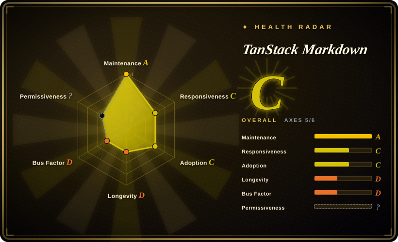
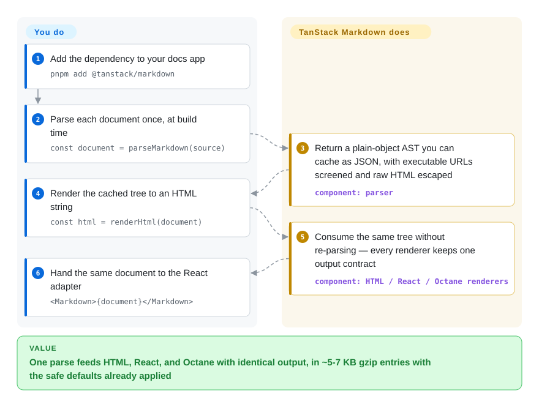

# TanStack Markdown

You're wiring Markdown into a docs site or blog and the renderer keeps eating your bundle budget — markdown-it drags ~53 KB gzip for one browser entry, and rendering anything you didn't author turns every parser into an XSS audit you owe yourself. TanStack Markdown parses a *documented* docs/blog syntax subset into a JSON-serializable AST and renders that same tree to HTML, React, or Octane with structurally identical output — raw HTML escaped and executable URL protocols screened by default — in ~5 KB gzip for the parser and ~7 KB for each renderer.

## When to use

You maintain a technical blog or documentation site — prose, tables, fenced code with `file`/`framework`/line-highlight metadata, footnotes, callouts — and the content is written by you or your team, not pasted in by anonymous users. Browser bundle size is a product constraint, not an afterthought. You want `renderHtml(source)` in plain TypeScript and `<Markdown>{source}</Markdown>` in React to produce the same structure on the server and on the client, instead of stitching a parser to a separate react-markdown wrapper and praying hydration matches. The deciding tradeoff against the closest JS substitutes is *bundle and framework parity over a corpus you can audit*: on the project's own measurement harness the entries land at roughly 4.9 KB (parser) and 6.6–6.7 KB (HTML/React/Octane) gzip — about half of marked and an eighth of markdown-it — and the docs-site parts everyone otherwise bolts on (stable duplicate-safe heading IDs, GFM tables/task-lists/strikethrough, opt-in callout/tab/heading-collection extensions) ship as small separate entries. The second scenario that defines it is streaming an AI answer: an optional extension renders the accumulated response text by re-parsing the whole string each update — no incremental parser state that can be left corrupt mid-token — and suppresses incomplete trailing blocks until their closing delimiters arrive.

What you knowingly trade away is complete CommonMark/GFM behavior. The project's own compatibility report scores 403/652 spec examples (61.8%, generated 2026-09-11) and labels itself "compatibility accounting, not a conformance claim"; its docs point spec-critical users at commonmark.js, micromark, or a unified pipeline instead. That is the right bet for a controlled corpus you can run through their syntax profile and corpus-audit tooling, and the wrong one for arbitrary Markdown from the wild.

## How it works

The core is split in two: `parseMarkdown(source)` walks the Markdown into a plain-objects, `JSON.stringify`-able document (`MarkdownDocument`), and thin renderer entries consume that tree without re-parsing — `@tanstack/markdown/html` emits an HTML string, while `/react` and `/octane` map the same nodes to framework elements, so SSR HTML and client hydration agree by construction rather than by testing discipline. The safety boundary lives in the parser: raw block and inline HTML is escaped unless you explicitly pass `allowHtml: true`, and `javascript:` / `vbscript:` / `file:` / dangerous `data:` URLs are removed from links and images during parsing, with an optional `urlTransform(url, kind, defaultUrl)` callback to layer your own allow-list on top. What is deliberately *outside* the core: syntax highlighting (you pass a `highlighter` callback whose trusted markup goes into `<code>`; the tested integration is the TanStack Highlight adapter, so language grammars never inflate the Markdown bundle), docs-specific syntax (callouts, tabs, comment components, package-manager transforms are separate opt-in `/extensions/*` entries), and general plugin pipelines (the extension surface is focused hooks, not an async unified-style middleware stack). For streamed AI output, the ~0.2 KB-gzip streaming extension suppresses trailing half-open headings, quotes, and list items while text accumulates, then completes normally as the closing delimiters arrive.

<!-- flow-steps:begin (generated from flows/tanstack-markdown.json by tools/flow_card.py — do not edit) -->

Text version of the flow

1. **You**: Add the dependency to your docs app — `pnpm add @tanstack/markdown`
2. **You**: Parse each document once, at build time — `const document = parseMarkdown(source)`
3. **TanStack Markdown**: Return a plain-object AST you can cache as JSON, with executable URLs screened and raw HTML escaped — component: `parser`
4. **You**: Render the cached tree to an HTML string — `const html = renderHtml(document)`
5. **TanStack Markdown**: Consume the same tree without re-parsing — every renderer keeps one output contract — component: `HTML / React / Octane renderers`
6. **You**: Hand the same document to the React adapter — `<Markdown>{document}</Markdown>`

**Value**: One parse feeds HTML, React, and Octane with identical output, in ~5-7 KB gzip entries with the safe defaults already applied

<!-- flow-steps:end -->

## When NOT to use

- **You must render untrusted user Markdown (comments, forums, profiles).** Safe-by-default is not a sanitizer, and the project says so outright: `allowHtml`, a highlighter that doesn't escape, extension `renderHtml` hooks, and application-supplied ASTs are all trusted-content boundaries, and the parser's nesting/delimiter limits are explicitly *not* a total input-size cap. For user content at scale, pair output with DOMPurify or rehype-sanitize over markdown-it or the remark stack — an independent defense layer your threat model can audit.
- **You need CommonMark/GFM fidelity across an unknown corpus.** 403/652 measured matches, plus explicit non-goals — no setext headings, no indented code blocks, no autolink literals, partial entity decoding — mean arbitrary Markdown *will* render differently than the spec. Use commonmark.js, markdown-it, or micromark when exact spec output is a requirement; the project's own comparison page says exactly this.
- **You want components inside the prose (MDX/JSX evaluation).** Out of scope by design ("MDX, JSX parsing, or arbitrary code evaluation" is listed as a deliberate limit). Use MDX instead.
- **You need a large plugin catalog or a transformation pipeline** (lint rules, custom AST passes, multi-format output, math via KaTeX): remark/unified or markdown-it have the parts; TanStack Markdown offers bounded hooks and a docs preset, not an ecosystem. If you need math today, the community note in issue #13 reports it only fits as an external extension. [推断]
- **Your organization can't carry a two-month-old v0.0.x dependency.** Every release to date is a 0.0.x patch, the public surface still moves (`urlTransform` and `InlineComponentNode` landed in 0.0.15), and there is **no LICENSE file in the repository** — MIT appears only in `package.json` metadata (checked 2026-09-28). For a conservative pick with a decade-plus of history, stay on marked or markdown-it.

## Comparison

| Alternative | In index | Our verdict | Tradeoff |
|---|---|---|---|
| [markdown-it](markdown-it.md) | ✅ | Choose markdown-it when strict CommonMark parsing plus a mature plugin catalog matter more than client bytes; choose TanStack Markdown when the ~8× browser-size gap is the debt you're paying down and your corpus is docs-shaped. | markdown-it buys spec fidelity and an ecosystem; TanStack Markdown buys ~6.7 KB entries, built-in React/Octane parity and URL screening at the price of deliberate spec incompleteness. |
| [marked](marked.md) | ✅ | Choose marked when one familiar Markdown→HTML string call and a 15-year track record beat framework renderers and default URL screening — and you'll sanitize the output yourself anyway. | marked wins on maturity and adoption; TanStack Markdown wins on bundle (≈6.7 vs ≈12.5 KB gzip), safe defaults, and HTML/React/Octane output parity, but is two months old and v0.x. |
| [micromark](micromark.md) | ✅ | Choose micromark when you're building your own content pipeline and want a CommonMark-conformant tokenizer to extend; pick TanStack Markdown only once you accept its fixed docs syntax profile. | micromark is the standard-conformant layer remark builds on — a building block; TanStack Markdown is a finished small renderer, not a layer you extend arbitrarily. |
| [remark](remark.md) | ✅ | Choose remark/unified when Markdown is one stage of a transformation pipeline (lint, custom AST passes, MDX, many output formats); choose TanStack Markdown when all you need is parse-once-and-render-to-UI with a serializable cached AST. | remark buys the mdast ecosystem and transform power at a much larger runtime surface (≈37 KB gzip for unified+remark+rehype by the same harness); TanStack Markdown buys a cached plain-object AST plus parity renderers in ~7 KB. |
| Streamdown | not indexed | Choose Streamdown when you want the established drop-in react-markdown replacement tuned for AI streaming — it is the incumbent this project benchmarks itself against in React AI-response rendering. | A real repository (`vercel/streamdown`) with no page in this index yet — not added in this tab-intake batch. TanStack Markdown answers with ~6.7 KB React entries, non-React HTML/Octane renderers, and re-parse-with-no-state streaming; it carries none of Streamdown's just-over-a-year of head start. |

## Tech stack

- **Language/runtime:** TypeScript throughout, published ESM-only — `"type": "module"` and an `exports` map with `import` conditions only (package.json read 2026-09-28), so CommonJS consumers need a bundler or transpile step. Runs in browser and Node.
- **Entries:** `@tanstack/markdown` (default re-export), `/parser`, `/html`, `/react`, `/octane`, plus `/extensions/{callouts,docs,framework,headings,streaming,tabs,comment-components}` (exports map).
- **Tooling:** `tsc` build, vitest suite (conformance, corpus, security, resilience, hydration, bundle-size and budget tests), Playwright for browser streaming verification, esbuild + gzip/brotli for the size reports, Changesets + GitHub Actions trusted publishing for releases.
- **Peer targets:** React ≥ 18 and `octane` ≥ 0.1.12 (the npm UI framework its registry describes as "the successor to Inferno") — both optional, each used only by its adapter entry.
- **Agent surface:** the package ships `skills/*/SKILL.md` task cards installed via `npx @tanstack/intent@latest install`.

## Dependencies

- **Runtime:** zero dependencies (`@tanstack/markdown@0.0.15` declares no `dependencies`; npm registry metadata 2026-09-28).
- **Optional peers:** `react >=18` (only the `/react` entry), `octane >=0.1.12` (only `/octane`) — `peerDependenciesMeta` marks both optional.
- **Highlighting is separate:** a `highlighter` callback fed by an external package (tested with `@tanstack/highlight`); grammars never enter the Markdown bundle.
- **For untrusted input you must still add** a sanitizer (DOMPurify / rehype-sanitize) — explicitly outside this library's scope.

## Ops difficulty

**Low.** It's a dependency, not a service: install, import the narrowest entry, ship — no daemon, datastore, or infra. The ongoing burden is version movement (v0.0.x patches still add public API — pin exact versions and read the CHANGELOG before each bump) and the one-time pre-migration audit the docs insist on: confirm your corpus against the syntax profile (their own repo exposes `MARKDOWN_CORPUS_DIRS=… pnpm run test:corpus` and external-corpus audit scripts as the template).

## Health & viability

- **Radar (machine-scored 2026-09-28): overall C — maintenance A, responsiveness C, adoption C, longevity D, governance D, license `?`** (`license_declared_unverifiable`); see the card above.
- **Maintenance — hyperactive, two months deep.** Repo created 2026-07-21, last pushed 2026-09-26 (GitHub API 2026-09-28); the npm package (created 2026-06-21) shipped 15 releases in ~3 months, latest v0.0.15 (2026-09-13). Releases are Changesets-driven through CI with npm trusted publishing and per-release bundle-budget accounting in the CHANGELOG — cadence and discipline are real even if tenure is short.
- **Governance / bus factor — an org badge over a one-person repo today.** It lives under the `TanStack` GitHub organization (owner type Organization, verified 2026-09-28), which supplies brand, CI, and release infrastructure; but the contributor list is 4 accounts and tannerlinsley authored ~89% of the 12-month contribution window (top1_share 0.889, health.py 2026-09-28). Key-person risk is currently in the person, not the org. [推断]
- **Backing — the TanStack brand is the substance of the bet.** Query/Router/Table carry heavy production adoption, and this repo's docs, benchmarks, corpus-audit harnesses, regression suites, and bundled agent-skills read as intentional sustained investment rather than a weekend drop. [推断: judged from this repo's artifacts and the org's track record, not from disclosed funding]
- **Adoption — high volume for its age, hype included, no visible dependents yet.** 216,868 npm downloads measured last month (adoption.downloads_last_month, health.py 2026-09-28; the npm API's own last-month window ending 2026-09-27 read 223,185) against ~412 GitHub stars and **0 dependent repos** in the machine-scored graph — downloads without a repo graph is exactly what a launch wave, not entrenched usage, looks like [推断], and every adopter is running a v0.x library. Median first issue response measured at ~531 hours (responsiveness C, health.py 2026-09-28).
- **Age / Lindy — does not apply yet.** ~2 months old (repo_age_days 69 at scoring): the index's Lindy prior gives this page nothing. The bet is on the org and the design discipline (bundle budgets, regression-protected compatibility accounting, honest non-goals), not on elapsed time.
- **Risk flags.** v0.0.x API churn; **no LICENSE file in the repo** (GitHub's license endpoint 404s; MIT is declared only in `package.json`) — a real legal-hygiene gap for company adoption even though the org's other repos are MIT; and the deliberate syntax-profile subset is a feature for audited corpora and a landmine for unaudited ones.

## Caveats (unverified)

- [未验证] All bundle-size, benchmark, and 403/652 conformance figures come from the project's own generated reports (`reports/sizes.md`, `benchmarks.md`, `conformance.md`, generated 2026-09-11/12); this pass did not re-run the harnesses.
- [未验证] Whether the 223k monthly npm downloads represent production usage vs CI and launch-wave experimentation — the registry cannot split consumer types.
- [推断] "Org badge, one-person repo": derived from the contributors API snapshot (2026-09-28); actual internal staffing for this project at TanStack is not externally observable.
- [推断] MIT rests solely on the `package.json` declaration; the repo tree contains no LICENSE file and GitHub's license detection returns null (both checked 2026-09-28).
- [未验证] Octane's identity and maturity were taken from the npm registry description ("the successor to Inferno"); the framework itself was not evaluated.
- [推断] The npm package (created 2026-06-21) predates the public repository (2026-07-21), implying private incubation before public release; no public statement about this was found.
- [推断] Calling the project "hyped" is an interpretation of star velocity on a 2-month repo; no independent popularity data was consulted.
